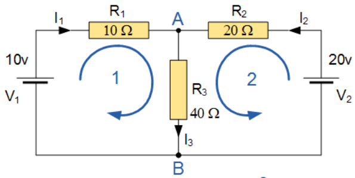
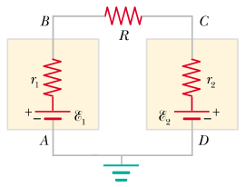
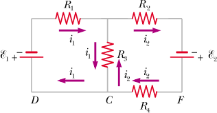

<!--
.. title: Esercizi sulla corrente
.. slug: fisica2-esercizi-corrente
.. date: 2023-07-03 17:41:10 UTC+02:00
.. tags: 
.. category: didattica
.. link: 
.. description: 
.. type: text
.. has_math: true
-->

[Esercizio 26](#esercizio-26) - [Esercizio 27](#esercizio-27) - [Esempio Kirchhoff](#esempio-kirchhoff) - [Esercizio 28](#esercizio-28) - [Esercizio 29](#esercizio-29)

# Esercizio 26

Un conduttore cilindrico cavo di lunghezza $h$ ha raggio interno $R_1$ ed esterno $R_2$ ed è costituito da un materiale di resistività $\rho$.

1. Calcolare la resistenza $R$ che oppone ad una corrente che scorre in direzione parallela all'asse del cilindro.
2. Dati $R_1 = 1$ mm, $R_2 = 1.5$ mm e se nel conduttore scorre una corrente $i = 500$ mA e il campo all'interno del conduttore ha intensità $E = 10$ V/m, quanto vale la resistività $\rho$?

## Soluzione

1. Applichiamo la definizione di resistenza:
$$
R = \rho \int_0^h \frac{dh}{\Sigma(h)} = \rho \int_0^h \frac{dh}{\pi (R_2^2 - R_1^2)} = \frac{\rho h}{\pi (R_2^2 - R_1^2)}
$$
2. Dobbiamo prima applicare la legge di Ohm per trovare la resistenza. Per farlo, però, dobbiamo prima calcolare la d.d.p. ai capi del conduttore:
$$
\Delta V = Eh = 10\, {\rm V}
$$
Quindi:
$$
R = \frac{\Delta V}{i} = 20\, {\rm \Omega} = \rho \frac{h}{\pi (R_2^2 - R_1^2)}
$$
e quindi la resistività vale:
$$
\rho = \frac{E \pi (R_2^2 - R_1^2)}{i} = 7.85 \times 10^{-5} \, \Omega{\rm m}
$$

# Esercizio 27

Dato il circuito in figura e i valori $R_1 = 1.0\, \Omega$, $R_2 = 3.0\, \Omega$, $R_3 = 2.0\, \Omega$ and $R_4 = 2.0\, \Omega$,

1. Calcolare la resistenza equivalente.
2. Calcolare la potenza dissipata da ognuno dei quattro resistori se $V_0 = 6$ V.

## Soluzione

1. $R_2$ ed $R_3$ sono in parallelo, e quindi si ha
$$
R_{\rm eq}^{(1)} = \frac{R_2 R_3}{R_2 + R_3} = 1.2 \, \Omega
$$
$R_1$ e $R_{\rm eq}^{(1)}$ sono in serie, quindi
$$
R_{\rm eq}^{(2)} = R_1 + R_{\rm eq}^{(1)} = 2.2 \Omega
$$
Restano solamente due resistori ($R_4$ e $R_{\rm eq}^{(2)}$), che sono collegati in parallelo:
$$
R_{\rm eq} = \frac{R_4 R_{\rm eq}^{(2)}}{R_4 + R_{\rm eq}^{(2)}} = 1.05 \, \Omega
$$
2. Sappiamo che $\mathcal{P} = \Delta V i = R i^2 = \frac{\Delta V^2}{R}$. Per poter applicare queste relazioni dobbiamo prima trovare o le d.d.p. ai capi dei resistori, o le correnti che passano al loro interno o entrambi. Sappiamo che la corrente totale è data da:
$$
i = \frac{V_0}{R_{\rm eq}} = 5.73 \, {\rm A}
$$
Quella passante per $R_4$ vale
$$
i_4 = \frac{V_0}{R_4} = 3\, {\rm A}
$$
e quindi, per la condizione di stazionarietà, quella che passa nel ramo superiore (che, sempre per lo stesso principio, passa anche per $R_1$) vale
$$
i_1 = i - i_4 = 2.72\, {\rm A}
$$
Quindi la d.d.p. ai capi di $R_1$ è:
$$
\Delta V_1 = R_1 i_1 = 2.71 \, {\rm V}
$$
Quindi la d.d.p. ai capi di $R_2$ ed $R_3$ vale:
$$
\Delta V_{\rm eq}^{(1)} = V_0 - \Delta V_1 = 3.27\, {\rm V}
$$
per cui le correnti negli ultimi due resistori valgono:
$$
\begin{align}
i_2 & = \frac{\Delta V_{\rm eq}^{(1)}}{R_2} = 1.09 \, {\rm A}\\\\
i_3 & = \frac{\Delta V_{\rm eq}^{(1)}}{R_3} = 1.63 \, {\rm A}
\end{align}
$$
**Nota Bene**: perché $i_2 + i_3 \neq i_1$? Perché tagliando i decimali finali stiamo sempre approssimando i valori numerici... Se calcolassimo tutte le quantità senza approssimare ad ogni passaggio e stampassimo *tutte* le cifre decimali vedremmo che le correnti verrebbero identiche. Dai valori delle correnti otteniamo la potenza:
$$
\begin{align}
\mathcal{P}_1 & = R_1 i_1^2 = 7.4 \, {\rm W}\\\\
\mathcal{P}_2 & = R_2 i_2^2 = 3.6 \, {\rm W}\\\\
\mathcal{P}_3 & = R_3 i_3^2 = 8.7 \, {\rm W}\\\\
\mathcal{P}_4 & = R_4 i_4^2 = 18 \, {\rm W}
\end{align}
$$

## Esempio Kirchhoff

Calcoliamo le correnti che scorrono nel circuito in figura

Scegliamo arbitrariamente i versi delle correnti in maniera tale che nelle due maglie (1 e 2) si vada dal polo positivo a quello negativo di ogni generatore. Applichiamo la prima legge di Kirchhoff nel nodo $A$:

$$
i_1 + i_2 = i_3.
$$

Per le due maglie, invece, vale

\begin{align}
V_1 & = i_1 R_1 + i_3 R_3\\\\
V_2 & = i_2 R_2 + i_3 R_3
\end{align}

Le equazioni si risolvono sostituendo la prima nelle ultime due e poi isolando le due correnti. Nello specifico caso in esame si trova $i_1 = -0.143$ A, $i_2 = 0.429$ A e $i_3 = 0.286$ A. Il fatto che $i_1$ sia negativa significa che il suo verso è contrario a quello che abbiamo scelto per applicare le leggi di Kirchoff.

Possiamo risolvere lo stesso problema scegliendo versi differenti: orario per entrambe le maglie. In questo caso la prima legge di Kirchhoff si può scrivere come
$$
i_1 = i_2 + i_3
$$
e quindi

\begin{align}
V_1 & = i_1 R_1 + i_3 R_3\\\\
-V_2 & = i_2 R_2 - i_3 R_3
\end{align}

che, se risolto, dà $i_1 = -0.143 A$, $i_2 = -0.429$ e quindi $i_3 = i_1 - i_2 = 0.286$, cioè gli stessi risultati di prima (tenendo conto dei segni).

# Esercizio 28
<small>MNV: esempio 5.9</small>

Calcolare la corrente che scorre nel seguente circuito, composto da un'unica maglia ($\mathcal{E}_1 = 50$ V, $\mathcal{E}_2 = 100$ V, $R = 50\, \Omega$, $r_1 = 20\, \Omega$, $r_2 = 30\, \Omega$):

## Soluzione

Scegliamo (arbitrariamente) il verso orario. La seconda legge di Kirchhoff diventa:

$$
\mathcal{E}_1 - \mathcal{E}_2 = (r_1 + r_2 + R) i
$$

e quindi la corrente vale:

$$
i = \frac{\mathcal{E}_1 - \mathcal{E}_2}{r_1 + r_2 + R} = -0.5 \, \mathrm{A}.
$$

Il segno negativo della corrente implica che il verso in cui scorre è opposto a quello che abbiamo scelto (quindi antiorario).

# Esercizio 29
<small>MNV: esempio 5.10</small>

Calcolare le correnti che scorrono nel seguente circuito, composto da due maglie($\mathcal{E}_1 = 18$ V, $\mathcal{E}_2 = 12$ V, $R_1 = 12\, \Omega$, $R_2 = 2\, \Omega$, $R_3 = 6\, \Omega$, $R_4 = 4 \, \Omega$):

## Soluzione

Scegliamo il verso orario per la maglia a sinistra e antiorario per quella a destra (quindi al contrario di quanto indicato in figura, che invece corrisponde alla risoluzione dell'esercizio che si trova in fondo alle soluzioni). Applicando la seconda legge di Kirchhoff otteniamo le seguenti equazioni:

\begin{align}
-\mathcal{E}_1 & = R_1 i_1 + R_3 (i_1 + i_2)\\\\
-\mathcal{E}_2 & = (R_2 + R_4) i_2 + R_3 (i_2 + i_1)
\end{align}

Se sostituiamo i valori numerici troviamo:

\begin{align}
-18 & = 18 i_1 + 6 i_2\\\\
-12 & = 12 i_2  + 6 i_1
\end{align}

da cui ricaviamo:

\begin{align}
i_1 & = -0.8 \, {\rm A}\\\\
i_2 & = -0.6 \, {\rm A}
\end{align}

per cui $i_1$ scorre in senso antiorario e $i_2$ scorre in senso orario. In $R_3$ scorre la corrente $i_3 = i_1 + i_2 = -1.4$ A, quindi dal basso verso l'alto.

Se scegliamo i versi come quelli in figura allora la corrente che scorre nel ramo condiviso ha segno diverso quando è "vista" da ciascuna delle due maglie. In questo caso l'espressione della corrente che scorre in $R_3$ è differente per le due maglie. In particolare per la maglia di sinistra la corrente del ramo centrale sarà $i_1 - i_2$, mentre per la maglia di destra sarà $i_2 - i_1$. Applicando la seconda equazione di Kirchhoff si ottiene il seguente sistema di equazioni:

\begin{align}
-\mathcal{E}_1 & = R_1 i_1 + R_3 (i_1 - i_2)\\\\
\mathcal{E}_2 & = (R_2 + R_4) i_2 + R_3 (i_2 - i_1)
\end{align}

le cui soluzioni corrispondono a quelle trovate precedentemente.

Si può ottenere lo stesso risultato se introduciamo una corrente $i_3$ che scorre nel ramo centrale e con cui, ipotizzando un verso, possiamo applicare la prima legge di Kirchhoff.  Se per esempio ipotizziamo che $i_3$ scorra verso l'alto, otteniamo il sistema di equazioni

\begin{align}
i_2 & = i_1 + i_3\\\\
-\mathcal{E}_1 & = R_1 i_1 - R_3 i_3\\\\
\mathcal{E}_2 & = (R_2 + R_4) i_2 + R_3 i_3
\end{align}

che, se risolto, dà gli stessi risultati ottenuti con gli altri metodi.
