<!-
.. title: Esercizi di elettrostatica
.. slug: fisica2-esercizi-elettrostatica
.. date: 2023-07-03 17:41:10 UTC+02:00
.. tags: 
.. category: didattica
.. link: 
.. description: 
.. type: text
.. has_math: true
->

[Esercizio 0](#esercizio-0) - [Esercizio 1](#esercizio-1) - [Esercizio 2](#esercizio-2) - [Esercizio 3](#esercizio-3) - [Esercizio 4](#esercizio-4)  - [Esercizio 5](#esercizio-5) - [Esercizio 6](#esercizio-6) - [Esercizio 7](#esercizio-7) - [Esercizio 8](#esercizio-8) - [Esercizio 9](#esercizio-9) - [Esercizio 10](#esercizio-10) - [Esercizio 11](#esercizio-11) - [Esercizio 12](#esercizio-12) - [Esercizio 13](#esercizio-13) - [Esercizio 14](#esercizio-14) - [Esercizio 15](#esercizio-15) - [Esercizio 16](#esercizio-16) - [Esercizio 17](#esercizio-17) - [Esercizio 18](#esercizio-18) - [Esercizio 19](#esercizio-19) - [Esercizio 20](#esercizio-20) - [Esercizio 21](#esercizio-21) - [Esercizio 22](#esercizio-22) - [Esercizio 23](#esercizio-23) - [Esercizio 24](#esercizio-24) - [Esercizio 25](#esercizio-25) - [Esercizio 30](#esercizio-30) - [Esercizio 31](#esercizio-31) - [Esercizio 32](#esercizio-32) -- [Esercizio 33](#esercizio-33)

# Esercizio 0

Due cariche $q_1 = 10^{-9}$ C e $q_2 = -2 \times 10^{-9}$ C si trovano in $\vec{r}_1 = (1, 0, 2)$ e $\vec{r}_2 = (0, -1, 0)$, dove le componenti dei vettori sono da intendersi misurate in metri. 

1. Scrivere l'espressione della forza esercitata dalla carica 2 sulla 1, $\vec{F}_{21}$.
2. Calcolare il modulo di $\vec{F}_{21}$.

## Soluzione

1. Il vettore che congiunge 2 ad 1 vale
$$
\vec{r}\_{21} = \vec{r}_1 - \vec{r}_2 = (1, 1, 2),
$$
che ha modulo $r\_{21} = \sqrt{6}$ e versore associato $\hat{r} = \frac{1}{\sqrt{6}}(1, 1, 2)$. Sostituendo queste quantità nella legge di Coulomb troviamo
$$
\vec{F}\_{21} = \frac{q_1 q_2}{24 \sqrt{6} \pi \epsilon_0} (1, 1, 2)
$$
2. Il modulo del vettore scritto sopra vale $F\_{21} = -\frac{q_1 q_2}{24 \pi \epsilon_0} = 3 \times 10^{-9}$ N.

# Esercizio 1
<small>Dall'esempio 1.3 del MNV</small>

Un oggetto (puntiforme) di massa $m$ e carica $q_0$ è sospeso ad un filo. Una carica fissa $q$ è posta alla stessa distanza dal suolo di $q_0$, ma a distanza $x_0$ da quest'ultima (vedi disegno). Il sistema è in equilibrio. Per effetto della forza elettrica, il filo formerà un angolo $\theta$ rispetto alla verticale.

1. Scrivere l'espressione di $\theta$ in funzione di $x_0$.
2. Calcolare $\theta$ per $m = 2\times 10^{-3}~\mathrm{Kg}$, $q_0 = 2\times 10^{-9}~\mathrm{C}$, $q = 5\times 10^{-7}~\mathrm{C}$, e $x_0 = 5~\mathrm{cm}$.

## Soluzione

1. Consideriamo un sistema di riferimento nel quale la forza peso $\vec{F}_g$ è diretta lungo $-\hat{y}$, mentre quella elettrica $\vec{F}_e$ è lungo $\hat{x}$. Le forze in gioco sono 3: la forza peso, quella elettrica e la tensione del filo. All'equilibrio, la risultante di queste forze deve essere nulla, e quindi $\vec{T} + \vec{F}_e +\vec{F}_g = 0$. Se disegniamo questi vettori troviamo immediatamente il legame tra la forza peso, quella elettrica e l'angolo $\theta$:
$$
\tan{(\theta)} = \frac{F_e}{F_g} = \frac{q q_0}{4\pi\epsilon_0 mg x_0^2}
$$
2. Sostituendo i valori numerici nella relazione precedente si trova $\tan{(\theta)} = 0.1833$.

# Esercizio 2
<small>Dall'esempio 1.1 del MNV</small>

Un corpo di massa $m$ avente carica $q$ è sospeso ad una distanza $h$ dal suolo, dove è presente un'altra carica dello stesso valore ($q$). Il sistema si trova in equilibrio. Entrambe le cariche possono essere considerate puntiformi.

1. Scrivere la relazione tra $m$ e $q$ per la quale il corpo rimane sospeso ad altezza $h$.
2. Data la relazione trovata al punto precedente, se $h = 10^{-2}~\mathrm{m}$ e $m = 3\times 10^{-3}~\mathrm{g}$, quanto vale $q$?
3. Di quante cariche elementari "spaiate" abbiamo bisogno per generare la carica di cui al punto precedente?

## Soluzione

1. Il corpo risente della forza peso e di quella di Coulomb. Se orientiamo l'asse $y$ perpendicolare al suolo, la forza peso è diretta verso $y$ negative, mentre quella di Coulomb è diretta verso $y$ positive. Se si vuole che la distanza dal suolo non cambi si deve imporre che la forza totale agente sul corpo sia 0, cioè
$$
F_y = -mg + \frac{1}{4\pi\epsilon_0}\frac{q^2}{h^2}
$$
L'equazione precedente fissa il valore del rapporto tra il quadrato delle cariche e quello della massa:
$$
\frac{q^2}{m} = 4\pi\epsilon_0h^2g
$$
**Nota Bene:** la carica compare al quadrato: non importa che $q$ sia positiva o negativa, perché due cariche dello stesso tipo si respingono *sempre*.
2. Dal punto precedente si ha che, sostituendo i valori numerici, $q = \pm \sqrt{4\pi\epsilon_0h^2mg} = \pm 5.72\times10^{-10} C$.
3. Per trovare la soluzione dividiamo la carica totale per il valore (in modulo), trovando

$$
N_c = \frac{5.72 \times 10^{-10}}{1.6\times 10^{-19}} \approx 3.57\times 10^{9}
$$

# Esercizio 3

Consideriamo due cariche fisse $q$ disposte parallele all'asse $y$ e distanti $2L$. Calcolare il campo elettrostatico in un punto generico $x_0$ equidistante dalle due cariche.

## Soluzione

Utilizziamo il sistema di riferimento nel quale le due cariche hanno coordinate $\vec{r}_1 = (0, L)$ e $\vec{r}_2 = (0, -L)$ e il punto che ci interessa ha coordinate $\vec{r}_0 = (x_0, 0)$. Studiamo il campo generato dalla prima carica, rispetto alla quale $\vec{r}\_{10} = \vec{r}_0 - \vec{r}_1 = (x_0, -L)$, $r\_{10} = \sqrt{x_0^2 + L^2}$ e quindi $\hat{r}\_{10} = \frac{1}{r\_{10}}(x_0, -L)$:

$$
E_x^{10} = \frac{1}{4\pi\epsilon_0} \frac{q}{r\_{10}^2} \frac{x_0}{r\_{10}}
$$

$$
E_y^{10} = -\frac{1}{4\pi\epsilon_0} \frac{q}{r\_{10}^2} \frac{L}{r\_{10}}
$$

D'altra parte, rispetto alla seconda carica abbiamo $\vec{r}\_{20} = \vec{r}\_0 - \vec{r}\_2 = (x_0, L)$, $r\_{20} = \sqrt{x_0^2 + L^2} = r\_{10}$, $\hat{r}\_{20} = \frac{1}{r\_{20}}(x_0, L)$ e quindi

$$
E_x^{20} = \frac{1}{4\pi\epsilon_0} \frac{q}{r_{10}^2} \frac{x_0}{r_{10}}
$$
$$
E_y^{20} = \frac{1}{4\pi\epsilon_0} \frac{q}{r_{10}^2} \frac{L}{r_{10}}
$$

Il campo totale è la sovrapposizione (cioè, la somma) dei due, e quindi si ha $E_x = 2E_x^{10}$ e $E_y = 0$.

Possiamo ritrovare lo stesso risultato considerando che, in generale, se definiamo $\theta$ come l'angolo compreso tra il campo e l'asse $x$, $E_x^{10} = |\vec{E}\_{10}|\cos{\theta}$ e $E_y^{10} = |\vec{E}\_{10}|\sin{\theta}$. Nel caso specifico dell'esercizio vale l'uguaglianza trigonometrica $\cos{\theta} = \frac{x_0}{r\_{10}}$, mentre il modulo di $\vec{E}$ si ricava dalla legge di Coulomb, $|\vec{E}| = \frac{1}{4\pi\epsilon_0} \frac{q}{r\_{10}^2}$. Si trova quindi:

$$
E_x^{10} = \frac{q}{4\pi\epsilon_0} \frac{x_0}{r\_{10}^3}
$$

in accordo col risultato precedente.

# Esercizio 4
<small>Ispirato dall'esempio 1.5 del MNV</small>

Tre cariche fisse $q_1$, $q_2$ e $q_3$ sono poste sui vertici di un triangolo equilatero di lato $2L$. Poniamo $q_2 = q_3 = q$.

1. Calcolare l'espressione del campo elettrostatico $\vec{E} = (E_x, E_y)$ nel centro $\vec{O}$ del triangolo.
2. Possiamo muovere la carica $q_1$ lungo l'asse che la congiunge al centro. Se $q_1 = 2q$, dove dobbiamo posizionare $q_1$ per far sì che il campo si annulli nel punto $\vec{O}$?

## Soluzione

1. Orientiamo il sistema di riferimento in modo da avere l'asse $x$ parallelo al segmento che congiunge $q_2$ e $q_3$. Poiché $q_2$ e $q_3$ si equivalgono, il campo totale da loro generato lungo $x$ deve essere nullo (vedi [esercizio 3](#esercizio-3)). Inoltre, il vettore che congiunge $q_1$ con il centro del triangolo ha solamente la componente $y$ , quindi si trova $E_x = 0$. Usiamo ora la trigonometria per scrivere $E_y$ in funzione dell'angolo $\theta$ tra l'asse $y$ e la direzione del campo generato da ognuna delle due cariche, per esempio da $q_2$:
$$
E_y^{(2)} = \frac{q}{4\pi\epsilon_0}\frac{1}{r^2} \cos{\theta}
$$
dove $r$ è la distanza tra $\vec{O}$ e la carica $q_2$. Dobbiamo ora calcolare $r$ e $\theta$. Se disegniamo un triangolo equilatero e utilizziamo la trigonometria troviamo che:
$$
r = \frac{L}{\cos{(\pi/6)}}, \quad \theta = \frac{\pi}{3}
$$
Se notiamo che $\cos{\theta} = \cos{(\pi/3)} = 0.5$, possiamo scrivere il campo totale dovuto a $q_2$ e $q_3$ (pari a due volte quello dovuto a $q_2$, *cfr.* [esercizio 3](#esercizio-3)):
$$
E_y^{(2)+(3)} = \frac{q}{4\pi\epsilon_0}\frac{1}{r^2}
$$
D'altro canto, con questo sistema di riferimento il campo dovuto a $q_1$ è semplice da scrivere, perché il vettore distanza (e quindi il campo elettrostatico generato) tra $q_1$ e $\vec{O}$ ha la sola componente $y$ non nulla, che quindi vale:
$$
E_y^{(1)} = -\frac{q_1}{4\pi\epsilon_0}\frac{1}{r^2}
$$
Fate il disegno e scrivete le componenti dei vettori distanza per capire da dove viene il segno meno! Il campo totale (che è diretto tutto lungo $y$) vale quindi:
$$
E_y = \frac{q - q_1}{4\pi\epsilon_0}\frac{1}{r^2}
$$
2. Se spostiamo $q_1$, la sua distanza da $\vec{O}$ non sarà più $r$ ma un valore incognito $y_0$. Possiamo quindi riscrivere la componente $y$ del campo (che è ancora l'unica diversa da 0) come:
$$
E_y = \frac{q}{4\pi\epsilon_0}\frac{1}{r^2} - \frac{2q}{4\pi\epsilon_0}\frac{1}{y_0^2}
$$
Se imponiamo $E_y = 0$ troviamo:
$$
y_0 = \sqrt{2}r
$$

# Esercizio 5

<small>Dall'esempio 1.6 del MNV</small>

Una carica $q$ è distribuita uniformemente su un *sottile* anello di raggio $R$.

1. Senza calcolarlo, discutere qualitativamente il comportamento del campo elettrostatico lungo l'asse dell'anello (che prendiamo coincidente con l'asse $x$) al variare di $x$.
2. Calcolare il campo elettrico in un generico punto $(x, 0, 0)$.

## Soluzione

1. Lungo l'asse dell'anello il problema ha simmetria cilindrica: lì il campo (se diverso da 0) non può che essere parallelo ad $\hat{x}$. Inoltre, si deve annullare per $x = 0$ (cioè al centro dell'anello), ancora una volta per simmetria.

2. Prendiamo un elementino di carica $dq$. Questo genererà un campo infinitesimo in $x$ di intensità:
$$
d|\vec{E}| = \frac{dq}{4\pi\epsilon_0}\frac{1}{r^2}
$$
dove $r = \sqrt{R^2 + x^2}$. Sappiamo però che, lungo l'asse dell'anello, la componente $y$ del campo (totale) si deve annullare. Dobbiamo quindi utilizzare la relazione precedente per trovare l'unica componente diversa da zero, $E_x$. Per fare ciò proiettiamo il campo lungo $x$ utilizzando la relazione $E_x = |\vec{E}|\cos{(\theta)}$, con $\cos{(\theta)} = \frac{x}{r}$ (disegnare per credere). Si ottiene quindi
$$
dE_x = \frac{dq}{4\pi\epsilon_0}\frac{x}{r^3}
$$
La somma di tutti i contributi è banale, perché tutti gli elementini $dq$ generano lo stesso campo in $x$ e quindi si ottiene
$$
\vec{E} = E_x\hat{x} = \frac{q}{4\pi\epsilon_0}\frac{x}{r^3}\hat{x} = \frac{q}{4\pi\epsilon_0}\frac{x}{(R^2 + x^2)^{3/2}}\hat{x}
$$

# Esercizio 6

<small>Dagli esempi 1.7 e 1.8 del MNV</small>

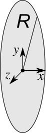

Una carica $q$ è distribuita uniformemente su un sottile disco di raggio R. Consideriamo il sistema di riferimento che ha l'origine nel centro del disco e $\hat{x}$ orientato in maniera concorde all'asse del disco.

1. Calcolare il modulo del campo elettrico in un generico punto $(x, 0, 0)$.
2. Cosa succede quando $R \to \infty$?
3. Discutere il verso del campo lungo l'asse $x$.

## Soluzione

1. Il disco può essere considerato come un oggetto "bidimensionale" avente una densità di carica $\sigma = \frac{q}{\pi R^2}$. Poiché il problema ha simmetria cilindrica, l'elemento di superficie vale $d\Sigma = 2\pi a da$. Il disco può quindi essere considerato come un insieme di anelli di spessore $da$, aventi ognuno una carica $dq = \sigma d\Sigma = 2 \pi \sigma a da$. Il contributo alla componente $x$ del campo (l'unica diversa da zero) del generico anello infinitesimo di raggio $r$ è (vedi [esercizio 5](#esercizio-5)):
$$
dE_x = \frac{\sigma}{2\epsilon_0}\frac{x a da}{(a^2 + x^2)^{3 / 2}}
$$
L'espressione per il campo totale si ottiene integrando da $0$ ad $R$ l'equazione precedente:
$$
E_x = \frac{\sigma x}{2\epsilon_0} \int_0^R \frac{a da}{(a^2 + x^2)^{3 / 2}} = \frac{\sigma x}{2\epsilon_0} \left. \left( -\frac{1}{\sqrt{a^2 + x^2}} \right) \right|_0^R = \frac{\sigma}{2\epsilon_0} \left( \frac{x}{|x|} - \frac{x}{\sqrt{R^2 + x^2}}\right)
$$

2. Nel limite per $R \to \infty$ (tenendo $x$ costante) la radice al denominatore tende all'infinito e quindi la frazione tende a 0. Il risultato è
$$
E_x = {\rm sgn}(x) \frac{\sigma}{2\epsilon_0}
$$
dove ${\rm sgn}(x)$ indica il segno di $x$. Questo fattore viene dal fatto che $\sqrt{x^2} = |x|$, quindi $x / |x| = {\rm sgn}(x)$. Nel limite di grandi $R$ (in cui il disco carico diventa effettivamente un piano indefinito uniformemente carico) il campo è *uniforme*, cioè prende lo stesso valore in tutti i punti dello spazio. La stessa espressione è valida nel caso in cui ci avviciniamo molto ad una superficie carica (cioè nel limite in cui la superficie è così vicino da *sembrarci* un piano infinito).

3. Sia che $R$ sia finito sia che tenda all'infinito, il limite di $\vec{E}$ per $x \to 0$ è diverso venendo da sinistra o da destra: il modulo resta lo stesso, mentre il verso è opposto. Il campo ha quindi una *discontinuità* in $x = 0$: il campo ha un salto di valore pari a $\Delta E = \frac{\sigma}{\epsilon_0}$. Vettorialmente si può scrivere che nel limite $R \to \infty$
$$
\vec{E} = {\rm sgn}(x) \frac{\sigma}{2 \epsilon_0} \hat{x}
$$

# Esercizio 7
<small>Esempio 2.8 del MNV</small>

Calcolare e disegnare il potenziale e il modulo del campo elettrostatico generati in tutto lo spazio da due piani indefiniti paralleli uniformemente carichi con densità superficiale $\sigma_1$ e $\sigma_2$ e posti a $x_1 = 0$ e $x_2 = d$ lungo l'asse $x$,

1. Nel caso in cui $\sigma_1 = -\sigma_2$.
2. Nel caso in cui $\sigma_1 = \sigma_2 = \sigma$.

## Soluzione

Il modulo del campo generato da un singolo piano è $E = \frac{\sigma_i}{2\epsilon_0}$.

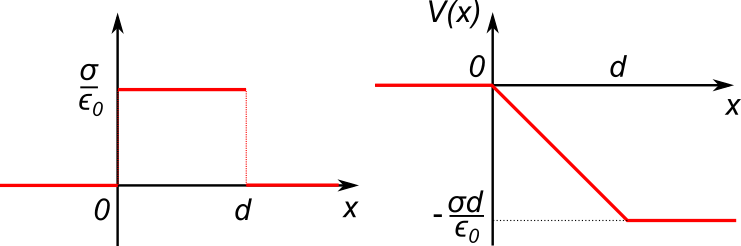

1. Se i piani hanno densità di carica opposta, il campo sarà diverso da 0 solamente nel mezzo, dove vale (definendo $\sigma \equiv \sigma_1$) $E = \frac{\sigma}{\epsilon_0}$. Utilizziamo la definizione di potenziale per calcolare $\Delta V = V_2 - V_1$ tra i due piani:
$$
\Delta V = -\int_0^d E dx = -Ed = -\frac{\sigma d}{\epsilon_0}
$$
Lì dove il campo è zero (cioè a sinistra e a destra dei due piani), il potenziale deve essere costante. Poiché la funzione potenziale deve essere sempre continua (perché?), troviamo $V(x) = 0$ per $x < 0$ e $V(x) = -\frac{\sigma d}{\epsilon_0}$ per $x > d$.
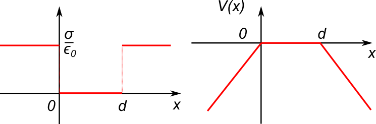

2. Se i piani hanno la stessa densità di carica, il campo sarà diverso da 0 solamente a sinistra e a destra dei due piani, dove vale $\vec{E} = {\rm sgn}(x) \frac{\sigma}{\epsilon_0}\hat{x}$ (cioè il campo ha segno $+$ a destra dei piani, $x > d$, e il segno $-$ a sinistra dei piani, $x < 0$). Dove il campo vale 0 (cioè tra i due piani) il potenziale è costante. Lo poniamo a 0 (ma potremmo porlo uguale a qualsiasi altro valore, perché?). A sinistra dei piani (cioè per $x < 0$) si ha
$$
V(x) = -\int_0^{x} \vec{E} \cdot d\vec{s} = \int_0^x E dx' = \frac{\sigma}{\epsilon_0} x
$$
perché il campo è diretto verso le $x$ negative. A destra dei piani ($x > d$) si ha invece:
$$
V(x) = -\int_d^x \vec{E} \cdot d\vec{s} = -\int_d^x E dx' = -\frac{\sigma}{\epsilon_0} (x - d)
$$

# Esercizio 8

Questo esercizio verrà è stato svolto durante l'esercitazione del 14 Ottobre 2022.

Due piani indefiniti paralleli caricati con densità superficiale $\sigma_1$ e $\sigma_2$ sono posti in $x_1 = 0$ e $x_2 = d$.

1. Calcolare il lavoro che la forza elettrostatica compie per spostare una carica $q_0$ tra i punti $(\delta, 0, 0)$ e $(5\delta, 0, 0)$, entrambi compresi tra i due piani. Il problema si può risolvere sia utilizzando la definizione di lavoro che il legame che sussiste tra il lavoro e il potenziale.
2. Poniamo $\sigma_1 = -\sigma_2 > 0$. Al tempo $t = 0$ una carica $q_0 > 0$ si trova in $\vec{r} = (\delta, 0, 0)$ con velocità iniziale $\vec{v} = (v_{0,x}, v_{0,y}, v_{0,z})$. Calcolare il tempo $t^*$ dopo il quale la carica tocca il secondo piano.

## Soluzione

1. Il campo generato da un piano indefinito (e quindi anche da più piani indefiniti) è uniforme e diretto (in questo caso) lungo $\hat{x}$, quindi il lavoro si può scrivere semplicemente come $W = F\Delta x = q_0 E \Delta x$. Lo spostamente è dato dalla differenza tra la posizione finale e quella iniziale, quindi:
$$
\Delta x = 5\delta - \delta = 4\delta
$$
Il campo totale che agisce per $0 < x < d$ è:
$$
\vec{E} = \frac{\sigma_1 - \sigma_2}{2\epsilon_0} \hat{x}.
$$
Il lavoro fatto è quindi:
$$
W = \frac{q_0(\sigma_1 - \sigma_2)}{2\epsilon_0} 4\delta = \frac{2\delta q_0(\sigma_1 - \sigma_2)}{\epsilon_0}
$$
Lo stesso risultato si può ottenere ricordando che $W = -q_0 \Delta V$, dove $\Delta V = V(4 \delta) - V(\delta)$.
2. Il campo è uniforme e, tra i due piani, vale $\frac{\sigma_1 - \sigma_2}{2\epsilon_0}$. L'accelerazione quindi è costante lungo $\hat{x}$ e vale
$$
a_x = \frac{q_0}{m}E = \frac{q_0(\sigma_1 - \sigma_2)}{2m\epsilon_0}
$$
La posizione in funzione del tempo è:
$$
x(t) = \delta + v_{0,x}t + \frac{1}{2}a_x t^2
$$
Ponendo questa ultima quantità uguale alla posizione del secondo piano, cioè $x(t) = d$, otteniamo un'equazione di secondo grado:
$$
(\delta - d) + v_{0,x} t + \frac{1}{2}a_x t^2 = 0.
$$
Risolviamo per $t$ per trovare il risultato:
$$
t^* = \frac{-v_{0,x} \pm \sqrt{v_{0,x}^2 - 2a(\delta - d)}}{a_x}
$$

# Esercizio 9

Esercizio da svolgere a casa.

Calcolare l'espressione del campo elettrostatico date le seguenti espressioni del potenziale:

1. $V(x, y, z) = A(xz - 2z^2)$
2. $V(x, y, z) = A(\cos{(kx)} + Bz - \log(y))$

## Soluzione

1. Deriviamo il potenziale:

$$
\begin{align}
E_x & = -Az\\\\
E_y & = 0\\\\
E_z & = A(4z - x)
\end{align}
$$

2. Deriviamo il potenziale:

$$
\begin{align}
E_x & = -Ak\sin{(kx)}\\\\
E_y & = \frac{A}{y}\\\\
E_z & = - AB
\end{align}
$$

# Esercizio 10

Tre cariche $q$ sono poste su tre vertici di un quadrato di lato $L$.

1. Qual è l'energia elettrostatica del sistema?
2. Calcolare l'espressione del lavoro $W$ compiuto dalla forza elettrostatica qualora una carica $q_0$ venisse posta sul quarto vertice del quadrato. Discuterne il segno e metterlo in relazione con il lavoro compiuto dalla forza esterna per compiere questa operazione.
3. Calcolare $W$ per $q = 2\cdot 10^{-7}$ C, $q_0 = -10^{-8}$ C e $L = 5$ cm.

## Soluzione

1. L'energia totale ha tre contributi, $U_e = U_e^{1,2} + U_e^{1,3} + U_e^{2,3}$. Ognuno di questi tre contributi ha la forma:
$$
U_e^{i,j} = \frac{q_i q_j}{4\pi \epsilon_0} \frac{1}{r_{ij}}
$$
Delle tre distanze tra le cariche, due valgono $L$ e una vale $\sqrt{2}L$, quindi si ha:
$$
U_e = \frac{q^2}{2\pi \epsilon_0} \frac{1}{L} + \frac{q^2}{4\pi \epsilon_0} \frac{1}{\sqrt{2}L}
$$
2. Per calcolare il lavoro usiamo $W = -\Delta U_e$. L'energia iniziale è $U_e^i = 0$, perché la carica $q_0$ è inizialmente "all'infinito". L'energia finale invece vale:
$$
U_e^f = \frac{q_0 q}{2\pi \epsilon_0} \frac{1}{L} + \frac{q_0 q}{4\pi \epsilon_0} \frac{1}{\sqrt{2}L}
$$
E quindi il lavoro vale:
$$
W = -\left( \frac{q_0 q}{2\pi \epsilon_0} \frac{1}{L} + \frac{q_0 q}{4\pi \epsilon_0} \frac{1}{\sqrt{2}L} \right)
$$
Notiamo che $W$ è negativo se $q$ e $q_0$ hanno lo stesso segno e positivo altrimenti: se le cariche hanno lo stesso segno l'energia potenziale del sistema *aumenta* e quindi la forza elettrostatica ha direzione opposta allo spostamento (e viceversa). Il lavoro fatto dalla forza esterna per "costruire" il sistema ha invece segno opposto, $W_{\rm ext} = - W$: se l'energia potenziale aumenta, la forza esterna (che è opposta a quella elettrostatica) e lo spostamento hanno lo stesso segno e viceversa.
3. Sostituiamo i numeri nell'equazione precedente e troviamo
$$
W = 9.732 \times 10^{-4}\\,\mathrm{J}
$$
**Nota Bene:** il lavoro ha le stesse unità di misura dell'energia (perché?) e quindi si misura in Joule (J).

# Esercizio 11

Un dipolo elettrico di momento di dipolo $\vec{p}$ e momento di inerzia $I$ è immerso in un campo elettrico uniforme $\vec{E}$. Il dipolo è inizialmente fermo in una posizione in cui $\vec{p}$ forma un angolo $\theta$ con $\vec{E}$. Al tempo $t = 0$ il dipolo viene lasciato libero di ruotare.

1. Calcolare la velocità angolare $\omega$ del dipolo quando l'angolo formato col campo vale $0$. Suggerimento: utilizzare la conservazione dell'energia.
2. Il dipolo viene bloccato nell'istante in cui è allineato col campo ($\theta = 0$). Qual è la sua energia elettrostatica se si pone  un altro dipolo di momento $\vec{p}$ (avente cioè la stessa orientamento e lo stesso valore del momento di dipolo) ad una distanza $x$ lungo la direzione data dai momenti di dipolo.

## Soluzione

1. L'energia potenziale di un dipolo in un campo vale $U_e = -\vec{p} \cdot \vec{E}$, mentre l'energia cinetica di un corpo che ruota è data da $U_k = \frac{1}{2} I \omega^2$. Scriviamo l'espressione dell'energia totale iniziale e finale ed imponiamo che il suo valore si conservi:
$$
-p E \cos{(\theta)} = -pE + \frac{1}{2} I \omega^2
$$
da cui si ottiene:
$$
\omega = \sqrt{\frac{2pE(1 - \cos{(\theta))}}{I}}
$$
2. L'energia elettrostatica del dipolo è $U_e = -\vec{p} \cdot (\vec{E} + \vec{E}_d)$, dove $\vec{E}$ è il campo uniforme e $\vec{E}_d$ è il campo generato dal secondo dipolo. Poiché i due dipoli sono paralleli e disposti uno dietro l'altro, il campo generato dal secondo dipolo nel punto in cui si trova il primo vale:
$$
\vec{E}_d = \frac{\vec{p}}{2\pi\epsilon_0} \frac{1}{x^3}
$$
E quindi l'energia potenziale totale è data da
$$
U_e = -Ep - \frac{p^2}{2\pi\epsilon_0} \frac{1}{x^3}
$$

# Esercizio 12
<small>Esempio 3.4 del MNV</small>

Utilizzare il teorema di Gauss per calcolare il campo elettrostatico generato da un piano indefinito caricato uniformemente con densità superficiale di carica $\sigma$.

## Soluzione

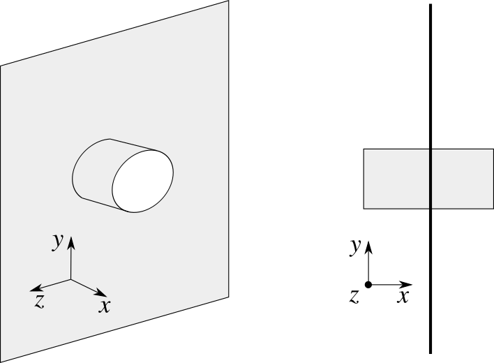

La superficie che scegliamo è un cilindro di raggio $R$ e lunghezza $2x$ centrato sul piano e avente l'asse di simmetria ortogonale al piano (cioè orientato lungo $\hat{x}$ nella figura sopra). Per simmetria il campo deve essere diretto lungo l'asse del cilindro, e quindi il flusso attraverso la superficie laterale del cilindro è nullo ($\vec{E} \cdot \hat{n} = 0$). Resta da calcolare il flusso lungo le due basi. Poiché i due contributi devono essere uguali per simmetria (provate a ruotare tutto il sistema di $180^\circ$, cosa cambia?), possiamo direttamente scrivere:

$$
2 \pi R^2 E(x) = \frac{1}{\epsilon_0} \int_{\tau(r )} dq
$$

Poiché abbiamo a che fare con una densità superficiale costante, la carica totale non è altro che la densità per la superficie, e quindi $2 \pi R^2 E(x) = \frac{\sigma}{\epsilon_0} \pi R^2$. Risolvendo per il campo (e notando che questo non dipende da $x$), si trova

$$
E = \frac{\sigma}{2\epsilon_0}
$$

# Esercizio 13
<small>Esempi 3.1 e 3.2 del MNV</small>

Calcolare (e disegnare) il campo elettrostatico generato in *tutto* lo spazio da una sfera di raggio $R$ caricata con carica $q$ distribuita

1. con densità superficiale di carica $\sigma$;
2. uniformemente con densità di carica $\rho$;
3. con densità di carica $\rho(r ) = Ar^2$.

## Soluzione

L'esercizio si risolve utilizzando il teorema di Gauss. Poiché in tutte e tre i casi abbiamo a che fare con distribuzioni di simmetria sferica, applichiamo il teorema su superfici sferiche di raggio $r$ e concentriche alla sfera carica. Poiché la simmetria è radiale, il campo calcolato è sempre parallelo alla normale delle superfici ed ha sempre lo stesso modulo su ogni punto. Possiamo quindi riscrivere l'integrale del flusso come:

$$
\oint_{\Sigma( r)} \vec{E} \cdot \hat{n} dS = \oint_{\Sigma( r)} E(r ) dS = 4\pi r^2 E( r)
$$

Applichiamo il teorema di Gauss:

$$
4\pi r^2 E(r ) = \frac{1}{\epsilon_0} \int_{\tau(r )} dq
$$

Dove $\tau(r )$ indica il volume racchiuso dalla superficie sferica (e cioè una sfera di raggio $r$). Per risolvere l'esercizio dobbiamo calcolare l'integrale a destra per le diverse distribuzioni e per tutte le distanze

1. Nel caso di densità superficiale, abbiamo
$$
  \begin{align}
  4\pi r^2 E(r ) & = 0 & \mathrm{per}\quad r < R\\\\
  4\pi r^2 E(r ) & = \frac{q}{\epsilon_0} & \mathrm{per}\quad r \geq R
  \end{align}
$$
  Perché se $r < R$ le superfici sferiche non contengono alcuna carica, mentre per $r \geq R$ le superfici sferiche contengono *tutta* la carica $q$. Invertendo le relazioni appena scritte si trova
$$
  \begin{align}
  E(r ) & = 0 & \mathrm{per}\quad r < R\\\\
  E(r ) & = \frac{q}{4\pi \epsilon_0 r^2} & \mathrm{per}\quad r \geq R
  \end{align}
$$
  **Nota Bene:** La seconda relazione (cioè l'espressione del campo per $r \geq R$), è valida qualunque sia la distribuzione di carica, purché abbia simmetria sferica.

2. Dobbiamo calcolare come varia il campo all'interno della sfera (perché all'esterno l'espressione è la stessa di quella di un campo generato da una carica puntiforme). L'espressione per l'integrale del flusso attraverso una superficie sferica di raggio $r$ non cambia. Cambia invece il membro di destra, per il quale si ha (per $r < R$)
$$
\frac{1}{\epsilon_0} \int_{\tau(r )} dq = \frac{1}{\epsilon_0} 4 \pi \int_0^r \rho r'^2 dr' = \frac{1}{\epsilon_0} \frac{4}{3}\pi r^3 \rho
$$
Sostituendo il membro di sinistra calcolato prima si trova (per $r < R$)
$$
E(r ) = \frac{\rho r}{3 \epsilon_0}
$$
3. Ripetiamo la stessa procedura, con la differenza che ora $\rho$ non è costante ma dipende da $r$ e quindi non si può tirare fuori dall'integrale:
$$
\frac{1}{\epsilon_0} \int_{\tau(r )} dq = \frac{1}{\epsilon_0} 4 \pi \int_0^r Ar'^2 r'^2 dr' = \frac{1}{\epsilon_0} \frac{4}{5}\pi r^5 A
$$
e quindi
$$
E(r ) = \frac{A r^3}{5 \epsilon_0}
$$

# Esercizio 14
<small>Esempio 2.6 del MNV</small>

1. Calcolare il potenziale elettrostatico generato da una carica $q$ uniformemente distribuita su di un anello sottile di raggio $R$ in un generico punto $\vec{P} = (x_0, 0, 0)$ del suo asse.
2. Verificare che l'espressione di $E_x$ calcolata a partire dal potenziale coincide con quella calcolata esplicitamente.

## Soluzione

1. La densità di carica lineare vale $\lambda = \frac{q}{2\pi R}$ e si ha $dq = \lambda dl$. Ogni elementino di carica genera un potenziale in $\vec{P}$ pari a
$$
dV = \frac{dq}{4\pi\epsilon_0}\frac{1}{\sqrt{R^2 + x_0^2}} = \frac{\lambda dl}{4\pi\epsilon_0} \frac{1}{\sqrt{R^2 + x_0^2}}
$$
Per ottenere il potenziale totale integriamo su tutto l'anello:
$$
V = \frac{\lambda}{4\pi\epsilon_0} \frac{1}{\sqrt{R^2 + x_0^2}} \int_0^{2\pi R} dl = \frac{q}{4\pi\epsilon_0}\frac{1}{\sqrt{R^2 + x_0^2}}
$$
**Nota Bene:** questa espressione è valida *unicamente* sull'asse dell'anello (perché?)

2. Possiamo scrivere $E_x$ come derivata del potenziale elettrostatico:
$$
E_x = -\frac{\partial V}{\partial x} = \frac{q}{4\pi\epsilon_0}\frac{x_0}{\left( R^2 + x_0^2 \right)^{3 /2}}
$$
Questa espressione coincide con quella calcolata esplicitamente.

# Esercizio 15
<small>Esempio 3.3 del MNV</small>

Utilizzare il teorema di Gauss per calcolare 

1. il campo elettrostatico generato da un cilindro indefinito di raggio $R$ caricato uniformemente con densità di carica $\rho$ in ogni punto dello spazio.
2. La differenza di potenziale tra due punti distanti dal centro del cilindro, rispettivamente, $r_1 > R$ e $r_2 > R$.

## Soluzione

1. Il campo ha sicuramente direzione radiale, cioè $\vec{E}(r ) = E(r ) \hat{r}$. Per calcolare il modulo $E(r )$ applichiamo il teorema di Gauss ad un cilindro di raggio $r$ ed altezza $h$ coassiale al cilindro carico. Poiché il campo è radiale, il suo flusso attraverso le basi del cilindro è nullo. Calcoliamo il flusso attraverso la superficie laterale:
$$
\oint_{\Sigma} \vec{E} \cdot \hat{n} d\Sigma = E(r ) \oint_{\Sigma} d\Sigma = E(r ) 2 \pi r h
$$
La carica totale contenuta all'interno della superficie è data da:
$$
\int_{\tau} \rho d\tau = \rho \pi R^2 h
$$
Applicando il teorema di Gauss si trova:
$$
E(r ) = \frac{\rho R^2}{2 \epsilon_0 r} = \frac{\lambda}{2 \pi\epsilon_0 r}
$$
avendo definito la densità di carica *lineare* $\lambda = \rho \pi R^2$. Questa espressione è valida anche per fili *sottili* caricati con la stessa densità di carica $\lambda$.
2. La differenza di potenziale si calcola utilizzando la definizione di potenziale:
$$
\Delta V = V(r_2) - V(r_1) = - \int\_{r_1}^{r_2} E dr = - \frac{\rho R^2}{2 \epsilon_0 } \int\_{r_1}^{r_2} \frac{1}{r}dr = -\frac{\rho R^2}{2 \epsilon_0} \left ( \log(r_2) - \log(r_1) \right) = \frac{\rho R^2}{2 \epsilon_0} \log{\left ( \frac{r_1}{r_2} \right)}
$$
Possiamo usare questa relazione per calcolare la capacità di un condensatore cilindrico di altezza $h$, per il quale si ha $q = \rho \pi R^2 h$, quindi la differenza di potenziale si può scrivere come
$$
\Delta V = \frac{q}{2 \pi \epsilon_0 h} \log{\left ( \frac{r_2}{r_1} \right)}
$$
e quindi
$$
C = \frac{q}{\Delta V} = \frac{2 \pi \epsilon_0 h}{\log\left(\frac{r_2}{r_1}\right)}
$$

# Esercizio 16

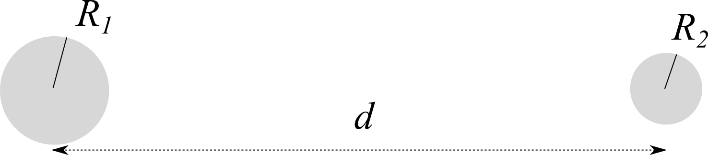

Due sfere conduttrici di raggio $R_1$ ed $R_2$ sono disposte ad una distanza $d$ molto maggiore dei loro raggi. Depositiamo una carica $Q$ su $R_1$.

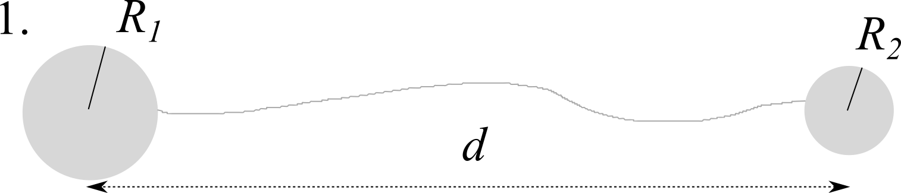
1. Se collegassimo le due sfere con un sottile filo conduttore quanta carica si depositerebbe sulle due sfere?
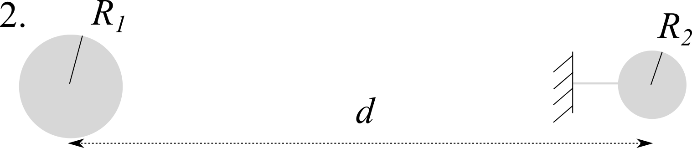
2. Colleghiamo $R_2$ a terra. Se ora consideriamo anche l'effetto che una sfera ha sull'altra, quanto vale la carica indotta su $R_2$?
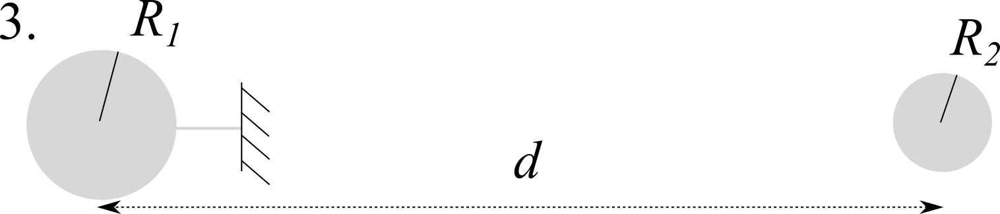
3. Scolleghiamo $R_2$ e colleghiamo $R_1$ a terra. Quanto vale la carica indotta su $R_1$?

**Nota Bene:** Il fatto che $d \gg R_1$ e $d \gg R_2$ significa che le distribuzioni di carica (non indotte) delle sfere conduttrici possono essere considerate uniformi, e che $d - R_1 \simeq d$ e $d - R_2 \simeq d$.

## Soluzione

1. Quando colleghiamo due conduttori, la carica totale si redistribuisce sulle loro superfici (tralasciando la superficie del filo). In generale, il potenziale di due conduttori connessi deve essere lo stesso. Se lo calcoliamo sulla superficie questo vale:
$$
\begin{align}
V_1 & = \frac{q_1}{4\pi\epsilon_0 R_1}\\\\
V_2 & = \frac{q_2}{4\pi\epsilon_0 R_2}
\end{align}
$$
D'altro canto, per la conservazione della carica $Q = q_1 + q_2$, e quindi
$$
\begin{align}
q_1 & = Q \frac{R_1}{R_1 + R_2}\\\\
q_2 & = Q \frac{R_2}{R_1 + R_2}
\end{align}
$$
2. In generale, collegare a terra significa porre il potenziale di quel conduttore a 0. Il potenziale totale sarà però dato da due contributi, uno dovuto alla sfera $R_1$ (distante $d$) ed uno dovuto alla carica indotta:
$$
\begin{align}
V_1(d) &= \frac{Q}{4\pi\epsilon_0 d}\\\\
V_2(R_2) &= \frac{q_2}{4\pi\epsilon_0 R_2}
\end{align}
$$
Il fatto che la seconda sfera sia collegata a terra significa che il potenziale totale deve essere zero, da cui si ha che
$$
q_2 = -\frac{QR_2}{d}
$$
3. Se scolleghiamo $R_2$, la carica $q_2$ che inizialmente era indotta diventa fissa e, nell'ipotesi in cui $d$ è molto più grande delle dimensioni dei conduttori, si distribuisce in maniera uniforme sulla sfera. D'altro canto, collegando a terra $R_1$ questa si scarica e il suo potenziale vale $V = 0$. Siamo nelle stesse condizioni di prima, ma stavolta a parti  invertite. Con lo stesso procedimento troviamo che:
$$
\begin{align}
V_2(d) &= \frac{q_2}{4\pi\epsilon_0 d}\\\\
V_1(R_1) &= \frac{q_1}{4\pi\epsilon_0 R_1}
\end{align}
$$
Da cui si ricava
$$
q_1 = -\frac{q_2 R_1}{d} = \frac{Q R_1 R_2}{d^2}
$$

# Esercizio 17

Un conduttore sferico scarico di raggio $R$ contiene due cavità sferiche, rispettivamente di raggio $r_a$ e $r_b$. Al centro delle cavità sono poste due cariche $q_a$ e $q_b$. Calcolare:

1. le densità superficiali delle tre sfere;
2. il campo elettrico all'esterno del conduttore;
3. i campi elettrici all'interno delle due cavità;
4. le forze percepite dalle due cariche; c'è interazione tra le cariche?
5. Ritorniamo al caso delle cariche poste nel centro delle cavità. Come cambia *qualitativamente* la situazione se una carica $q_c$ viene posta nelle vicinanze della sfera conduttrice?

## Soluzione

1. In ognuna delle due cavità si ha induzione totale, e quindi $\sigma_a = -\frac{q_a}{4 \pi r_a^2}$, $\sigma_b = -\frac{q_b}{4 \pi r_b^2}$. D'altro canto, la sfera conduttrice non ha altre cariche, e quindi (applicando il teorema di Gauss) sulla superficie esterna deve essere depositata una carica $q_a + q_b$, quindi $\sigma_R = \frac{q_a + q_b}{4 \pi R^2}$.
2. Poiché le cariche interne sono schermate, il campo all'esterno è dato unicamente dalla carica distribuita sulla superficie. Dal teorema di Gauss troviamo:
$$
\vec{E}(r ) = \frac{q_a + q_b}{4\pi\epsilon_0} \frac{1}{r^2}\hat{r}
$$
3. Entrambe la cavità sono schermate, dall'esterno tanto quanto l'una dall'altra. In ogni cavità, quindi, il campo sarà quello generato dalla carica al suo interno e varrà $\vec{E}_a = \frac{q_a}{4\pi \epsilon_0} \frac{1}{r^2}\hat{r}$ e $\vec{E}_b = \frac{q_b}{4\pi \epsilon_0} \frac{1}{r^2}\hat{r}$, con $r$ distanza dal centro della cavità.
4. Le cariche sono al centro delle rispettive cavità, che sono schermate elettrostaticamente dall'esterno: non sentono alcuna forza.
5. Se avviciniamo una carica $q_c$, il suo effetto sarà quello di indurre spostamenti di carica su $R$ affinché il campo si annulli al suo interno. La carica totale sulla superficie di $R$ non cambierebbe ($q_R = q_a + q_b$), ma la sua distribuzione sì. All'interno invece la presenza di $q_c$ non è avvertita in forza dello schermo elettrostatico.

# Esercizio 18

Sono noti la differenza di potenziale $\Delta V_{ab}$ e le capacità di ciascun condensatore del circuito in figura:

1. Determinare la capacità equivalente del circuito.
2. Calcolare la carica e la d.d.p. di ciascun condensatore.

## Soluzione

1. La capacità equivalente totale si ottiene in tre passi:
	1. $C_1$, $C_2$ e $C_3$ sono in parallelo. La loro capacità equivalente è quindi $C\_{\rm eq}^{(1)} = C_1 + C_2 + C_3$.
	2. Disegniamo il circuito equivalente: $C\_{\rm eq}^{(1)}$ e $C_4$ sono in serie, e quindi la loro capacità equivalente vale $C\_{\rm eq}^{(2)} = \frac{C_4 C\_{\rm eq}^{(1)}}{C_4 + C\_{\rm eq}^{(1)}}$.
	3. $C\_{\rm eq}^{(2)}$ e $C_5$ sono ora chiaramente in parallelo, e quindi $C\_{\rm eq} = C\_{\rm eq}^{(2)} + C_5$.
2. Anche qui il procedimento si semplifica se consideriamo una parte del circuito alla volta:
	* $C_5$ è posto ad una d.d.p. nota perché $\Delta V_5 = \Delta V$, quindi $q_5 = C_5 \Delta V$.
	* Il condensatore equivalente $C\_{\rm eq}^{(2)}$ si trova anch'esso a $\Delta V^{(2)} = \Delta V$, e quindi la carica su di esso depositata è $q\_{\rm eq}^{(2)} = C\_{\rm eq}^{(2)} \Delta V$. Poiché $C\_{\rm eq}^{(1)}$ e $C_4$ sono in serie, essi contengono la stessa quantità di carica, quindi $q_4 = q\_{\rm eq}^{(2)}$, per cui $\Delta V_4 = q_4 / C_4$.
	* La d.d.p. ai capi dei tre condensatori in parallelo è (per definizione) la stessa, $\Delta V^{(1)}\_{\rm eq}$. Possiamo calcolarla notando che $\Delta V^{(1)}\_{\rm eq} + \Delta V_4 = \Delta V$ e quindi $\Delta V^{(1)}\_{\rm eq} = \Delta V - \Delta V_4$. Poiché conosciamo sia la d.d.p che le capacità dei diversi condensatori, le quantità di carica si possono calcolare immediatamente: $q_1 = C_1 \Delta V^{(1)}\_{\rm eq}$, $q_2 = C_2 \Delta V^{(1)}\_{\rm eq}$ e $q_3 = C_3 \Delta V^{(1)}\_{\rm eq}$.

# Esercizio 19
<small>Esercizio II.11 del Mencuccini-Silvestrini</small>

Tre condensatori, di capacità $C_A = C$, $C_B = 2C$, $C_C = 3C$, sono disposti come in figura:

Gli elettrodi di $C_A$ e $C_B$ sono tenuti a differenze di potenziale $V_A = 10$ V e $V_B = 40$ V, mentre un elettrodo di $C_C$ è collegato a terra. Qual è la differenza di potenziale ai capi di $C_C$?

## Soluzione

Le differenze di potenziale ai capi dei tre condensatori valgono:

\begin{align}
V_A - V_C & = \frac{q_A}{C}\\\\
V_B - V_C & = \frac{q_B}{2C}\\\\
V_C & = \frac{q_C}{3C} = \frac{q_A + q_B}{3C}
\end{align}

quindi

$$
V_C = \frac{C(V_A - V_C + 2V_B - 2V_C)}{3C} = \frac{V_A + 2V_B}{6} = 15 \\, \mathrm{V}.
$$

# Esercizio 20

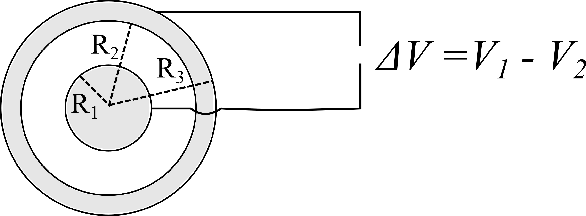

Una sfera di raggio $R_1$ è posta al centro di una sfera cava di raggio interno $R_2$ ed esterno $R_3$. I due conduttori sono mantenuti da un generatore a valori del potenziale $V_1$ e $V_2$ rispetto al potenziale all'infinito (che poniamo a 0 per comodità). 

1. Calcolare le cariche $q_1$, $q_2$ e $q_3$ depositate sulle tre superfici conduttive.
2. Calcolare numericamente le cariche se $R_1 = 10$ cm, $R_2 = 20$ cm, $R_3 = 25$ cm, $V_1 = -1000$ V, $V_2 = 200$ V.

## Soluzione

1. La differenza di potenziale tra $R_1$ ed $R_2$ si trova integrando il campo all'interno della cavità:
$$
\Delta V = V_1 - V_2 = \frac{q_1}{4\pi\epsilon_0} \left( \frac{1}{R_1} - \frac{1}{R_2} \right)
$$
Da cui si ricava la carica della sfera interna:
$$
q_1 = 4 \pi \epsilon_0 \Delta V \left( \frac{R_1 R_2}{R_1 - R_2} \right) = \Delta V C
$$
Dove l'ultima relazione mostra come il sistema possa essere considerato un condensatore sferico di capacità $C = 4 \pi \epsilon_0 \left( \frac{R_1 R_2}{R_1 - R_2} \right)$. Per il teorema di Gauss, la carica sulla superficie interna della sfera cava non può essere altro che $q_2 = -q_1$.  La carica sulla superficie esterna, invece, si trova integrando direttamente il campo per trovare la differenza di potenziale tra la sfera cava e l'infinito (dove $V = 0$):
$$
V_2 = \frac{q_3}{4\pi \epsilon_0} \frac{1}{R_3}
$$
Da cui si trova che:
$$
q_3 = 4 \pi \epsilon_0 R_3 V_2
$$

2. Sostituiamo i valori nelle relazioni trovate precedentemente:
$$
\begin{align}
q_1 & = -2.67 \times 10^{-8}\\\\
q_2 & = 2.67 \times 10^{-8}\\\\
q_3 & = 5.6 \times 10^{-9}
\end{align}
$$

# Esercizio 21

<small>MVN: esercizio 4.10</small>

Cinque fogli metallici sferici e concentrici (di spessore trascurabile) sono inizialmente scarichi. Il secondo e il terzo e il quarto e il quinto sono collegati da fili conduttori. Una carica $q$ è depositata sulla superficie più interna.
Calcolare

1. le cariche presenti sulle superfici;
2. il campo $E(r)$;
3. l'energia elettrostatica del sistema;

Calcolare le stesse quantità se

4. i conduttori 1 e 2 vengono collegati;

5. i conduttori 3 e 4 vengono collegati;

6. il conduttore 5 viene collegato a terra;

## Soluzione

I conduttori collegati possono essere visti come un unico conduttore, quindi il sistema può essere visto come una sfera conduttrice carica al centro di due sfere conduttrici concentriche.

1. La sfera centrale ha carica $q$. La superficie 2 si carica con $-q$ per induzione completa. Per conservazione della carica la superficie 3 acquista quindi una carica $q$. Per i conduttori 4 e 5 vale lo stesso discorso, e quindi si caricano rispettivamente con carica $-q$ e $q$.
2. Il campo è nullo all'interno dei conduttori e nelle zone comprese tra i conduttori collegati (quindi 2-3 e 4-5). Negli altri punti possiamo utilizzare il teorema di Gauss per trovare il campo, che vale sempre
$$
E(r ) = \frac{q}{4 \pi \epsilon_0 r^2}
$$
3. Il sistema può essere visto come composto da due condensatori sferici e da una superficie sferica cava. L'energia di un condensatore è semplicemente $U_e = \frac{q^2}{2C}$, dove la capacità di un condensatore sferico di raggi $R_a > R_b$ è
$$
C = 4 \pi \epsilon_0 \frac{R_a R_b}{R_a - R_b}
$$
L'energia elettrostatica di una sfera conduttrice carica può essere calcolata in due modi equivalenti:
  1. considerandola come un'armatura di un condensatore piano avente l'altra armatura all'infinito. In questo caso possiamo associarle una capacità $C_\infty = 4 \pi \epsilon_0 R_b$ che può essere utilizzata per calcolarne l'energia elettrostatica;
  2. utilizzando la relazione che lega il campo all'energia, $U_e = \frac{1}{2} \epsilon_0 \int_V E^2 d\tau$
In entrambi i casi otteniamo $U_e = \frac{q^2}{8 \pi \epsilon_0 R_5}$, e l'energia totale vale quindi
$$
U_e = \frac{q^2}{8 \pi \epsilon_0} \left( \frac{1}{R_1} - \frac{1}{R_2} + \frac{1}{R_3} - \frac{1}{R_4} + \frac{1}{R_5}\right)
$$
4. Collegare i due conduttori azzera la loro carica e quindi annulla il campo nell'intercapedine (e quindi l'energia elettrostatica associata al condensatore).
5. Come sopra.
6. Collegare a terra il conduttore più esterno lo fa scaricare, e quindi carica, campo ed energia si annullano.

# Esercizio 22

Un piano conduttore indefinito è carico con densità superficiale di carica $\sigma$. Su una delle due superfici viene appoggiata una lastra di materiale dielettrico omogeneo e lineare di spessore $h$ e costante dielettrica $\kappa$.

1. Calcolare le densità di carica di polarizzazione presenti sulle superfici del dielettrico.
2. Scrivere l'espressione della d.d.p. tra un punto all'interno del conduttore e uno all'esterno (dal lato del dielettrico).

## Soluzione

1. Il campo generato da una piano conduttore carico nel vuoto è
$$
\vec{E}_v = \frac{\sigma}{\epsilon_0} \hat{n}
$$
dove $\hat{n}$ è la normale al piano. All'interno di un dielettrico $\epsilon_0 \to \epsilon = \kappa \epsilon_0$, quindi
$$
\vec{E}_d = \frac{\sigma}{\kappa\epsilon_0} \hat{n}
$$
cioè l'intensità del campo diminuisce di un fattore $\kappa$. Sulle superfici del dielettrico appariranno delle densità di carica $\sigma_p$ in forza del fenomeno della polarizzazione. Queste densità di carica sono legate alla polarizzazione tramite la relazione $\sigma_p = \vec{P} \cdot \hat{n}$, dove $\vec{P} = \epsilon_0 (\kappa - 1) \vec{E}$ è il vettore polarizzazione (diverso da zero solo all'interno del dielettrico), che in questo caso vale quindi:
$$
\vec{P} = \frac{\kappa - 1}{\kappa} \sigma \hat{n}.
$$
Il dielettrico che stiamo considerando ha due superfici, una con normale diretta *verso* il conduttore, l'altra in verso opposto. Avremo quindi due densità di polarizzazione date da:
$$
\sigma_p = \pm \vec{P} \cdot \hat{n} = \pm \frac{\kappa - 1}{\kappa} \sigma
$$

2. Abbiamo visto come il campo elettrico assuma valori diversi all'interno e all'esterno del dielettrico. La d.d.p. tra la superficie del conduttore (su cui consideriamo $V(0) = 0$) ed un punto all'interno del dielettrico vale:
$$
\Delta V(x < h) = \int_0^x \frac{\sigma}{\epsilon} dx' = \frac{\sigma}{\epsilon}x
$$
Sulla seconda superficie del dielettrico si avrà quindi
$$
\Delta V(h) = \frac{\sigma}{\epsilon}h
$$
Per distanze maggiori, il campo da integrare è quello nel vuoto, quindi:
$$
\Delta V(x > h) = \int_0^h \frac{\sigma}{\epsilon} dx' + \int_h^x \frac{\sigma}{\epsilon_0} dx' = \frac{\sigma}{\epsilon}h + \frac{\sigma}{\epsilon_0}(x - h)
$$
Per validare il risultato basta vedere cosa succede se $\kappa = 1$...

# Esercizio 23

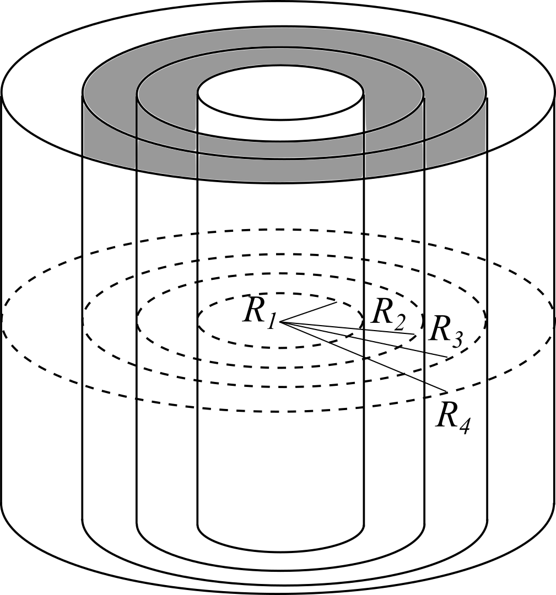

Un cilindro conduttore di raggio $R_1$ caricato con densità di carica superficiale $\sigma$, è posto al centro di un cilindro cavo, anch'esso conduttore, di raggio interno $R_3$ ed esterno $R_4$. Lo spazio interno tra le superfici è riempito con due dielettrici, anch'essi a forma di cilindro cavo. Il primo, di costante dielettrica $\kappa_1$, ha raggi $R_1$ ed $R_2$, il secondo, di costante dielettrica $\kappa_2$, ha raggi $R_2$ ed $R_3$. 

1. Calcolare $\vec{E}$, $\vec{D}$ e $\vec{P}$.
2. Calcolare le densità di polarizzazione sulle superfici dei dielettrici.
3. Calcolare la d.d.p. tra il cilindro interno ed un punto qualsiasi all'esterno del guscio cilindrico nei casi in cui quest'ultimo sia messo a terra oppure no.

## Soluzione

1. All'interno dei conduttori $\vec{E}$, e quindi anche $\vec{D}$ e $\vec{P}$, che sono proporzionali ad $\vec{E}$, sono nulli. All'esterno del cilindro cavo si ha, per il teorema di Gauss,
$$
\vec{E}(r ) = \frac{\sigma_4 R_4}{\epsilon_0 r} \hat{r} = \frac{\sigma R_1}{\epsilon_0 r}\hat{r}.
$$
essendoci il vuoto, $\vec{P} = 0$ e quindi $\vec{D}(r ) = \epsilon_0\vec{E}( r) = \frac{\sigma R_1}{r}\hat{r}$. All'interno dei dielettrici, se utilizziamo il teorema di Gauss per $\vec{D}$ troviamo che vale sempre (indipendentemente dal fatto che ci troviamo in un dielettrico o nell'altro)
$$
\vec{D}( r) = \frac{\sigma R_1}{r} \hat{r}
$$
questo perché le uniche cariche libere (cioè non dovute alla polarizzazione) sono quelle che si trovano sulla superficie del cilindro interno. Poiché $\vec{D} = \epsilon \vec{E} = \epsilon_0 \vec{E} + \vec{P}$ e quindi $\vec{P} = \epsilon_0 (\kappa - 1) \vec{E}$, si ha
$$
\begin{align}
\vec{E} & = \frac{\sigma R_1}{\kappa_i \epsilon_0 r} \hat{r}\\\\
\vec{P} & = \frac{\kappa_i - 1}{\kappa_i} \frac{\sigma R_1}{r} \hat{r}
\end{align}
$$
dove $i = 1, 2$ a seconda del dielettrico considerato.

2. La densità di polarizzazione vale sempre $\sigma_p = \vec{P} \cdot \hat{n}$. Sulla superficie interna:
$$
\sigma^{(1)}_p(R_1) = -\frac{\kappa_1- 1}{\kappa_1} \sigma
$$
Sulla superficie esterna del primo dielettrico:
$$
\sigma^{(1)}_p(R_2) = \frac{\kappa_1 - 1}{\kappa_1} \frac{\sigma R_1}{R_2} = -\sigma^{(1)}_p(R_1)\frac{R_1}{R_2}
$$
Sulla superficie interna del secondo dielettrico:
$$
\sigma^{(2)}_p(R_2) = -\frac{\kappa_2 - 1}{\kappa_2} \frac{\sigma R_1}{R_2}
$$
Mentre sulla superficie esterna del secondo dielettrico:
$$
\sigma^{(2)}_p(R_2) = \frac{\kappa_2 - 1}{\kappa_2} \frac{\sigma R_1}{R_3} = -\sigma^{(2)}_p(R_2)\frac{R_2}{R_3}
$$
Questi valori si possono validare a due a due considerando che la quantità di carica di polarizzazione in un dielettrico (comprese le sue superfici) deve essere zero!

3. Per il principio della gabbia di Faraday, il fatto che il conduttore più esterno sia messo o meno a terra non cambia la d.d.p. tra i due conduttori, che vale sempre:
$$
\Delta V_{1,3} = V(R_1) - V(R_3) = \int_{R_1}^{R_3} \vec{E} \cdot d\vec{s} = \int_{R_1}^{R_2} \frac{\sigma R_1}{\kappa_1 \epsilon_0 r} dr + \int_{R_2}^{R_3} \frac{\sigma R_1}{\kappa_2 \epsilon_0 r} dr = \frac{\sigma R_1}{\epsilon_0} \left( \frac{1}{\kappa_1} \log\left( \frac{R_2}{R_1}\right) + \frac{1}{\kappa_2} \log\left( \frac{R_3}{R_2}\right)\right)
$$
 D'altro canto, la d.d.p. tra il guscio esterno ed un punto qualsiasi al suo esterno vale $0$ nel caso sia messo a terra (applicate il teorema di Gauss per dimostrarlo!), oppure
$$
\Delta V_4(r ) = \int_{R_4}^r \frac{\sigma R_1}{\epsilon_0 r} dr = \frac{\sigma R_1}{\epsilon_0} \log\left( \frac{r}{R_4} \right)
$$
 nel caso in cui non lo sia (vedi sopra per l'espressione del campo). La differenza di potenziale totale è quindi diversa nei due casi e vale:
$$
\begin{align}
\Delta V(r ) & = \Delta V_{1,3} + \Delta V_4(r )\\\\
\Delta V(r ) & = \Delta V_{1,3}
 \end{align}
$$

# Esercizio 24

Una nuvola temporalesca ha una forma approssimativamente rettangolare, con lati $a = 2.0$ km e $b = 3.0$ km, e fluttua ad un'altezza $h = 500$ m al di sopra di una zona pianeggiante. La nuvola contiene una carica $q = -80$ C. 

1. Sapendo che la rigidità dielettrica dell'aria è circa $3.0 \times 10^6$ V/m, le condizioni descritte sopra sono sufficienti per generare fulmini?
2. Qual è l'energia elettrostatica del sistema nuvola $+$ terreno?

## Soluzione

Il sistema può essere visto come un condensatore piano di capacità:

$$
C = \frac{\epsilon_0 \Sigma}{h} = \frac{\epsilon_0 ab}{h} = 10.6 \times 10^{-8}\\, \mathrm{F}
$$

**Nota Bene:** la costante dielettrica relativa dell'aria è praticamente uno, quindi possiamo utilizzare le espressioni valide nel vuoto.

La differenza di potenziale tra la terra (caricata positivamente) e la nuvola (caricata negativamente) vale:

$$
\Delta V = \frac{q}{C} = 7.5 \times 10^8\\, \mathrm{V}
$$

1. La rigidità dielettrica è il massimo valore del campo elettrostatico che può essere applicato senza causare scariche (fulmini!). Calcoliamo il campo all'interno del "condensatore", utilizzando la solita espressione per i condensatori piani (molto approssimata in questo caso, perché?):
$$
E \simeq \Delta V / h = 1.5 \times 10^6\\, \frac{\mathrm{V}}{\mathrm{m}}
$$
che è più bassa della rigidità dielettrica: niente fulmini (in questa approssimazione)!
2. L'espressione dell'energia di un qualunque condensatore è $U_e = \frac{1}{2} q\Delta V$, quindi si ha:
$$
U_e = \frac{1}{2} q \Delta V = 3 \times 10^{10}\\, \mathrm{J}
$$

# Esercizio 25
<small>Ispirato dall'esercizio III.13 del Mencuccini-Silvestrini</small>

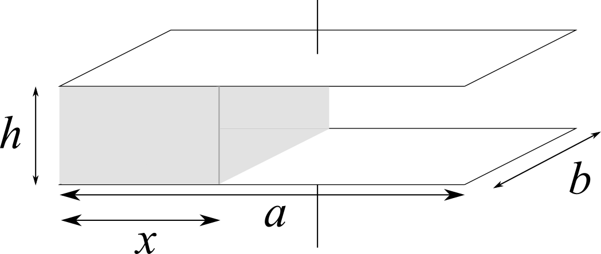

Un condensatore piano di dimensioni $a \times b \times h$ è parzialmente riempito (per un tratto $x = a / 3$) di una lastra di dielettrico omogeneo e isotropo di costante dielettrica relativa $\kappa$ e mantenuto ad una d.d.p. $\Delta V$. 

1. Quanto vale la carica $q_d$ che si dispone sulla parte di armatura superiore che si affaccia sul dielettrico?
2. Calcolare $q_d$ se $\Delta V = 113$ V, $a = b = 10$ cm, $h = 2$ mm e $\kappa = 4$.

## Soluzione

1. Il condensatore può essere visto come due condensatori in parallelo di capacità $C_d = \epsilon_0 \kappa ab / 3h$ e $C_v = 2 \epsilon_0 ab / 3h$. La carica di entrambi i "condensatori" si trova utilizzando la relazione che lega capacità, carica e differenza di potenziale, quindi: 
$$
q_d = C_d \Delta V = \frac{\epsilon_0 \kappa ab}{3h} \Delta V
$$
2. Sostituiamo i valori dati nelle relazione trovata al punto precedente:
$$
q_d = \frac{4}{3} 113 \cdot 8.854 \times 10^{-12} \frac{0.1 \cdot 0.1}{0.002}\\, \mathrm{C} = 0.667 \times 10^{-8} \\, \mathrm{C}
$$

# Esercizio 26

Un conduttore cilindrico cavo di lunghezza $h$ ha raggio interno $R_1$ ed esterno $R_2$ ed è costituito da un materiale di resistività $\rho$.

1. Calcolare la resistenza $R$ che oppone ad una corrente che scorre in direzione parallela all'asse del cilindro.
2. Dati $R_1 = 1$ mm, $R_2 = 1.5$ mm e se nel conduttore scorre una corrente $i = 500$ mA e il campo all'interno del conduttore ha intensità $E = 10$ V/m, quanto vale la resistività $\rho$?

## Soluzione

1. Applichiamo la definizione di resistenza:
$$
R = \rho \int_0^h \frac{dh}{\Sigma(h)} = \rho \int_0^h \frac{dh}{\pi (R_2^2 - R_1^2)} = \frac{\rho h}{\pi (R_2^2 - R_1^2)}
$$
2. Dobbiamo prima applicare la legge di Ohm per trovare la resistenza. Per farlo, però, dobbiamo prima calcolare la d.d.p. ai capi del conduttore:
$$
\Delta V = Eh = 10\\, {\rm V}
$$
Quindi:
$$
R = \frac{\Delta V}{i} = 20\\, {\rm \Omega} = \rho \frac{h}{\pi (R_2^2 - R_1^2)}
$$
e quindi la resistività vale:
$$
\rho = \frac{E \pi (R_2^2 - R_1^2)}{i} = 7.85 \times 10^{-5} \\, \Omega{\rm m}
$$

# Esercizio 30

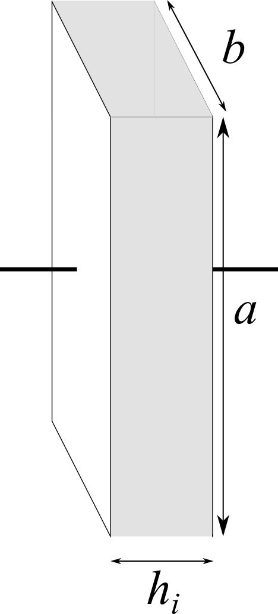

Un condensatore piano di dimensioni $a \times b \times h_i$ è riempito completamente con un liquido incomprimibile dielettrico di costante relativa $\kappa$ e mantenuto da un generatore ad una d.d.p. $\Delta V$ costante. Se la distanza tra le due armature diventa $1.5 h_i$,

1. come varia la capacità del condensatore?
2. se prima di fare questa operazione di allontanamento il generatore venisse spento, cosa succederebbe?
3. se l'operazione precedente venisse ripetuta per un dielettrico solido, quale sarebbe l'espressione della d.d.p.?

## Soluzione

1. La capacità iniziale del condensatore è:
$$
C_i = \frac{\epsilon_0 a b \kappa}{h_i}
$$
Poiché il liquido è incomprimibile, il volume che occupa rimane costante. Il volume iniziale è $V_i = abh_i$, mentre quello finale vale $V_f = 1.5 a x h_i$, dove $x$ è l'altezza che raggiunge dopo la variazione di distanza. Ponendo $V_i = V_f$ si ottiene $x = \frac{2}{3}b$. La capacità finale sarà quindi:
$$
C_f = \frac{4}{9} \epsilon_0 a b \kappa + \frac{2}{9} \epsilon_0 a b = \frac{\epsilon_0 a b}{h_i} \left( \frac{4}{9}\kappa + \frac{2}{9} \right)
$$
La differenza di capacità vale quindi:
$$
\Delta C = C_f - C_i = \frac{\epsilon_0 a b}{h_i} \left( \frac{4}{9}\kappa + \frac{2}{9} - \kappa \right) = \frac{\epsilon_0 a b}{h_i} \left( \frac{2}{9} - \frac{5}{9}\kappa \right)
$$
2. Se il generatore venisse spento *prima* di allontanare le armature, la carica sulle armature resterebbe la stessa. Inizialmente abbiamo
$$
q_i = \Delta V C_i
$$
D'altro canto alla fine avremmo
$$
q_f = \Delta V_f C_f = q_i = \Delta V C_i
$$
e quindi la nuova d.d.p. tra le armature sarebbe:
$$
\Delta V_f = \Delta V \frac{C_i}{C_f} = \Delta V \frac{9\kappa}{4\kappa + 2}
$$
3. Definito $\sigma = q_i / ab$, il campo nel vuoto è $E = \sigma / \epsilon_0$, mentre nel dielettrico è $E = \sigma / \kappa\epsilon_0$. Il potenziale tra le armature vale quindi:
$$
\Delta V = \frac{\sigma \left(\frac{3}{2} h_i - h_i\right)}{\epsilon_0} + \frac{\sigma h_i}{\kappa\epsilon_0} = \frac{q_i}{ab\epsilon_0}\left(\frac{h_i}{2} + \frac{h_i}{\kappa}\right)
$$

# Esercizio 31
<small>Esercizio II.6 del Mencuccini-Silvestrini</small>

Dato il circuito in figura

calcolare quale relazione debba sussistere tra le quattro capacità per far sì che si annulli la differenza di potenziale $\Delta V\_{AB} = V_A - V_B$.

## Soluzione

La differenza di potenziale ai capi dei due rami è la stessa, sono cioè collegati in parallelo. Le capacità equivalenti dei due rami valgono:

\begin{align}
C_u &= \frac{C_1 C_2}{C_1 + C_2}\\\\
C_d &= \frac{C_3 C_4}{C_3 + C_4}
\end{align}

e quindi le cariche sui rami valgono:

\begin{align}
q_u &= \Delta V \frac{C_1 C_2}{C_1 + C_2}\\\\
q_d &= \Delta V \frac{C_3 C_4}{C_3 + C_4}
\end{align}

Per il ramo superiore vale $\Delta V = \frac{q_u}{C_u} = \frac{q_u}{C_1} + \frac{q_u}{C_2}$. I due termini indicano la differenza di potenziale tra uno dei due poli ed il punto mediano $A$, e tra questo e il secondo polo. La d.d.p. tra il primo polo e $A$ vale quindi

$$
\Delta V_A = \Delta V - \frac{q_u}{C_2}
$$

Una relazione simile per la differenza di potenziale rispetto a $B$ si può scrivere per il ramo inferiore

$$
\Delta V_B = \Delta V - \frac{q_d}{C_4}
$$

Uguagliando queste due quantità troviamo

$$
\frac{q_u}{C_2} = \frac{q_d}{C_4}
$$

da cui si ricava 

$$
\frac{C_1}{C_1 + C_2} = \frac{C_3}{C_3 + C_4}
$$

e quindi

$$
C_1 C_4 = C_2 C_3
$$

# Esercizio 32

Un cilindro conduttore di raggio $R_1$ è circondato da un guscio cilindrico conduttore di raggi $R_2$ ed $R_3$. Sui due conduttori vengono depositate le cariche $q_1$ e $q_2$. L'altezza $h$ dei cilindri è tale per cui nel sistema si ha, con buona approssimazione, induzione completa.

1. Calcolare le quantità di carica che si trovano sulle tre superfici conduttive.

2. Una sfera conduttrice di raggio $R_s$ posta a grande distanza viene collegata al sistema. Calcolare le nuove distribuzioni di carica.
3. Calcolare la d.d.p. rispetto all'infinito ($V = 0$) del sistema di conduttori.

## Soluzione

1. Il cilindro interno ha carica $q_1$, che induce una carica $-q_1$ sulla faccia interna del guscio. Per conservazione della carica, la superficie più esterna del guscio sarà quindi caricata con $q_i = q_1 + q_2$.

2. Quando colleghiamo due conduttori, le cariche libere che eventualmente si trovano sulle loro superfici si spostano dall'uno all'altro in modo tale da eguagliare il loro potenziale. In questo caso troviamo:
$$
\frac{q_f}{2 \pi \epsilon_0 h} \log(R_3) = \frac{q_s}{4 \pi \epsilon_0 R_s}
$$
dove $q_f$ e $q_s$ sono le cariche finali del guscio e della sfera. Dalla relazione precedente si trova che
$$
\frac{q_f}{q_s} = \frac{h}{2R_s \log(R_3)}.
$$
D'altronde, per la conservazione della carica si deve avere $q_f + q_s = q_i$, e quindi
$$
\frac{q_i - q_s}{q_s} = \frac{h}{2R_s \log(R_3)}.
$$
da cui si trova
$$
q_s = \frac{q_i}{1 + \frac{h}{2R_s \log(R_3)}}
$$
e da cui si può ricavare la carica sulla superficie esterna del guscio, $q_f = q - q_s$. All'interno del guscio, ovviamente, nulla varia in forza del fenomeno di schermo elettrostatico.

3. Poiché sappiamo qual è la carica presente sulla superficie della sfera possiamo calcolare direttamente la differenza di potenziale:
$$
V(R_s) - V(\infty) = \frac{q_s}{4 \pi \epsilon_0 R_s} = \frac{q_i}{1 + \frac{h}{2R_s \log(R_3)}}  \frac{1}{4 \pi \epsilon_0 R_s}
$$

# Esercizio 33

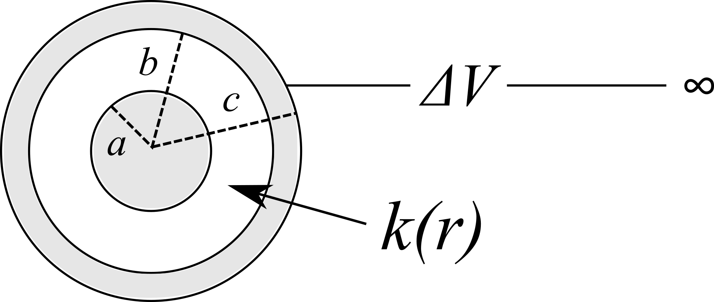

Un sistema è formato da due conduttori sferici concentrici. Il conduttore interno è pieno e ha raggio
$a = 20$ cm, quello esterno è cavo e ha raggio interno $b = 30$ cm ed esterno $c = 35$ cm. Lo spazio compreso tra i due conduttori è riempito da un dielettrico la cui costante dipende dalla distanza $r$ dal centro secondo la relazione $\kappa(r ) = r/a$. Il conduttore interno ha carica $q = 10$ nC, mentre quello esterno è mantenuto ad una d.d.p. $\Delta V = 500$ V rispetto all'infinito . Determinare:

1. il valore della carica sulle tre superfici conduttrici;
2. le cariche superficiali di polarizzazione presenti sulle superfici del dielettrico;
3. Il conduttore interno viene ora collegato con quello esterno, mantenendo inalterate le altre condizioni. Determinare i nuovi valori delle cariche sulle tre superfici conduttrici.

## Soluzione

1. La carica sulla superficie più interna è $q_a = q$, e quindi $q_b = -q$ per induzione completa. La superficie più esterna ha una carica determinata dalla differenza di potenziale a cui è posta:
$$
\Delta V = \frac{q_c}{4 \pi \epsilon_0 c}
$$
quindi
$$
q_c = 4 \pi \epsilon_0 c \Delta V = 19.5 \\, {\rm nC}.
$$
Il fatto che il conduttore sia mantenuto ad una certa d.d.p., quindi, fa sì che una quantità di carica $q_c - q = 9.5$ nC si trasferisca sulla sua superficie più esterna.
2. All'interno della cavità il campo vale
$$
E( r) = \frac{q}{4 \pi \epsilon_0 \kappa( r) r^2}
$$
e quindi il vettore polarizzazione ha modulo
$$
P(r ) = \epsilon_0 ( \kappa(r ) - 1 ) E(r ) = \frac{q (r - a)}{4 \pi r^3}.
$$
Possiamo ora calcolare le densità di carica di polarizzazione usando la relazione $\sigma_p = \vec{P}(r ) \cdot \hat{n}$:
\begin{align}
\sigma_p(a) & = 0\\\\
\sigma_p(b) & = P(b ) = 2.95 \\, {\rm nC / m^2}
\end{align}
3. Se i due conduttori vengono collegati, le cariche sulle due superfici interne si cancellano e quindi si avrà $q(a) = q(b) = 0$. D'altro canto, il conduttore più esterno è ancora posto ad una d.d.p. rispetto all'infinito, e quindi la sua carica non varia, risultando ancora $q_c = 19.5$ nC.
