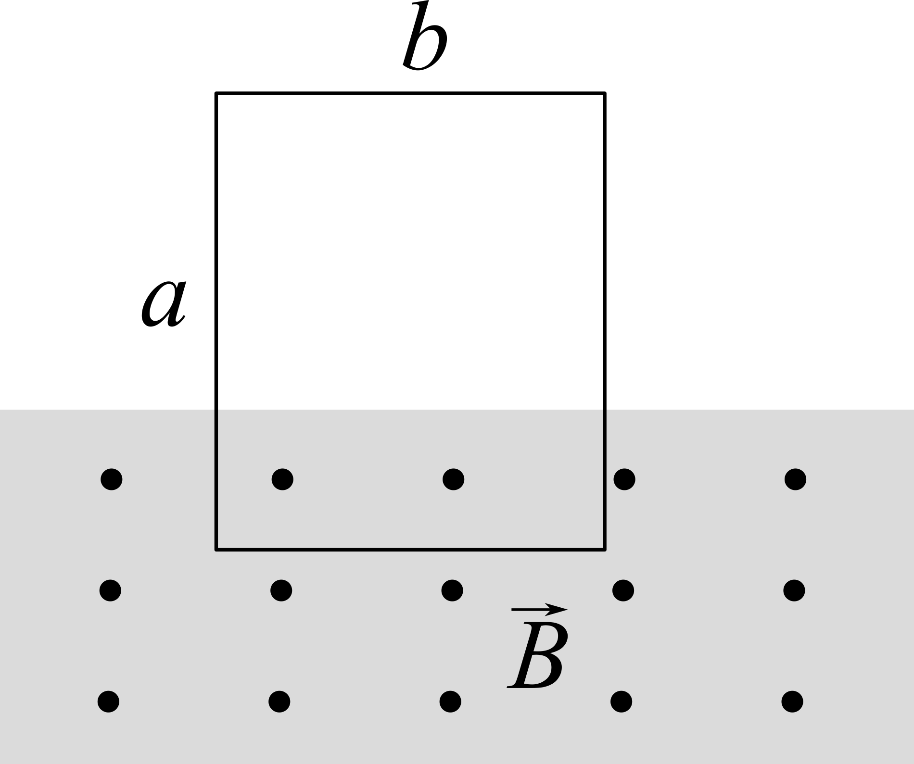
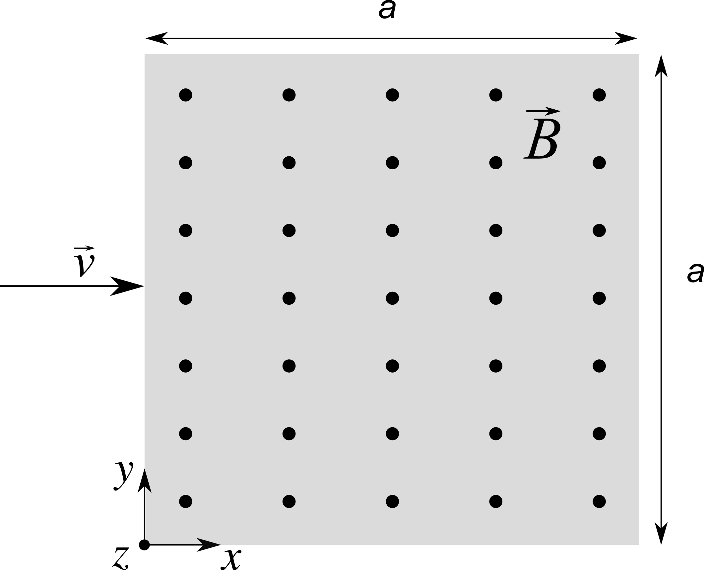
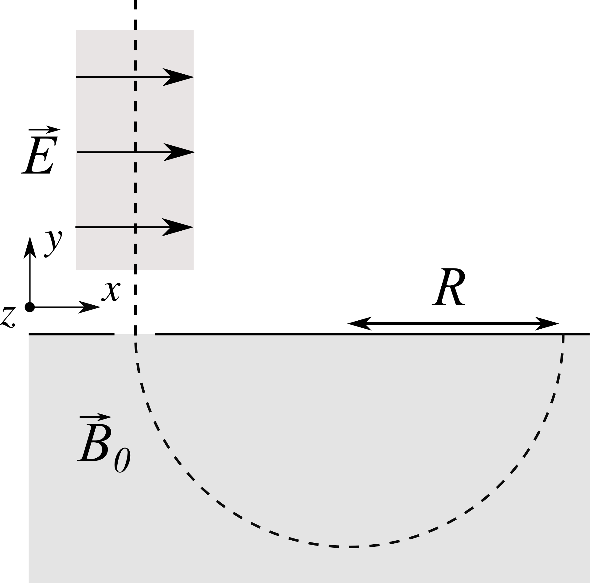
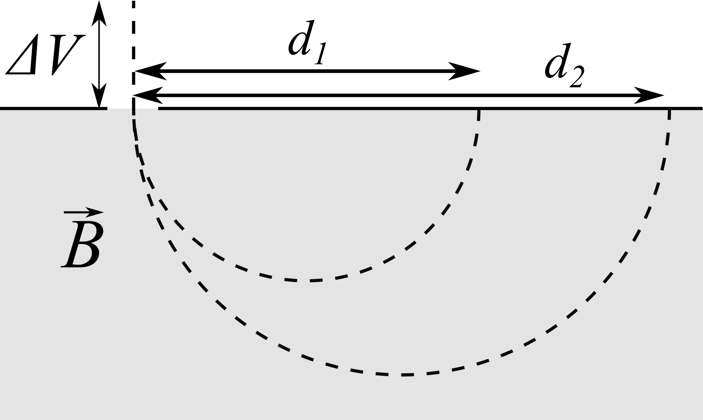
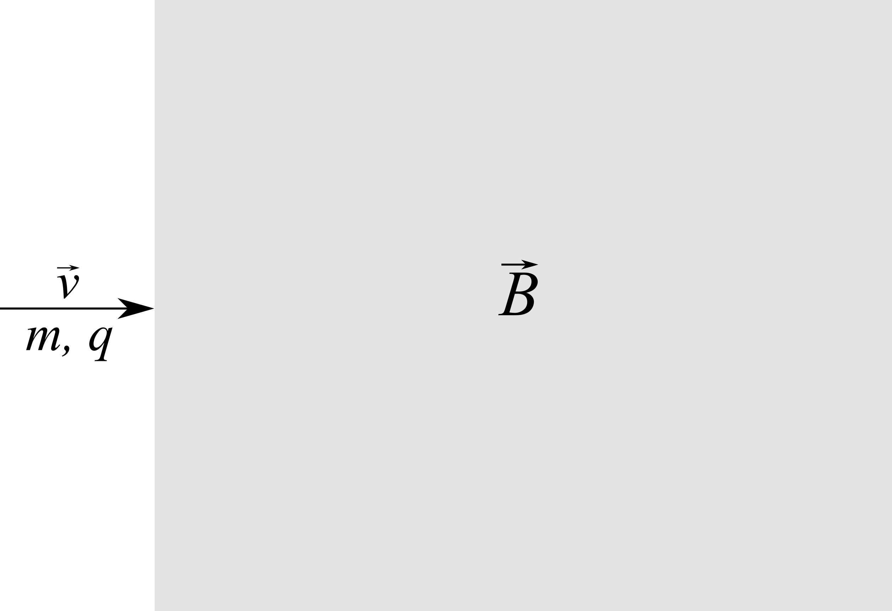
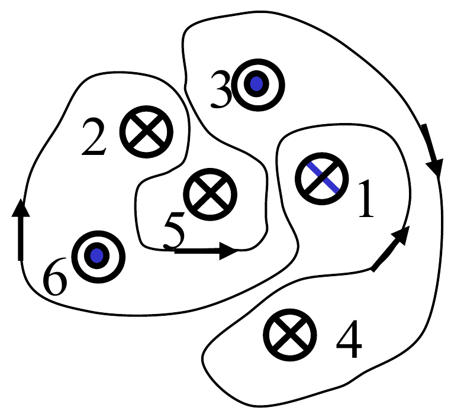
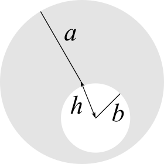
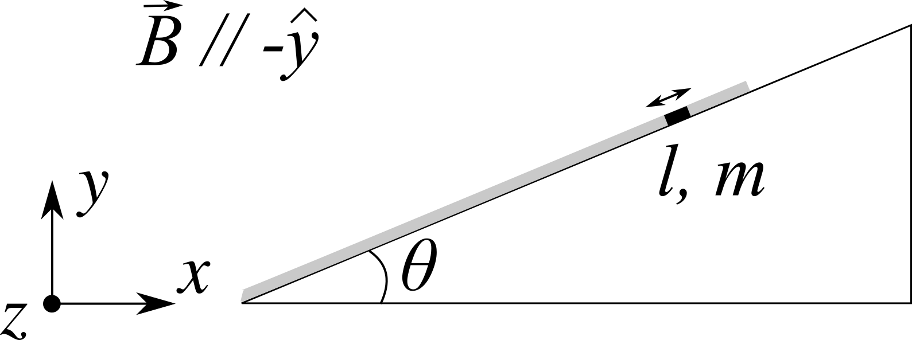
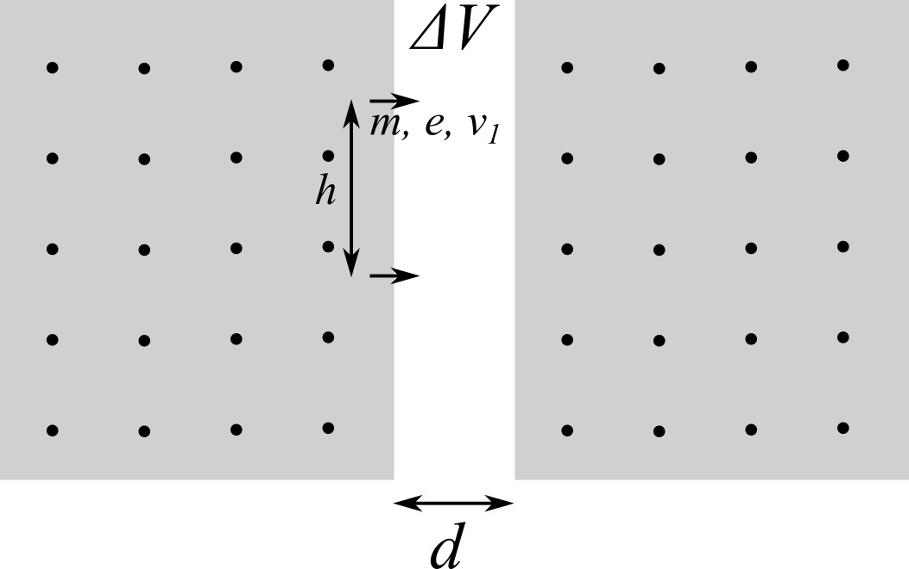

<!--
.. title: Esercizi di magnetostatica
.. slug: fisica2-esercizi-magnetostatica
.. date: 2023-07-03 17:41:10 UTC+02:00
.. tags: 
.. category: didattica
.. link: 
.. description: 
.. type: text
.. has_math: true
-->

[Il prodotto vettoriale](#il-prodotto-vettoriale) - [Esercizio 34](#esercizio-34) - [Esercizio 35](#esercizio-35) - [Esercizio 36](#esercizio-36) - [Esercizio 37](#esercizio-37) - [Esercizio 38](#esercizio-38) - [Esercizio 39](#esercizio-39) - [Esercizio 40](#esercizio-40) - [Esercizio 41](#esercizio-41) - [Esercizio 42](#esercizio-42) - [Esercizio 43](#esercizio-43) - [Esercizio 44](#esercizio-44) - [Esercizio 45](#esercizio-45) - [Esercizio 46](#esercizio-46) - [Esercizio 47](#esercizio-47) - [Esercizio 48](#esercizio-48) - [Esercizio 49](#esercizio-49) - [Esercizio 50](#esercizio-50) - [Esercizio 51](#esercizio-51) - [Esercizio 52](#esercizio-52) - [Esercizio 62](#esercizio-62)

## Il prodotto vettoriale

Il prodotto vettoriale tra i due vettori $\vec{a}$ e $\vec{b}$ gode delle seguenti proprietà:

* $\vec{a} \times \vec{b} = -\vec{b} \times \vec{a}$;
* $|\vec{a} \times \vec{b}| = ab \sin(\theta)$, dove $\theta$ è l'angolo tra i due vettori;
  * $\vec{a} \times \vec{b} = 0$ se $\vec{a}$ e $\vec{b}$ sono paralleli, cioè se vale $\vec{a} \cdot \vec{b} = 0$;
  * Il modulo del prodotto vettoriale è massimo quando $\theta = \pi / 2$, cioè quando i vettori sono ortogonali;
* Se $\vec{c} = \vec{a} \times \vec{b}$, allora $\vec{c} \cdot \vec{b} = 0$ e $\vec{c} \cdot \vec{a} = 0$, cioè il prodotto vettoriale tra due vettori è un vettore che è ortogonale ad entrambi

Il prodotto vettoriale è anche bilineare: se $\vec{a}$, $\vec{b}$ e $\vec{c}$ sono vettori e $k$ è uno scalare allora valgono le seguenti proprietà

* $(k \vec{a}) \times \vec{b} = k(\vec{a} \times \vec{b}) = \vec{a} \times (k\vec{b})$
* $(\vec{a} + \vec{c}) \times \vec{b} = \vec{a} \times \vec{b} + \vec{c} \times \vec{b}$
* $\vec{a} \times (\vec{b} + \vec{c}) = \vec{a} \times \vec{b} + \vec{a} \times \vec{c}$

:::{warning}
Il prodotto vettoriale **non è** associativo, quindi

$$
\vec{a} \times (\vec{b} \times \vec{c}) \neq (\vec{a} \times \vec{b}) \times \vec{c}
$$

ma si ha invece

$$
\vec{a} \times (\vec{b} \times \vec{c}) = (\vec{a} \cdot \vec{c}) \vec{b} - (\vec{a} \cdot \vec{b}) \vec{c}
$$

:::

Un sistema di riferimento cartesiano può essere

* *destrogiro*, per il quale vale $\hat{x} \times \hat{y} = \hat{z}$;
* *levogiro*, per il quale vale $\hat{x} \times \hat{y} = -\hat{z}$;

Noi avremo sempre a che fare con sistemi di riferimento destrogiri. In questo caso valgono le seguenti relazioni

$$
\begin{align}
\hat{x} \times \hat{y} & = \hat{z}\\\\
\hat{y} \times \hat{z} & = \hat{x}\\\\
\hat{z} \times \hat{x} & = \hat{y}
\end{align}
$$

da cui è possibile ricavare le altre utilizzando le proprietà del prodotto vettoriale. Un'utile regola mnemonica per ricordare il segno dei risultati del prodotto vettoriale di questi versori è la seguente:

*Leggendo da sinistra verso destra (e guardando il primo versore se $\hat{x}$ è l'ultimo versore scritto), se il versore che segue $\hat{x}$ è $\hat{y}$, allora il versore a destra dell'uguale ha il segno $+$, altrimenti il segno $-$.*

### Qualche esercizio

1. Calcolare il prodotto vettoriale tra $\vec{a} = 3\hat{x} - \hat{y} + 2\hat{z}$ e $\vec{b} = 5\hat{x} + \hat{z}$ e verificare che il risultato sia ortogonale sia a $\vec{a}$ che a $\vec{b}$.
	* $-\hat{x} + 7 \hat{y} + 5\hat{z}$.
2. Calcolare il prodotto vettoriale tra $\vec{a} = (-3, 0, -1)$ e $\vec{b} = (-1, 1, 2)$
	* $(1, 7, -3)$.
3. Determinare, se esiste, il valore di $c$ per cui i due vettori $\vec{a} = (1, -1, c)$ e $\vec{b} = (-2, c, 1)$ sono paralleli.
	* $(-c^2 - 1)\hat{x} + (-2c -1)\hat{y} + (c - 2)\hat{z}$. Per nessun valore di $c$ questo vettore è nullo, quindi non esiste un valore di $c$ per cui i due vettori sono paralleli.

# Esercizio 34

In una regione di spazio è presente un campo magnetico uniforme $\vec{B} = (B_x, B_y, B_z)$ G. Data una particella di carica $q$ e velocità generica $\vec{v} = (v_x, v_y, v_z)$, 

1. Calcolare per quali condizioni la forza dovuta al campo magnetico è diretta lungo $\hat{x}$, $\hat{y}$ e $\hat{z}$.
2. Poniamo $\vec{B}_1 = (0, -3, 4)$ G e $\vec{B}_2 = (3, 15, -1)$ G. Applicare nei due casi le relazioni trovate precedentemente per una carica positiva ($q \gt 0$) per trovare, se possibile, un esempio di valori di $v_x$, $v_y$ e $v_z$ per cui almeno una di queste relazioni si verifica.
3. Calcolare per quali condizioni la traiettoria della particella carica è limitata ad un piano quando è presente il campo $\vec{B}_2$.

## Soluzione

1. La forza che agisce sulla carica è quella di Lorentz, quindi

\begin{align}
\vec{F} & = q \vec{v} \times \vec{B} = q (v_x \hat{x} + v_y \hat{y} + v_z \hat{z}) \times (B_x\hat{x} + B_y\hat{y} + B_x\hat{z})\\\\
 & = q \left[  (v_y B_z - v_z B_y) \hat{x} + (v_z B_x - v_x B_z) \hat{y} + (v_x B_y - v_y B_x) \hat{z} \right]\\\\
\end{align}

  Dire che la forza è diretta lungo una certa direzione significa imporre che la sua componente lungo quella direzione sia l'unica diversa da 0. Imporre queste condizioni significa risolvere un sistema composto da tre equazioni (di cui una è una diseguaglianza). Nel caso di $\hat{x}$, ad esempio, si ha

\begin{align}
q (v_y B_z - v_z B_y) & > 0\\\\
v_z B_x - v_x B_z & = 0\\\\
v_x B_y - v_y B_x & = 0
\end{align}

  **Nota Bene:** nelle due uguaglianze $q$ si può semplificare (perché sempre diversa da 0), mentre nella diseguaglianza dobbiamo tenerla dato che, in principio, può essere sia positiva che negativa.
2. Svolgiamo per intero il secondo caso. Il campo magnetico si può riscrivere come $\vec{B}_2 = 3\hat{x} + 15\hat{y} - \hat{z}$. La forza che agisce sulla carica diventa quindi

\begin{align}
\vec{F} & = q (15 v_x \hat{z} + v_x \hat{y} - 3 v_y \hat{z} - v_y \hat{x} + 3 v_z \hat{y} - 15 v_z \hat{x})\\\\
  & = q (-v_y - 15 v_z, v_x + 3 v_z, 15 v_x - 3 v_y)
\end{align}

  Le relazioni scritte sopra per il caso generico sono ora più specifiche e si possono utilizzare per trovare i valori delle componenti della velocità. Nel caso di $\hat{x}$, ad esempio, si ha

\begin{align}
-q (v_y + 15 v_z) & > 0\\\\
v_x + 3 v_z & = 0\\\\
15 v_x - 3 v_y & = 0
\end{align}

Provando a risolvere questo o uno degli altri sistemi, si vede che non hanno soluzione (o meglio, hanno come unica soluzione il vettore $\vec{v} = (0, 0, 0)$). Questo perché il risultato di un prodotto vettoriale è un vettore ortogonale ad *ambo gli operandi*. Poiché $\vec{B}_2$ non è ortogonale a nessuno dei tre assi, questi non possono essere il risultato di un'operazione di prodotto vettoriale in cui sia coinvolto un campo con queste componenti. Nel caso di $\vec{B}_1$ il campo non ha componente $\hat{x}$ e quindi la forza può essere diretta lungo quest'asse se anche la velocità non ha componenti lungo $\hat{x}$. Inoltre le componenti della velocità devono essere tali da rispettare la disuguaglianza del punto precedente $q (v_y B_z - v_z B_y) \gt 0$, che in questo caso diventa
$$
v_y \gt -\frac{3}{4} v_z.
$$
3. La condizione si verifica se la velocità iniziale è ortogonale al campo. Infatti, la forza di Lorentz è sempre perpendicolare al campo magnetico, e quindi non potrà mai far deviare nella direzione del campo una traiettoria generata da una velocità che non ha componenti in quella direzione. Per trovare la relazione richiesta dal problema dobbiamo quindi imporre $\vec{v} \cdot \vec{B} = 0$, cioè:
$$
3 v_x + 15 v_y - v_z = 0.
$$
Questa equazione ha tre incognite, e quindi chiaramente infinite soluzioni, perché esistono infiniti vettore che giacciono su un piano dato.

# Esercizio 35

In una spira formata da cinque fili rettilinei scorre una corrente $i$ (vedi figura). La spira è immersa in un campo magnetico di modulo $B$ diretto lungo $\hat{z}$.

1. Determinare le forze (in modulo, direzione e verso) agenti su tutti i segmenti.
2. Determinare la forza totale agente sulla parte inferiore della spira (cioè sulla parte "diagonale" totale).
2. Calcolare la forza totale agente sulla spira.

## Soluzione

1. Utilizzando la regola della mano destra possiamo trovare subito direzione e verso (vedi figura per il verso sui segmenti diagonali). Il filo ed il campo sono ortogonali per tutti i casi, quindi i moduli delle forze valgono $F = i c B$ per i segmenti diagonali, $F = iaB$ per quelli verticali e $F = ibB$ per quello orizzontale.
2. Il problema si può risolvere esplicitamente calcolando le due forze e sommandole vettorialmente (fatelo!), oppure si può ricordare che se il campo è omogeneo la forza totale è data da $i \vec{L} \times \vec{B}$ dove $\vec{L}$ è la distanza tra i capi del segmento di filo di cui vogliamo conoscere la forza, quindi
$$
\vec{F}_{\rm d} = i b B \hat{y}
$$
3. Poiché la spira è chiusa e il campo omogeneo, la forza totale non può che essere nulla.

# Esercizio 36

In una spira rettangolare di massa $m = 4 \times 10^{-2}$ g e lati $a = 3$ cm e $b = 2$ cm scorre una corrente $|i| = 1$ A. La parte inferiore della spira, che è sottoposta alla forza peso diretta verso il basso, è immersa in un campo magnetico diretto lungo $\hat{z}$ che fa sì che la spira resti sospesa in aria con i lati più corti paralleli al terreno. Calcolare 

1. il verso della corrente;
2. il modulo di $\vec{B}$.

## Soluzione

1. Sulla spira sicuramente agisce la forza di gravità, $\vec{F}_g = -mg \hat{y}$. Poiché solo la parte inferiore della spira è immersa in un campo magnetico, vi sarà anche una forza magnetica dovuta al fatto che solo uno dei due lati paralleli al terreno avverte il campo. Se ipotizziamo che, in questo lato, la corrente scorra lungo $\hat{x}$, la forza varrà:
$$
\vec{F} = i \vec{b} \times \vec{B} = i b B \hat{x} \times \hat{z} = - i b B \hat{y} .
$$
Se la forza fosse effettivamente diretta lungo $-\hat{y}$, sarebbe concorde a quella di gravità e quindi la spira non potrebbe rimanere in equilibrio. È chiaro quindi che la corrente deve scorrere nella direzione contraria (cioè in senso orario se disegnamo la spira in modo che l'angolo in basso a sinistra sia il punto più vicino all'origine degli assi).
2. Il modulo del campo si trova eguagliando le due forze, 
$$
mg = ibB,
$$
e quindi
$$
B = \frac{mg}{ib} = 0.0196 \\, {\rm T} = 196 \\, {\rm G}
$$

# Esercizio 37

In una spira circolare di raggio $R$ scorre una corrente $i$. La spira è immersa in un campo magnetico uniforme $\vec{B} = B_0 \hat{x}$ e le condizioni del sistema sono tali per cui si trova ad oscillare attorno ad $\hat{y}$. Il momento di inerzia lungo quest'asse vale $I$.

1. Tenendo presente che la velocità angolare massima raggiunta è $\omega_0$, calcolare l'angolo tra la normale della spira e il campo magnetico quando $\omega = \omega_0 / 3$.
2. Una molla angolare di costante $k$ viene collegata alla spira in maniera tale da contrapporsi al momento magnetico mentre questa è nel punto per cui vale $\omega = 0$. Calcolare il valore che $k$ deve avere per far sì che la spira resti ferma.

### Soluzione

1. L'energia totale (che è conservata) ha due contributi: l'energia cinetica rotazionale e quella magnetica potenziale. La prima vale
$$
U_k = \frac{1}{2} I \omega^2
$$
mentre la seconda vale
$$
U_e = - \vec{m} \cdot \vec{B} = - m B \cos \theta
$$
dove $\vec{m} = i \Sigma \hat{n}$ è il momento di dipolo magnetico della spira, dove $\Sigma = \pi R^2$. L'energia totale vale
$$
U = \frac{1}{2} I \omega^2 - i \Sigma B \cos \theta.
$$
Quando $\theta = 0$ l'energia potenziale è minima e quindi quella cinetica è massima. In questo caso l'energia totale vale
$$
U_0 = \frac{1}{2} I \omega_0^2 - i \Sigma B
$$
e il suo valore può essere calcolato dai dati del problema. Quando $\omega = \omega_0 / 3$, si ha:
$$
U_0 = \frac{1}{18} I \omega_0^2 - i \Sigma B \cos \theta
$$
da cui si può ricavare il valore di $\cos \theta$:
$$
\cos \theta = \frac{1}{i \Sigma B} \left(\frac{1}{18} I \omega_0^2 -  U_0 \right).
$$
2. L'angolo per cui $\omega = 0$ si trova imponendo
$$
U_0 = - i \Sigma B \cos \theta_{\rm max}
$$
da cui si ottiene
$$
\theta_{\rm max} = \arccos\left(- \frac{U_0}{i \Sigma B} \right)
$$
Il momento meccanico di una molla angolare vale, in generale $M = k \theta$. La condizione di equilibrio si impone eguagliando i due momenti meccanici,
$$
k \theta_{\rm max} = i \Sigma B \sin \theta_{\rm max},
$$
per cui il valore della costante elastica che assicura che la spira resti ferma è
$$
k = \frac{i \Sigma B \sin \theta_{\rm max}}{\theta_{\rm max}}
$$

# Esercizio 38

Una spira rettangolare indeformabile di dimensioni $a = 40$ cm e $b = 1$ m e massa $m = 1$ g ha i lati lunghi paralleli all'asse $x$ ed è posta ad una distanza $d = 1$ cm da esso (vedi figura). Nella regione è presente un campo magnetico diretto lungo $-\hat{z}$ di modulo $B(y) = |A / y|$, con $ A = 6 \times 10^{-6}$ Tm.  La forza peso $\vec{F}_p$ agisce in direzione $-\hat{y}$. Quando nella spira scorre una corrente $i$ il sistema è in equilibrio e la spira rimane sospesa.

1. Determinare verso e intensità di $i$.
2. Si aggiunge nella regione di spazio in figura un campo magnetico uniforme uscente dal foglio e di intensità $B_{\rm add} = 1$ T. Quale deve essere il nuovo valore di $i$ per far sì che il sistema rimanga in equilibrio?

## Soluzione

1. Il verso di $i$ deve essere tale per cui la forza magnetica $F_m$ che il circuito sente sia contrapposta alla forza peso. In questo caso $F_m$ ha due contributi dati dalle due porzioni di spira parallele al filo. Il contributo dato dal filo più in alto è più forte, poiché lì il campo è maggiore, quindi deve essere quello che determina il verso della corrente. Per far sì che si generi una forza verso l'alto, $i$ deve scorrere lungo $\hat{x}$ in questa parte di spira. Ne consegue che $i_s$ scorre in senso orario.
   Affinché la spira sia in equilibrio, le intensità della forza peso e di quella magnetica devono essere uguali. La forza peso vale semplicemente $mg$. Quella magnetica è dovuta alla presenza del campo magnetico e ha due contributi dovuti alle due parti di spira parallele all'asse $x$, che si sommano direttamente poiché hanno la stessa direzione:

$$
F_m = i b B(d) + i b B(d + a) = i b A \left( \frac{1}{d} - \frac{1}{d + a}\right).
$$

Uguagliando le due forze si ottiene
$$
 A i b \left( \frac{1}{d} - \frac{1}{d + a} \right) = mg
$$
e risolvendo per i:
$$
i = \frac{mg}{A} \frac{d(d + a)}{ab} = 16.8 \\, {\rm A}
$$

2. La risposta non cambia, perché la forza totale agente sulla spira non risente di un campo omogeneo (perché?).

# Esercizio 39

Una particella di carica $q > 0$ entra dal lato delle $x$ negative e con velocità $\vec{v} = (v, 0, 0)$ nel centro di una regione in cui è presente un campo magnetico uniforme $\vec{B} = (0, 0, B)$. La regione si estende indefinitamente lungo $\hat{z}$ mentre ha dimensioni $a$ sia lungo $\hat{x}$ che lungo $\hat{y}$.

1. Calcolare qual è l'angolo $\theta$ rispetto all'asse $x$ con cui la particella esce dalla regione col campo se $B = \frac{mv}{10 qa}$.
2. Calcolare per quali valori di $B$ la particella esce dal lato da cui è entrata,
3. dal lato alla sua destra,
4. dal lato opposto a quello da cui è entrata.
5. Discutere cosa cambierebbe se la particella avesse una velocità iniziale $\vec{v} = (v_x, 0, v_z)$
6. Discutere cosa cambiarebbe se la particella possedesse una carica $q < 0$

## Soluzione

1. Per quel valore di $B$ il raggio della traiettoria è
$$
r = \frac{mv}{qB} = 10 a.
$$
Notiamo che la domanda è equivalente a chiedersi qual è l'angolo $\theta$ sotteso dall'arco di circonferenza compiuto dalla particella quando questa si è mossa di una distanza $a$ lungo $\hat{x}$. Questo vuol dire che si ha
$$
a = r \sin \theta
$$
e quindi
$$
\sin(\theta) = \frac{a}{r} = \frac{1}{10}
$$
e quindi
$$
\theta = \arcsin(0.1) \approx 0.1
$$
2. La particella percorrerà la circonferenza verso il basso (utilizzare la definizione di forza di Lorentz per vederlo!). Per avere la condizione richiesta si deve avere $2r = 2\frac{mv}{qB} < a / 2$, quindi
$$
B > \frac{4 m v}{qa}.
$$
3. Perché esca dal lato a destra, il campo deve essere chiaramente più debole di quello che la farebbe uscire dal lato da cui entrata. D'altro canto, deve essere più forte di quello che la farebbe uscire dal lato opposto. Si ha quindi
$$
B_o < B < \frac{4 m v}{qa}
$$
$B_o$ si trova calcolando il caso limite; quello, cioè, per cui la particella uscirebbe dallo spigolo del quadrato. Questo si trova imponendo che il punto di entrata e lo spigolo si trovino alla stessa distanza dal centro della circonferenza che identifica la traiettoria. Consideriamo il punto di entrata come l'origine degli assi. È chiaro quindi che, in questo sistema di riferimento, il centro della circonferenza deve avere $x_c = 0$. Vale quindi $r = y_c$. D'altro canto, per lo spigolo vale
$$
r = \sqrt{a^2 + \left(\frac{a}{2} - y_c\right)^2} = \sqrt{a^2 + \frac{a^2}{4} + y_c^2 - ay_c}.
$$
Elevando entrambi i membri al quadrato e sostituendo $r = y_c$ si trova
$$
b^2 + \frac{a^2}{4} - ay_c = 0
$$
da cui si ricava
$$
y_c = \frac{5}{4} a = r = \frac{mv}{qB_0}
$$
e quindi la condizione richiesta diventa
$$
\frac{4}{5} \frac{mv}{qa} < B < \frac{4 m v}{qa}
$$
4. Poiché per $B = 0$ il moto risulta inalterato, la condizione richiesta è
$$
0 < B < \frac{4}{5} \frac{mv}{qa}
$$
5. Le espressioni trovate prima rimangono invariate, purché si ponga $v = v_x$, perché avere una velocità con componente lungo il campo dà luogo ad un moto uniforme elicoidale che non modifica affatto il moto lungo il piano $xy$.
6. Il verso di percorrenza della circonferenza (o degli archi di circonferenza) dipende dal segno della carica quindi, data la simmetria del sistema, con carica negativa si avrebbero le stesse relazioni.

# Esercizio 40

Consideriamo uno spettrometro di massa costituito da un selettore di velocità seguito da una camera di deflessione. Il campo elettrico fra le placche del selettore di velocità ha modulo $E=2.5$ kV/m e direzione $\hat{x}$ (vedi disegno), mentre il campo magnetico nella camera di deflessione ha modulo $B_0=0.035$ T.  Per uno ione di carica $q=1.6 \times 10^{-19}$ C e $m=2.18 \times 10^{-26}$ Kg si misura un raggio della traiettoria $R = 0.28$ m. Determinare direzione, verso e modulo del campo magnetico presente nel selettore di velocità.

## Soluzione

Affinché l'effetto del campo magnetico controbilanci quello del campo elettrico, $\vec{B}$ deve essere diretto lungo $\hat{z}$.

Per trovare il modulo consideriamo che dal raggio di curvatura è possibile ottenere direttamente la velocità degli ioni, che vale

$$
v = \frac{rqB_0}{m} = 7.2 \times 10^{4} \\, {\rm m/s}.
$$

Ricordando che in un selettore di velocità quest'ultima è data dal rapporto tra i moduli dei campi si trova

$$
B = \frac{E}{v} = 0.035 \\, {\rm T}
$$

# Esercizio 41

Un piccolo fascio di ioni di carica $q = 1.6 \times 10^{-19}$ C e velocità iniziale nulla viene accelerato da una d.d.p. $\Delta V = 23$ V e penetra ortogonalmente in una camera a vuoto di uno spettrometro di massa. All'interno vi è un campo magnetico uniforme. Si nota che nello spettrometro il fascio si divide in due componenti: una colpisce la parete da cui sono entrati gli ioni ad una distanza $d_1 = 280$ mm, l'altra ad una distanza $d_2 = 392$ mm. Il primo fascio è composto da ioni sodio aventi $m_1 = 3.8 \times 10^{-26}$ Kg. 

1. Dato il disegno, determinare la direzione ed il verso del campo magnetico.
2. Calcolare la massa e la velocità del secondo tipo di ioni.

## Soluzione

1. Poiché $q > 0$, il campo deve essere entrante nel foglio.
2. La velocità degli ioni sodio si calcola dall'energia cinetica, che vale
$$
\frac{1}{2} m_1 v_1^2 = q\Delta V
$$
da cui si ottiene
$$
v_1 = \sqrt{\frac{2q\Delta V}{m_1}} = 1.4 \times 10^4 \\, {\rm m / s}
$$
I raggi di curvatura delle due traiettorie sono
$$
\begin{align}
R_1 & = \frac{1}{2} d_1 = 140 \\, {\rm mm}\\\\
R_2 & = \frac{1}{2} d_2 = 196 \\, {\rm mm}
\end{align}
$$

e, per la legge del moto uniformemente accelerato, vale
$$
q B = \frac{m_1 v_1}{R_1} = \frac{m_1 v_2}{R_2}
$$
d'altro canto, l'energia cinetica iniziale è la stessa per entrambi i fasci, e quindi
$$
\frac{1}{2} m_1 v_1^2 = \frac{1}{2} = m_2 v_2^2.
$$
Abbiamo due equazioni in due incognite. Risolvendo il sistema otteniamo
$$
\begin{align}
m_2 & = m_1 \left(\frac{R_2}{R_1}\right)^2 = 7.44 \times 10^{-26} \\, {\rm Kg}\\\\
v_2 & = v_1 \frac{R_1}{R_2} = 10^4\\, {\rm m / s}
\end{align}
$$

# Esercizio 42

Una particella di carica $q = 50$ mC e massa $m = 20$ g entra al tempo $t = 0$ in una regione molto grande dove è presente un campo magnetico di intensità $B = 0.25$ T ortogonale alla sua velocità iniziale, di modulo $v = 8$ m/s.

1. Calcolare la distanza a cui la particella riesce dalla regione col campo magnetico.
2. Calcolare il tempo che la particella trascorre nella regione col campo magnetico.
3. Calcolare l'intensità e la direzione del campo elettrico che bisogna applicare per far sì che che la traiettoria della particella rimanga perpendicolare al campo.
4. Calcolare a che tempo bisognerebbe spegnere il campo magnetico per ottenere un angolo di $\theta = 30^\circ$ tra le velocità di entrata e di uscita.

## Soluzione

1. Poiché la traiettoria presa dalla particella è una circonferenza di raggio $r = mv / qB$, la distanza è data dal suo diametro, cioè:
$$
d = 2 r = \frac{2 m v}{qB} = 26 \\, {\rm m}
$$

2. Il tempo trascorso nella regione col campo sarà metà del periodo del moto circolare uniforme, che vale $T = 2 \pi m / qB$, cioè:
$$
t = \frac{T}{2} = \frac{\pi m}{q B} = 5 \\, {\rm s}
$$

3. La direzione del campo elettrostatico deve essere perpendicolare al campo magnetico, così da contrastare la forza di Lorentz. L'intensità si trova equagliando il modulo delle forze che ne risulterebbero, cioè:
$$
q E = q v B
$$
e quindi
$$
E = v B = 2 \\, {\rm \frac{V}{m}}
$$

4. In un moto circolare uniforme la velocità angolare è costante ed è uguale all'angolo percorso nell'unità di tempo. Nel caso specifico di campo magnetico uniforme la velocità angolare vale

$$
\omega = qB / m
$$

e quindi si ha che, in funzione del tempo $t$, l'angolo vale

$$
\theta = \omega t
$$

da cui si ottiene

$$
t = \frac{\theta}{\omega} = \frac{\theta m}{q B}
$$

che, per $\theta = 30^\circ$, dà $t = 0.84$ s.

# Esercizio 43

Sei fili conduttori sono tutti perpendicolari allo stesso piano e attraversati da correnti $i$ uguali in modulo ma diverse in verso, come indicato in figura.

1. Calcolare la circuitazione del campo $\oint \vec{B} \cdot d\vec{s}$ lungo la linea chiusa percorsa nella direzione indicata dalle frecce.
2. Trovare, se esiste, un percorso chiuso tale per cui la circuitazione del campo valga $\oint \vec{B} \cdot d\vec{s} = -3 \mu_0 i$.
3. Trovare, se esiste, un percorso chiuso tale per cui la circuitazione del campo valga $\oint \vec{B} \cdot d\vec{s} = \mu_0 i /2$.

## Soluzione

1. Applichiamo la legge di Ampère. Notiamo subito che i fili $1$ e $5$ non sono concatenati al percorso e quindi danno un contributo nullo all'integrale. Per valutare i restanti dobbiamo applicare la regola della mano destra (o della vite) ai versi delle correnti per vedere se i loro contributi sono positivi o negativi. In tutti i casi indicati in figura il verso della linea chiusa è orario, e quindi correnti entranti danno contributo positivo e correnti uscenti danno contributo negativo. Si ha quindi:
$$
\oint \vec{B} \cdot d\vec{s} = \mu_0 (i_2 + i_4 - i_3 - i_6) = 0
$$
2. Si può prendere, ad esempio, un ovale che circondi i fili $1$, $4$ e $5$ e venga percorso in verso antiorario
3. Un percorso del genere non esiste, perché in questo sistema specifico non c'è modo di ottenere una somma di correnti che dia come risultato $i/2$.

# Esercizio 44

## Testo

Una spira rettangolare rigida di lati $a = 10$ cm e $b = 20$ cm ha una densità lineare di massa $\lambda_m = 0.05$ g/cm ed è percorsa da una corrente $i = 6$ A. Essa è posta inizialmente sul piano $xy$ con il lato a $y$ maggiori (lungo $a$) combaciante con l'asse $x$ e, in questa configurazione, la corrente scorre in verso antiorario. La spira può ruotare liberamente (senza attrito) intorno a quest'asse, mentre la forza peso agisce in direzione $-\hat{y}$. Determinare 

1. il modulo ed il verso del campo magnetico $\vec{B}$, uniforme e parallelo all'asse $y$, che produce una rotazione della spira verso $\hat{z}$ di $\theta_0 = 12^\circ = 0.209$ rad;
2. il lavoro compiuto dal campo sulla spira per produrre detta rotazione.

## Soluzione

1. Se la spira è in equilibrio quando forma un certo angolo $\theta$, significa che per questo valore dell'angolo i momenti meccanici presenti si equivalgono. Calcoliamoli rispetto all'asse $x$. Il fatto che la spira sia libera di ruotare rispetto al lato più in alto significa che quest'ultimo è fermo, e cioè non risente di eventuali forze presenti. Il momento magnetico sarà quindi dato dalla forza che agisce sull'altro lato di dimensione $a$, che vale
$$
\vec{F}_m = i a B \hat{x} \times \hat{y} = i a B \hat{z}
$$
e che, rispetto all'asse $x$, genera un momento meccanico magnetico
$$
\vec{M}_m = -i a b B \sin\left( \frac{\pi}{2} - \theta_0 \right) \hat{x}
$$
**Nota Bene:** data la definizione di $\theta$, il braccio del momento *non è* $\theta$ ma $\pi / 2 - \theta$ (disegnare il sistema di profilo per dimostrarlo!). D'altro canto, la forza peso vale in modulo $mg = 2\lambda_m (a + b) g$ ed è applicata a distanza $b / 2 \sin \theta_0$, quindi il suo momento rispetto ad $\hat{x}$ vale
$$
\vec{M}_g = \lambda_m (a + b)b g \sin \theta_0 \hat{x}
$$
I segni che abbiamo trovato considerando il verso di $\vec{B}$ parallelo a $\hat{y}$ sono corretti, perché così facendo si trova che i due momenti hanno verso opposto, e quindi effettivamente $\hat{B} = \hat{y}$. Eguagliando i moduli dei due momenti possiamo ricavare il modulo del campo:
$$
B = \frac{\lambda g}{i}\frac{a + b}{a} \tan \theta_0  = 5.21 \cdot 10^{-3} \\, {\rm T}.
$$

2. Il lavoro si ottiene integrando il momento meccanico tra $\theta = 0$ e $\theta = \theta_0$:

$$
W = iabB \int_0^{\theta_0} \cos \theta d\theta = iabB \sin \theta |_0^{\theta_0} = iabB \sin{\theta_0} = 1.3 \times 10^{-4} \\, {\rm J}
$$

# Esercizio 45

<small>Ispirato all'esercizio 7.1 del MNV</small>

Due fili conduttori molto lunghi orientati lungo l'asse $z$ sono posti a distanza $2a = 4$ cm lungo $x$. Nei fili scorre la stessa corrente $i = 50$ A ma in verso opposto (vedi figura). Prendendo come origine degli assi il punto equidistante tra i due fili,

1. Calcolare il campo magnetico lungo $\hat{x}$
2. Calcolare il campo magnetico lungo $\hat{y}$
3. Calcolare il valore per $y = a$.
4. Determinare come cambierebbero queste risposte se le due correnti scorressero nello stesso verso.

## Soluzione

1. La corrente che scorre nel filo alla sinistra dell'origine è uscente, mentre l'altra è entrante. Il modulo del campo è sempre dato da $\mu_0 i / 2 \pi r$, mentre il suo verso è determinato da $\hat{t} \times \hat{r}$, dove $\hat{t}$ è il versore tangente al filo nella direzione della corrente e $\hat{r} = \vec{r} / r$, dove $\vec{r}$ è il vettore che connette la sorgente di campo (e quindi il filo) al punto dove lo calcoliamo. Utilizzando queste relazioni troviamo che i due fili (di sinistra e di destra) genereranno i seguenti campi magnetici lungo l'asse $x$:

\begin{align}
\vec{B}_s(x, 0, 0) & = \frac{\mu_0 i}{2 \pi} \frac{\hat{y}}{x + a}\\\\
\vec{B}_d(x, 0, 0) & = -\frac{\mu_0 i}{2 \pi} \frac{\hat{y}}{x - a}
\end{align}

**Nota Bene:** fate molta attenzione al segno del campo! Questo cambia a seconda che ci si trovi alla sinistra o alla destra del filo. Per il principio di sovrapposizione, il campo totale è semplicemente la somma dei due, quindi:
$$
\vec{B}(x, 0, 0) = \frac{\mu_0 i \hat{y}}{2 \pi} \left( \frac{1}{x + a} - \frac{1}{x - a} \right)
$$

2. Poiché i campi hanno verso opposto, lungo l'asse $y$ le componenti $x$ sono uguali e contrarie e quindi si cancellano. Il campo sarà quindi dato da $\vec{B} = 2 B_y \hat{y}$. Per trovare il valore di $B_y$ disegniamo $\vec{B}$ e vediamo che $B_y = B \cos \theta$, dove 

$$
\cos \theta = \frac{a}{r} = \frac{a}{\sqrt{a^2 + y^2}}
$$

e quindi il campo vale
$$
\vec{B}(0, y, 0) = \frac{\mu_0 i}{\pi}\frac{a}{a^2 + y^2}\hat{y}
$$
Lo stesso risultato si può ottenere calcolando in maniera più meccanica il campo generato dal filo utilizzando i versori come fatto per il punto precedente (e a lezione).

3. Sostituendo i valori noti nella relazione appena calcolata si trova

$$
B(0, a, 0) = 5 \times 10^{-4} \\, {\rm T} = 5 \\, {\rm G}
$$

4. Se le correnti scorressero nello stesso verso, anche i due campi sarebbero orientati nella stessa maniera. Prendiamo entrambe le correnti uscenti. Lungo l'asse $x$ si avrebbe quindi

$$
\vec{B}(x, 0, 0) = \frac{\mu_0 i \hat{y}}{2 \pi} \left( \frac{1}{x + a} + \frac{1}{x - a} \right),
$$

mentre lungo l'asse $y$ la componente $B_y$ avrebbe due contributi uguali e contrari, per cui si avrebbe
$$
B_y(0, y, 0) = 0.
$$
D'altro canto, le componenti $x$ dei due campi in questo caso si sommerebbero, per cui si avrebbe $\vec{B} = 2B_x \hat{x}$. Le componenti $x$ si trovano con una costruzione analoga a quella fatta prima con $B_x = B \sin \theta$, dove
$$
\sin \theta = \frac{y}{r} = \frac{y}{\sqrt{a^2 + y^2}}
$$
e quindi
$$
\vec{B}(0, y, 0) = -\frac{\mu_0 i}{\pi}\frac{y}{a^2 + y^2}\hat{x}
$$

# Esercizio 46

Sei lunghi fili complanari percorsi da una corrente $i = 1$ A sono disposti in modo tale da delimitare una regione esagonale di lato $l = 10$ cm (vedi regione grigia in figura). Il verso delle correnti porta a percorrere l'esagono in senso orario. Determinare verso e intensità della componente di $\vec{B}$ perpendicolare al piano nel centro dell'esagono.

## Soluzione

Usando la regola della mano destra (o della vite) si trova che i campi generati singolarmente dai fili nel centro dell'esagono sono sempre entranti nel piano. Per ragioni di simmetria le intensità dei campi nel centro saranno tutte uguali e, in particolare, saranno dati dalla legge di Biot-Savart, $B_s = \frac{\mu_0 i}{2 \pi r}$, dove $r$ è la distanza dal centro. Questa si può calcolare disegnando il sistema e notando che un esagono è composto da sei triangoli equilateri

$$
r = l \cos\theta
$$

dove $\theta = \pi / 6$ è metà dell'angolo che sottende ogni lato e che, in un esagono, vale $60^\circ = \pi / 3$. Sostituendo nella relazione precedente si trova

$$
B = 6 B_s = 6\frac{\mu_0 i}{2 \pi r} = 12\frac{\mu_0 i}{2 \pi l} \tan\left( \frac{\pi}{6} \right) = 13.86 \\, {\rm \mu T}
$$

# Esercizio 47

## Testo

Una spira rettangolare indeformabile di dimensioni $a = 40$ cm e $b = 1$ m e massa $m = 1$ g è parallela ad un filo (fisso e parallelo all'asse $x$) e posta ad una distanza $d = 1$ cm da esso (vedi figura). Nel filo scorre una corrente $i_f = 30$ A verso destra ($x$ crescenti). La forza peso $\vec{F}_p$ agisce nella direzione indicata in figura. Quando nella spira scorre una corrente $i$ il sistema è in equilibrio e la spira rimane sospesa.

1. Determinare verso e intensità di $i$.
2. Si aggiunge nella regione di spazio in figura un campo magnetico uniforme uscente dal foglio e di intensità $B_{\rm add} = 1$ T. Quale deve essere il nuovo valore di $i$ per far sì che il sistema rimanga in equilibrio?

## Soluzione

1. Il campo magnetico generato dal filo è entrante nella regione di spazio in cui è presente la spira, e il suo modulo vale
$$
B(r ) = \frac{\mu_0 i_f}{2 \pi r},
$$
dove r è la distanza tra il filo e il punto in cui si calcola il campo. Il verso di $i$ deve essere tale per cui la forza magnetica $F_m$ che il circuito sente sia contrapposta alla forza peso. In questo caso $F_m$ ha due contributi dati dalle due porzioni di spira parallele al filo. Il contributo dato dal filo più in alto è più forte, poiché lì il campo è maggiore (poiché $r$ è minore), quindi deve essere quello che determina il verso della corrente. Per far sì che si generi una forza verso l'alto, $i$ deve scorrere lungo $\hat{x}$ in questa parte di spira. Ne consegue che $i_s$ scorre in senso orario.
Affinché la spira sia in equilibrio, le intensità della forza peso e di quella magnetica devono essere uguali. La forza peso vale semplicemente $mg$. Quella magnetica è dovuta alla presenza del campo magnetico e ha due contributi dovuti alle due parti di spira parallele all'asse $x$, che si sommano direttamente poiché hanno la stessa direzione:
$$
F_m = i b B(d) + i b B(d + a) = i b \frac{\mu_0 i_f}{2 \pi} \left( \frac{1}{d} - \frac{1}{d + a}\right).
$$
Uguagliando le due forze si ottiene
$$
 \frac{\mu_0 i_f}{2 \pi} i b \left( \frac{1}{d} - \frac{1}{d + a} \right) = mg
$$
e risolvendo per i:
$$
i = \frac{2\pi mg}{\mu_0 i_f} \frac{d(d + a)}{a} = 16.8 \\, {\rm A}
$$
2. La risposta non cambia, perché la forza totale agente sulla spira non risente di un campo omogeneo (perché?).

# Esercizio 48
<small>Ispirato all'esempio 7.5 del MNV</small>

Un solenoide toroidale composto da $N$ spire in cui scorre una corrente $i$ è riempito con un materiale avente permeabilità magnetica relativa $\kappa_m$. 

1. Calcolare i campi $\vec{H}$, $\vec{B}$ ed $\vec{M}$ presenti nel suo interno.
2. Calcolare la corrente di magnetizzazione.

## Soluzione

1. Usando la legge di Ampère abbiamo già visto che, nel vuoto, il campo magnetico generato da un solenoide toroidale è nullo all'esterno mentre all'interno ha modulo costante e direzione tangente alle circonferenze di raggio $r$. In particolare, il modulo vale
$$
B_0 = \frac{\mu_0 N i}{2 \pi r}.
$$
Quando è pieno possiamo applicare la legge di Ampère per il vettore $\vec{H}$:
$$
\oint \vec{H} \cdot d\vec{s} = 2 \pi r H = N i
$$
da cui si ottiene
$$
H = \frac{N i}{2 \pi r}.
$$
Il campo magnetico vale quindi
$$
B = \mu H = \frac{\mu N i}{2 \pi r}
$$
Per quanto riguarda la magnetizzazione, si trova 
$$
M = \chi_m H = \frac{\chi_m N i}{2 \pi r}
$$

2. La corrente di magnetizzazione si può trovare in diversi modi. Ad esempio, si può considerare la circuitazione del vettore magnetizzazione:

$$
i_m = \oint \vec{M} \cdot d\vec{s} = M 2 \pi r = \chi_m N i
$$

oppure si può calcolare dalla relazione generale ottenuta dalle considerazioni microscopiche:

$$
\vec{j}_m = \vec{M} \times \hat{n}
$$

che, poiché $\vec{M}$ e $\hat{n}$ sono ortogonali, diventa

$$
j_m = M.
$$

Ricordando che $j_m$ è una densità di corrente *lineare*, vale 

$$
i_m = 2 \pi r j_m = 2 \pi r M = \chi_m N i
$$

# Esercizio 49
<small>Esercizio V.17 del Mencuccini-Silvestrini</small>

Un conduttore di forma cilindrica di raggio $a$ e lunghezza indefinita è percorso da una corrente stazionaria $i$. All'interno del conduttore vi è una cavità di sezione circolare di raggio $b$ che corre parallela all'asse del cilindro. La distanza tra i centri dei cilindri è $h$. Calcolare il campo magnetico $\vec{B}$ in un punto generico posto a distanza $r > a$ dal centro del cilindro conduttore lungo l'asse che congiunge i due centri. 

## Soluzione

Questo sistema può essere considerato la sovrapposizione di due sistemi: un cilindro pieno di raggio $a$ in cui scorre una corrente e un cilindro pieno di raggio $b$ in cui scorre una corrente di verso opposto di stessa densità.
In questo caso la densità di corrente vale

$$
j = \frac{i}{\Sigma} = \frac{i}{\pi (a^2 - b^2)}.
$$

La corrente nel primo cilindro *pieno* varrà quindi

$$
i_p = j \pi a^2 = \frac{i a^2}{a^2 - b^2}
$$

mentre quella fittizia che "scorre" nel cilindro vuoto vale

$$
i_v = -j \pi b^2 = -\frac{i b^2}{a^2 - b^2}.
$$

Sommiamo ora i due contributi, ognuno dei quali è dato dalla legge di Biot-Savart:

$$
B(r ) = \frac{\mu_0}{2 \pi} \left( \frac{i_p}{r} + \frac{i_v}{r - h} \right) = \frac{\mu_0 i}{2 \pi (a^2 - b^2)} \left( \frac{a^2}{r} - \frac{b^2}{r - h} \right)
$$

# Esercizio 50

Una spira rettangolare è posta su di un piano inclinato di $\theta = \pi / 6 = 30^\circ$. Uno dei due lati orizzontali (lunghi $l = 50$ cm) è fisso a terra, mentre l'altro è costituito da una barra conduttrice di massa $m = 0.1$ kg che può scivolare senza attriti sul piano. Il circuito è immerso in un campo magnetico $\vec{B} = -B_0 \hat{y}$, dove $B_0 = 0.8$ T e $\hat{y}$ è indicato in figura. 
Determinare verso e intensità della corrente $i$ che deve scorrere nel circuito per far sì che la sbarra resti ferma in posizione. 

## Soluzione

La forza peso agente sulla sbarra conduttrice è $\vec{F}_p = -mg\hat{y}$. La componente $F_p \cos \theta$ è bilanciata dalla reazione vincolare del piano, mentre la componente $F_p \sin \theta$ tenderà a far scivolare la sbarra verso terra lungo il piano. Per avere una situazione di equilibrio dobbiamo generare una forza magnetica che vada in direzione opposta (cioè in direzione $\hat{x}$). Scriviamo quale sarebbe l'espressione della forza se la corrente scorresse nella barra lungo il verso di $-\hat{z}$:

$$
\vec{F}_m = i \vec{l} \times \vec{B} = -i l \hat{z} \times (-B_0 \hat{y}) = -i l B_0 \hat{x}.
$$

Poiché in questo caso la forza sarebbe diretta lungo la stessa direzione della forza peso, è chiaro che dobbiamo considerare il verso opposto della corrente, e cioè $\vec{l} = l\hat{z}$. Guardando il circuito dal semi-asse delle $y$ positive, questo significa che la corrente deve scorrere in senso orario.

Per trovare l'intensità della corrente eguagliamo i moduli delle due forze lungo la direzione del piano. Come per la forza peso, anche parte della forza magnetica ($F_m \sin \theta$) è bilanciata dalla reazione vincolare, per cui le due componenti da eguagliare sono

$$
mg \sin \theta = i l B_0 \cos \theta
$$

da cui otteniamo l'intensità di corrente come

$$
i = \frac{mg}{l B_0} \tan \theta \approx 1.4 \\, {\rm A}
$$

# Esercizio 51

Un lungo filo rettilineo percorso da una corrente $i$ è sospeso al soffitto tramite delle corde ad esso collegate ad invervalli regolari e forma un angolo $\theta = 30^\circ$ con la verticale, definito come uno spostamento in direzione antioraria rispetto a quest'ultima. Il filo ha una densità lineare di massa $\lambda = 0.12$ kg/m e si trova in una regione di spazio in cui è presente un campo magnetico diretto verso il basso di intensità $B = 0.36$ T. Determinare verso e intensità della corrente che scorre nel filo. 

**Nota Bene:** la figura mostra lo stesso sistema da due punti di riferimento diversi (identificati dai sistemi di riferimento).

## Soluzione

Sul filo agiscono due forze: quella peso e quella magnetica. Poiché la lunghezza del filo è indefinita, dobbiamo ragionare in termini di *forza per unità di lunghezza*. In questo caso è possibile farlo perché entrambe le forze sono proporzionali alla lunghezza del tratto considerato. L'intensità della forza peso vale infatti $\lambda l g$, mentre quella della forza magnetica è $ilB$. Per porre le condizioni di equilibrio, dobbiamo scomporre le forze per unità di lunghezza lungo le componenti tangenziali e normali alle corde che tengono sospeso il filo. Queste ultime vengono annullate dalla tensione delle corde, e quindi dobbiamo semplicemente porre uguali ed opposte le componenti tangenziali.
Disegnando il sistema, vediamo come la componente tangenziale della forza peso tenderà a far diminuire $\theta$, quindi la corrente deve essere tale per cui la componente tangenziale della forza magnetica deve andare nel verso opposto. Considerando che $\vec{F} = i \vec{l} \times \vec{B}$ e che $\vec{B} = - B \hat{y}$ si trova subito che la corrente deve avere verso uscente dal foglio.
Per trovare l'intensità di corrente poniamo uguali le due componenti tangenziali:

$$
\lambda g \sin(\theta) = i B \cos(\theta)
$$

e quindi otteniamo

$$
i = \frac{\lambda g}{B} \tan(\theta) = 1.89 \\, {\rm A}
$$

# Esercizio 52
<small>Esercizio 6.11 del MNV</small>

Due griglie metalliche $G_1$ e $G_2$ parallele molto estese distano $d = 4$ cm e separano due regioni di spazio in cui esiste un campo magnetico $B = 0.8$ T uniforme e uscente dal foglio. Tra le griglie è applicata un d.d.p. $\Delta V$. Al tempo $t = 0$ un protone attraversa $G_1$ nel punto $A_1$ ed entra nella regione tra le griglie con velocità ortogonale a $G_1$. Dopo un tempo $t_{\rm tot} = 1.22 \times 10^{-7}$ s il protone riattraversa nuovamente $G_1$ nello stesso verso ma in un punto $A_2$ distante $h = 5.2$ cm da $A_1$. 

1. Calcolare $\Delta V$.
2. Calcolare le velocità $v_1$ e $v_2$ del protone all'interno delle due regioni col campo magnetico.

## Soluzione

1. Il tempo $t_{\rm tot}$ è la somma del tempo trascorso all'interno delle regioni e dello spazio tra le griglie, cioè:
$$
t_{\rm tot} = 2 t_G + t_1 + t_2
$$
perché $t_G$ è lo stesso sia in un verso che nell'altro, poiché la particella è sottoposta alla stessa forza e in un caso passa da $v_1$ a $v_2$ e nell'altro da $v_2$ a $v_1$. I tempi $t_1$ e $t_2$ sono metà dei periodi necessari per compiere una traiettoria circolare. Poiché ci ricordiamo che il periodo è indipendente dalla velocità, si trova immediatamente
$$
t_1 = t_2 = \frac{T}{2} = \frac{\pi m}{q B}
$$
e quindi, sostituendo,
$$
t_G = \frac{t_{\rm tot} - T}{2} = 2 \times 10^{-8} \\, {\rm s}
$$
Se disegniamo il sistema notiamo come $h$ sia semplicemente la differenza tra i diametri delle semicirconferenze disegnate dalla traiettoria della particella all'interno delle due regioni col campo, cioè:
$$
h = 2r_2 - 2r_1 = 2 \frac{m}{qB} (v_2 - v_1)
$$
da cui si ricava
$$
v_2 - v_1 = \frac{hqB}{2m} = 2 \times 10^{6} \\, {\rm m/s}.
$$
D'altronde, l'accelerazione tra le due griglie è costante e quindi possiamo scrivere
$$
v_2 = v_1 + at_G = v_1 + \frac{q\Delta V}{md} t_G,
$$
dove abbiamo scritto l'accelerazione come la forza dovuta al campo elettrico, che vale $E = \Delta V / d$, diviso per la massa della particella, $a = q \Delta V / dm$. Risolvendo per $\Delta V$ si trova
$$
\Delta V = (v_2 - v_1) \frac{md}{qt_G} = 4.18 \times 10^4 \\, {\rm V}
$$

2. Ora conosciamo solo la differenza tra le due velocità. Possiamo trovarne il valore assoluto scrivendo l'equazione del moto iniziale per la particella, per cui si ha, considerando $x(0) = 0$,
$$
x(t) = v_1 t + \frac{1}{2} a t^2 = v_1 t + \frac{q \Delta V}{2md} t^2
$$
che, per $t = t_G$, vale
$$
d = v_1 t_G + \frac{q \Delta V}{2md} t_G^2 = v_1 t_G + \frac{1}{2}(v_2 - v_1) t_G
$$
da cui possiamo ricavare $v_1$:
$$
v_1 = \frac{d - \frac{1}{2}(v_2 - v_1) t_G}{t_G} = 10^6 \\, {\rm m/s}
$$
e quindi $v_2$ vale:
$$
v_2 = (v_2 - v_1) + v_1 = 3 \times 10^6 \\, {\rm m/s}
$$

# Esercizio 62

Due fili indefiniti sono posti su di un piano inclinato di un angolo $\theta = 10^\circ$. Il filo posto più in basso, in cui scorre una corrente $i_b = 20 A$ in direzione $\hat{z}$ (considerando il sistema di riferimento indicato in figura), è fisso. Il filo più in alto, che ha densità di massa $\lambda = 0.01$ kg/m ed in cui scorre una corrente $i_a$, è libero di scivolare senza attrito sul piano. Se la distanza tra i due fili vale $d = 1$ cm, il filo più in alto rimane fermo. **Nota Bene:** la forza peso ha direzione $-\hat{y}$. In figura i cerchi utilizzati per disegnare i fili **non** indicano necessariamente la direzione della corrente che scorre.

1. Calcolare verso e intensità di $i_a$.
2. Determinare direzione, verso e intensità del campo magnetico presente nel punto $O$ equidistante (distanza $d/2$) dai due fili (vedi figura).
3. Il sistema viene immerso in un campo magnetico uniforme di modulo $B = 0.1$ T e direzione $-\hat{z}$. Determinare il valore di $i_a$ necessario affinché il sistema resti in equilibrio.

## Soluzione

1. Poiché la forza peso agisce lungo $-\hat{y}$, la forza magnetica deve sicuramente avere una componente positiva lungo $\hat{y}$, quindi le correnti devono scorrere in verso opposto: il verso di $i_a$ non può che essere lungo $-\hat{z}$. Se il sistema è in equilibrio la forza totale deve essere zero. Poiché il filo è indefinito, in questo caso si parla di forza per unità di lunghezza, la cui risultante vale:
$$
i_a B_b(d) - \lambda g \sin\theta = \frac{\mu_0 i_a i_b}{2 \pi d} - \lambda g \sin\theta = 0
$$
e quindi
$$
i_a = \frac{2 \pi d \lambda g \sin \theta}{\mu_0 i_b} = 42.7 \\, {\rm A}
$$
2. Poiché nei fili scorrono correnti opposte, i due contributi al campo in $O$ hanno la stessa direzione e lo stesso verso, che risulta essere ortogonale al piano inclinato e avere componente $\hat{y}$ positiva. Per quanto riguarda il modulo, questo è la somma dei moduli dei campi generati dai due fili, che si trovano dalla legge di Biot-Savart:
\begin{align}
B_b(O) &= B_b(d/2) = \frac{\mu_0 i_b 2}{2 \pi d} = \frac{\mu_0 i_b}{\pi d}\\\\
B_a(O) &= B_a(d/2) = \frac{\mu_0 i_a 2}{2 \pi d} = \frac{\mu_0 i_b}{\pi d}
\end{align}
e quindi
$$
B(O) = B_a(O) + B_b(O) = \frac{\mu_0}{\pi d} (i_a + i_b) = 2.5 \times 10^{-3} \\, {\rm T}
$$
3. Poiché è parallelo al filo, il campo magnetico aggiunto non può esercitare alcuna forza su di esso e quindi il valore di $i_a$ non cambia.
