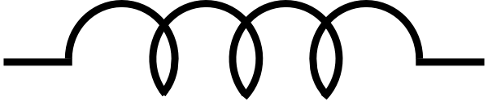

<!--
.. title: Elettromagnetismo
.. slug: elettromagnetismo
.. date: 2023-07-03 17:41:10 UTC+02:00
.. tags: 
.. category: didattica
.. link: 
.. description: 
.. type: text
.. has_math: true
-->

# Campi elettrici e magnetici variabili nel tempo

* Cariche elettriche fisse generano il campo elettrostatico conservativo $\vec{E}$.
* Cariche elettriche in moto stazionario generano il campo magnetico solenoidale $\vec{B}$.

Note le sorgenti dei campi e le condizioni al contorno (presenza di materiali dielettrici o magnetici *etc.*), le equazioni di Maxwell per i campi statici ci permettono di calcolare indipendentemente $\vec{E}$ e $\vec{B}$. I due campi sono, a questo livello, indipendenti l'uno dall'altro. 

A metà del XIX secolo esperimenti condotti da Faraday e da Henry dimostrarono una connessione più stretta tra i due campi:

* un campo magnetico variabile nel tempo genera un campo elettrico non conservativo; un fenomeno simile avviene nel caso in cui un conduttore si muova all'interno di un campo magnetico costante.
* Un campo elettrico variabile genera un campo magnetico.

I due campi sono quindi differenti aspetti legati allo stesso concetto di *campo elettromagnetico*.

# Legge di Faraday
<small>MNV: paragrafo 8.1</small>

Consideriamo i due esperimenti seguenti:

* si prenda una spira collegata ad un galvanometro e un magnete. Si trova che avvicinando o allontanando il magnete dalla spira il galvanometro misurerà una corrente positiva o negativa.
* Si prenda una spira collegata ad un galvanometro e la si ponga vicino ad un solenoide di lunghezza finita e nucleo di ferro (per amplificare l'intensità del campo). Il solenoide è collegato ad un generatore tramite un interruttore. Si trova che il galvanometro misurerà una corrente solamente per periodi di tempo molto brevi che seguono l'apertura o la chiusura del circuito solenoide-generatore. Questi periodi in cui la corrente è diversa da zero coincidono con i periodi durante i quali il campo magnetico generato dal solenoide varia nel tempo.

La mole di dati estratti da questi e molti altri esperimenti si può riassumere nella *legge di Faraday*: se $\mathcal{C}$ è un percorso chiuso, la circuitazione del campo elettrico lungo $\mathcal{C}$ è legata alla derivata temporale del flusso magnetico concatenato a $\mathcal{C}$ dalla relazione:

$$
\oint_\mathcal{C} \vec{E} \cdot d\vec{s} = - \frac{d\Phi_\mathcal{C}(\vec{B})}{dt}.
$$

Ricordando che la forza elettromotrice è definita come la circuitazione del campo elettrico:

$$
\mathcal{E} = \oint\_\mathcal{C} \vec{E} \cdot d\vec{s},
$$

si ottiene

$$
\mathcal{E}_i = - \frac{d\Phi\_\mathcal{C}(\vec{B})}{dt}.
$$

Se $\mathcal{C}$ identifica un circuito di resistenza $R$, in esso circolerà una corrente *indotta* (dovuta alla forza elettromotrice)

$$
i = \frac{\mathcal{E}_i}{R} = - \frac{1}{R} \frac{d\Phi\_\mathcal{C}(\vec{B})}{dt}.
$$

D'altro canto, se il circuito è aperto e collegato ad un voltmetro, quest'ultimo misurerà una differenza di potenziale

$$
\Delta V = \mathcal{E}_i = -\frac{d\Phi\_\mathcal{C}(\vec{B})}{dt}.
$$

La forza elettromotrice dovuta alla variazione di flusso si comporta quindi come un generatore di tensione. 

È chiaro che il campo $\vec{E}$ non può essere di natura elettrostatica perché non ha circuitazione nulla, e non è quindi conservativo: è proprio questa natura non conservativa del campo che consente di generare una corrente in un circuito.

## Legge di Lenz

Il segno meno davanti alla derivata del flusso nella legge di Faraday è così importante da prendere il nome di legge di Lenz. Questa afferma che l'effetto della forza elettromotrice indotta dalla variazione di flusso di $\vec{B}$ è tale da opporsi alla causa che l'ha generata:

* Se il flusso aumenta nel tempo, la forza elettromotrice è negativa e la corrente indotta genererà, a sua volta, un flusso che tenderà a *contrastare* l'ulteriore aumento di $\Phi(\vec{B})$.
* se il flusso diminuisce nel tempo, la forza elettromotrice è positiva e la corrente indotta genererà, a sua volta, un flusso che tenderà ad aumentare $\Phi(\vec{B})$.

Ad esempio, prendiamo un campo magnetico diretto parallelamente alla normale di una spira. Se il campo magnetico è variabile nel tempo, lo è anche il flusso concatenato con la spira. Applicando la legge di Faraday troviamo che se il campo aumenta di intensità il flusso aumenta, e questo aumento genererà una corrente indotta il cui verso sara tale da generare un flusso negativo che si opporrà a un ulteriore aumento. Viceversa in caso di flusso del campo decrescente.

Questa proprietà della legge di Faraday è un aspetto particolare del principio di conservazione dell'energia. Per capirlo, prendiamo due spire parallele. La prima è ferma e in essa non scorre alcuna corrente. La seconda è in movimento e in essa scorre una corrente. Se il moto è tale per cui le due spire si avvicinano, il flusso del campo generato dalla seconda sulla prima aumenterà nel tempo. Per la legge di Lenz questo aumenta porta a una f.e.m. negativa che genera una corrente nella prima spira che ha verso *opposto* a quella che scorre nella seconda spira. Questo fa sì che le due spire sentano una mutua repulsione che diminuisce la velocità con cui i due oggetti si avvicinano. Se la legge di Faraday non avesse il segno negativo la sola presenza della spira ferma farebbe *accelerare* la seconda spira, violando il principio di conservazione dell'energia (da dove verrebbe l'energia cinetica in eccesso?).

## Origine del campo elettrico indotto
<small>MNV: paragrafo 8.2</small>

Consideriamo la legge di Faraday, esplicitando la definizione di flusso:

$$
\mathcal{E}_i = \oint\_{\mathcal{C}(t)} \vec{E}_i \cdot d\vec{s} = - \frac{d\Phi\_{\mathcal{C}(t)}(\vec{B})}{dt} = - \frac{d}{d t} \int\_{\Sigma(t)} \vec{B}(t) \cdot \hat{n} d\Sigma
$$

dove $\mathcal{C}(t)$ è la linea chiusa che stiamo considerando (e che potrebbe variare nel tempo), mentre $\Sigma(t)$ è una qualsiasi superficie che ha $\mathcal{C}(t)$ come contorno. È chiaro che la forza elettromotrice risultante contiene due contributi dovuti a

* la dipendenza temporale della linea chiusa (e quindi della superficie associata);
* la dipendenza temporale del campo.

Possiamo dimostrare esplicitamente la legge di Faraday nel primo caso considerando un circuito rettangolare posto sul piano ortogonale ad un campo magnetico uniforme $\vec{B}$ di verso uscente. Un lato del circuito è composto da una sbarretta conduttrice mobile. Se viene messa in moto con velocità $\vec{v}$ parallela ad $\hat{x}$, sugli elettroni agirà una forza di Lorentz $\vec{F} = -e \vec{v} \times \vec{B}$. Poiché la forza di Lorentz è *proporzionale* alla carica della particella ed all'inizio del corso abbiamo definito il campo elettrico in termini di forza e carica come $\vec{E} = \vec{F} / q$,  possiamo pensare a questa forza come una forza generata da un campo *elettromotore* 

$$
\vec{E}_i = \frac{\vec{F}}{-e} = \vec{v} \times \vec{B}.
$$

Questo risultato si può anche ottenere formalmente riscrivendo la derivata totale rispetto al tempo del flusso del campo magnetico calcolato su di una superficie che dipende essa stessa dal tempo.

Se la sbarretta ha altezza $b$ e si muove lungo $x$, la circuitazione del campo elettromotore (calcolata in senso antiorario) è

$$
\mathcal{E}_i = \oint\_{\rm circuito} \vec{E}_i \cdot d\vec{s} = \oint\_{\rm circuito} \vec{v} \times \vec{B} \cdot d\vec{s} = \int\_{\rm sbarretta} vB dy = - v B b
$$

dove il segno meno è dovuto al verso con cui il circuito è percorso e indica che la forza elettromotrice genererà una corrente che scorre in verso orario. Dimostriamo che l'espressione precedente è uguale a quella che si ottiene con la legge di Faraday. Il flusso del campo è

$$
\Phi(\vec{B}) = \oint\_{\rm circuito} \vec{B} \cdot \hat{n} d\Sigma = B b x
$$

e quindi, applicando la legge di Faraday,

$$
\mathcal{E}_i = - \frac{d\Phi(\vec{B})}{dt} = - B b \frac{dx}{dt} = -B b v.
$$

L'uguaglianza delle due espressioni, qui ricavata per un caso specifico, è un risultato generale che si estende al caso di qualunque circuito in movimento in presenza di un campo magnetico costante. In tutti questi casi la forza elettromotrice indotta è un effetto della forza di Lorentz che agisce sugli elettroni presenti nei conduttori.

La seconda causa di induzione è quella dovuta a campi magnetici non costanti (cioè variabili nel tempo). Consideriamo una linea chiusa (e quindi una superficie su cui calcolare il flusso di $\vec{B}$) che non varia nel tempo. Se questa linea chiusa coincide con un circuito, i risultati sperimentali discussi all'inizio di questa lezione dimostrano come gli elettroni all'interno dei conduttori si mettano in moto in forza della variazione di campo magnetico. Questo è possibile solo in presenza di un campo elettrico che non può che essere generato proprio dalla variazione di flusso di campo magnetico. 
È importante notare come questo effetto *non richiede* che $\mathcal{C}$ coincida con un circuito. In ogni punto dello spazio in cui è presente un campo magnetico variabile, infatti, quest'ultimo genererà un campo elettromotore (non conservativo) indotto. Questo effetto può essere utilizzato, ad esempio, per costruire particolari acceleratori di particelle detti betatroni.

## Applicazioni della legge di Faraday
<small>MNV: paragrafo 8.3</small>

### Generatore di corrente

Consideriamo un circuito con sbarretta mobile, simile a quello discusso prima, immerso in un campo magnetico uniforme. Se manteniamo la velocità della sbarretta costante, nel circuito scorrerà una corrente

$$
i = \frac{\mathcal{E}_i}{r + R}
$$

dove $r$ ed $R$ sono le resistenze della sbarretta e del circuito. Siamo quindi nella situazione in cui la sbarretta sente una forza magnetica (dovuta alla forza di Lorentz agente sugli elettroni al suo interno)

$$
\vec{F}_m = i \vec{b} \times \vec{B} = - \frac{B^2 b^2}{r + R} \vec{v}
$$

che quindi si *oppone* al moto. Questa forza, di tipo viscoso perché proporzionale alla velocità, è detta *attrito elettromagnetico*. Per far sì che, nonostante questo attrito, la sbarretta si muova con una velocità costante sarà necessario applicare una forza esterna uguale e contraria ad $\vec{F}_m$. Dobbiamo quindi fornire una certa energia per unità di tempo per tenere in moto la sbarretta, equivalente alla potenza

$$
\mathcal{P} = \frac{dW}{dt} = \frac{F_{\rm ext} v dt}{dt} = F_{\rm ext} v = \frac{B^2 b^2 v^2}{r + R} = \mathcal{E}_i i.
$$

Il dispositivo così descritto è chiaramente un *generatore di corrente*, cioè uno strumento in grado di convertire direttamente una forza (ad esempio di tipo meccanico) in una corrente.

### Generatore di corrente alternata

Possiamo utilizzare lo stesso principio applicato ad una spira rotante per generare una corrente alternata. Consideriamo una spira in una regione di spazio in cui è presente un campo magnetico uniforme. Se la spira ruota con velocità angolar costante $\omega$ intorno ad un asse ortogonale al campo, il flusso magnetico che la attraversa vale

$$
\Phi(\vec{B}) = B \Sigma \cos \theta = B \Sigma \cos (\omega t)
$$

e quindi la forza elettromotrice vale

$$
\mathcal{E}_i = - \frac{d\Phi(\vec{B})}{dt} = \omega B \Sigma \sin (\omega t)
$$

che, se la spira ha resistenza $R$, induce la corrente

$$
i = \frac{\mathcal{E}_i}{R} = \frac{\omega B \Sigma \sin (\omega t)}{R}
$$

che quindi oscilla in fase con la spira. Come per il caso della sbarretta, anche in questo caso per mantenere $\omega$ costante sarà necessario spendere potenza (ad esempio meccanica), che verrà quindi convertita in potenza elettrica. Questo è il principio alla base degli *alternatori*.

### Correnti di Foucault

Se un oggetto conduttore si trova in una regione di spazio in cui il campo magnetico è variabile (perché $\vec{B}$ non è costante nel tempo o perché non è omogeneo e il conduttore è in movimento), si troverà attraversato da correnti indotte che, percorrendolo, lo scalderanno. Questo effetto è alla base di diverse tecnologie, sia industriali (*forni a induzione*) che non (*fornelli ad induzione*).

Le correnti dovute a questo effetto sono dette *parassite* o di Foucault (*eddy currents* in inglese) e sono alla base dei freni elettromagnetici, che si basano sull'effetto di attrito elettromagnetico visto prima: utilizzando un elettromagnete che si può accendere o spegnere a piacimento è possibile generare correnti parassite all'interno, ad esempio, di un disco o di una ruota di un treno, con conseguente aumento dell'attrito e quindi diminuzione della velocità. Controllando l'intensità del campo generato dall'elettromagnete è possibile controllare l'attrito e quindi l'efficacia del freno.

Lo stesso concetto di correnti parassite è alla base del funzionamento dei *metal detector*. Questi dispositivi generano campi magnetici variabili nel tempo che possono indurre correnti parassite in oggetti metallici posti nelle vicinanze. Queste correnti parassite, a loro volta, generano un campo magnetico che, se misurato, ne rivela la presenza.

### Misure di campo magnetico

Una bobina composta da $N$ spire immersa in un campo magnetico è percorsa da una corrente $i$ che dipende solamente dalla variazione del flusso di campo magnetico e dalla resistenza $R$ che possiede. La carica che fluisce nella spira tra $t_1$ e $t_2$ è data da

$$
q = \int_{t_1}^{t_2} dq = \int_{t_1}^{t_2} i(t) dt = - \frac{1}{R} \int_{\Phi_1}^{\Phi_2} d\Phi = \frac{\Phi_1 - \Phi_2}{R},
$$

e dipende quindi solo dalla differenza dei flussi iniziale e finale. Se la bobina ha dimensioni abbastanza piccole da poter considerare il campo magnetico uniforme sulla sua superficie e viene orientata in maniera che il suo momento di dipolo magnetico sia parallelo al campo, il flusso iniziale vale semplicemente

$$
\Phi_1 = N B \Sigma
$$

dove $\Sigma$ è la superficie della bobina. Se spostiamo la bobina in una zona senza campo magnetico, la quantità di carica che passa nella bobina sarà pari a

$$
q = \frac{\Phi_1}{R} = \frac{NB\Sigma}{R},
$$

che possiamo utilizzare per misurare il valore del modulo del campo magnetico:

$$
B = \frac{qR}{N\Sigma}.
$$

# Autoinduzione

<small>MNV: paragrafo 8.4, esempio 8.4</small>

Consideriamo un circuito in cui scorra una corrente $i$. Questo genererà un campo dato dalla legge di Ampère-Laplace:

$$
\vec{B} = \frac{\mu_0 i }{4 \pi} \oint \frac{d\vec{s} \times \hat{r}}{r^2}.
$$

Il flusso di questo campo concatenato col circuito stesso è detto *autoflusso* e vale

$$
\Phi(\vec{B}) = \int_{\Sigma} \left( \frac{\mu_0 i }{4 \pi} \oint \frac{d\vec{s} \times \hat{r}}{r^2} \right) \cdot \hat{n} d\Sigma,
$$

dove $\Sigma$ è una qualunque superficie che abbia il circuito come contorno. Poiché il flusso, come anche il campo, è proporzionale alla corrente, la relazione precedente si può scrivere come:

$$
\Phi(\vec{B}) \equiv Li
$$

dove $L$ è detta *induttanza* (o coefficiente di autoinduzione) del circuito e, se quest'ultimo è indeformabile, dipende solamente dalla forma che ha e dai materiali di cui è composto.

Calcoliamo $L$ per il caso di un solenoide toroidale composto da $N$ spire in cui scorre una corrente $i$, di sezione rettangolare di lati $a$ e $b$ e raggio interno $R$. In questo caso si ha

$$
\vec{B} = \frac{\mu_0 N i}{2 \pi r} \hat{\phi}
$$

dove $r$ è la distanza dal centro del solenoide. Calcoliamo il flusso attraverso una singola spira (per cui vale $\hat{n} = \hat{\phi}$):

$$
\Phi_s(\vec{B}) = \int_\Sigma \vec{B} \cdot \hat{n} d\Sigma = \frac{\mu_0 N i}{2 \pi } \int_0^a da \int_0^b \frac{db'}{R + b'} = \frac{\mu_0 N i a}{2 \pi} \int_0^b \frac{db'}{R + b'} = \frac{\mu_0 N i a}{2 \pi} \log\left( \frac{R + b}{R} \right)
$$

e quindi per $N$ spire vale

$$
\Phi(\vec{B}) = N \Phi_s(\vec{B}) = \frac{\mu_0 N^2 i a}{2 \pi} \log\left( \frac{R + b}{R} \right)
$$

e quindi il solenoide ha induttanza

$$
L = \frac{\mu_0 N^2 a}{2 \pi} \log\left( \frac{R + b}{R} \right).
$$

Se la corrente non è costante, nel circuito apparirà una corrente *autoindotta* dovuta alla forza elettromotrice generata dalla variazione di flusso concatenato al circuito stesso, che vale

$$
\mathcal{E}_L = - \frac{d\Phi(\vec{B})}{dt} = -L \frac{di}{dt},
$$

che fornisce una definizione *operativa* del coefficiente di induzione $L$. In generale qualunque porzione di circuito possiede $L \neq 0$, ma di solito questo valore è molto piccolo. Elementi circuitali con $L$ grande possono essere costruiti, ad esempio avvolgendo del filo in spire a formare un solenoide, e sono solitamente indicati col simbolo 

**Nota Bene:** data la sua definizione l'induttanza è misurata in weber/ampere, a cui si dà il nome di *henry* (H). I sottomultipli più utilizzati sono $mH$ e $\mu H$. 

L'effetto dovuto all'induttanza è sempre presente quando vi è un circuito in cui scorre una corrente variabile, ma fino ad ora l'abbiamo trascurato perché, per circuiti composti da singole (o poche) spire avvolte nel vuoto $L$ ha un valore molto piccolo. Esistono diversi strumenti online che permettono di calcolare l'induttanza di circuiti generici ([qui](https://technick.net/tools/inductance-calculator/?aiocp_dp=util_inductance_calculator) un caso semplice da utilizzare), che permettono di vedere come, ad esempio, sia per una spira circolare di raggio $0.5$ m che per una spira quadrata di lato $1$ m si ha $L \approx 4 \times 10^{-6}$ H, cioè valori molto piccoli. Se provate a svolgere nuovamente gli esercizi fatti senza considerare l'autoinduzione, troverete che in questi casi specifici il suo effetto è sempre trascurabile.

## Extracorrenti di apertura e di chiusura

### Chiusura di un circuito induttivo

Consideriamo un circuito composto da un generatore di f.e.m. $\mathcal{E}$, da una resistenza $R$, da un induttore $L$ e da un interruttore, inizialmente aperto. Al tempo $t = 0$ l'interruttore viene chiuso. È chiaro che, per continuità, deve valere $i(0) = 0$. La legge di Ohm in presenza di un induttore si scrive:

$$
R i = \mathcal{E} + \mathcal{E}_L = \mathcal{E} - L \frac{di}{dt},
$$

che può essere risolta per separazione di variabili:

$$
\frac{di}{i - \mathcal{E} / R} = -\frac{R}{L} dt
$$

che, integrando dal tempo iniziale ad un generico tempo $t$, diventa

$$
\log\left( \frac{i(t) - \mathcal{E}/R}{-\mathcal{E}/R} \right) = -\frac{R}{L} t
$$

da cui si ottiene la corrente

$$
i(t) = \frac{\mathcal{E}}{R}\left( 1 - e^{-\frac{t}{\tau}} \right),
$$

dove $\tau \equiv \frac{L}{R}$ è detta *costante di tempo* del circuito per cui valgono le stesse considerazioni fatte nel caso del circuito $RC$. La forza elettromotrice autoindotta è

$$
\mathcal{E}_L(t) = -L\frac{di}{dt} = - \mathcal{E} e^{-\frac{t}{\tau}}
$$

e va a 0 per $t \to \infty$, cioè quando la corrente $i(t)$ raggiunge il suo valore asintotico. La corrente dovuta alla presenza dell'induttore, detta *extracorrente di chiusura*, vale

$$
i_L(t) = \frac{\mathcal{E}_L}{R} = - \frac{\mathcal{E}}{R} e^{-\frac{t}{\tau}},
$$

ed è negativa perché si *oppone* alla corrente dovuta alla presenza del generatore.
In assenza di induttori veri e propri $\tau$ è solitamente molto piccolo ($10^{-5}$ - $10^{-8}$ s), mentre può diventare anche dell'ordine del secondo in presenza di elementi con grandi induttanze. Ad esempio, per $R = 1\, \Omega$ e $L = 1$ H $\tau = 1$ s.

### Apertura di un circuito induttivo

Consideriamo il circuito precedente nel limite in cui la corrente ha raggiunto il suo valore asintotico. Nel momento in cui apriamo il circuito, questo si può vedere come un circuito chiuso avente resistenza $R' \gg R$ che consideriamo costante durante il periodo transiente in cui la corrente decresce dal suo valore iniziale ($\mathcal{E} / R$) a $0$. Nell'ipotesi, che confermeremo a posteriori, che $\mathcal{E}$ è trascurabile rispetto alla f.e.m. autoindotta, l'equazione che governa il sistema è

$$
\mathcal{E}_L = -L \frac{di}{dt} = R' i
$$

separando le variabili e integrando da $t = 0$ si ottiene immediatamente

$$
i(t) = \frac{\mathcal{E}}{R}e^{-\frac{t}{\tau'}},
$$

dove $\tau' = \frac{L}{R'} \ll \tau$. Derivando l'espressione precedente si ottiene la forza elettromotrice autoindotta:

$$
\mathcal{E}_L = -L \frac{di}{dt} = \frac{R'}{R} \mathcal{E} e^{-\frac{t}{\tau'}}
$$

che, per tempi piccoli risulta molto più grande di $\mathcal{E}$ e quindi ha senso trascurare il contributo di quest'ultima. La corrente originata dall'autoinduzione è detta extracorrente di apertura e vale

$$
\frac{\mathcal{E}_L}{R'} = i(t),
$$

cioè proprio la corrente che scorre nel circuito. Il grande valore di $\mathcal{E}_L$ fa sì che tra i contatti dell'interruttore si generi un campo che può talvolta eccedere la resistenza dielettrica del mezzo: in questo caso si possono generare scintille o addirittura incendi. 

Un esempio di sistema in cui si genera una $\mathcal{E}_L > \mathcal{E}$ si vede in [questo filmato](https://www.youtube.com/watch?v=HxTYsO_4NBk), dove viene mostrato il comportamento di un circuito composto da una batteria da $9$ V, da un induttore e da una lampadina che richiede 60-70 $V$. Quest'ultima si accende (anche se brevemente) solo quando il circuito viene aperto, perché per un breve istante la forza elettromotrice indotta è sufficientemente alta da fornire il potenziale necessario alla lampadina.

# Energia magnetica

<small>MNV: paragrafo 8.5</small>

Abbiamo visto come la presenza di un induttore in un circuito in cui varia la corrente generi una f.e.m. che, generando una corrente, compirà un lavoro. Questo lavoro è, per definizione, associabile ad una differenza di energia potenziale. Calcoliamolo nel caso di un circuito $RL$. In questo caso la potenza, $\mathcal{P} = Vi$, si scrive

$$
\mathcal{P} = \mathcal{E}i = Ri^2 + Li \frac{di}{dt}
$$

perché $\mathcal{E} + \mathcal{E}_L = Ri$ e quindi $\mathcal{E} = Ri - \mathcal{E}_L$. Il lavoro nel tempo $dt$ vale quindi

$$
\mathcal{E}i dt = Ri^2 dt + Li di.
$$

Il primo membro di questa espressione è il lavoro compiuto dal generatore. Questo è pari alla somma di due contributi: uno dissipato nella resistenza, l'altro speso per contrastare la f.e.m. di autoinduzione, $\mathcal{E}_L = - L di / dt$. Integrando questo contributo per un intervallo di tempo (per esempio quello necessario per passare dalla corrente $i_1$ a quella $i_2$) si ottiene il lavoro compiuto dal generatore per opporsi alla f.e.m. autoindotta:

$$
W(t) = \int_{i_1}^{i_2} L i di = \frac{1}{2} L i_2^2 - \frac{1}{2} L i_1^2.
$$

È chiaro che questo valore non dipende dalla maniera in cui avviene la variazione di corrente, ma soltanto dai valori $i_1$ e $i_2$. Un risultato simile si ottiene quando si apre il circuito e la corrente passa da $i_\infty = \mathcal{E} / R$ a $0$. In questo, infatti, abbiamo visto che $i(t) = \frac{\mathcal{E}}{R} e^{-R' t / L}$, e quindi

$$
W = \int_0^\infty R' i^2 dt = R' \frac{\mathcal{E}^2}{R^2} \int_0^\infty e^{-2 R' t / L} dt = \frac{1}{2} L \frac{\mathcal{E}^2}{R^2} = \frac{1}{2} L i_\infty^2.
$$

All'apertura del circuito l'energia immagazzinata dall'induttanza viene dissipata sulla resistenza $R'$. Anche in questo caso questa energia ha l'espressione

$$
U_L = \frac{1}{2} L i^2.
$$

La corrente sembra quindi possedere una *energia intrinseca*, e questa energia sembrerebbe localizzata proprio nel circuito in cui la corrente scorre. Ricordiamo però che la corrente è un effetto secondario: l'effetto primario è la presenza della f.e.m. autoindotta dalla variazione del flusso del campo che, a sua volta, è generato dalla variazione del campo magnetico. L'energia si può quindi pensare come associata alla presenza del campo $\vec{B}$ piuttosto che a quella della corrente. In maniera analoga a quanto detto per il campo elettrico, possiamo pensare che ad una regione in cui è presente un campo magnetico si possa associare una certa *energia magnetica*. 
Consideriamo un solenoide di lunghezza $d$, sezione $\Sigma$ e densità di spire $n$. Approssimando l'espressione del campo con quella di un solenoide indefinito, $B = \mu_0 n i$, possiamo scrivere l'autoflusso attraverso una singola spira come

$$
\Phi_s(\vec{B}) = \mu_0 n i \Sigma
$$

e quindi il flusso totale come 

$$
\Phi(\vec{B}) = \mu_0 n i \Sigma nd = \mu_0 n^2 i \Sigma d
$$

perché $nd = N$ è il numero totale di spire. Il coefficiente di autoinduzione è quindi

$$
L = \mu_0 n^2 \Sigma d
$$

e, se nel solenoide scorre una corrente $i$, l'energia immagazzinata si può scrivere come

$$
U_L = \frac{1}{2} L i^2 = \frac{1}{2} \mu_0 n^2 \Sigma d i^2 = \frac{1}{2} \frac{B^2}{\mu_0} \tau
$$

dove $\tau = \Sigma d$ è il volume del solenoide. Lo stesso risultato si ottiene per un solenoide toroidale.

Poiché l'energia risulta, almeno in questi casi specifici, proporzionale al volume in cui è presente un campo magnetico, si può definire una *densità di energia magnetica*, che vale

$$
u_m = \frac{1}{2} \frac{B^2}{\mu_0} = \frac{1}{2} \mu_0 H^2 = \frac{1}{2} BH.
$$

Analogamente a quanto fatto per il caso elettrostatico, l'energia totale di una porzione di spazio si può scrivere come integrale della densità di energia:

$$
U_m = \int_\tau \frac{1}{2} \frac{B^2}{\mu_0} d\tau.
$$

Anche se lo non lo faremo, si può dimostrare che questo risultato è assolutamente generale, e l'espressione ricavata inizialmente nel caso di un'induttanza ne è semplicemente un caso particolare.

# Legge di Ampère-Maxwell

<small>MNV: paragrafo 8.7</small>

Consideriamo un circuito $RC$ che si sta caricando. Calcoliamo la circuitazione di $\vec{B}$ lungo una linea che concatena il filo del circuito in un punto qualsiasi vicino al condensatore. È chiaro che applicando la legge di Ampère si ottiene immediatamente

$$
\oint \vec{B} \cdot d\vec{s} = \mu_0 i_c
$$

dove $i_c$ è la corrente (di conduzione) che scorre nel filo. Abbiamo visto come la legge di Ampère lungo un percorso $\mathcal{C}$ si possa scrivere in termini di densità di corrente:

$$
\oint_{\mathcal{C}} \vec{B} \cdot d\vec{s} = \mu_0 \int_{\Sigma} \vec{j}_c \cdot \hat{n} d\Sigma
$$

perché $i_c$ si può sempre scrivere come flusso di $\vec{j}_c$. In questo caso $\Sigma$ è una qualsiasi superficie che ha $\mathcal{C}$ come contorno. Se utilizziamo la relazione precedente prendendo come $\Sigma$ una superficie che è attraversata dal filo, l'integrale sulla destra si calcola immediatamente ed ha risultato $\mu_0 i_c$. Consideriamo invece il caso di una superficie che passa tra le due pareti del condensatore senza toccare il filo. In questo caso la densità di corrente di conduzione è chiaramente nulla, ma il valore dell'integrale *non può* dipendere dalla superficie che scegliamo dato che discende direttamente dal teorema di Ampère.

## Corrente di spostamento

<small>MNV: paragrafo 5.8</small>

Questo apparente paradosso si risolve con il concetto di *corrente di spostamento*. Durante i processi di carica e scarica del condensatore, all'interno del circuito scorre una corrente $i(t)$ che dipende dal tempo ma è la stessa in ogni sezione del circuito. All'interno dei conduttori questa corrente coincide con la corrente di conduzione, $i(t) = i_c(t)$. Cosa succede invece tra le armature del condensatore? È chiaro che non può esserci una corrente vera e propria, perché lo spazio tra le armature non contiene cariche libere. D'altro canto, affinché il circuito sia "chiuso" e scorra corrente in tutte le sue porzioni, dobbiamo immaginare un processo che in qualche modo "sposti" le cariche da un capo all'altro del condensatore.

Dal punto di vista intuitivo, quando la carica varia su una delle armature (ad esempio una quantità di carica $dq$ si accumula sull'armatura positiva), per induzione la stessa quantità di carica, ma di segno opposto, $-dq$, appare sull'altra armatura. In forza del principio di conservazione della carica c'è quindi un eccesso di carica $dq$ che si deve spostare dalla seconda armatura. Possiamo quindi interpretare questo fenomeno come se una quantità $dq$ di carica si fosse spostata da un'armatura all'altra, dando vita ad una *corrente di spostamento* $i_s$. Poiché non solo la carica è conservata, ma $i(t)$ è, ad un dato istante di tempo $t$, la stessa ovunque nel circuito, si deve avere $i_s(t) = i_c(t)$. Possiamo calcolare $i_s$ considerando un condensatore piano, nel quale vale $C = \frac{\epsilon_0 \Sigma}{h}$, $E = \frac{\Delta V}{h}$. Si ha quindi:

$$
i_s(t) = \frac{dq}{dt} = \frac{d}{dt} (C \Delta V) = \frac{d}{dt} \left( \frac{\epsilon_0 \Sigma \Delta V}{h} \right) = \epsilon_0 \frac{d}{dt} (\Sigma E) = \epsilon_0 \frac{d\Phi(\vec{E})}{dt}
$$

dove $\Phi(\vec{E})$ è il flusso del campo attraverso il condensatore. Questa relazione ha valore generale. Vediamo come, in questa forma, la corrente di spostamento è automaticamente nulla in presenza di un campo costante: questo si ha, ad esempio, quando il condensatore è carico e la d.d.p. ai suoi capi diventa costante. In questo caso il condensatore è equivalente ad una interruzione del circuito. In maniera analoga a quanto fatto per la corrente di conduzione, anche alla corrente di spostamento si può associare una densità di corrente,

$$
j_s = \frac{i_s}{\Sigma} = \epsilon_0 \frac{dE}{dt}.
$$

La corrente totale è data dalla somma delle correnti di conduzione e di spostamento, cioè si ha

$$
i = i_c + i_s = i_c + \epsilon_0 \frac{d\Phi(\vec{E})}{dt}
$$

e quindi l'espressione del teorema di Ampère nel caso generale diventa

$$
\oint \vec{B} \cdot d\vec{s} = \mu_0 \left( i_c + \epsilon_0 \frac{d\Phi(\vec{E})}{dt} \right).
$$

Questa legge, detta di Ampère-Maxwell, è analoga alla legge di Faraday, nel senso che lega la variazione del campo elettrico alla presenza di un campo magnetico. Questo si può vedere applicando la legge di Ampère-Maxwell ad un percorso che non concatena la corrente di conduzione:

$$
\oint \vec{B} \cdot d\vec{s} = \mu_0 \epsilon_0 \frac{d\Phi(\vec{E})}{dt} = \frac{1}{c^2} \frac{d\Phi(\vec{E})}{dt},
$$

dove abbiamo notato che $\epsilon_0 \mu_0 = \frac{1}{c^2}$, dove $c$ è la velocità della luce. Questa relazione è formalmente identica alla legge di Faraday, che lega la circuitazione del campo elettrico alla variazione di flusso di campo magnetico:

$$
\oint \vec{E} \cdot d\vec{s} = - \frac{d\Phi(\vec{B})}{dt}.
$$

**Nota Bene:** il termine *corrente di spostamento*, coniato da Maxwell, è improprio. La presenza di una corrente di spostamento, infatti, non è collegata ad un vero e proprio moto di cariche.

## Campo magnetico prodotto da un condensatore in carica

<small>MNV: ispirato dall'esempio 8.8</small>

Consideriamo un condensatore piano composto da due armature circolari di raggio $a$ posto in serie ad una resistenza $R$, ad un generatore di f.e.m. $\mathcal{E}$ e a un interruttore, inizialmente aperto. Abbiamo visto che, chiudendo l'interruttore, la carica sulle armature varia con la legge 

$$
q(t) = C\mathcal{E}\left( 1 - e^{-\frac{t}{\tau}}\right),
$$

dove $\tau = RC$ è il tempo caratteristico di carica. Poiché la carica varia, varierà anche il campo elettrico all'interno del condensatore, che sarà diretto dall'armatura positiva a quella negativa e avrà modulo

$$
E = \frac{\sigma(t)}{\epsilon_0} = \frac{q(t)}{\pi a^2 \epsilon_0},
$$

dando quindi luogo, secondo la legge di Ampère-Maxwell, ad un campo magnetico indotto. Lo possiamo calcolare considerando che, per simmetria, il campo magnetico non potrà che avere linee di campo circolari concentriche al centro del condensatore. Se calcoliamo la circuitazione di $\vec{B}$ su una di queste linee di campo di raggio $r$ otteniamo

$$
\oint \vec{B} \cdot d\vec{s} = B 2 \pi r
$$

che è legata alla derivata temporale del flusso del campo elettrico, che vale

$$
\frac{d\Phi(E)}{dt} = \frac{d}{dt} \pi r^2 \frac{q(t)}{\pi a^2 \epsilon_0} = \frac{r^2}{a^2 \epsilon_0} \frac{dq(t)}{dt} = \frac{r^2}{a^2 \epsilon_0} \frac{\mathcal{E}}{R} e^{-\frac{t}{\tau}}.
$$

Applicando la legge di Ampère-Maxwell si ottiene

$$
2 \pi r B = \frac{\mu_0 r^2}{a^2} \frac{\mathcal{E}}{R} e^{-\frac{t}{\tau}}
$$

da cui si deriva l'espressione del modulo del campo magnetico:

$$
B = \frac{\mu_0 r}{2 \pi a^2} \frac{\mathcal{E}}{R} e^{-\frac{t}{\tau}}
$$

# Le equazioni di Maxwell

Le leggi di Faraday e di Ampère-Maxwell introducono delle dipendenze "incrociate" tra i campi, accoppiandoli e trasformandoli in due aspetti dello stesso fenomeno.

Tutta la fenomenologia dell'elettromagnetismo che abbiamo studiato fino ad ora può essere ottenuta considerando quattro equazioni fondamentali che collegano le derivate spaziali e temporali dei campi tra di loro e alle sorgenti di campo (cariche e correnti). Queste equazioni possono essere espresse sia in forma integrale che in forma *differenziale* (cioè locale).

## Forma integrale

<small>MNV: paragrafo 8.8</small>

Le quattro equazioni in forma integrale sono

\begin{align}
\oint \vec{E} \cdot \hat{n} d\Sigma = \frac{Q}{\epsilon_0} \qquad & \oint \vec{E} \cdot d\vec{s} = - \frac{d\Phi(\vec{B})}{dt}\\\\
\oint \vec{B} \cdot \hat{n} d\Sigma = 0 \qquad & \oint \vec{B} \cdot d\vec{s} = \mu_0 \left(i + \epsilon_0 \frac{d\Phi(\vec{E})}{dt}\right).
\end{align}

Da queste relazioni si deducono tutte le altre che abbiamo studiato fino ad ora. Abbiamo già discusso il significato di ogni equazione. Ricordiamo che 

1. la prima equazione lega il campo elettrico alle sue sorgenti (le cariche);
2. la seconda equazione lega il campo elettrico alle variazioni di campo magnetico;
3. la terza equazione afferma che non esistono monopoli magnetici;
4. la quarta equazione lega il campo magnetico alle sue sorgenti (le correnti) e alla variazione di campo elettrico.

Queste equazioni diventano particolarmente simmetriche se $Q = 0$ e $i = 0$:

\begin{align}
\oint \vec{E} \cdot \hat{n} d\Sigma = 0 \qquad & \oint \vec{E} \cdot d\vec{s} = - \frac{d\Phi(\vec{B})}{dt}\\\\
\oint \vec{B} \cdot \hat{n} d\Sigma = 0 \qquad & \oint \vec{B} \cdot d\vec{s} = \frac{1}{c^2} \frac{d\Phi(\vec{E})}{dt}.
\end{align}

Equazioni in questa forma hanno una soluzione banale ($\vec{B} = 0$ e $\vec{E} = 0$) e una in cui i campi sono sempre variabili sia nel tempo che nello spazio. Quest'ultima soluzione è legata alla propagazione del campo elettromagnetico, cioè al fenomeno delle *onde elettromagnetiche*. 

## Forma differenziale

<small>MNV: paragrafo 8.9</small>

Le equazioni di Faraday e di Ampère-Maxwell possono essere riscritte in forma *locale* utilizzando il teorema di Stokes. Si ha infatti che

$$
\oint_\mathcal{C} \vec{E} \cdot d\vec{s} = \int_{\Sigma(\mathcal{C})} \vec{\nabla} \times \vec{E} \cdot \hat{n} d\Sigma = - \frac{\partial}{\partial t} \int_{\Sigma(\mathcal{C})} \vec{B} \cdot \hat{n} d\Sigma = - \int_{\Sigma(\mathcal{C})} \frac{\partial \vec{B}}{\partial t} \cdot \hat{n} d\Sigma.
$$

Poiché questa relazione è vera per qualunque $\Sigma$, si deve avere

$$
\vec{\nabla} \times \vec{E} = -  \frac{\partial \vec{B}}{\partial t}.
$$

In maniera del tutto analoga si trova 

$$
\oint_\mathcal{C} \vec{B} \cdot d\vec{s} = \int_{\Sigma(\mathcal{C})} \vec{\nabla} \times \vec{B} \cdot \hat{n} d\Sigma = \mu_0 \int_{\Sigma(\mathcal{C})} \vec{j} \cdot \hat{n} d\Sigma + \epsilon_0 \mu_0 \int_{\Sigma(\mathcal{C})} \frac{\partial \vec{E}}{\partial t} \cdot \hat{n} d\Sigma
$$

e quindi

$$
\vec{\nabla} \times \vec{B} = \mu_0 \left( \vec{j} + \epsilon_0 \frac{\partial \vec{E}}{\partial t} \right).
$$

Mettendo insieme le quattro equazioni otteniamo le seguenti *equazioni di Maxwell per il campo elettromagnetico*:

$$
\begin{align}
\vec{\nabla} \cdot \vec{E} = \frac{\rho}{\epsilon_0} \qquad & \vec{\nabla} \times \vec{E} = -\frac{\partial \vec{B}}{\partial t}\\
\vec{\nabla} \cdot \vec{B} = 0 \qquad & \vec{\nabla} \times \vec{B} = \mu_0 \left( \vec{j} + \epsilon_0 \frac{\partial \vec{E}}{\partial t} \right).
\end{align}
$$

Questa è la forma più comoda dal punto di vista pratico, poiché queste relazioni hanno valore *locale*, cioè sono vere *punto per punto*. Queste equazioni possono essere risolte analiticamente in alcuni casi semplici, mentre in generale è necessario o ricorrere ad approssimazioni oppure risolverle *numericamente*, cioè con l'ausilio del computer.

## Conservazione della carica

Prendiamo la divergenza dell'equazione di Maxwell in forma differenziale che lega il campo magnetico alle sue sorgenti. Poiché il risultato di un prodotto vettoriale è sempre ortogonale ad entrambi i vettori che andiamo a moltiplicare, $\vec{\nabla} \cdot (\vec{\nabla} \times \vec{B}) = 0$, quindi

$$
\vec{\nabla} \cdot \vec{j} + \epsilon_0 \frac{\partial}{\partial t} \vec{\nabla} \cdot \vec{E} = 0
$$

che, ricordando che la divergenza del campo elettrico è legata alla densità di carica, si può riscrivere come

$$
\vec{\nabla} \cdot \vec{j} = - \frac{\partial \rho}{\partial t}.
$$

Questa equazione, che lega le derivate spaziali di una densità di corrente alla derivata temporale di una densità, è detta *di continuità* ed appare molte volte in diversi ambiti della fisica. Si può capirne il significato se la integriamo su di un volume $\tau$ arbitrario:

$$
\int_\tau \vec{\nabla} \cdot \vec{j} d\tau = - \int_\tau \frac{\partial \rho}{\partial t} d \tau = - \frac{\partial q_{\rm int}}{\partial t},
$$

dove $q_{\rm int}$ è la carica contenuta nel volume $\tau$. Applicando il teorema della divergenza al membro di sinistra si trova

$$
\int_\tau \vec{\nabla} \cdot \vec{j} d\tau = \oint_{\Sigma} \vec{j} \cdot \hat{n} d\Sigma = i_a,
$$

dove $i_a$, data la sua definizione, è semplicemente la corrente che attraverso la superficie $\Sigma$ (definita come quella superficie che racchiude il volume $\tau$). Si ha quindi che

$$
i_a = - \frac{\partial q_{\rm int}}{\partial t},
$$

che si interpreta dicendo che la corrente totale che scorre attraverso una superficie è pari alla derivata temporale della carica contenuta al suo interno presa col segno meno. Ad esempio, se siamo in presenza di una corrente stazionaria, tanta carica entra tanta ne esce, quindi $\frac{\partial q_{\rm int}}{\partial t}$ è 0, così come $i_a$. L'equazione appena trovata implica quindi che la carica si conserva: se $i_a$ è positiva, la carica presente in $\tau$ sta diminuendo (e viceversa).

