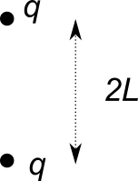
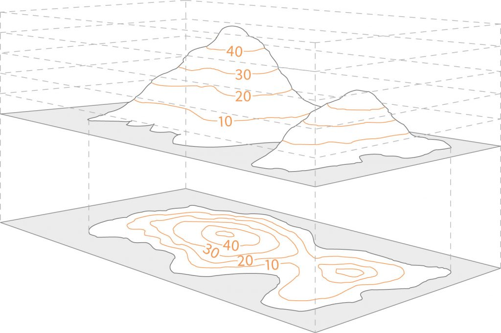

<!--
.. title: Elettrostatica
.. slug: elettrostatica
.. date: 2023-07-03 17:41:10 UTC+02:00
.. tags: 
.. category: didattica
.. link: 
.. description: 
.. type: text
.. has_math: true
-->

```{contents} Indice
:depth: 2
:backlinks: none
```

# Introduzione

L'interazione elettromagnetica è una delle forze fondamentali della natura come, ad esempio, quella gravitazionale. Se consideriamo solamente la forza elettrica, troviamo che questa è **molto** più forte della forza di gravità. In effetti, è così forte che se il numero di elettroni (carichi negativamente) e di protoni (carichi positivamente) di due persone poste a distanza di mezzo metro differisse di appena l'1%, si genererebbe una forza tale da poter sollevare un peso pari a quello della Terra!

Per dare un esempio dell'importanza dell'interazione elettromagnetica, considerate che la maggior parte della passa atomica è condensata nel nucleo, che è circa $10^5$ volte più piccolo delle dimensioni atomiche: la materia è vuota! La repulsione elettromagnetica (anche se in una forma *molto* diversa da quella che vedremo nel corso) è una delle principali responsabili del fatto che i corpi non si interpenetrano!

In questa prima parte del corso studieremo i fenomeni legati all'*elettrostatica*, che si occupa di tutti i fenomeni elettrici dovuti a distribuzioni di cariche che sono, come implica il nome, *stazionari nel tempo*.

## Carica elettrica
<small>MNV: paragrafo 1.1</small>

Alcuni oggetti, se strofinati con un panno, mostrano la capacità di attirare corpuscoli come pagliuzze o granelli di polvere. Questo è dovuto al fatto che alcuni materiali, quando strofinati, acquistano una *carica*. Tramite esperimenti si è capito che

* Non tutti i materiali si possono caricare
* Due oggetti carichi esercitano l'uno sull'altro una forza che chamiamo *elettrica*
* Esistono cariche di due tipi, che chiamiamo positive e negative
* Cariche dello stesso tipo si respingono, cariche di tipo diverso si attraggono

## Struttura elettrica della materia
<small>MNV: paragrafo 1.2</small>

Quella che segue è una descrizione poco rigorosa e molto qualitativa della vera struttura atomica della materia, ma è sufficiente per i nostri scopi.

* La materia è composta da neutroni (carica nulla), protoni (carica positiva) ed elettroni (carica negativa)
* La massa dei protoni (che, insieme ai neutroni, compongono il nucleo degli atomi) è quasi 2000 volte più grande di quella degli elettroni, che invece "orbitano" (per modo di dire!) intorno al nucleo.
* La carica degli elettroni e dei protoni, in modulo, è detta carica elementare ed è indicata col simbolo $e$. Ogni altra carica presente in natura è multipla di questa carica (la carica è una quantità *quantizzata*).
* La maggior parte dei corpi ha carica netta $0$ ed è quindi detto *neutro*. 
* Gli elettroni negli orbitali più esterni hanno una certa energia di legame. È quindi possibile, fornendo ad esempio energia meccanica tramite strofinio, *strappare* alcuni di questi elettroni facendoli passare da un corpo $A$ ad un altro $B$. Alla fine della procedura $A$ e $B$ non saranno più neutri ma carichi, poiché $A$ avrà un eccesso di cariche positive e $B$ un eccesso di cariche negative.
* In un sistema isolato (dal punto di vista elettrico) le cariche si conservano: la somma totale della carica non cambia nel tempo.

L'unità di misura della carica è il Coulomb, C. In questa unità $e = 1.6 \times 10^{-19}$ C. Le cariche con cui avremo a che fare sono molto più grandi, dell'ordine di $10^{-9} - 10^{-7}$ C. Questi valori equivalgono ad un gran numero di elettroni o protoni (ordine $10^{10}$). D'altro canto, in un grammo di materia abbiamo un numero *enormemente* maggiore di elettroni e protoni, comparabile con il numero di Avogadro, $N_A = 6.022 \times 10^{23}$. Anche nei sistemi molto carichi, quindi, solo una piccola parte delle cariche elementari è "spaiata".

# Legge di Coulomb
<small>MNV: paragrafo 1.3</small>

Partiamo dai seguenti risultati sperimentali, che si possono ottenere con una [bilancia torsionale](https://www.youtube.com/watch?v=be2R-_fJIJg), validi per cariche *puntiformi* (o, come vedremo in seguito, distribuzioni di carica equivalenti):

* La forza elettrica che una carica esercita sull'altra è diretta lungo l'asse che le congiunge
* Due cariche sono uguali se esercitano la stessa forza su di una terza carica
* Se la forza esercitata sulla terza carica è uguale in modulo ma opposta in segno, le cariche sono anch'esse opposte in segno
* Il modulo della forza diminuisce con il quadrato della distanza

La relazione matematica che riassume queste proprietà è la cosiddetta legge di Coulomb tramite cui possiamo scrivere l'espressione della forza che la carica $q_2$ in posizione $\vec{r}_2$ esercita sulla carica 1 in posizione $\vec{r}_1$ :

$$
\vec{F}_{12} = k \frac{q_1q_2}{r^2} \hat{r}
$$

dove $r$ è la distanza tra le due cariche $q_1$, $q_2$, $\hat{r} = (\vec{r}_1 - \vec{r}_2) / r$ è il versore che le congiunge e $k$ è una costante di proporzionalità. Facciamo un esercizio di analisi dimensionale per determinare le unità di misura delle quantità coinvolte:

* La distanza si misura in m (metri)
* La forza si misura in N (Newton), cioè Kg$\cdot$m / s$^2$
* La carica si misura in C (Coulomb)

Quindi si ha che $[k] = [F][r]^2 / [q]^2 =$ Nm$^2/$C$^2$. Per motivi storici (e, in parte, pratici) si scrive

$$
k = \frac{1}{4\pi\epsilon_0}
$$

dove $\epsilon_0 = 8.8542 \times 10^{-12}$ C$^2$/Nm$^2$ è chiamata costante dielettrica del vuoto.

# Campo elettrostatico
<small>MNV: paragrafo 1.4</small>

Prendiamo $N$ cariche puntiformi $q_1$, $q_2$, $\ldots$, $q_N$ distribuite nello spazio e una *carica di prova* $q_0$, anch'essa puntiforme. Calcoliamo la forza agente su $q_0$, nel limite in cui quest'ultima è piccola e non perturba la distribuzione delle altre cariche:

$$
\vec{F}\_{\rm tot} = \frac{q_0}{4\pi\epsilon_0} \sum_{i=1}^N \frac{q_i}{r_{0i}^2}\hat{r}_{0i}
$$

**Nota Bene:** l'equazione precedente vale perché vige il *principio di sovrapposizione*: le forze esercitate su $q_0$ sono indipendenti fra loro e quindi si sommano.

È interessante notare che la forza agente su $q_0$ è proporzionale alla sua carica. Possiamo quindi definire una grandezza che sia *indipendente* dal valore di $q_0$. Questa grandezza vettoriale è chiamata *campo elettrostatico* ed è definita come segue:

$$
\vec{E} = (E_x, E_y, E_z) = \frac{\vec{F}}{q_0}
$$

La legge di Coulomb e la definizione di campo elettrostatico implicano che una carica puntiforme $q$ posta nell'origine genera un campo nel punto $\vec{r} = (x, y, z)$ che vale $\vec{E}(\vec{r}) = \frac{1}{4\pi\epsilon_0}\frac{q}{r^2}\hat{r}$.

Possiamo invertire la relazione tra forza e campo, $\vec{F}(\vec{r}) = q_0 \vec{E}(\vec{r})$: la distribuzione di cariche *genera* un campo (vettoriale!) in ogni punto dello spazio, ed è attraverso questo campo che le cariche interagiscono a distanza. Il principio di sovrapposizione ci dice che *ogni* carica genera un campo, e il campo totale non è altro che la *somma vettoriale* dei singoli campi.

**Nota Bene:** la forza elettrica generata dalla presenza di un campo elettrico è ovviamente soggetta alla terza legge di Newton: la forza che $q_0$ sente in presenza di un'altra carica $q$ è uguale ma opposta in verso a quella che la stessa $q_0$ esercita su $q$. Quando si chiede di calcolare la forza che agirebbe su di una carica di prova $q_0$ in presenza di una certa distribuzione di cariche, supporremo sempre che $q_0$ sia molto piccola oppure che le altre cariche siano tenute fisse. Una definizione più generale (e rigorosa) di campo elettrostatico che tiene conto di questo aspetto è $\vec{E} = \lim_{q_0 \to 0} \frac{\vec{F}}{q_0}$.

Che unità di misura è associata al campo elettrico? Usiamo l'analisi dimensionale: $[E] = \frac{[F]}{[q]}$ = N/C. In pratica si usa più spesso un'altra unità di misura equivalente che introdurremo più avanti, i Volt per metro (V/m).

## Campi vettoriali e principio di sovrapposizione

Il più semplice tipo di *campo* è un *campo scalare*, cioè una funzione che associa uno scalare ad ogni punto dello spazio. Un esempio è il campo di temperatura, $T(x, y, z)$. Questa immagine riporta una carta metereologica che indica come variano pressione e temperatura su una porzione di superficie del globo:


Un *campo vettoriale* è un oggetto matematico che associa un vettore ad ogni punto dello spazio.  Per visualizzare campi vettoriali in 2D si può utilizzare [questa pagina](https://www.geogebra.org/m/QPE4PaDZ).

In uno spazio tridimensionale un campo vettoriale è una funzione di tre variabili, esprimibili separatamente, $\vec{E}(x, y, z)$,  o come vettore, $\vec{E}(\vec{r})$, dove abbiamo definito $\vec{r} = (x, y, z)$.

In alcuni casi particolari, molto importanti nella fisica, diversi campi aventi la stessa natura si possono sommare direttamente. È il caso del campo elettromagnetico, per cui vale il cosiddetto *principio di sovrapposizione*: il campo totale generato da più di una sorgente è la somma dei campi generati dalle singole sorgenti.

<small>Fine lezione 1</small>

---

## Distribuzioni continue di cariche
<small>MNV: paragrafo 1.5</small>

Poiché la carica è quantizzata, a rigor di logica il campo elettrico $\vec{E}$ (o, equivalentemente, la forza $\vec{F}$) dovrebbe essere sempre espresso come una somma di contributi concentrati intorno agli atomi. In realtà abbiamo a che fare sempre con dimensioni molto maggiori di quelle atomiche, e quindi, all'atto pratico, ciò che misuriamo è il campo elettrostatico *mediato* sulla distribuzione di cariche atomiche che, alle scale macroscopiche che ci interessano, è vista come una distribuzione continua. Utilizzando quindi il concetto di infinitesimo, possiamo scrivere il campo totale come una somma di infiniti contributi: un integrale.

Consideriamo un volume $v$ in cui è distribuita una certa quantità di carica. Il campo elettrico generato in un punto $\vec{P}$ da una porzione infinitesima di carica $dq$ distante $\vec{r}$ da $\vec{P}$ è semplicemente

$$
d\vec{E}(\vec{P}) = \frac{1}{4\pi\epsilon_0} \frac{dq}{r^2} \hat{r}.
$$

L'espressione del campo elettrico *totale* in $\vec{P}$, in forza del principio di sovrapposizione, è quindi

$$
\vec{E}(\vec{P}) =  \frac{1}{4\pi\epsilon_0} \int_v \frac{dq}{r^2} \hat{r}
$$

**Nota Bene:** poiché è esteso a tutto il volume, l'integrale è un integrale triplo. Inoltre, poiché abbiamo a che fare con quantità vettoriali, dobbiamo calcolare un integrale per ogni componente del vettore (uno per $x$, uno per $y$ e uno per $z$).

Nella maggior parte dei casi che incontreremo, la carica totale $q$ sarà distribuita *uniformemente* su oggetti di diversa forma. In questo caso la carica infinitesima si può scrivere esplicitamente:

* $dq = \lambda dl$ per oggetti "unidimensionali", dove $\lambda$ è detta densità lineare e $dl$ è l'elemento di linea infinitesimo (MNV: esempio 1.6).
* $dq = \sigma d\Sigma$ per oggetti "bidimensionali", dove $\sigma$ è detta densità superficiale e $d\Sigma$ è l'elemento superficiale infinitesimo (MNV: esempio 1.7).
* $dq = \rho d\tau$ per oggetti "tridimensionali", dove $\rho$ è detta densità volumetrica e $d\tau$ è l'elemento di volume infinitesimo.

### Esempio di campo generato da una distribuzione lineare di carica

<figure>

</figure>

Consideriamo il sistema in figura: una sbarretta lunga $2L$ è caricata *uniformemente* con carica $q$. Calcoliamo il campo generato in un punto generico $x_0$ equidistante dalle estremità della sbarretta, cioè in uno dei punti della linea tratteggiata disegnata in figura. Utilizziamo l'espressione di un campo generato da un sistema composto da due cariche (vedi box sotto).

{}

<figure>

</figure>

Consideriamo due cariche fisse $q$ disposte parallele all'asse $y$ e distanti $2L$. Calcoliamo il campo elettrostatico in un punto generico $x_0$ equidistante dalle due cariche, cioè in uno dei punti della linea tratteggiata disegnata in figura.

Utilizziamo il sistema di riferimento nel quale le due cariche hanno coordinate $\vec{r}_1 = (0, L)$ e $\vec{r}_2 = (0, -L)$ e il punto che ci interessa ha coordinate $\vec{r}_0 = (x_0, 0)$. Studiamo il campo generato dalla prima carica, rispetto alla quale $\vec{r}_{10} = \vec{r}_0 - \vec{r}_1 = (x_0, -L)$, $r_{10} = \sqrt{x_0^2 + L^2}$ e quindi $\hat{r}_{10} = \frac{1}{r_{10}}(x_0, -L)$:

$$
E_x^{10} = \frac{1}{4\pi\epsilon_0} \frac{q}{r_{10}^2} \frac{x_0}{r_{10}}
$$

$$
E_y^{10} = -\frac{1}{4\pi\epsilon_0} \frac{q}{r_{10}^2} \frac{L}{r_{10}}
$$

D'altra parte, rispetto alla seconda carica abbiamo $\vec{r}_{20} = \vec{r}_0 - \vec{r}_2 = (x_0, L)$, $r_{20} = \sqrt{x_0^2 + L^2} = r_{10}$, $\hat{r}_{20} = \frac{1}{r_{20}}(x_0, L)$ e quindi

$$
E_x^{20} = \frac{1}{4\pi\epsilon_0} \frac{q}{r_{10}^2} \frac{x_0}{r_{10}}
$$
$$
E_y^{20} = \frac{1}{4\pi\epsilon_0} \frac{q}{r_{10}^2} \frac{L}{r_{10}}
$$

Il campo totale è la sovrapposizione (cioè, la somma) dei due, e quindi si ha $E_x = 2E_x^{10}$ e $E_y = 0$.

Possiamo ritrovare lo stesso risultato considerando che, in generale, se definiamo $\theta$ come l'angolo compreso tra il campo e l'asse $x$, $E_x^{10} = |\vec{E}_{10}|\cos{\theta}$ e $E_y^{10} = |\vec{E}_{10}|\sin{\theta}$. Nel caso specifico dell'esercizio vale l'uguaglianza trigonometrica $\cos{\theta} = \frac{x_0}{r_{10}}$, mentre il modulo di $\vec{E}$ si ricava dalla legge di Coulomb, $|\vec{E}| = \frac{1}{4\pi\epsilon_0} \frac{q}{r_{10}^2}$. Si trova quindi:

$$
E_x^{10} = \frac{q}{4\pi\epsilon_0} \frac{\cos \theta}{r_{10}^2} = \frac{q}{4\pi\epsilon_0} \frac{x_0}{r_{10}^3}
$$

e quindi

$$
E_x = 2E_x^{10} = \frac{q}{2\pi\epsilon_0} \frac{\cos \theta}{r_{10}^2} = \frac{q}{2\pi\epsilon_0} \frac{x_0}{r_{10}^3}
$$

in accordo col risultato precedente.

{}

Ogni infinitesimo di sbarretta contiene una carica $dq$. Ogni coppia di infinitesimi posti alla stessa distanza dalla linea rossa genera un campo $d\vec{E}$ che ha l'espressione trovata al problema precedente sostituendo $q$ con $dq$. In particolare, il campo avrà solo la componente $x$ ($dE_x$) diversa da 0, che vale

$$
dE_x = \frac{dq}{2\pi\epsilon_0} \frac{\cos \theta}{r^2}
$$

dove $r$ è la distanza tra $dq$ e il punto $(x_0, 0)$. Poiché $r \cos \theta = x_0$, $r = x_0 / \cos \theta$; inoltre, la sbarretta ha una distribuzione di carica uniforme, quindi $dq = \lambda dy$, con $\lambda = q / 2L$, quindi

$$
dE_x = \frac{\lambda dy}{4\pi\epsilon_0} \frac{\cos^3 \theta}{x_0^2}.
$$

Per calcolare $E_x$ dobbiamo integrare su metà sbarretta (perché stiamo considerando coppie di punti), quindi da $0$ a $L$. Per risolvere l'integrale dobbiamo però cambiare variabile (e quindi estremi di integrazione), passando da $y$ a $\theta$, che sono legati dalla relazione $y = x_0 \tan \theta$. Si ha quindi

$$
dy = x_0 \frac{d\theta}{\cos^2\theta}
$$

e quindi

$$
dE_x = \frac{\lambda}{4\pi\epsilon_0 x_0} \cos \theta d \theta.
$$

Gli estremi di integrazione passano da $(0, L)$ a $(0, \theta_1)$, dove $\theta_1 = \arcsin \left( L / \sqrt{L^2 + x_0^2} \right)$, quindi si trova

$$
E_x = \frac{\lambda}{4\pi\epsilon_0 x_0} \int_0^{\theta_1} \cos \theta d \theta = \frac{\lambda \sin \theta_1}{4\pi\epsilon_0 x_0} = \frac{\lambda}{4\pi\epsilon_0 x_0} \frac{L}{\sqrt{L^2 + x_0^2}}
$$

## Linee di forza di $\vec{E}$

<small>MNV: paragrafo 1.6</small>

Qualunque distribuzione di carica genera un campo elettrostatico in tutto lo spazio: se volessimo mettere una carica di prova in un punto qualsiasi, questa sentirebbe una forza dovuta alla presenza di tutte le altre cariche.

Possiamo *disegnare* questo campo partendo da un punto e muovendoci lungo la tangente del campo. Otterremo un insieme di linee (dette di forza o di campo) con le seguenti proprietà:

* Le linee hanno la stessa direzione e lo stesso verso del campo.
* Più le linee sono dense, più il campo è intenso (e viceversa).
* In ogni punto il campo prende uno e un solo valore: le linee non possono *mai* incrociarsi.
* Le linee partono dalle cariche positive e terminano su quelle negative. Se il sistema non è neutro, alcune linee di forza non terminano ma si *chiudono all'infinito*.

A <a href="link://slug/field-lines">questo</a> link è possibile visualizzare le linee di forza di un campo elettrostatico generato sul piano da una qualsiasi distribuzione di carica discreta.

<small>Fine lezione 2</small>

---

## Moto di una carica in un campo elettrostatico

<small>MNV: paragrafo 1.7 ed esempio 1.9</small>

Poniamo una carica $q_0$ in una regione di spazio dove è presente un campo elettrostatico $\vec{E}$ generato da una distribuzione di cariche fisse (nel senso che abbiamo già discusso). Se la carica ha massa $m$, la presenza del campo la sottoporrà ad una accelerazione in accordo con le leggi della dinamica in condizioni non relativistiche ($\vec{F} = q_0\vec{E} = m\vec{a}$), per cui

$$
\vec{a} = \frac{d^2\vec{r}}{dt^2} = \frac{q}{m}\vec{E}
$$

La relazione precedente può essere integrata per ottenere (a partire da condizioni iniziali date) la posizione e velocità della carica nel tempo. In generale, se $q > 0$ l'accelerazione è parallela e concorde ad $\vec{E}$, mentre se $q$ è negativa $\vec{a}$ ed $\vec{E}$ hanno verso opposto.

Per fare un esempio, descriviamo il moto di una particella di massa $m$ e carica $q$ in un campo uniforme $\vec{E}$ (come può essere quello generato da piani indefiniti). Prendiamo un sistema di riferimento che abbia l'asse $x$ orientato lungo la direzione del campo elettrico. Se la particella carica ha posizione iniziale $(x_0, y_0, z_0)$ e velocità iniziale $(v_{0,x}, v_{0,y}, v_{0,z})$, le equazioni del moto lungo $x$ si scrivono:

\begin{align}
a_x(t) & = \frac{q}{m}E\\\\
v_x(t) & = v_{0,x} + at\\\\
x(t) & = x_0 + v_{0,x}t + \frac{1}{2}at^2
\end{align}

Lungo gli altri assi si ha $a_y(t) = a_z(t) = 0$ e quindi

\begin{align}
v_y(t) & = v_{0,y}\\\\
v_z(t) & = v_{0,z}\\\\
y(t) & = y_0 + v_{0,y}t\\\\
z(t) & = z_0 + v_{0,z}t
\end{align}

Poiché la particella accelera, la sua energia cinetica $U_k = \frac{1}{2}mv^2(t)$ cambia nel tempo. Calcoliamo la differenza di energia cinetica:

$$
\Delta U_k(t) = U_k(t) - U_k(0) = \frac{1}{2}m\left(v_{0,x}^2 + a^2t^2 + 2v_{0,x}at\right) - \frac{1}{2}mv_{0,x}^2 = \frac{1}{2}m(a(at^2+ 2v_{x,0}t)) = ma(x(t) - x_0)
$$

Se ora sostituiamo la relazione che collega $E$ ad $a$ troviamo

$$
\Delta U_k(t) = qE(x(t) - x_0) = F\Delta s(t)
$$

Dove $F$ è la forza elettrica e $\Delta s$ è lo spostamento. La differenza di energia cinetica è quindi pari al lavoro svolto dalla forza elettrostatica, $W$.

# Lavoro della forza elettrostatica

<small>MNV: prima parte del paragrafo 2.1 (senza forza elettromotrice)</small>

La formula trovata prima è un caso particolare di una definizione più generale. Richiamiamo qui un argomento del corso di meccanica: la definizione di lavoro associato ad uno spostamento lungo un percorso generico $\mathcal{C}_1$ che va dal punto $A$ al punto $B$ in presenza di una forza $\vec{F}$. Dividiamo il percorso $\mathcal{C}_1$ in segmenti infinitesimi $d\vec{s}$, dove ogni $d\vec{s}$ è il vettore tangente al percorso $\mathcal{C}_1$ in quel punto. Ogni contributo infinitesimo di lavoro $dW$ è dato dalla componente della forza $\vec{F}$ lungo $d\vec{s}$, cioè $\vec{F} \cdot d\vec{s}$. Per ottenere il lavoro totale sommiamo tutti questi contributi integrando su tutto il percorso $\mathcal{C}_1$:

$$
W\_{\mathcal{C}_1} = \int\_{\mathcal{C}_1} \vec{F} \cdot d\vec{s}
$$

In linea di massima la quantità $W$ dipende dal percorso che scegliamo per connettere $A$ e $B$: se anche $\mathcal{C}_2$ porta da $A$ a $B$, in generale si avrà $W\_{\mathcal{C}_1} \neq W\_{\mathcal{C}_2}$. Le forze per cui vige l'uguaglianza sono dette *forze conservative*. In questo caso l'integrale precedente non dipende più da tutto il percorso $\mathcal{C}_1$, ma solo dai punti $A$ e $B$ di partenza e di arrivo. In formule:

$$
W\_{\mathcal{C}_1} = W\_{AB} = \int_A^B \vec{F} \cdot d\vec{s}
$$

Un esempio di forza conservativa è data dalla forza gravitazionale. Al contrario, la forza d'attrito è un esempio di forza non conservativa. Infatti, immaginiamo di trascinare un peso che poggia su un piano con attrito da un punto $A$ ad un punto $B$. È chiaro anche da un punto di vista intuitivo che il lavoro compiuto dalla forza lungo un percorso rettilineo sarà minore (in modulo) di quello compiuto lungo un percorso (ad esempio) ad arco. Un'importante proprietà delle forze conservative è che il lavoro da loro compiuto su di un circuito chiuso è sempre nullo. Questo si può dimostrare facilmente prendendo due punti $A$ e $B$ e due percorsi $\mathcal{C}_1$ e $\mathcal{C}_2$ qualsiasi che li uniscono. Si avrà allora:

$$
W\_{\rm tot} = W\_{\mathcal{C}_1} + W\_{\mathcal{C}_2} = W\_{AB} + W\_{BA} = \int_A^B \vec{F} \cdot d\vec{s} + \int_B^A \vec{F} \cdot d\vec{s} = \int_A^B \vec{F} \cdot d\vec{s} - \int_A^B \vec{F} \cdot d\vec{s} = 0
$$

Solitamente l'integrale di linea di un percorso chiuso si indica col simbolo $\oint$.

Per quanto riguarda l'interazione elettromagnetica, al contrario delle forze elettriche, la forza elettrostatica è conservativa. Lo dimostriamo calcolando il lavoro che la forza elettrostatica compie quando una carica di prova $q_0$ si muove da un punto $A$ a un punto $B$ in una regione in cui è presente un campo generato da una carica puntiforme $q$. Ricordando che la forza dovuta ad una carica puntiforme è radiale (cioè ha direzione $\hat{r}$), il prodotto scalare $\vec{F} \cdot d\vec{s} = Fdr$, dove $dr$ è proprio la proiezione di $d\vec{s}$ su $\hat{r}$. Si trova quindi

$$
\vec{F} \cdot d\vec{s} = F dr = \frac{q_0 q}{4\pi \epsilon_0} \frac{dr}{r^2}
$$

Integriamo questa quantità lungo il percorso $\mathcal{C}$ che collega $A$ a $B$:

$$
W_{AB} = \int_\mathcal{C} \vec{F} \cdot d\vec{s} = \frac{q_0 q}{4\pi \epsilon_0} \int_{r_A}^{r_B} \frac{dr}{r^2} = - \left( \frac{q_0 q}{4\pi \epsilon_0}\frac{1}{r_B} - \frac{q_0 q}{4\pi \epsilon_0}\frac{1}{r_A} \right),
$$

che dimostra come il lavoro non dipenda dallo specifico $\mathcal{C}$ scelto ma solo da $A$ e $B$.


Si può quindi scrivere, per una forza elettrostatica agente sulla carica $q_0$,

$$
W\_{\mathcal{C}_1} = W\_{AB} = \int_A^B \vec{F} \cdot d\vec{s} = q_0 \int_A^B \vec{E} \cdot d\vec{s}.
$$

Discende da questa relazione e da quanto detto in precedenza sulle forze conservative che la circuitazione del campo elettrostatico è *sempre nulla*, cioè:

$$
\oint \vec{E} \cdot d\vec{s} = 0
$$

In maniera analoga a quanto fatto per la forza, il risultato precedente si può esprimere dicendo che anche il campo elettrostatico è conservativo.

## Potenziale elettrostatico

<small>MNV: seconda parte del paragrafo 2.1 e paragrafo 2.2</small>

Ricordiamo che l'integrale di linea di $\vec{E}\cdot d\vec{S}$ non dipende dal percorso ma solo dai punti $A$ e $B$ di partenza ed arrivo. Senza perdere di generalità possiamo quindi scrivere:

$$
\int_A^B \vec{E}\cdot d\vec{s} = V(A) - V(B) = -(V(B) - V(A)).
$$

La funzione $V(\vec{r})$ si chiama potenziale elettrostatico e, poiché compare come differenza nella relazione precedente (che la definisce), è definita a meno di una costante. Utilizzando la funzione $V$ possiamo riscrivere la definizione di lavoro della forza elettrostatica:

$$
W_{AB} = -q_0(V(B) - V(A)) = -q_0 \Delta V
$$

Alle forze conservative si può associare una energia potenziale la cui differenza tra due punti è pari all'opposto del lavoro compiuto per quello stesso spostamento, cioè:

$$
W_{AB} = U_e(A) - U_e(B) = -( U_e(B) - U_e(A) ) = -q_0 ( V(B) - V(A) )
$$

L'energia potenziale di un sistema elettrostatico (detta anche *energia potenziale elettrostatica*) è quindi strettamente legata al potenziale:

$$
\Delta U_e = q_0 \Delta V
$$

**Nota Bene:** la dicitura *conservativa* non è casuale. In presenza di sole forze conservative, infatti, l'energia *totale* del sistema (energia cinetica più energia potenziale) si conserva: se l'energia potenziale varia di una certa quantità, il valore dell'energia cinetica varia della stessa quantità cambiata di segno. Per esempio, nel caso semplice di un campo uniforme abbiamo dimostrato che $\Delta U_k = W$. Ora abbiamo visto che $W = -\Delta U_e$, il che implica che $\Delta U_k + \Delta U_e = 0$.

### Unità di misura del potenziale

<small>MNV: box alla fine del paragrafo 2.2</small>

L'unità di misura del potenziale è il Volt V. Se utilizziamo la relazione tra potenziale ed energia elettrostatica vediamo che un Volt è uguale ad un Joule per un Coulomb (J/C). La relazione che lega il potenziale ed il campo elettrostatico ci dice anche che quest'ultimo può avere unità di misura V/m (Volt per metro), che è la più utilizzata (insieme ai suoi multipli e sottomultipli).

### Il potenziale generato da una carica puntiforme

Abbiamo visto prima come il lavoro compiuto dalla forze elettrostatica per spostare una carica $q_0$ da $A$ a $B$ in una regione di spazio in cui è presente un campo generato da una carica puntiforme $q_0$ valga

$$
W_{AB} = - \left( \frac{q_0 q}{4\pi \epsilon_0}\frac{1}{r_B} - \frac{q_0 q}{4\pi \epsilon_0}\frac{1}{r_A} \right) = -q_0 \Delta V_{AB} = -q_0 \left(V(B) - V(A)\right),
$$

che implica

$$
V(r ) = \frac{q}{4\pi\epsilon_0} \frac{1}{r} + C
$$

dove $C$ è una costante arbitraria. Nella maggior parte dei casi (ma non sempre!) si impone $V(r \to \infty) = 0$ e quindi $C = 0$, per cui l'espressione del potenziale diventa:

$$
V(r ) = \frac{q}{4\pi\epsilon_0} \frac{1}{r}.
$$

In questo caso il potenziale dipende solo dalla distanza dalla carica e ha quindi simmetria sferica.

**Nota Bene:** la *funzione* potenziale e la *differenza* di potenziale sono due cose diverse! 

## Il principio di sovrapposizione applicato al potenziale

Consideriamo una distribuzione discreta di $N$ cariche. Il campo elettrico è dato da $\vec{E} = \sum_{i=1}^N \vec{E}_i$. La differenza di potenziale tra due punti $A$ e $B$ sarà quindi:

$$
\Delta V = -\int_A^B \vec{E} \cdot d\vec{s} = -\int_A^B \sum\_{i=1}^N \vec{E}_i \cdot d\vec{s} = -\sum\_{i=1}^N \int_A^B  \vec{E}_i \cdot d\vec{s}
$$

Dalla definizione di potenziale possiamo riscrivere la differenza come:

$$
\Delta V = \sum_{i=1}^N \Delta V_i
$$

Il che dimostra che il principio di sovrapposizione si applica anche al potenziale elettrostatico: la differenza di potenziale dovuta ad una distribuzione di cariche è uguale alla somma delle differenze di potenziale dovute alle singole cariche. Lo stesso risultato si estende a distribuzione di cariche continue, per le quali vale (analogamente a quanto visto per il campo e se scegliamo di imporre $C = 0$):

$$
V(r ) = \int dV = \frac{1}{4\pi\epsilon_0} \int \frac{dq}{r}
$$

dove l'integrale è esteso al volume contenente la distribuzione di carica.

## Relazione inversa tra $\vec{E}$ e $V$

<small>MNV: paragrafi 2.4 e 2.6</small>

Consideriamo i due punti $\vec{A} = (x, y, z)$ e $\vec{B} = \vec{A} + d\vec{r}$, dove $d\vec{s} = \hat{x}dx + \hat{y}dy + \hat{z}dz$ è uno spostamento infinitesimo. La differenza di potenziale tra $\vec{A}$ e $\vec{B}$ dipende solamente dalle loro coordinate, quindi

$$
dV = V(x + dx, y + dy, z + dz) - V(x, y, z) = -\vec{E} \cdot d\vec{s} = -E_x dx - E_y dy - E_z dz
$$

Consideriamo anche che, in maniera del tutto generale, il differenziale totale si scrive $dV = \frac{\partial V}{\partial x}dx + \frac{\partial V}{\partial y}dy + \frac{\partial V}{\partial z}dz$. Uguagliando membro a membro le due equazioni precedenti troviamo:

$$
E_x = -\frac{\partial V}{\partial x}, \quad E_y = -\frac{\partial V}{\partial y}, \quad E_z = -\frac{\partial V}{\partial z}
$$

La relazione precedente si può riassumere dicendo che, in ogni punto dello spazio, *il campo elettrostatico è uguale al gradiente del potenziale cambiato di segno*. Di solito l'*operatore* gradiente si indica con il simbolo $\vec{\nabla}$ (detto *nabla* o *del*) e, in coordinate cartesiane, vale

$$
\vec{\nabla} = \frac{\partial}{\partial x}\hat{x} + \frac{\partial}{\partial y}\hat{y} + \frac{\partial}{\partial z}\hat{z}
$$

**Nota Bene:** $\vec{\nabla}$ è un vettore e come tale si può quindi moltiplicare per un altro vettore sia scalarmente che vettorialmente.

Ora che abbiamo introdotto il concetto di gradiente possiamo riscrivere in forma *locale* il fatto che la circuitazione del campo elettrostatico sia sempre nulla. Lo facciamo applicando il *teorema di Stokes*, che afferma che *la circuitazione di un campo vettoriale lungo un percorso chiuso $\mathcal{C}$ è uguale al flusso del rotore dello stesso campo attraverso una qualunque superficie $\Sigma$ avente per contorno $\mathcal{C}$*. In formule:

$$
\oint \vec{E} \cdot d\vec{s} = \int_\Sigma \vec{\nabla} \times \vec{E} \cdot \hat{n} d\Sigma = 0,
$$
 dove $\hat{n}$ è il versore *normale* alla superficie. Poiché l'integrale a destra deve essere vero per *qualunque* $\Sigma$ che abbia come contorno $\mathcal{C}$, si deve avere, in ogni punto dello spazio,

$$
 \vec{\nabla} \times \vec{E} = 0
$$

Ne deriva che il campo elettrostatico, essendo conservativo, è anche *irrotazionale*, cioè ha sempre rotore nullo. La relazione precedente, valida per il campo elettrostatico in ogni punto dello spazio, può essere dimostrata scrivendo esplicitamente le componenti del rotore e sostituendo alle componenti del campo le derivata del potenziale.

Cos'è il rotore di un campo vettoriale? È la cosiddetta "vorticità", che dà un'idea della tendenza del campo vettoriale a formare vortici. Questa figura mostra un esempio:


<small>Fine lezione 3</small>

---

## Superfici equipotenziali

<small>MNV: paragrafo 2.5</small>

Le superfici equipotenziali sono quei luoghi dei punti nello spazio per cui vale $V(x, y, z) = $ costante. Dato il rapporto che lega potenziale e campo, possiamo dire che per ogni punto passa solamente *una* superficie equipotenziale e le linee di campo sono *sempre* ortogonali alle superfici equipotenziali. Questa proprietà deriva dalle caratteristiche del gradiente.

Se disegniamo delle "superfici di livello" separate da $\Delta V$ costanti, più queste sono vicine più il campo localmente sarà forte (perché il potenziale varia più rapidamente!). Pensate alle linee di livello altimetriche:



Proviamo a disegnare le superfici equipotenziali dovute ad un piano carico indefinito o ad una carica singola.

## Energia potenziale elettrostatica e conservazione dell'energia

<small>MNV: paragrafo 2.3</small>

Abbiamo già visto come un campo elettrostatico acceleri una carica puntiforme. Utilizzando il concetto di energia elettrostatica potenziale introdotto nei paragrafi precedenti possiamo applicare la conservazione dell'energia allo stesso problema. Se in un sistema sono presenti unicamente forze conservative la sua energia totale, $U = U_k + U_e$, è conservata, cioè rimane costante nel tempo.

Per quanto riguarda il moto di una particella carica $q_0$, sappiamo che la sua energia cinetica vale sempre $U_k = \frac{1}{2} m v^2(t)$. D'altro canto, abbiamo visto che la sua energia potenziale elettrostatica è legata al potenziale, $U_e = q_0 V(x(t), y(t), z(t))$. L'energia totale vale quindi:

$$
U = \frac{1}{2} m v^2(t) + q_0 V(x(t), y(t), z(t))
$$

Questa quantità è *sempre* conservata. Possiamo usare questa legge di conservazione per accelerare particelle: se passando dal punto $\vec{A}$ al punto $\vec{B}$ il potenziale diminuisce, per $q_0 > 0$ la particella viene accelerata (e viceversa). La possibilità di accelerare particelle microscopiche (come gli elettroni) tramite campi elettrici ha permesso lo sviluppo di applicazioni pratiche come il tubo catodico e alcuni acceleratori di particelle.

Come abbiamo visto, l'energia potenziale è legata al lavoro compiuto dalla forza cambiata di segno. L'energia potenziale elettrostatica di un sistema di cariche si può quindi interpretare come il lavoro che bisogna compiere per "costruire" quel dato sistema. Poniamo ad esempio di voler calcolare l'energia elettrostatica di un sistema di tre cariche, $q_1$, $q_2$ e $q_3$, poste a distanze relative $r_{12}$, $r_{13}$ e $r_{23}$. Partiamo da un sistema vuoto e posizioniamo la prima carica. Questa operazione è "a costo zero", poiché nella regione di spazio non è presente alcun campo. L'energia potenziale vale quindi $U_e = 0$, ma nella regione è ora presente il campo generato da $q_1$, $\vec{E}_1$. Per posizionare la seconda carica dobbiamo muoverla dall'infinito alla sua posizione. Per farlo dobbiamo applicare una forza uguale e contraria a quella elettrostatica dovuta all'interazione tra $q_1$ e $q_2$, cioè $\vec{F} = -q_2\vec{E}_1$. Il lavoro compiuto da questa forza esterna sarà quindi:

$$
W\_{\rm ext}^{(2)} = -q_2 \int\_{\infty}^{r\_{12}} \vec{E}_1 \cdot d\vec{s} = \frac{q_2 q_1}{4 \pi \epsilon_0} \frac{1}{r\_{12}} = \Delta U_e^{(2)}
$$

Ricordiamo che la relazione tra il lavoro compiuto dalla forza elettrostatica e l'energia potenziale elettrostatica sono uguali a meno del segno, mentre qui, poiché la forza esterna necessaria è *opposta* a quella elettrostatica, le due quantità hanno le stesso segno. L'energia potenziale totale del sistema è, a questo punto, $U_e^{(2)} = \frac{q_2 q_1}{4 \pi \epsilon_0} \frac{1}{r_{12}}$.

Nella regione di spazio sono ora presenti due campi, $\vec{E}_1$ ed $\vec{E}_2$, e quindi il lavoro svolto dalla forza esterna per posizionare correttamente $q_3$ sarà dato da due contributi:

$$
W\_{\rm ext}^{(3)} = -q_3 \int\_{\infty}^{r\_{13}} \vec{E}_1 \cdot d\vec{s} - q_3 \int\_{\infty}^{r\_{23}} \vec{E}_2 \cdot d\vec{s} = \frac{q_3 q_1}{4 \pi \epsilon_0} \frac{1}{r\_{13}} + \frac{q_3 q_2}{4 \pi \epsilon_0} \frac{1}{r\_{23}}
$$

quindi l'energia potenziale totale del sistema sarà

$$
U_e
= U_e^{(2)} + U_e^{(3)} = \frac{q_2 q_1}{4 \pi \epsilon_0} \frac{1}{r_{12}} + \frac{q_3 q_1}{4 \pi \epsilon_0} \frac{1}{r_{13}} + \frac{q_3 q_2}{4 \pi \epsilon_0} \frac{1}{r_{23}}
$$

Più in generale applicando il principio di sovrapposizione si trova che l'energia potenziale di un sistema di cariche (cioè l'energia necessaria per assemblare il sistema) è data da

$$
U_e = \sum_{i > j} \frac{q_i q_j}{4 \pi \epsilon_0} \frac{1}{r_{ij}}
$$

dove il pedice $i > j$ della somma fa sì che non si contino gli stessi contributi due volte.

# Dipolo elettrico

<small>MNV: paragrafo 2.7</small>

Costruiamo un sistema composto da due cariche uguali ma opposte in segno, $q_+ = q$ e $q_- = -q$, poste ad una distanza $a$. Scriviamo l'espressione del potenziale generato dalle due cariche in un punto $\vec{P}$:

$$
V(\vec{P}) = \frac{q}{4\pi\epsilon_0} \left( \frac{1}{r_+} - \frac{1}{r_-} \right) = \frac{q}{4\pi\epsilon_0} \frac{r_- - r_+}{r_+r_-},
$$

dove $r_+$ ed $r_-$ sono le distanze delle cariche positiva e negativa da $\vec{P}$. Se disegniamo le quantità vettoriali in gioco troviamo che $\vec{r}\_- -\vec{r}\_+ = \vec{a}$, e quindi $\vec{r}\_+ = \vec{r}\_- - \vec{a}$, dove $\vec{a}$ è il vettore che congiunge la carica negativa a quella positiva.

Poniamoci sufficientemente lontano da poter trascurare la dimensione del dipolo (matematicamente, $r \gg a$). In questo caso $r_+ r_- \approx r^2$, dove $r$ è la distanza di $\vec{P}$ dal centro del dipolo. Possiamo approssimare $r_- - r_+$ tenendo conto che, se $a$ è piccolo rispetto ad $r$ e $\theta$ è l'angolo tra $\vec{a}$ ed $\vec{r}$,

$$
r\_+ = \sqrt{(\vec{r}\_- - \vec{a})\cdot(\vec{r}\_- - \vec{a})} = \sqrt{r\_-^2 + a^2 - 2r\_+ a \cos{(\theta)}} = r\_- \sqrt{1 + \frac{a^2}{r\_-^2} - 2\frac{a}{r\_-} \cos{\theta}} \approx r\_- \sqrt{1 - 2\frac{a}{r\_-} \cos{\theta}}\approx r\_- - a\cos{\theta}.
$$

Abbiamo utilizzato il fatto che $a^2/r_-^2 \approx 0$ e che $\sqrt{1 + x} \approx 1 + \frac{1}{2} x$ per piccoli valori di $x$. Questa approssimazione ha una interpretazione geometrica (vedi, ad esempio, la figura 2.29 del MNV). Si ha quindi che $r_- - r_+ \approx a\cos{\theta}$. Possiamo riscrivere l'espressione per il potenziale in questa approssimazione:

$$
V(r ) = \frac{q}{4\pi\epsilon_0} \frac{a \cos{\theta}}{r^2} = \frac{\vec{p} \cdot \hat{r}}{4\pi\epsilon_0 r^2}
$$

dove abbiamo definito il vettore *momento di dipolo elettrico* $\vec{p} = q\vec{a}$. Vediamo che il potenziale non dipende singolarmente da $a$ e da $q$ ma solo dal loro prodotto: dal punto di vista sperimentale, se facciamo una misura (ad esempio di differenza di potenziale ad una distanza $r \gg a$) su di un dipolo avente determinati valori di $a$ e $q$, la stessa misura su di un dipolo avente $a/2$ e $2q$ darà gli stessi risultati.

Il campo elettrico di un dipolo si può ricavare calcolando il gradiente del potenziale. In questo caso le espressioni si semplificano se si utilizzando le coordinate polari (e quindi il gradiente espresso in coordinate polari):

\begin{align}
E_r & = -\frac{\partial V}{\partial r} = \frac{2 p \cos{\theta}}{4\pi\epsilon_0 r^3}\\\\
E_\theta & = -\frac{1}{r}\frac{\partial V}{\partial \theta} = \frac{p \sin{\theta}}{4\pi\epsilon_0 r^3}
\end{align}

Cioè, in forma vettoriale,

$$
\vec{E} = \frac{p}{4\pi\epsilon_0 r^3} (2 \cos{\theta}\hat{r} + \sin{\theta} \hat{\theta})
$$

Il campo non dipende da $\phi$ poiché ha simmetria cilindrica rispetto all'asse del dipolo. Se poniamo $\theta = 0$ oppure $\theta = \pi$ troviamo che, lungo l'asse del dipolo, il campo è parallelo a $\vec{p}$ e vale 

$$
\vec{E} = \frac{2\vec{p}}{4\pi\epsilon_0 r^3}
$$

Se invece $\theta = \frac{\pi}{2}$ o $\theta = \frac{3\pi}{2}$, cioè sul piano ortogonale a $\vec{p}$, il campo è antiparallelo al momento di dipolo e vale:

$$
\vec{E} = -\frac{\vec{p}}{4\pi\epsilon_0 r^3}
$$

Se disegniamo le linee di campo (fatelo utilizzando la pagina apposita!) troviamo delle linee chiuse che vanno dalla carica positiva alla carica negativa e sono parallele al dipolo solo nei due casi considerati sopra.

Il concetto di dipolo è estremamente importante in molti contesti, ad esempio:

* Ambito ingegneristico: il funzionamento di molte antenne è basato sull'approssimazione di dipolo.
* Struttura della materia: atomi e molecole si polarizzano in presenza di un campo elettrico.
* Chimica fisica: molte molecole posseggono un momento di dipolo *intrinseco*, come ad esempio l'acqua.

<small>Fine lezione 4</small>

---

## Momento della forza su un dipolo elettrico

<small>MVN: paragrafo 2.8</small>

Consideriamo il caso di un dipolo immerso in un campo elettrostatico $\vec{E}$ uniforme. Poiché $\vec{E}$ è uniforme, le due cariche sentiranno forze uguali in modulo ($qE$) ma opposte in verso: la risultante è nulla e il dipolo non accelera. La coppia di forze però genera un momento meccanico diverso da zero, e quindi il dipolo tenderà, in generale, a ruotare. Scriviamo il momento delle forze rispetto al polo negativo, definendo $\vec{F}\_+$ la forza agente sulla carica positiva:

$$
\vec{M} = \vec{a} \times \vec{F}\_+ = \vec{a} \times (q \vec{E}\_+) = \vec{a} \times (q \vec{E}) = q\vec{a} \times \vec{E} = \vec{p} \times \vec{E}
$$

{}
Troviamo lo stesso risultato se scriviamo il momento delle forze rispetto al centro del dipolo:

$$
\vec{M} = \vec{r}\_{c+} \times \vec{F}\_+ + \vec{r}\_{c-} \times \vec{F}\_- = \left( \vec{r}\_{c+} - \vec{r}\_{c-} \right) \times \vec{F}\_+ = q\vec{a} \times \vec{E} = \vec{p} \times \vec{E}
$$

**Nota Bene:** i vettori $\vec{r}\_{c+}$ e $\vec{r}\_{c-}$ vanno dal centro del dipolo alle cariche, mentre prima andavano dalle cariche al punto $\vec{P}$. Se disegniamo questi vettori troviamo che, in questo caso, $\vec{a} = \vec{r}\_{c+} - \vec{r}\_{c-}$.

Se disegniamo i vettori $\vec{p}$, $\vec{E}$ ed il loro prodotto vettoriale vediamo che un dipolo immerso in un campo elettrostatico tenderà a ruotare per allinearsi al campo.

{}

Per trovare l'energia potenziale associata ad un dipolo scriviamo il lavoro fatto dal momento meccanico. Disegniamo sul piano i vettori $\vec{p}$ ed $\vec{E}$ in maniera tale che il loro prodotto vettoriale sia diretto verso il piano, cioè lungo $-\hat{z}$. In questo caso abbiamo $\vec{M} = -pE \sin{\theta} \hat{z}$. Calcoliamo il lavoro fatto dal momento per portare l'angolo tra $\vec{p}$ ed $\vec{E}$ da $\theta_0$ a $\theta_1$:

$$
W = \int_{\theta_0}^{\theta_1} M d\theta = -pE \int_{\theta_0}^{\theta_1} \sin{\theta} d\theta = pE \cos{\theta_1} - pE \cos{\theta_0}
$$

Ricordando la relazione tra lavoro ed energia potenziale ($W = -\Delta U_e$) si trova che:

$$
U_e = -\vec{p} \cdot \vec{E}
$$

# Teorema di Gauss

<small>MNV: paragrafo 3.1</small>

Il teorema (o legge) di Gauss mette in relazione il flusso del campo elettrostatico attraverso una superficie chiusa e la quantità di carica presente nella porzione di volume racchiusa da quella superficie. Il flusso di un campo vettoriale attraverso un elemento di superficie $d\Sigma$ è così definito:

$$
d\Phi(\vec{E}) = \vec{E} \cdot \hat{n} d\Sigma
$$

dove $\hat{n}$ è la *normale* alla superficie, cioè il versore con direzione ortogonale e verso uscente rispetto alla porzione di superficie che stiamo considerando. **Nota Bene:** la dizione *verso uscente* ha senso solamente se la superficie è chiusa, e quindi, potendosi definire un interno ed un esterno, si può parlare di un verso che *esce* dalla superficie.

Il teorema di Gauss, valido in generale per tutti i campi vettoriali centrali che dipendono dalla distanza come $r^{-2}$ (ne conoscete altri?), è così espresso:

$$
\Phi(\vec{E}) = \oint_\Sigma \vec{E} \cdot \hat{n} d\Sigma = \frac{q}{\epsilon_0}
$$

dove $q$ è la carica *totale* presente all'interno di $\Sigma$. Se chiamiamo $\tau$ la porzione di volume racchiusa da $\Sigma$, nel caso di distribuzioni discrete $q = \sum_{q_i \in \tau} q_i$, mentre nel caso di distribuzioni continue $q = \int_{\tau} dq$.

**Nota Bene:** se $\tau$ contiene sia cariche positive che cariche negative, queste si sommano algebraicamente: se la somma è zero il flusso del campo elettrostatico attraverso $\Sigma$ sarà nullo!

Diamo un'interpretazione geometrica del teorema di Gauss disegnando il flusso generato da una singola carica $q$ attraverso una superficie:

1. Disegniamo il numero di linee di campo che attraversano la proiezione del campo lungo la normale di un elementino $d\Sigma$: si vede come questo numero sia indipendente dalla distanza di $d\Sigma$ da $q$, purché l'angolo sotteso resti lo stesso. Questo significa che, se $\Sigma$ è chiusa, l'integrale del flusso attraverso la superficie non può dipendere dalla sua forma. Ecco una figura: 
2. Prendiamo una superficie chiusa.
   * Se la carica è *esterna* alla superficie, le sue linee di campo che entrano nella superficie (e quindi danno contributo negativo all'integrale) ne devono anche uscire (dando contributo positivo all'integrale). Intuitivamente vediamo come il flusso totale (cioè il contributo delle cariche esterne al flusso) debba essere nullo.
   * Se la carica è *interna* alla superficie, le sue linee di campo (a seconda del segno della carica) saranno sempre entranti o uscenti la superficie, e quindi contribuiranno tutte allo stesso modo all'integrale: il contributo totale sarà quindi positivo per cariche positive e negativo per cariche negative.

I punti precedenti, insieme al principio di sovrapposizione, forniscono una spiegazione intuitiva del teorema di Gauss. Per una dimostrazione matematicamente ineccepibile si può vedere il paragrafo 3.2 del MNV (non nel programma). È importante però sapere che il teorema di Gauss vale per il campo elettrico perché l'intensità di $E$ diminuisce con il quadrato della distanza. In qualunque altro caso il teorema di Gauss non sarebbe valido.

Il teorema di Gauss è utile da un punto di vista pratico per calcolare il campo elettrostatico di distribuzioni di carica molto simmetriche (cilindriche, sferiche, piane, *etc.*). Permette, ad esempio, di calcolare immediatamente:

* che il campo elettrico all'interno di una sfera carica cava è 0 in ogni punto;
* il campo elettrico generato da una singola carica puntiforme (legge di Coulomb).

## Prima equazione di Maxwell

<small>MNV: paragrafo 3.4</small>

Possiamo riscrivere il teorema di Gauss in forma locale utilizzando il teorema della divergenza:

$$
\oint_\Sigma \vec{E} \cdot \hat{n} dS = \int_\tau \vec{\nabla} \cdot \vec{E} d\tau = \frac{1}{\epsilon_0} \int_\tau \rho d\tau
$$

Notiamo che ora sia a sinistra che a destra abbiamo un integrale sul volume. Possiamo quindi eguagliare gli argomenti dell'integrale, trovando

$$
\vec{\nabla} \cdot \vec{E} = \frac{\rho}{\epsilon_0}
$$

Questa è la prima legge di Maxwell. Il prodotto scalare tra l'operatore gradiente ed un campo vettoriale è detto *divergenza*, e quindi la prima legge di Maxwell si può enunciare dicendo che "la divergenza del campo elettrico in ogni punto dello spazio è uguale alla densità di carica in quel punto, diviso per la costante dielettrica del vuoto".

Utilizzando la definizione di potenziale la prima equazione di Maxwell può essere riscritta, ottenendo l'equazione di Poisson:

$$
\vec{\nabla} \cdot (-\vec{\nabla} V) = -\nabla^2 V = \frac{\rho}{\epsilon_0}
$$
o, equivalentemente, $\nabla^2 V = -\frac{\rho}{\epsilon_0}$. La divergenza di un campo vettoriale ci dà informazioni sulla tendenza del campo a divergere o convergere nell'intorno di un punto dello spazio, come in questa figura:


# Conduttori

<small>MNV: paragrafo 4.1</small>

I conduttori sono materiali in cui sono presenti alcune cariche libere, che quindi possono reagire alla presenza di un campo elettrico muovendosi. 
In presenza di un campo elettrostatico, c'è un *transiente* durante il quale queste cariche si muovono. Alla fine di questa fase, quando il sistema raggiunge il cosiddetto *equilibrio*, si ottiene una distribuzione di carica fissa. Valgono allora le seguenti proprietà (su scale macroscopiche):

1. La distribuzione delle cariche è tale per cui $\vec{E} = 0$ all'interno del conduttore. Se così non fosse, ci sarebbero zone del campo in cui $\vec{E} \neq 0$, il che genererebbe moti di cariche che contravverrebbero all'ipotesi di equilibrio. 
2. Il fatto che $\vec{E} = 0$ in ogni punto interno al conduttore implica come tutte le cariche libere siano distribuite sulla superficie. Questo risultato si dimostra applicando il teorema di Gauss. Prendiamo una superficie $\Sigma$ interna al conduttore. Il flusso del campo attraverso $\Sigma$ vale
$$
\oint_{\Sigma} \vec{E} \cdot \hat{n} d\Sigma = 0
$$
perché $\vec{E} = 0$. D'altro canto, per il teorema di Gauss questo implica che la carica totale interna alla superficia sia $0$. Questo risultato, data l'arbitrarietà nella scelta di $\Sigma$, implica come le cariche libere possano disporsi *unicamente* sulla superficie del conduttore.
3. Il fatto che il campo sia nullo implica che, all'interno del conduttore, il potenziale è costante. Questo risultato si dimostra calcolando il potenziale tra due punti interni al conduttore e ricordando che $\vec{E} = 0$:
$$
V(P_2) - V(P_1) = -\int_{P_1}^{P_2} \vec{E} \cdot d\vec{s} = 0
$$
che significa $V(P_2) = V(P_1) = V_0$.
**Nota Bene:** questo risultato implica che il potenziale in un conduttore è costante, non nullo!
4. Il campo vicino alla superficie di un conduttore è normale alla superficie e ha modulo $E = \frac{\sigma}{\epsilon_0}$, con $\sigma$ densità superficiale di carica. Per ottenere questo risultato utilizziamo il teorema di Gauss. Se siamo sufficientemente vicini, qualunque superficie ci sembrerà planare. Applichiamo allora il teorema di Gauss ad un cilindretto di raggio $R$ e basi appena dentro e appena fuori dal conduttore. Il flusso del campo sarà nullo attraverso la superficie laterale (che abbiamo preso di spessore infinitesimo). Sarà però nullo anche attraverso la base interna del conduttore, perché all'interno si ha $\vec{E} = 0$. Resta quindi solamente il contributo dato dalla base esterna, che vale $E \pi R^2$. Secondo il teorema di Gauss, questo flusso è uguale alla carica contenuta all'interno del cilindro, che vale $q = \sigma \pi R^2$, per cui il campo vale

$$
\vec{E} = \frac{\sigma}{\epsilon_0}\hat{n}.
$$

Questo risultato è noto come teorema di Coulomb, da non confondersi né con la legge di Coulomb né con il teorema di Gauss!

Come si distribuisce la carica sulla superficie di un conduttore? Facciamo degli esempi pratici

* Prendiamo una sfera conduttrice, lontana da qualunque altra carica, e carichiamola con carica $q$. Come detto, la carica si concentrerà solo sulla superficie. La densità superficiale di carica deve essere la stessa su tutta la superficie. Se così non fosse,  si genererebbe un campo elettrostatico all'interno del conduttore: se la sfera viene caricata positivamente sulla superficie si troveranno solo cariche positive e viceversa.
* Prendiamo un conduttore posto in un campo esterno $\vec{E}(x, y, z)$. Nel momento in cui il campo viene acceso, all'interno del conduttore il campo vale $\vec{E}(x, y, z)$, e quindi i portatori di carica (quasi sempre elettroni) "migrano" per effetto del campo (fase transiente). All'equilibrio, la distribuzione di cariche sarà tale per cui il campo generato all'interno del conduttore varrà esattamente $\vec{E}_i(x, y, z) = -\vec{E}(x, y, z)$, così da annullare il campo esterno. Il campo $\vec{E}_i$ si chiama *campo indotto*, e la distribuzione di carica all'equilbrio si chiama *carica elettrica indotta*. Questo fenomeno è chiamato *induzione elettrostatica*. **Nota Bene:** la carica *totale* sul conduttore non cambia: sommando (integrando...) la densità di carica indotta si ottiene sempre zero! Ad esempio, mettiamo un conduttore in una regione di spazio in cui è presente un campo uniforme $\vec{E}$, ad esempio tra due piani indefiniti di carica opposta.
  * Se il conduttore è anch'esso un piano, sulla faccia di fronte al piano carico negativamente si accumulerà una carica positiva di densità $\sigma$, mentre sulla faccia di fronte al piano carico positivamente si accumulerà una carica negativa di densità $-\sigma$. Possiamo verificare che questa combinazione fa sì che all'interno del conduttore si abbia $\vec{E} = 0$.
  * Se il conduttore ha una forma più complicata (ad esempio una sfera), la distribuzione di cariche sarà anch'essa più complicata, ma sempre tale che si abbia $\vec{E} = 0$.
* Se si mettono in contatto (tramite, ad esempio, un filo conduttore) due o più oggetti conduttori si ottiene un *unico corpo conduttore*: il campo è nullo ovunque (lo sarebbe stato anche se i conduttori non fossero stati collegati) e, in aggiunta, tutti i conduttori hanno anche lo stesso potenziale. 

<small>Fine lezione 5</small>

---

## Conduttori cavi, induzione completa e gabbia di Faraday

<small>MNV: paragrafo 4.2</small>

Consideriamo un conduttore carico cavo, cioè un conduttore che abbia al suo interno una cavità vuota. Se applichiamo il teorema di Gauss all'interno del conduttore, troviamo subito che $\vec{E} = 0$, quindi $Q_{\rm int} = 0$. Questo vale anche se calcoliamo il flusso attraverso una superficie che coincide con quella interna del conduttore, cioè la superficie che racchiude completamente la cavità. Si trova quindi che la carica totale interna è nulla, cioè che il numero di cariche positive e negative si bilanciano. Si potrebbe avere una configurazione di carica che rispetta questo vincolo se parti diverse della superficie interna fossero caricate positivamente e negativamente, in modo tale da dare una carica netta nulla. Dimostriamo che ciò non è possibile: se la superficie fosse caricata eterogeneamente, all'interno della cavità sarebbe presente un campo $\vec{E} \neq 0$, e la differenza di potenziale $\Delta V_{AB}$ calcolata tra due punti $A$ e $B$ della superficie su di un percorso passante nella cavità sarebbe anch'essa diversa da 0. Se però calcolassimo la differenza di potenziale tra $B$ ed $A$ su di un percorso che passa esclusivamente all'interno del conduttore troveremmo $\Delta V_{BA} = 0$. Questo è impossibile, perché la circuitazione del campo (cioè $\oint \vec{E} \cdot d\vec{s} = \Delta V_{AB} + \Delta V_{BA}$), è sempre nulla perché il campo elettrostatico è conservativo! Risulta quindi che:

* Il campo è nullo ovunque, anche all'interno della cavità
* Il potenziale è costante ovunque, anche all'interno della cavità

Prendiamo un conduttore $\mathcal{C}$ cavo privo di carica, e introduciamo un oggetto (conduttore o non) di carica $q$ all'interno della cavità. Per effetto dell'induzione, 

1. la superficie interna di $\mathcal{C}$ acquisirà una carica $-q$ 
2. quella esterna una carica $q$. 

Il primo punto si dimostra applicando il teorema di Gauss ad una superficie interna a $\mathcal{C}$ che racchiuda completamente la cavità. Poiché in ogni punto della superficie si ha $\vec{E} = 0$ (siamo all'interno di un conduttore!), anche il suo flusso sarà nullo e quindi, per il teorema, la carica contenuta sarà anch'essa nulla: la superficie interna del conduttore deve per forza di cose annullare il contributo dato dalla carica posta all'interno della cavità. In questo caso il fenomeno d'induzione è detto *d'induzione completa*: tutte le linee di forza che partono dalla carica nella cavità finiscono sulla superficie interna di $\mathcal{C}$ e quindi non c'è *dispersione*.

Il secondo punto si dimostra ricordando che il conduttore era neutro all'inizio, e quindi deve restare neutro. L'unico modo per mantenere la neutralità è che la superficie più esterna sia caricata con una carica $q$. 

Le cariche della superficie interna si dispongono in modo tale da far sì che il campo dovuto al corpo nella cavità non si estenda all'interno del conduttore. Questo spazio tra le due superfici di $\mathcal{C}$ agisce quindi da *schermo elettrostatico*: le informazioni sulle distribuzioni di carica delle diverse superfici non passano dall'esterno all'interno e viceversa. 

Questo effetto di schermo (che è perfetto in elettrostatica ma parziale in presenza di campi elettromagnetici generici) è utilizzato in moltissime applicazioni, spesso sotto il nome di *gabbia di Faraday*:

* Per ridurre il rumore di misure in laboratorio
* Nei cavi coassiali per schermare il segnale
* Gli ascensori agiscono spesso da gabbie di Faraday, limitando fortemente il segnale dei telefono
* Automobili ed aeroplani sono gabbie di Faraday, proteggendo i passeggeri dai fulmini!
* [Per fare video fantastici](https://www.youtube.com/watch?v=pjw5gbkRTaY)

# Condensatori

<small>MNV: paragrafo 4.3</small>

Prendiamo un conduttore sferico cavo di raggio $R_1$ posto al centro di un conduttore sferico cavo di raggio $R_2$. Il conduttore interno possiede una carica $q$, e quindi il conduttore esterno avrà carica $-q$ sulla superficie interna e $q$ su quella esterna. Utilizzando il teorema di Gauss possiamo direttamente scrivere il campo presente nella cavità:

$$
E(r ) = \frac{q}{4\pi\epsilon_0 r^2}.
$$

I due conduttori sono quindi ad una differenza di potenziale data da:

$$
\Delta V = V_1 - V_2 = -\int_{R_2}^{R_1} E(r ) dr = \frac{q}{4\pi\epsilon_0} \left( \frac{1}{R_1} - \frac{1}{R_2}\right).
$$

Notiamo che $\Delta V$ è proporzionale a $q$. Se chiamiamo la costante di proporzionalità $1 / C$, si trova

$$
C = \frac{4\pi\epsilon_0 R_1 R_2}{R_2 - R_1}.
$$

Questa quantità si definisce *capacità*, e il sistema delle due *superfici* conduttrici tra cui si ha induzione completa (o quasi completa, nel senso che specificheremo più avanti) viene chiamato *condensatore* o *capacitore*. I due conduttori sono detti *armature* del condensatore. Data la geometria che stiamo considerando, in questo caso abbiamo a che fare con un *condensatore sferico*. In generale si definisce *capacità del condensatore* la quantità $C = q / \Delta V$, dove $\Delta V$ è la differenza di potenziale tra l'armatura positiva e quella negativa, $q$ è presa positiva.

La capacità di un condensatore ci dice quanta carica si deposita sulle armature quando queste sono poste ad una differenza di potenziale di $1$ V. L'unità di misura è il Farad F. Si ha 1 F = 1 C / V. Di solito si usano sottomultipli (millifarad, microfarad, nanofarad, picofarad).

Calcoliamo la capacità di altri due condensatori molto comuni:

1. Due cilindri conduttori coassiali di raggi $R_1$ e $R_2$ costituiscono un condensatore cilindrico. Poniamo che $\lambda = q / d$ sia la densità di carica lineare. Dimostreremo durante la prossima esercitazione che la differenza di potenziale tra le due armature generata dal cilindro più interno vale $\Delta V = \frac{\lambda}{2\pi\epsilon_0} \log{ \left( \frac{R_2}{R_1} \right)} = \frac{q}{2\pi\epsilon_0d}\log{\left( \frac{R_2}{R_1} \right)}$. La capacità di un condensatore cilindrico di lunghezza $d$ è quindi:

$$
C = \frac{2\pi\epsilon_0 d}{\log\left( \frac{R_2}{R_1} \right)}
$$

2. Due piani paralleli carichi (con densità di carica $\sigma_1 = -\sigma_2$ opposta) distanti $h$ costituiscono le armature di un condensatore piano. La differenza di potenziale tra le due armature vale $\Delta V = \frac{\sigma}{\epsilon_0}h = \frac{qh}{\Sigma \epsilon_0}$, dove $\Sigma$ è la superficie dei piani. La capacità vale quindi:

$$
C = \frac{\Sigma \epsilon_0}{h}
$$

In entrambi i casi appena discussi abbiamo (ovviamente) considerato armature di grandezza finita, ma abbiamo utilizzato le espressioni del campo e del potenziale ricavate per sistemi infiniti. In realtà l'approssimazione che abbiamo fatto è tanto più valida quanto le dimensioni dei conduttori sono grandi rispetto ad $h$. È interessante comunque considerare i cosiddetti *effetti di bordo*, almeno da un punto di vista qualitativo. Consideriamo un condensatore piano e calcoliamo la circuitazione del campo attraverso un percorso che passi sia per l'interno che per l'esterno del volume compreso tra le armature (vedi figura 4.21 del MNV). Se utilizzassimo l'espressione del campo valido per piani infiniti troveremmo che la circuitazione del campo è diversa da zero: mentre la parte interna al condensatore contribuisce all'integrale, quella esterna è nulla (perché il campo esterno, nell'approssimazione discussa sopra, è 0). Questo ovviamente non è possibile. In realtà il campo vicino ai bordi si deforma e non è più uniforme: si parla di *dispersione del campo*. Le linee di campo vicino ai bordi sono in qualche modo simili a quelle generate da dipoli (vedi figura 4.22). 

## Collegamento di condensatori

<small>MNV: paragrafo 4.4</small>

I condensatori sono importantissimi in elettrotecnica, e sono utilizzati in praticamente qualunque circuito elettrico, dove sono indicati col simbolo:


I condensatori possono essere connessi tra di loro o con altri elementi per formare un *circuito*. I due modi di connessione più semplici sono:

* Connessione in parallelo: la differenza di potenziale ai capi dei condensatori (o degli elementi di circuito) è la stessa;
* Connessione in serie: la differenza di potenziale tra la prima e l'ultima armatura è fissa, cioè ogni elemento è connesso solamente a quello che lo segue.

Calcoliamo la capacità equivalente di due condensatori collegati in queste due configurazioni.

### Condensatori in parallelo

I due condensatori hanno capacità $C_1$ e $C_2$ e hanno entrambi la stessa differenza di potenziale $\Delta V$. Si ha quindi

\begin{align}
q_1 & = C_1 \Delta V\\\\
q_2 & = C_2 \Delta V
\end{align}

La carica totale del sistema è quindi $q = (C_1 + C_2) \Delta V = C_{\rm eq} \Delta V$: la capacità equivalente di un sistema di condensatori in parallelo è data dalla somma delle singole capacità ed è sempre maggiore di quella di ciascun componente.

### Condensatori in serie

In questo caso abbiamo due condensatori di capacità $C_1$ e $C_2$. Il sistema è quindi composto da tre conduttori, $A$, $B$ e $C$. Se l'armatura di $A$ è caricata con $q$, questa carica sarà anche sull'armatura inferiore di $B$. L'armatura superiore di $B$ e quella di $C$ hanno invece carica $-q$. La differenza di potenziale tra $A$ e $C$ è $\Delta V = V_C - V_A$. La differenza di potenziale tra il primo e il secondo conduttore è $V_B - V_A = q / C_1$, mentre quella tra il secondo e il terzo vale $V_C - V_B = q / C_2$. Si ha quindi:

$$
\Delta V = V_C - V_A = V_C - V_B + V_B - V_A = q \left( \frac{1}{C_1} + \frac{1}{C_2} \right) = \frac{q}{C_{\rm eq}}
$$

L'inverso della capacità equivalente di un sistema di condensatori in serie è dato dalla somma degli inversi delle singole capacità. La capacità equivalente è quindi sempre minore di quella di ciascun componente.

<small>Fine lezione 6</small>

# Energia e densità di energia del campo elettrostatico

<small>MNV: paragrafo 4.5</small>

Il processo di carica di un condensatore consiste nello spostare cariche da un'armatura ad un'altra, e quindi richiede una quantità di lavoro che dipende dalla carica $q$ e dalla capacità $C$ (o, equivalentemente, dalla differenza di potenziale $\Delta V = q / C$). Durante la fase di carica, se il condensatore è posto ad una differenza di potenziale $\Delta V$, il lavoro infinitesimo da compiere per spostare $dq$ da un'armatura all'altra è:

$$
dW_{\rm ext} = \Delta V dq = \frac{q}{C} dq.
$$

Il lavoro complessivo necessario per caricare il condensatore con $q$ è:

$$
W_{\rm ext} = \int_0^q \frac{q'}{C}dq' = \frac{1}{2} \frac{q^2}{C} = U_e
$$

L'ultima uguaglianza deriva dal fatto che, per definizione, in un sistema conservativo il lavoro compiuto per "assemblare" un sistema è pari alla sua energia potenziale. Utilizzando le relazione che intercorrono tra $q$, $C$ e $\Delta V$, l'energia elettrostatica si può scrivere in maniera equivalente:

$$
U_e = \frac{1}{2} \frac{q^2}{C} = \frac{1}{2} q \Delta V = \frac{1}{2} C \Delta V^2
$$

Se consideriamo un condensatore piano, possiamo esprimere la stessa relazione in funzione non delle sorgenti del campo elettrostatico (cioè le cariche) ma del campo stesso. In questo caso specifico, infatti, si ha che $E = V / h$ e $C = \epsilon_0 \Sigma / h$. D'altro canto, $\frac{1}{2} \frac{q^2}{C} = \frac{1}{2} C \Delta V^2$, e quindi

$$
U_e = \frac{1}{2} C \Delta V^2 = \frac{1}{2} \frac{\epsilon_0 \Sigma}{h} E^2 h^2 = \frac{1}{2} \epsilon_0 E^2 \Sigma h \equiv \frac{1}{2} \epsilon_0 E^2 \tau
$$

Dove abbiamo definito $\tau = \Sigma h$ volume del condensatore. In questo caso specifico l'energia è quindi proporzionale al volume in cui è presente il campo elettrostatico. Ne consegue che possiamo definire la quantità *densità di energia elettrostatica* (di unità di misura J / m$^3$),

$$
u_e = \frac{U_e}{\tau} = \frac{1}{2}\epsilon_0 E^2
$$

Anche se derivata nel caso molto specifico di campo uniforme, si può dimostrare come la relazione precedente abbia carattere generale. Nell'elenco che segue forniamo solo alcune ipotesi e giustificazioni *a posteriori* che suggeriscono questa generalità:

* Il concetto di densità di energia richiede che $u_e$ ed $E$ siano distribuiti in maniera simile: dove uno è zero lo è anche l'altra.
* La relazione precedente non dipende in alcun modo dalla geometria del sistema, ma solo dal valore del campo e dalle proprietà del mezzo (in questo caso il vuoto, caratterizzato da $\epsilon_0$).
* Se supponiamo che il campo sia uniforme all'interno di un volumetto infinitesimo $\delta \tau$, la relazione che lega $u_e$ a $U_e$ si può generalizzare:

$$
U_e = \int_\tau u_e d\tau
$$

**Nota Bene:** Quest'ultima relazione è così generale da essere valida per qualunque campo elettrico. Mostriamolo in un caso particolare un po' più complicato: l'energia elettrostatica di un condensatore sferico. Il campo tra le armature vale:

$$
E(r ) = \frac{q}{4\pi\epsilon_0 r^2}
$$

E quindi:

$$
U_e = \frac{1}{2} \epsilon_0  4 \pi \int_{R_1}^{R_2} E^2(r ) r^2 dr = \frac{q^2}{8 \pi \epsilon_0} \int_{R_1}^{R_2} \frac{dr}{r^2} = \frac{q^2}{8 \pi \epsilon_0} \left( \frac{1}{R_1} - \frac{1}{R_2} \right)
$$

Si ottiene lo stesso risultato se ricordiamo che $U_e = \frac{1}{2} \frac{q^2}{C}$, dove $C = 4 \pi \epsilon_0 \frac{R_1 R_2}{R_1 - R_2}$ è la capacità di un condensatore sferico.

L'energia elettrostatica può essere utilizzata per calcolare le forze agenti in un sistema di cariche. Il lavoro della forza è infatti legato (tramite un segno meno) alla differenza di energia elettrostatica. Per esempio, la forza che agisce lungo la direzione $\hat{x}$ può essere calcolata tenendo conto del fatto che

$$
dW = F_x dx = - dU_e
$$

Per cui si ha:

$$
F_x = -\frac{dU_e}{dx}
$$

Vediamo, ad esempio, la forza che agisce tra le due armature di un condensatore piano. L'energia elettrostatica è:

$$
U_e = \frac{1}{2} \frac{q^2}{C} = \frac{1}{2} \frac{q^2h}{\epsilon_0 \Sigma}
$$

e quindi la forza (che ha direzione normale alle armature per simmetria, come il campo) sarà data da:

$$
F = -\frac{dU_e}{dh} = -\frac{q^2}{2\epsilon_0 \Sigma} = -\frac{\sigma^2 \Sigma}{2 \epsilon_0}
$$

La forza è negativa: tenderà ad avvicinare le armature. 

**Nota Bene:** per calcolare la forza come derivata dell'energia, quest'ultima deve essere espressa come funzione di quantità che *non variano* al variare di $x$. Ad esempio, se avessimo derivato l'espressione $U_e = \frac{1}{2} C \Delta V^2 = \frac{1}{2} \frac{\epsilon_0 \Sigma}{h} \Delta V^2$ per $h$ avremmo ottenuto il risultato sbagliato, perché variando $h$ cambia anche $\Delta V$!

# Dielettrici

I dielettrici sono materiali isolanti, cioè materiali **non hanno cariche libere**, e sono quindi fondamentalmente diversi dai conduttori, che si *polarizzano* in presenza di un campo elettrico.

## Polarizzazione
<small>MNV: paragrafo 4.7</small>

Se un materiale non ha cariche libere, l'unica maniera in cui può reagire alla presenza di un campo elettrico è polarizzarsi:

* Le nuvole elettroniche e i nuclei degli atomi tenderanno a spostarsi, rispettivamente, in direzione contraria e concorde al campo. Ogni atomo quindi acquisterà un momento di dipolo $\vec{p}_a = Ze \vec{x}$, dove $Ze$ è la carica atomica e $\vec{x}$ il vettore che separa il centro della carica negativa elettronica da quello del nucleo. Questo meccanismo è detto *polarizzazione elettronica*.
* In alcuni liquidi e gas, le molecole posseggono un momento di dipolo intrinseco (l'acqua ad esempio). In questi casi si può osservare anche la cosiddetta *polarizzazione per orientamento*: in presenza di un campo elettrico le molecole tenderanno ad orientarsi lungo la direzione del campo. In questo caso il momento di dipolo di ogli atomo/molecola è costante, ma l'allineamento medio col campo (e quindi il momento di dipolo *macroscopico*) è soltanto parziale perché disturbato dall'agitazione termica.

Il momento di dipolo medio $\langle \vec{p} \rangle$ di ogni atomo o molecola (indotto o intrinseco) è molto piccolo e parallelo al campo elettrostatico esterno $\vec{E}$, ma il numero enorme di atomi di cui i materiali sono composti fa sì che il campo totale generato assuma grandezza macroscopica. Se questo numero è $N$, il momento di dipolo totale è $N \langle \vec{p} \rangle$, e il momento di dipolo per unità di volume sarà

$$
\vec{P} = \frac{N}{\tau} \langle \vec{p} \rangle \equiv n \langle \vec{p} \rangle
$$

dove $n$ è il numero di atomi o molecole per unità di volume e $\vec{P}$ è detto *vettore polarizzazione* e, come $\langle \vec{p} \rangle$, è parallelo ad $\vec{E}_{\rm tot}$.

Consideriamo un dielettrico solido: è lecito immaginare che, in presenza di un campo uniforme come quello generato da due armature piane, anche $\vec{P}$ sia uniforme (cioè supponiamo che il dielettrico sia *polarizzato uniformemente*), cioè abbia lo stesso valore ovunque nella lastra. Immaginiamo l'effetto del campo esterno: tutti gli atomi si polarizzano, con gli elettroni e i nuclei che si spostano lungo la direzione del campo. Per atomi o molecole nel centro del materiale questo spostamento non determina una vera e propria comparsa di una densità di carica, perché la distanza tra i centri della nuvola elettronica e del nucleo di atomi o molecole polarizzate è minuscola rispetta alle scale macroscopiche, e quindi la carica, localmente, si compensa, risultando ovunque nulla. Di converso, le regioni superficiali inferiore e superiore risulteranno cariche poiché nessuna compensazione è possibile. Dato che queste regioni hanno uno spessore comparabile con la taglia atomica, la densità di carica si può considerare a tutti gli effetti superficiale. Questa densità di carica, che ha segno opposto a quella dell'armatura che ha di fronte, è ciò che genera il campo che si contrappone al campo esterno e che abbiamo chiamato $\sigma_p$. Infatti, se prendiamo un parallelepipedo infinitesimo di materiale, il suo momento di dipolo indotto varrà $\vec{p} = \vec{P} d\tau = P d\Sigma d\vec{h}$ avendo scelto $d\vec{h}$ parallelo a $\vec{P}$. Possiamo immaginare che questo momento di dipolo sia generato da due cariche $q_p = \pm P d\Sigma$ poste a distanza $d\vec{h}$ e distribuite sulle superfici con densità $\pm \sigma_p = \pm q_p / d\Sigma = \pm P$.

**Nota Bene:** la densità di carica $\sigma_p$ è dovuta a spostamenti microscopici locali e non alla presenza di cariche libere, come invece accade nei conduttori.

La relazione $\sigma_p = P$ può essere generalizzata a superfici non parallele al campo $\vec{E}$ considerando, invece della superficie del volumetto la sua sezione, che vale $d\Sigma \cos{\theta}$, dove $\theta$ è l'angolo tra la normale alla superficie e il vettore polarizzazione. Si ottiene:

$$
\sigma_p = \vec{P} \cdot \hat{n}
$$

Con questa formula otteniamo automaticamente che una superficie sia caricata positivamente e l'altra negativamente (provare per credere, considerando l'orientazione del campo costante e ricordando che la normale ad una superficie punta sempre verso l'esterno).

## Conseguenze macroscopiche della polarizzazione
<small>MNV: paragrafo 4.6</small>

Consideriamo il caso semplice di un condensatore di superficie $\Sigma$, distanza fra le armature $h$ e pieno di un materiale dielettrico. Carichiamo il condensatore con una carica $q$. Nel vuoto questa configurazione genererebbe un campo $\vec{E}_0$ che stabilisce una differenza di potenziale $\Delta V_0 = E_0 h$ tra le armature. D'altro canto, in presenza del dielettrico il campo $E_0$ polarizzerà il dielettrico, che acquisterà una polarizzazione $\vec{P}$, e sulla superficie del dielettrico appariranno densità di carica $\pm \sigma_p = P$ (nel caso di un condensatore piano). Nel caso più semplice (l'unico che considereremo) di dielettrici *lineari*, si trova sperimentalmente che $\vec{P}$ è parallelo a $\vec{E}_0$ e

$$
\sigma_p = \frac{\kappa-1}{\kappa}\sigma < \sigma,
$$

e quindi

$$
q_p = \frac{\kappa - 1}{\kappa} q < q
$$

dove $\kappa$ è detta *costante dielettrica relativa del dielettrico* ed è una proprietà del materiale: non dipende dalla forma delle armature, dalle loro dimensioni o da quanto sono caricate. **Nota Bene:** $\kappa$ non ha associata alcune unità di misura: è un numero adimensionale. In altri libri il simbolo per questa quantità è $\epsilon_r$.

Poiché di fronte all'armatura carica positivamente si trova una densità di carica di polarizzazione negativa (e viceversa), il campo generato dal dielettrico avrà segno opposto rispetto a quello generato dalle armature, e il modulo del campo totale varrà

$$
E_{\rm tot} = E_0 - E_d = \frac{\sigma}{\epsilon_0} \frac{\kappa-1}{\kappa}\frac{\sigma}{\epsilon_0} = \frac{\sigma}{\kappa \epsilon_0} = \frac{E_0}{\kappa}.
$$

Si trova quindi che il campo totale all'interno del condensatore è ridotto di un fattore $\kappa$. Considerando che $\Delta V_0 = E_0 h$ e $\Delta V = E_{\rm tot} h$, si trova che anche la d.d.p. viene ridotta dello stesso fattore, cioè che $\Delta V = \Delta V_0 / h$.

La capacità del sistema condensatore$+$dielettrico è anch'essa variata e vale:

$$
C = \frac{q_0}{\Delta V} = \kappa \frac{q_0}{\Delta V_0} = \kappa C_0
$$

Più la costante dielettrica relativa è maggiore, più la capacità è grande! 

Nei materiali amorfi (cioè non cristallini) le proprietà dielettriche sono determinate da due valori: la costante dielettrica relativa e la rigidità dielettrica, cioè il valore massimo del campo oltre il quale l'isolante viene danneggiato irreparabilmente. L'aria ha $\kappa \simeq 1$, mentre l'acqua ha $\kappa \simeq 80$. 

Troviamo ora una relazione che lega $\vec{P}$ ed $\vec{E}_{\rm tot}$. Abbiamo visto prima che, dati i meccanismi di polarizzazione, i due campi vettoriali devono essere paralleli. Per i moduli vale invece

$$
P = \sigma_p = \frac{\kappa - 1}{\kappa}\sigma = (\kappa - 1) \epsilon_0 \frac{E_0}{\kappa} = \epsilon_0 (\kappa - 1) E_{\rm tot}.
$$

Abbiamo trovato una relazione di linearità, che vale per quei materiali detti dielettrici *lineari* (e che di solito è valida per campi non troppo intensi). In questo caso la relazione che lega il vettore polarizzazione al campo si scrive:

$$
\vec{P} = \epsilon_0 (\kappa - 1) \vec{E} = \epsilon_0 \chi \vec{E}
$$

con $\chi = \kappa - 1$ chiamata *suscettività elettrica del dielettrico*. 

## Legge di Gauss in presenza di dielettrici

<small>MNV: paragrafo 4.8</small>

In presenza di dielettrici, il fenomeno della polarizzazione fa sì che appaiano delle cariche indotte sulle superfici dei dielettrici. Consideriamo un condensatore piano riempito con un dielettrico e applichiamo il teorema di Gauss ad una superficie che include una sola armatura. Si avrà che

$$
\Phi(\vec{E}) = \oint \vec{E} \cdot \hat{n} d\Sigma = \frac{q + q_p}{\epsilon_0}
$$

perché il teorema di Gauss ci dice che dobbiamo considerare *tutte* le cariche presenti all'interno della superficie. Utilizziamo la relazione che lega $\vec{P}$ ed $\vec{E}$:

$$
\oint (\epsilon_0 \kappa \vec{E} - \vec{P}) \cdot \hat{n} d\Sigma = q + q_p
$$

Notiamo che $\kappa \vec{E} = \vec{E}_0$ è il campo che si avrebbe se non ci fosse il dielettrico. Poiché $\epsilon_0 \Phi (\vec{E}_0) = q$, si deve avere

$$
-\oint \vec{P} \cdot \hat{n} d\Sigma = q_p
$$

Sottraendo questa quantità da $\epsilon_0 \Phi(\vec{E})$ si ottiene

$$
\oint (\epsilon_0\vec{E} + \vec{P}) \cdot \hat{n} d\Sigma = q
$$

che può essere riscritta definendo il *vettore di induzione dielettrica* $\vec{D} = \epsilon_0 \vec{E} + \vec{P}$:

$$
\oint \vec{D} \cdot \hat{n} d\Sigma = q.
$$

Questa relazione è nota come *legge di Gauss per l'induzione dielettrica* e può essere riscritta in forma locale tramite il teorema della divergenza come visto in precedenza:

$$
\vec{\nabla} \cdot \vec{D} = \rho
$$

Possiamo utilizzare le relazioni che legano $\vec{D}$, $\vec{P}$, ed $\vec{E}$ per trovare il rapporto tra il vettore di induzione dielettrica e il campo:

$$
\vec{D} = \epsilon_0 \vec{E} + \vec{P} = \epsilon_0 \vec{E} + \epsilon_0 (\kappa - 1) \vec{E} = \epsilon_0 \kappa \vec{E} \equiv \epsilon \vec{E}
$$

dove $\epsilon$ è detta *costante dielettrica assoluta*. Ovviamente, per $\kappa = 1$ (relazione strettamente valida solamente nel vuoto) $\epsilon = \epsilon_0$.

Con questa definizione si trova, ad esempio, 

* che $\vec{D} = \sigma_0 \hat{n}$ all'interno di un dielettrico posto in un condensatore piano. Per vederlo basta utilizzare la relazione $E = \frac{\sigma_0}{\epsilon_0} - \frac{k - 1}{k}\frac{\sigma_0}{\epsilon_0}$ e moltiplicarla per $\epsilon$;
* che la densità di energia elettrostatica del campo ha un'espressione equivalente a quella nel vuoto, $u_e = \frac{1}{2}\epsilon E^2 = \frac{1}{2}\frac{D^2}{\epsilon}$

<small>Fine lezione 7</small>
