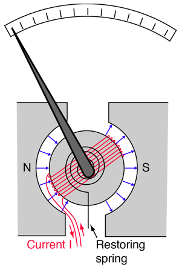

<!--
.. title: Magnetismo
.. slug: magnetismo
.. date: 2023-07-03 17:41:10 UTC+02:00
.. tags: 
.. category: didattica
.. link: 
.. description: 
.. type: text
.. has_math: true
-->

# Campo magnetico e forza magnetica
<small>MNV: paragrafo 6.1</small>

Alcuni materiali hanno la proprietà di attrarre la limatura di ferro. L'esempio più famoso è quello della *magnetite* (ossidi di ferro), il cui nome deriva dalla città di Magnesia, in Asia Minore, dove si trovavano giacimenti di questo materiale. 

Dato un oggetto fatto di magnetite, che chiamiamo *magnete*, la sua proprietà di attrarre la limatura non è uniforme, ma si concentra in alcune zone dette *poli del magnete*. I fenomeni legati a questa proprietà, al pari dei fenomeni elettrici,  erano considerati curiosità nell'Antichità, e sono stati studiati in maniera sistematica solo in epoca moderna. [Qui](https://www.youtube.com/watch?v=snNG481SYJw) trovate un video che mostra l'effetto di un magnete sulla limatura.

Le osservazioni sperimentali compiute nel XXVII, XXVIII e XIX secolo possono essere così riassunte:

1. I magneti esercitano una forza l'uno sull'altro causata dalla presenza di un *campo magnetico*. I fenomeni magnetici si verificano anche in assenza di cariche elettriche fisse e non sono quindi ascrivibili ad effetti elettrostatici. Tramite esperimenti controllati è possibile dimostrare come esistano solo due tipi di poli magnetici, per i quali valgono le seguenti proprietà
  * i poli possono essere *positivi* o *negativi*
  * poli dello stesso tipo si respingono, di tipo diverso si attraggono
  * i poli di uno stesso magnete sono sempre di tipo diverso
2. I magneti hanno la capacità di *magnetizzare* altri oggetti. Non tutti i materiali possono essere magnetizzati (ferro sì, vetro e plastica no). Un esempio noto è il caso di un sottile ago di ferro che, se magnetizzato, prende il nome di *ago magnetico*.
3. Un ago magnetico, se libero di ruotare (perché sospeso ad un filo o posto su di un sostegno galleggiante), si orienta sempre nella stessa direzione (approssimativamente coincidente con la direzione dei meridiani terrestri). Questo effetto è dovuto alla presenza del *campo magnetico terrestre* ed è analogo a quel che succede ad un dipolo elettrico in presenza di un campo elettrico. I due poli dell'ago vengono denominati nord e sud, a seconda della direzione lunga la quale tendono ad orientarsi. L'asse "magnetico" della Terra è spostato di circa $15^\circ$ rispetto al'asse nord-sud: i poli cosiddetti magnetici non coincidono infatti con quelli geografici, ma ne sono distanziati di $\approx 1600$ km.
4. Grazie ad esperimenti simili a quelli che hanno permesso di ricavare la dipendenza funzionale della forza elettrostatica, Coulomb mostrò come anche la forza tra poli magnetici puntiformi (quali quelli che si trovano, con buona approssimazione, agli estremi di sbarre lunghe e sottili) sia inversamente proporzionale al quadrato della distanza.
5. Esiste una differenza fondamentale fra la forza elettrostatica e quella magnetica: la carica elettrica elementare, in natura, può essere sia positiva che negativa. Nel caso dei poli magnetici, questi si trovano sempre a due a due: se si prende una sbarra magnetizzata e la si divide in due, ognuna delle due metà diventerà un magnete con due poli. Dal punto di vista microscopico, le nostre conoscenze attuali non spiegano perché non esistano i cosiddetti *monopoli magnetici*, ma esperimenti molto scrupolosi non ne hanno ancora dimostrato l'esistenza. In effetti, le particelle "elementari" (anche quelle neutre) posseggono tutte un momento di dipolo magnetico che, allo stato attuale delle nostre conoscenze, consideriamo *intrinseco*.
6. Limatura di ferro posta nelle vicinanze di un magnete tenderà a disporsi lungo le linee del campo magnetico. Questo è dovuto al fatto che i grani che compongono la limatura si magnetizzano e si comportano quindi come dipoli magnetici, orientandosi lungo il campo. Le proprietà di queste linee di campo sono molto simili a quelle che valgono per il campo elettrico:
  * Le linee sono tangenti e concordi al campo, punto per punto. Il verso si può trovare ponendo un ago magnetico di cui conosciamo i poli.
  * Le linee di campo sono più dense dove il campo è più forte. Ne deriva che un campo uniforme genera linee parallele ed equidistanti.
  * Le linee di campo non si incrociano mai, perché anche il campo magnetico è definitivo univocamente.
  * Le linee di campo sono uscenti dai poli nord (positivi) ed entranti nei poli sud (negativi).
	
## Elettricità e magnetismo
<small>MNV: paragrafo 6.2</small>

L'insieme dei risultati sperimentali appena riassunti porta a pensare che i magneti (o comunque i materiali magnetizzati) siano composti da dipoli magnetici caratterizzati da un momento di dipolo magnetico $\vec{m}$. Nell'800, dopo che l'invenzione della pila di Volta permise di studiare le correnti elettriche in maniera sistematica, fu notato come la limatura di ferro si addensasse in cerchi concentrici intorno ad un filo percorso da corrente, come mostrato in [questo video](https://www.youtube.com/watch?v=caHXwJbkbQU).

In linea con quanto detto precedentemente, risulta quindi evidente come delle cariche in movimento (cioè una corrente elettrica) generino un campo magnetico (indicato col simbolo $\vec{B}$).

Il fatto sperimentale che due fili percorsi da corrente interagiscono portò Ampère a ipotetizzare che tutti i fenomeni magnetici siano generati dall'interazione tra cariche elettriche in movimento (cioè da correnti). Per spiegare come fosse possibile che oggetti in cui non sembra scorrere corrente (come quelli composti da magnetite) generino comunque campi magnetici, Ampère ipotizzò anche che esistono correnti microscopiche, dette *correnti molecolari di Ampère* o *correnti amperiane*, che sono responsabili dei fenomeni magnetici in assenza di corrente.

Ulteriori sviluppi sperimentali e teorici misero in evidenza altri legami tra elettricità e magnetismo:

* Campi magnetici variabili nel tempo producono campi elettrici (non conservativi!).
* Campi elettrici variabili nel tempo producono campi magnetici (cfr. la corrente di spostamento).

In effetti, il legame tra $\vec{E}$ e $\vec{B}$ è così stretto da richiedere l'unificazione dei due nel concetto di *campo elettromagnetico*. Da un punto di vista storico questa unificazione, portata avanti dal punto di vista formale da Maxwell, diede anche una spinta allo sviluppo della teoria della relatività. Le equazioni di campo di Maxwell, infatti, non sono invarianti per trasformazioni di Galileo ma per trasformazioni di Lorentz, che sono alla base della teoria della relatività ristretta sviluppata da Einstein all'inizio del '900. Applicando questa teoria alle equazioni di campo si vede come campi magnetici in un sistema di riferimento inerziale si trasformino in campi elettrici in un altro (e viceversa).

# Forza magnetica

## Carica in moto
<small>MNV: paragrafo 6.3</small>

Dato un campo $\vec{B}$ generato da correnti amperiane o da cariche elettriche in movimento, un oggetto di massa $m$, carica $q$ e velocità $\vec{v}$ risente dell'effetto della *forza di Lorentz*:

$$
\vec{F} = q \vec{v} \times \vec{B}.
$$

Dato l'angolo $\theta$ tra la direzione della velocità e quella del campo magnetico, il modulo della forza di Lorentz vale

$$
F = |q| v B \sin \theta.
$$

La forza è quindi nulla quando $\vec{v}$ e $\vec{B}$ sono paralleli e massima quando sono ortogonali. Direzione e verso sono invece dati dal versore generato dal prodotto vettoriale tra la velocità e il campo magnetico, che si può calcolare con la regola della [mano destra](https://it.wikipedia.org/wiki/Regola_della_mano_destra). Ricordiamo le seguenti proprietà del prodotto vettoriale $\vec{c} = \vec{a} \times \vec{b}$:

1. $| \vec{a} \times \vec{b} | = ab\sin{ \theta}$
2. $\vec{a} \times \vec{b} = - \vec{b} \times \vec{a}$
3. $\vec{c}$ è ortogonale sia ad $\vec{a}$ che a $\vec{b}$

Analizziamo quest'ultima proprietà: il vettore risultante dall'operazione è ortogonale ad entrambi gli operandi. Ne deriva che la velocità della carica e la forza dovuta all'interazione magnetica sono sempre ortogonali. Poiché quest'ultima è anche parallela alla traiettoria della particella (e quindi allo spostamento), il lavoro compiuto dalle forze magnetiche, e quindi la differenza di energia cinetica, tra due punti generici della traiettoria si annulla:

$$
W = \int_P^Q \vec{F} \cdot d\vec{s} = \frac{1}{2}mv_Q^2 - \frac{1}{2}mv_P^2 = 0.
$$

In altre parole, in presenza di un campo magnetico il *modulo* della velocità non cambia, ma solo la sua direzione. Forza di Coulomb e forza di Lorentz sono quindi *molto* diverse:

* La forza elettrostatica compie, in generale, lavoro sulle cariche e quindi ne cambia l'energia cinetica, quella magnetica no.
* La forza elettrostatica è parallela alle linee di campo di $\vec{E}$ (che infatti si chiamano anche linee di forza), quella magnetica è ortogonale a $\vec{B}$.

Utilizzando la definizione di forza di Lorentz possiamo trovare le unità di misura del campo magnetico:

$$
[B] = \frac{\rm Ns}{\rm Cm} = \frac{\rm kg}{\rm As^2} \equiv T
$$

L'intensità del campo magnetico è solitamente misurata in Tesla o suoi sottomultipli (molto comune è il Gauss G, che vale $10^{-4}$ T). Il campo magnetico terrestre vale $0.4$ G. I campi utilizzati per le risonanze magnetiche sono invece dell'ordine dei Tesla.

## Conduttore percorso da corrente

Consideriamo un conduttore percorso da corrente. Ricordiamo le definizioni principali (consideriamo un conduttore in cui i portatori sono elettroni):

* il conduttore è composto da un reticolo di ioni fermi e da un "mare" di elettroni liberi
* $n$ è il numero di elettroni per unità di volume
* $-e$ è la carica deli elettroni
* $\vec{v}_d$ è la velocità di deriva 
* $\vec{j} = - n e \vec{v}_d$ è la densità di corrente
* $i = j \Sigma$ è l'intensità di corrente che passa attraverso una superficie $\Sigma$ ortogonale a $\vec{j}$

### Forza magnetica dovuta alla corrente
<small>MNV: paragrafo 6.4, esempio 6.2</small>

Se il conduttore è immerso in un campo magnetico $\vec{B}$, su ogni elettrone agirà la forza di Lorentz:

$$
\vec{F}_L = -e \vec{v}_d \times \vec{B}
$$

questa forza si trasmette direttamente al reticolo (e quindi alla massa del conduttore, che consideriamo indeformabile) tramite gli urti degli elettroni. In un tratto $ds$ di sezione $\Sigma$ la forza agente sul conduttore vale

$$
d\vec{F} = n \Sigma ds \vec{F}_L = -n \Sigma ds e \vec{v}_d \times \vec{B} = \Sigma ds \vec{j} \times \vec{B}.
$$

Se orientiamo $d\vec{s}$ nella direzione di $\vec{j}$, prendiamo un conduttore di sezione $\Sigma$ costante e introduciamo l'intensità di corrente al posto di $j$ possiamo scrivere la relazione precedente come

$$
d\vec{F} = i d\vec{s} \times \vec{B}
$$

che è detta *seconda legge elementare di Laplace*. Essendo molto simile all'espressione della legge di Lorentz, valgono le considerazioni fatte prima su verso e modulo della forza rispetto al verso e al modulo dell'orientamento del conduttore (dato da $d\vec{s}$) e di $\vec{B}$. 

La forza che agisce su di un tratto $PQ$ di conduttore si trova integrando la legge di Laplace:

$$
\vec{F} = i \int_P^Q d\vec{s} \times \vec{B}.
$$

La corrente si porta fuori dall'integrale perché costante su ogni sezione del conduttore. In generale, invece, la direzione e il modulo di $\vec{B}$ cambiano punto per punto.

Facciamo degli esempi particolari:

* Se $\vec{B}$ è uniforme e il conduttore è rettilineo fra $P$ e $Q$ vale
$$
\vec{F} = i \int_P^Q d\vec{s} \times \vec{B} = i \left( \int_P^Q d\vec{s} \right) \times \vec{B} = i \vec{PQ} \times \vec{B}
$$
* Lo stesso risultato si ottiene se il conduttore non è rettilineo, perché $\vec{B}$ non dipende da $s$ e quindi si può portare fuori dall'integrale (perché il prodotto vettoriale è un'operazione lineare!).
* Dati i risultati precedenti, è chiaro che la forza agente su di un circuito chiuso immerso in un campo magnetico uniforme debba essere nulla, infatti
$$
\vec{F}_{\rm tot} = i \oint d\vec{s} \times \vec{B} = i \int_P^Q d\vec{s} \times \vec{B} - i \int_Q^P d\vec{s} \times \vec{B} = 0
$$

Prendiamo come esempio un circuito formato da una semicirconferenza di raggio $L/2$ e da un tratto rettilineo di lunghezza $L$. Poniamo che il circuito sia adagiato sul piano $x, y$, che il tratto rettilineo sia orientato lungo $\hat{x}$, che in esso scorra una corrente $i$ sempre in direzione $\hat{x}$ e che il campo sia orientato lungo $\hat{y}$. La forza totale può essere calcolata come somma della forza agente sul tratto rettilineo più quella agente sul tratto curvo:

* Lungo il tratto rettilineo lo spostamento $d\vec{s}$ è orientato lungo $\hat{x}$ e quindi $i d\vec{s} \times \vec{B} = i B dx \hat{z}$ e quindi
$$
\vec{F}_r = i \int_0^L B dx \hat{z} = L i B \hat{z}
$$
* Lungo il tratto curvo lo spostamento ha una componente lungo $-\hat{x}$ e una lungo $\pm \hat{y}$ (a seconda della posizione). Poiché $\vec{B}$ è orientato lungo $\hat{y}$ si ha $\hat{y} \times \vec{B} = 0$ e quindi
$$
\vec{F}_c = -i \int_0^L dx \hat{x} \times B \hat{y} = -L i B \hat{z}
$$

Come dimostrato precedentemente, la forza totale è quindi nulla. Le due forze, però, sono uguali in modulo ma opposte in verso e formano quindi una coppia di forze che dà luogo ad un momento meccanico che tenderà a *ruotare* il circuito. 

## Momenti meccanici su circuiti piani

<small>MNV: paragrafo 6.5 (senza la parte sulle piccole oscillazioni)</small>

Riassumendo, circuiti chiusi immersi in un campo magnetico $\vec{B}$ uniforme non sono sottoposti ad alcuna forza, e quindi il loro centro di massa (se erano inizialmente fermi) non si muoverà. D'altro canto, l'interazione magnetica può generare un momento delle forze e quindi indurre una rotazione, generando i fenomeni che si vedono in [questo video](https://www.youtube.com/watch?v=4OpkdVevA-8).

Studiamo il caso semplice di una spira rettangolare di lati $a$ e $b$ e percorsa da corrente $i$. Poiché la spira è un oggetto planare, la sua normale $\hat{n}$ è costante su tutta la superficie. 

**Nota Bene:** La normale alla spira è definita utilizzando la regola della vite (o della mano destra) applicata al verso della corrente: la normale è diretta verso di noi se stiamo guardando il circuito dalla direzione per cui la corrente scorre in senso *antiorario*.

Poniamo la spira in una regione di spazio in cui è presente un campo magnetico uniforme $\vec{B}$. Orientiamo la spira in maniera che abbia due dei lati ortogonali a $\vec{B}$. L'orientamento della spira in questa configurazione è determinato dall'angolo $\theta$ che gli altri due lati formano con $\vec{B}$, che può essere calcolato a partire dalla normale:

$$
\vec{B} \cdot \hat{n} = B \cos{ \theta}
$$

Se chiamiamo $1$ e $2$ i lati mantenuti ortogonali a $\vec{B}$ e $3$ e $4$ gli altri, disegnando il circuito troviamo subito che le forze di origine magnetica agenti su questi ultimi hanno stesso modulo e direzione ma verso opposto. Dal disegno si vede come queste forze siano dirette in modo tale da non poter originare alcun momento.

Similmente, le forze agenti su $1$ e $2$ sono ancora uguali in modulo e direzione e opposte in verso, ma se $\theta > 0$ costituiscono una *coppia di forze* di braccio $b \sin{\theta}$. Il modulo del momento meccanico vale quindi

$$
M = b F \sin{ \theta } = i a b B \sin{ \theta } = i \Sigma B \sin{ \theta }
$$

dove abbiamo utilizzato l'espressione della forza agente su di un segmento rettilineo percorso da corrente $i$ derivata precedentemente e $\Sigma = ab$. La relazione precedente si può scrivere vettorialmente una volta definito il *momento magnetico* della spira:

$$
\vec{m} = i \Sigma \hat{n}
$$

che ha verso dato dalla normale della superficie planare e modulo $i\Sigma$. Il momento meccanico in forma vettoriale diventa così

$$
\vec{M} = \vec{m} \times \vec{B}.
$$

Questa relazione, dedotta per una spira, vale in realtà per ogni circuito piano, cioè per ogni circuito per cui è possibile definire un momento magnetico $\vec{m} = i \Sigma \hat{n}$.

Il momento meccanico generato tenderà sempre a ruotare il circuito in modo tale da allineare $\vec{B}$ ed $\hat{n}$. Questo si può visualizzare disegnando le quantità vettoriali in gioco usando un punto di vista per cui $\vec{M}$ esce dal foglio. Quando $\vec{B}$ e $\hat{n}$ sono allineati si ha $\vec{M} = 0$ (in condizioni di equilibrio stabile), mentre il momento meccanico è massimo quando $\theta = \pi$. Questo ricorda il comportamento di un dipolo elettrico in un campo elettrico uniforme, per il quale vale infatti un'espressione analoga, $\vec{M} = \vec{p} \times \vec{E}$.

Analogamente a quanto fatto per i dipoli elettrici, si può associare un'energia potenziale ad un dipolo magnetico in un campo $\vec{B}$:

$$
U_e = - \vec{m} \cdot \vec{B} = -m B \cos{ \theta }
$$

che è minima in condizioni di equilibrio stabile ($\theta = 0$) e massima in condizioni di equilibrio instabile ($\theta = \pi$). La relazione tra momento meccanico ed energia potenziale si può scrivere come:

$$
M = -\frac{dU_e}{d\theta} = - m B \sin{ \theta }
$$

In generale, il moto rotatorio del sistema sarà dato da

$$
\frac{d \vec{L}}{dt} = \vec{M}
$$

dove $\vec{L}$ è il momento angolare del sistema. Lungo l'asse di rotazione questa equazione si può riscrivere come

$$
M = I \alpha = I \frac{d^2 \theta}{dt}
$$

dove $I$ è il momento di inerzia della spira rispetto all'asse di rotazione e $\alpha$ è l'accelerazione angolare.

**Nota Bene:** le unità di misura del momento di dipolo magnetico, data la sua definizione, sono 
$$
[m] = A m^2 = \frac{J}{T}
$$

## Due esempi

### Il galvanometro

<small>MNV: esempio 6.3</small>

Un galvanometro (vedi figura sopra) è costituito da una bobina (composta da $N$ spire di superficie $\Sigma$) avvolta intorno ad un cilindro di ferro e solidale ad una molla. La molla è, a sua volta, solidale con un ago che si muove lungo una scala graduata. Il sistema bobina $+$ cilindro $+$ molla è posta tra due poli che generano un campo magnetico $\vec{B}$ che, grazie alla presenza del cilindro, risulta sempre ortogonale al momento di dipolo delle spire. La molla oppone resistenza alla rotazione generando un momento meccanico 

$$
M = k \theta
$$

dove $k$ è una costante del sistema e $\theta$ è l'angolo definito precedentemente. Quando viene fatta scorrere una corrente all'interno della bobina, questa tenderà a ruotare a causa del momento meccanico generato dalle coppie di forze agenti sulle diverse spire. Utilizzando la formula ricavata precedentemente, il momento che agisce su ogni spira della bobina vale $M_s = i \Sigma B$. Poiché questi momenti si sommano, il momento totale agente sulla bobina sarà

$$
M = N M_s = N i \Sigma B.
$$

All'equilibrio, i due momenti torcenti si equivalgono, quindi

$$
k \theta = N i \Sigma B
$$

da cui si ottiene

$$
i = \frac{k \theta}{N \Sigma B}.
$$

Misurando $\theta$ (e dopo aver tarato opportunamente la scala graduata) è possibile risalire al valore di $i$.

### Motore elettrico in corrente continua

Un motore a corrente continua è composto da 

* uno statore, che genera un campo magnetico. Nei motori più piccoli il campo magnetico è generato dai due poli di un magnete permamente, mentre nei motori più grandi è generato da *correnti di eccitazione* che scorrono in apposite spire poste intorno al rotore;
* un rotore, che è la parte del motore che ruota e su cui sono avvolte le spire del circuito che, essendo solidali al rotore, inducono la rotazione per effetto della forza magnetica;
* un collettore che, collegato ad un generatore, fa sì che scorra corrente nelle spire del rotore.

Le spire sul rotore si collegano al generatore tramite contatti "striscianti" detti spazzole. Quando si chiude il collegamento e passa corrente nelle spire, queste avvertiranno un momento meccanico che tenderà a far ruotare il rotore, attivando così il motore. 

Prendiamo ad esempio un'unica spira. Se le connessioni coi poli del generatore fossero tali per cui la corrente scorresse sempre nello stesso verso durante tutta la rotazione, la spira tenderebbe ad oscillare intorno alla posizione di equilibrio, e non a ruotare. Per far sì che, come in figura, la spira tenda a ruotare sempre nella stessa direzione, la polarità del collegamento tra la spira (o le spire) ed il collettore si inverte ogni mezzo giro. Così facendo anche la direzione della corrente si inverte, e questo porta ad avere un sistema in cui il momento meccanico generato tenderà a far ruotare la spira (e quindi il rotore ad essa solidale) in una direzione specifica. 

## Moto di una carica in un campo magnetico uniforme

<small>MNV: paragrafo 6.7</small>

Prendiamo il caso di una particella di carica $q$ e massa $m$ che entra in una regione di spazio in cui è presente un campo uniforme $\vec{B}$. La velocità iniziale della particella è $\vec{v}$. Ecco un [video esemplificativo](https://www.youtube.com/watch?v=orsMYomjwIw).

### Il caso $\theta = \pi / 2$

Poniamo il caso che si abbia, inizialmente, $\vec{v} \perp \vec{B}$ (cioè $\vec{v}$ e $\vec{B}$ sono ortogonali). La forza agente sulla carica è quella di Lorentz che deve essere, per definizione, ortogonale sia a $\vec{v}$ che a $\vec{B}$. Dato che anche la velocità iniziale era ortogonale a $\vec{B}$, ne segue che $\vec{v}$ resterà ortogonale a $\vec{B}$ per tutti gli istanti successivi, e quindi *tutto* il moto della carica si svolgerà sul piano ortogonale al campo magnetico. Possiamo facilmente dimostrarlo scrivendo esplicitamente l'espressione della forza di Lorentz. Orientiamo il sistema di riferimento in modo da avere $\vec{v} = (v_x, v_y, 0)$ e $\vec{B} = (0, 0, B)$, allora 

$$
\vec{F} = q \vec{v} \times \vec{B} = q (v_x \hat{x} + v_y \hat{y}) \times B \hat{z} = q v_x B \hat{x} \times \hat{z} + q v_y B \hat{y} \times \hat{z} = -q v_x B \hat{y} + q v_y B \hat{x} = (q v_y B, -q v_x B, 0)
$$

e quindi la forza non ha componente lungo l'asse $z$. Poiché anche la velocità iniziale ha componente $z$ nulla, il moto resterà confinato al piano $(x, y)$.

In questo caso particolare $\theta = \frac{\pi}{2}$ e quindi il modulo della forza di Lorentz è costante e vale

$$
F_L = q v B = m a.
$$

Istante per istante, l'accelerazione è costante in modulo ed ortogonale alla velocità: il moto che ne deriva è circolare uniforme (MCU). Ricordiamo alcuni dettagli relativi a questo tipo di moto:

* la velocità tangenziale è costante (ed in questo specifico caso è pari al modulo della velocità iniziale). Possiamo calcolarla ricordando che la velocità è il rapporto tra lo spazio percorso in un tempo $\Delta t$ e $\Delta t$, quindi

$$
v_t = \frac{2 \pi r}{T}
$$

dove $r$ è il raggio di curvatura (che nel MCU è semplicemente il raggio della circonferenza) e $T$ è il tempo necessario per compiere un giro completo (cioè il *periodo* del moto circolare).

* Si definisce *velocità angolare* il rapporto tra l'angolo descritto in un certo intervallo di tempo $\Delta t$ e $\Delta t$ stesso. In termini infinitesimi

$$
\omega = \frac{d\theta}{dt}
$$

Nel caso di MCU $\omega$ è chiaramente costante e, per definizione, vale
$$
\omega = \frac{2 \pi}{T} = \frac{v}{r}
$$
perché la particella impiega un tempo $T$ a percorrere un angolo di $2 \pi$.
La velocità angolare si può vedere come quantità vettoriale, $\vec{\omega}$, in cui direzione e verso del vettore indicano l'asse e il verso di rotazione. 

* Per l'accelerazione (che in questo caso ha solo la componente *centripeta*) vale la relazione

$$
\vec{a} = \vec{\omega} \times \vec{v}
$$

e quindi il suo modulo è $a = \frac{v^2}{r}$.

Possiamo ottenere una relazione tra la velocità angolare vettoriale ed il campo magnetico utilizzando l'anticommutatività del prodotto vettoriale:

$$
\vec{a} = \frac{q}{m} \vec{v} \times \vec{B} = \vec{\omega} \times \vec{v} = - \vec{v} \times \vec{\omega}
$$

da cui si trova

$$
\vec{\omega} = - \frac{q}{m} \vec{B}.
$$

Questa relazione ricorda (anche se è diversa!) quella trovata per il campo elettrico ($\vec{a} = \frac{q}{m}\vec{E}$), e può essere utilizzata per ottenere una definizione operativa del campo magnetico (cioè un modo per misurarlo) scrivendo $B$ in funzione di $\omega$:
$$
B = \frac{m\omega}{q}.
$$

Ricordando che $\omega = v / r$ si ottiene $v / r = q / m B$ e quindi
$$
r =  \frac{mv}{qB},
$$

**Nota Bene:** il modulo della velocità angolare non dipende dalla velocità $v$. Poiché $\omega$ e il periodo del moto sono legati dalla relazione $T = \frac{2 \pi}{\omega} = \frac{2 \pi m}{qB}$, anche il periodo risulta essere indipendente da $v$!

### Il caso generico

Nel caso generico, la velocità iniziale e il campo magnetico uniforme non sono ortogonali, e quindi $\theta \neq \frac{\pi}{2}$. Dato un vettore $\vec{v}$ qualsiasi, possiamo sempre scomporlo in due componenti, una parallela e l'altra ortogonale a $\vec{B}$, cioè:

$$
\vec{v} = \vec{v}_o + \vec{v}_p.
$$

Utilizzando le proprietà del prodotto vettoriale la forza di Lorentz si può scrivere come

$$
\vec{F}_L = q \vec{v} \times \vec{B} = q (\vec{v}_o + \vec{v}_p) \times \vec{B} = q \vec{v}_o \times \vec{B}
$$

perché $\vec{v}_p \times \vec{B} = 0$, essendo i due vettori paralleli. 

L'accelerazione giace quindi sempre sul piano ortogonale a $\vec{B}$, e le equazioni che governano il moto sono formalmente identiche a quelle trovate nel paragrafo precedente, dove $v_o = v \sin \theta$ fa le veci di $v$. Sul piano ortogonale a $\vec{B}$ quindi la carica compirà traiettorie circolari di raggio $r = \frac{m v \sin \theta}{qB}$. Nella direzione parallela al campo magnetico, d'altro canto, si avrà un moto rettilineo uniforme di velocità $v_p = v \cos \theta$. 

Il moto totale è quindi la *sovrapposizione* di un moto circolare uniforme e un moto rettilineo uniforme: la carica compirà una traiettoria elicoidale. Dopo ogni circonferenza compiuta, la carica si è mossa lungo l'asse dell'elica di una quantità

$$
p = v_p T = \frac{2 \pi m v \cos \theta}{q B}
$$

detta *passo dell'elica*.

## La bottiglia magnetica

<small>MNV: nota alla fine del paragrafo 6.7</small>

Il moto di una carica in un campo magnetico non uniforme è, in generale, un problema molto complesso. [Qui un video](https://www.youtube.com/watch?v=Sf1MGTD9xGY) con qualche esempio simulato al computer.

Facciamo un esempio che si applica a situazioni di interesse pratico. Prendiamo un campo con simmetria assiale, che sia più intenso alle estremità e più debole al centro. Se l'asse $z$ è l'asse di simmetria del sistema, possiamo scomporre il campo in due componenti, $B_z$, parallelo a $\hat{z}$, e $B_r$, ortogonale a $\hat{z}$. 

Disegnando il campo vediamo come $B_z$ sia diretto sempre nello stesso verso (dal polo Nord a quello Sud), mentre $B_r$ cambia segno passando da un polo all'altro. Consideriamo una carica che entra nella regione di spazio in cui è presente il campo. Se scomponiamo la sua velocità vediamo come la componente $B_z$ tenderà a far ruotare le particelle attorno all'asse $z$, mentre $B_r$ tenderà ad intrappolarle accelerandole sempre verso il centro della "bottiglia". La particella quindi tenderà a muoversi su di una traiettoria elicoidale tra i due poli e, in dipendenza dalla sua velocità iniziale, potrebbe rimanere intrappolata anche per lungo tempo. Questo effetto di *confinamento* può essere utilizzato per generare un contenitore senza pareti, utile ad esempio per intrappolare il plasma in alcuni tipi di reattori a fusione nucleare.

Il campo magnetico generato dalla Terra ha più o meno questa forma, e infatti esiste una regione nello spazio vicino al nostro pianeta (detta fascia di Van Allen) dove molte particelle cariche restano intrappolate. Poiché questo effetto di confinamento non è perfetto, alcune di queste particelle riescono a sfuggire dalla bottiglia e, per esempio, a raggiungere l'atmosfera terrestre. Questo accade con più probabilità vicino ai poli, dove il campo è più forte. L'interazione con i gas che compongono l'atmosfera può generare, in determinate condizioni, il fenomeno dell'aurora boreale.

## Lo spettrometro di massa

<small>MNV: parte del paragrafo 6.8</small>

### Lo spettrometro di Dempster

Il moto uniforme circolare generato da un campo magnetico uniforme può essere utilizzato per separare ioni aventi diversi rapporti di carica su massa da dispositivi detti *spettrometri di massa*. 

Vediamo una semplice schematizzazione di come funziona uno di questi strumenti. Gli ioni vengono inizialmente accelerati. Se, come spesso succede, viene utilizzato un campo elettrostatico, ogni ione avrà una energia cinetica iniziale

$$
U_k = \frac{1}{2} m v^2 = q \Delta V,
$$

e quindi la velocità dei singoli ioni dipenderà dal rapporto tra la massa e la carica. Se consideriamo ioni aventi stessa carica ma massa diversa (come succede per gli isotopi), quest'ultima determinerà la velocità di entrata dei singoli ioni, che vale

$$
v = \sqrt{\frac{2q\Delta V}{m}}
$$

In seguito gli ioni vengono fatti entrare, tramite delle fessure molto strette che ne collimano il fascio, in una regione di spazio in cui è presente un campo magnetico ortogonale alla traiettoria di entrata. Poiché l'unica forza presente è quella magnetica, gli ioni compiranno una traiettoria circolare di raggio $r = mv / qB$. Sostituendo il valore della velocità trovato precedentemente si ottiene

$$
r = \frac{m}{qB} \sqrt{\frac{2q\Delta V}{m}} = \sqrt{\frac{2\Delta V}{B^2} \frac{m}{q}}.
$$

Poiché i valori di $\Delta V$ e $B$ sono caratteristici dell'apparecchio e quindi noti, tramite misure di $r$ (ottenibili con rilevatori di posizione come ad esempio lastre fotografiche) è possibile determinare il rapporto $q/m$.

### Lo spettrometro di Bainbridge

Il dispositivo descritto sopra (spettrometro di Dempster) si basa sul presupposto che la velocità iniziale degli ioni sia molto minore di quella dovuta al campo elettrostatico iniziale. Se le condizioni sono tali per cui questo non avviene, la relazione tra $r$ e $m / q$ non è più valida. Si può ovviare a questo problema mettendo un *selettore di velocità* sul percorso degli ioni, prima che questi entrino nella zona col campo magnetico. Questo selettore di velocità non è altro che una regione di spazio in cui sono presenti un campo elettrostatico $\vec{E}_s$ e un campo magnetico $\vec{B}_s$, l'uno ortogonale all'altro ed entrambi ortogonali alla traiettoria degli ioni. In queste condizioni sul fascio di ioni agirà una forza $\vec{F}_s = q(\vec{E}_s + \vec{v} \times \vec{B}_s)$ che ha direzione ortogonale al moto degli ioni. Se i campi sono orientati in maniera tale da generare forze di verso opposto e i loro moduli sono scelti opportunamente, la forza si annullerà per un particolare valore di velocità dato da 

$$
v = \frac{E_s}{B_s}.
$$

Gli ioni aventi questa velocità, quindi, non cambieranno direzione. Se si mette una stretta fessura alla fine della regione di spazio in cui sono presenti i campi, solo gli ioni aventi questo particolare valore di velocità riusciranno ad entrare nella camera dove verranno deflessi dal campo magnetico $\vec{B}$ dello spettrometro di massa. Qui il raggio della traiettoria sarà dato da

$$
r = \frac{mv}{qB} = \frac{mE_s}{qB_s B}
$$

e quindi

$$
\frac{m}{q} = \frac{rB_s B}{E_s}.
$$

Se confrontiamo questa relazione con quella ottenuta per lo spettromero di Dempster vediamo come il rapporto massa/carica non dipenda più dalla differenza di potenziale (e quindi dalla velocità iniziale degli ioni), ma solo da quantità misurabili sperimentalmente ($r$) o legate allo strumento, e quindi note ($B_s$, $E_s$ e $B$). Un altro vantaggio è che la relazione che lega la quantità di interesse (il rapporto $m/q$) e la quantità che si misura ($r$) è lineare.

### Il ciclotrone

Consideriamo due cavità semicilindriche conduttrici poste ad una d.d.p. variabile $\Delta V = V_0 \sin (\omega_{RF} t)$ ed immerse in un campo magnetico uniforme $\vec{B}$ ortogonale alle loro basi. All'interno delle cavità il campo elettrico è essenzialmente nullo. Gli ioni vengono iniettati nel centro del sistema e inizialmente accelerati dalla d.d.p., così che la loro energia cinetica sia $U_k = q \Delta V$. Entrati in una delle due cavità, gli ioni vengono deflessi dal campo magnetico e ne escono dopo un tempo che è semplicemente la metà del periodo del moto circolare di una carica in un campo magnetico uniforme, cioè

$$
T_h = \frac{\pi m}{qB},
$$

che non dipende dalla loro velocità. Trascorso $T_h$, quindi, gli ioni si ritroveranno di nuovo nello spazio tra le due cavità in cui è presente la d.d.p. Se il dispostivo è progettato in maniera tale da invertire la d.d.p. dopo un tempo $T_h$, e cioè se $\omega_{RF} = \omega = \pi / T_h = qB / m$, gli ioni verranno accelerati nuovamente e la loro energia cinetica diventerà $U_k = 2 q \Delta V$. Poiché la velocità aumenta, aumenta anche il raggio di curvatura $r = mv / qB$, e quindi gli ioni percorreranno traiettorie di raggio via via maggiore con velocità crescenti, ma mantenendo sempre la stessa velocità angolare $\omega$. Questo processo continua finché il raggio di curvatura non raggiunge le dimensioni del raggio $R$ del ciclotrone stesso. Per questo valore del raggio si trova la velocità massima degli ioni, che vale

$$
v_{\rm max} = \frac{qBR}{m}.
$$

Il principio del ciclotrone è alla base di tutti i moderni acceleratori di particelle circolare (come LHC), e quindi di tutte le loro applicazioni (*imaging*, terapia adronica, *ecc*).

# Campi magnetici prodotti da correnti

<small>MNV: paragrafo 7.1</small>

Fino ad ora ci siamo occupati dell'effetto che un campo magnetico ha su particelle  cariche o su fili percorsi da corrente. Ora risponderemo alla domanda complementare: qual è il campo magnetico generato da cariche in moto in diverse configurazioni (cioè da correnti generiche)? [Qui](https://www.youtube.com/watch?v=bq6IhapfucE) un video che mostra due casi (una spira e un solenoide).

## Correnti in circuiti

Esperimenti compiuti nell'800 hanno permesso di identificare la dipendenza funzionale del campo magnetico generato da un tratto infinitesimo di filo percorso da corrente dalle diverse quantità in gioco. In particolare si è trovato che

* il campo generato in un punto a distanza $r$ è inversamente proporzionale a $r^2$;
* l'intensità del campo è proporzionale alla corrente $i$
* la direzione del campo è ortogonale sia al vettore distanza $\vec{r}$ che al versore tangenziale al tratto di filo

In formule, questa dipendenza si può scrivere come

$$
d\vec{B}(\vec{r}) = k_m i \frac{d\vec{l} \times \hat{r}}{r^2}
$$

dove $k_m$ è una costante di proporzionalità che dipende dal materiale che stiamo considerando (e il cui valore si misura sperimentalmente), $d\vec{l} = \hat{t} dl$ indica la direzione del filo (con $\hat{t}$ versore tangente) e $\vec{r}$ è il vettore distanza tra il tratto infinitesimo e il punto in cui stiamo misurando il campo.

Nel vuoto si trova $k_m = 10^{-7} {\rm \frac{Tm}{A}}$ e, per motivi storici, di solito si scrive in funzione della cosiddetta *permeabilità magnetica del vuoto*,

$$
k_m = \frac{\mu_0}{4\pi}
$$

da cui si ottiene $\mu_0 = 4 \pi k_m = 1.26 \times 10^{-6}$ Tm/A. 

L'espressione del campo diventa quindi

$$
d\vec{B}(\vec{r}) = \frac{\mu_0}{4 \pi} \frac{i dl}{r^2} \hat{t} \times \hat{r}
$$

detta *prima legge elementare di Laplace*. Questa legge consente di calcolare il campo magnetico generato da qualsiasi circuito percorso da corrente integrando su tutti i diversi contributi. Nel caso generico di circuito chiuso, l'espressione formale del campo diventa

$$
\vec{B} = \frac{\mu_0 i }{4 \pi} \oint \frac{d\vec{l} \times \hat{r}}{r^2}.
$$

Questa relazione, nota come *legge di Ampère-Laplace*, è valida per tutti i casi in cui i conduttori che compongono il circuito hanno sezioni su cui le quantità in gioco possono essere considerate costanti; quando, cioè, possono essere considerati filiformi.

## Cariche in moto

Possiamo riscrivere la legge elementare di Laplace da un punto di vista microscopico ricordando che $j = i / \Sigma$ e, per portatori generici di carica $q$ e velocità di deriva $\vec{v}$, $\vec{j} = n q \vec{v}$:

$$
d\vec{B}(\vec{r} ) = \frac{\mu_0}{4 \pi} \frac{q  \vec{v} \times \hat{r}}{r^2} n \Sigma dl = \frac{\mu_0}{4 \pi} \frac{q \vec{v} \times \hat{r}}{r^2} n d\tau.
$$

Questa è l'espressione del campo generata dagli $N = n d\tau$ portatori di carica presenti nel volumetto $d\tau = \Sigma dl$. Il campo generato da ognuno di questi portatori sarà quindi pari a $d\vec{B}(\vec{r} ) / n d\tau$, da cui si ricava il campo dovuto ad una semplice carica $q$ in movimento con velocità $\vec{v}$

$$
\vec{B} = \frac{\mu_0}{4 \pi} \frac{q \vec{v} \times \hat{r}}{r^2}.
$$

Poiché dipende unicamente dal valore della carica e dalla velocità della particella, questa espressione ha carattere del tutto generale. È chiaro quindi come una carica in moto generi *sempre* un campo magnetico, indipendentemente dalle cause che generano (o hanno generato) il moto. Questo risultato si può confermare misurando i campi magnetici generati da sistemi elettrostatici messi in moto, come fatto per la prima volta da Rowland nel 1878 con un disco carico rotante.

# Legge di Ampère

<small>MNV: paragrafo 7.4</small>

Consideriamo il campo magnetico generato da un filo indefinito rettilineo. Per simmetria (e per le proprietà della prima legge elementare di Laplace), le linee di campo non possono che essere che circonferenze poste sui piani ortogonali all'asse del filo. È quindi evidente una proprietà del campo magnetico: *tutte* le linee di campo sono chiuse. Data la loro definizione, il fatto che siano chiuse implica che la circuitazione del campo magnetico calcolata su una linea di campo (e, come vedremo, calcolata su *qualunque* linea chiusa) sia, in generale, diversa da zero. Esplicitiamo questa proprietà di $\vec{B}$. Per farlo consideriamo il caso particolare di un filo indefinito percorso da corrente che, come vedremo esplicitamente tra poco, genera un campo

$$
\vec{B}(r ) = \frac{\mu_0 i}{2 \pi r} \hat{\phi}.
$$

Dove $\hat{\phi}$ indica la direzione tangente alla linea di campo che, in questo caso, è una circonferenza centrata sul filo. Consideriamone una a distanza $R$ dal filo. Per calcolare l'integrale di linea dobbiamo prima calcolare il prodotto scalare tra il campo e lo spostamento, che in questo caso vale

$$
\vec{B} \cdot d\vec{s} = \frac{\mu_0 i}{2 \pi r} ds = \frac{\mu_0 i}{2 \pi} d\theta
$$

perché lo spostamento ed il campo magnetico sono paralleli, essendo entrambi tangenti alla linea del campo (il primo per definizione, il secondo perché diretto lungo $\hat{\phi}$), e perché $ds = r d\theta$, dove $d\theta$ è quindi l'angolo sotteso da $ds$. Se integriamo questa quantità su di un arco di circonferenza che unisce i punti $C$ e $D$ otteniamo

$$
\int_C^D \vec{B} \cdot d\vec{s} = \int_0^\theta \frac{\mu_0 i}{2 \pi} d\theta' = \frac{\mu_0 i}{2 \pi} \theta,
$$

dove $\theta$ è l'angolo sotteso dall'arco su cui abbiamo integrato. L'espressione precedente dipende solamente dall'angolo, ed è quindi naturale pensare che la stessa relazione valga indipendentemente dal percorso che unisce $C$ e $D$. Questo si può dimostrare considerando un percorso qualsiasi che unisca C e D, e scomponendo il vettore spostamento in due componenti $d\vec{s}_p$ e $d\vec{s}_o$, una parallela e l'altra ortogonale a $\hat{\phi}$. Il prodotto scalare con il campo diventa quindi

$$
\vec{B} \cdot d\vec{s} = \vec{B} \cdot d\vec{s}_p + \vec{B} \cdot d\vec{s}_o = \vec{B} \cdot \hat{\phi} ds_p = \frac{\mu_0 i}{2 \pi} d\theta
$$

dove $d\theta$ è l'angolo sotteso da $ds_p$. Avendo ottenuto la stessa espressione di prima, abbiamo dimostrato come l'integrale da $C$ a $D$ non dipende dal percorso che scegliamo, ma solo dall'angolo $\theta$ sotteso dall'arco di circonferenza che li unisce. Se consideriamo il percorso inverso, da $D$ a $C$, lo spostamento sarà ora orientato lungo $-\hat{\phi}$ e quindi avremo

$$
\int_D^C \vec{B} \cdot d\vec{s} = -\int_0^\theta \frac{\mu_0 i}{2 \pi} d\theta' = -\frac{\mu_0 i}{2 \pi} \theta.
$$

Possiamo ora calcolare l'integrale del campo per lo spostamento su di una linea chiusa, cioè la circuitazione di $\vec{B}$:

$$
\oint \vec{B} \cdot d\vec{s} = \frac{\mu_0 i}{2 \pi} \oint d\theta,
$$

ricordando che la definizione di $\theta$ è legata all'angolo visto dalla sorgente del campo, dobbiamo distinguere due casi:

* Se torniamo da $D$ a $C$ *senza* girare intorno alla (cioè senza concatenare la) sorgente, prima ci muoviamo di $+\theta$ e poi di $-\theta$. È chiaro quindi che la circuitazione del campo è nulla, cioè 

$$
\frac{\mu_0 i}{2 \pi} \oint d\theta = \frac{\mu_0 i}{2 \pi} \int_0^{\theta} d\theta' + \frac{\mu_0 i}{2 \pi} \int_0^{-\theta} d\theta' = 0
$$

* Se torniamo da $D$ a $C$ girando attorno alla (cioè concatenando la) sorgente, l'angolo $\theta$ aumenta monotonicamente, e quindi la circuitazione del campo diventa:

$$
\frac{\mu_0 i}{2 \pi} \oint d\theta = \mu_0 i.
$$

Questa relazione, che abbiamo ottenuto per un filo rettilineo indefinito, ha carattere del tutto generale ed è nota come *legge di Ampère*, che afferma che la circuitazione del campo magnetico $\vec{B}$ è uguale alla somma delle correnti concatenate moltiplicata per $\mu_0$. Si ha cioè

$$
\oint \vec{B} \cdot d\vec{s} = \mu_0 \sum_k i_k,
$$

che si può dimostrare applicando il principio di sovrapposizione alla derivazione della formula per il filo singolo.
Come nel caso della legge di Gauss per il campo elettrostatico, il campo magnetico che compare al primo membro è quello generato da *tutte* le correnti presenti nello spazio, mentre al secondo membro compaiono *tutte* le correnti concatenate al percorso chiuso che stiamo considerando. Il segno con cui si considera una corrente $i_k$ nella somma dipende dal rapporto tra il verso in cui scorre e il verso con cui si percorre la linea chiusa su cui si calcola la circuitazione:

* se i due versi sono legati dalla regola della mano destra (o della vite) si prende $+i_k$;
* altrimenti si considera $-i_k$.

La legge di Ampère lega direttamente le sorgenti del campo al campo stesso, in maniera analoga a quanto fatto dalla legge di Gauss.
**Nota Bene:** la legge di Ampère mostra come, in generale, la circuitazione di $\vec{B}$ sia diversa da zero. Anche se in casi specifici (come ad esempio quando il percorso su cui si integra non concatena alcuna corrente) la circuitazione può essere nulla, il campo magnetico è sempre un campo *non conservativo*.

## Forma locale della legge di Ampère

La legge di Ampère è una relazione integrale che può essere riscritta in forma locale utilizzando il teorema di Stokes che, in elettrostatica, è usato in maniera simile per dimostrare come $\vec{E}$ sia *irrotazionale*. In questo caso applicando il teorema si ottiene

$$
\oint_{\mathcal{C}} \vec{B} \cdot d\vec{s} = \int_{\Sigma(\mathcal{C})} \vec{\nabla} \times \vec{B} \cdot \hat{n} d\Sigma = \mu_0 i
$$

dove $\Sigma(\mathcal{C})$ (che indichiamo con $\Sigma$ per comodità) è una *qualsiasi* superficie avente come contorno la linea $\mathcal{C}$ su cui calcoliamo la circuitazione e $i$ è la somma delle correnti concatenate. Quest'ultima quantità può essere riscritta come integrale della densità di corrente:

$$
i =  \int_{\Sigma} \vec{j} \cdot \hat{n} d\Sigma
$$

dove, chiaramente, $\vec{j} \neq 0$ dove i fili in cui scorre corrente intersecano $\Sigma$. Uguagliando le espressioni membro a membro si ottiene

$$
\int_{\Sigma} \vec{\nabla} \times \vec{B} \cdot \hat{n} d\Sigma = \mu_0 \int_{\Sigma} \vec{j} \cdot \hat{n} d\Sigma
$$

e quindi, poiché $\Sigma$ è arbitraria, si trova

$$
\vec{\nabla} \times \vec{B} = \mu_0 \vec{j},
$$

detta *forma locale della legge di Ampère*. 

## Applicazioni della legge di Ampère

Come il teorema di Gauss, anche la legge di Ampère può essere utilizzata per calcolare il campo magnetico in casi particolarmente simmetrici.

### Filo indefinito

<small>MNV: esempio 7.2</small>

Applichiamo la legge di Ampère al caso di un filo indefinito percorso da una corrente $i$. La simmetria del sistema è chiaramente cilindrica, e quindi le linee di campo non possono che essere circonferenze centrate sul filo. Calcoliamo la circuitazione del campo lungo una di queste linee, di raggio $r$:

$$
\oint \vec{B} \cdot d\vec{s} = B 2 \pi r = \mu_0 i
$$

e quindi risolvendo per $B$ si ottiene

$$
B = \frac{\mu_0 i}{2 \pi r},
$$

detta legge di Biot-Savart.

Possiamo estendere l'analisi al caso di un filo di spessore $R$ finito. Per $r > R$ il campo è ancora quello trovato precedentemente. Per $r < R$, d'altro canto, l'intensità della corrente è proporzionale all'area che stiamo considerando. Per vederlo consideriamo l'intensità di corrente $j = i / \pi R^2$ e, ricordando la relazione che intercorre tra $j$ ed $i$ si trova $i(r ) = i r^2 / R^2$, e quindi

$$
\oint \vec{B} \cdot d\vec{s} = B 2 \pi r = \mu_0 i \frac{r^2}{R^2}
$$

da cui si trova

$$
B(r < R) = \frac{\mu_0 i r}{2 \pi R^2}
$$

### Solenoide indefinito

<small>MNV: esempio 7.3</small>

Calcoliamo il campo magnetico generato da un solenoide indefinito di raggio $R$ caratterizzato da una densità di spire $n$. All'interno del solenoide il campo non può che essere diretto lungo l'asse. D'altro canto, all'esterno il campo deve essere nullo. Questo si può mostrare considerando il fatto che le linee del campo magnetico in questo caso si chiudono all'infinito.

Calcoliamo la circuitazione del campo su di un percorso rettangolare che abbia due lati paralleli all'asse del solenoide: uno all'interno di quest'ultimo e uno posto a grande distanza (dove si può desumere che non ci sia campo magnetico). È chiaro che l'unico lato che contribuisce è quello interno al solenoide e parallelo all'asse, poiché esternamente si ha $B = 0$, mentre gli altri due lati sono ortogonali al campo e quindi $\vec{B} \cdot d\vec{s} = 0$. Applicando la legge di Ampère si trova quindi

$$
\oint \vec{B} \cdot d\vec{s} = B h = \mu_0 n h i
$$

dove $nh$ è il numero di spire che contribuiscono. Risolvendo per $B$ si trova

$$
B = \mu_0 n i.
$$

Notiamo prima di tutto che questo risultato non dipende dalla distanza dall'asse del segmento lungo $h$ su cui stiamo calcolando la circuitazione. Il campo all'interno del solenoide ha quindi sempre lo stesso modulo, oltre a direzione e verso: $\vec{B}$ è uniforme. Notiamo anche che $B$ non dipende né dal raggio né dalla sezione del solenoide: solenoidi a base quadrata, circolare o di qualunque altra forma generano tutti lo stesso campo.

### Solenoide toroidale

<small>MNV: esempio 7.4</small>

Un solenoide toroidale è costituito da $N$ spire avvolte attorno ad un toroide (cioè ad un cilindro piegato a forma di ciambella). Calcoliamo il campo magnetico all'interno nel caso in cui scorra una corrente $i$ nelle spire.

La simmetria del sistema suggerisce che, all'interno del toroide, le linee di campo siano circonferenze (questo è vero solo se la densità di spire è molto alta, cioè nel limite in cui si ha simmetria cilindrica). Applichiamo la legge di Ampère ad una di queste circonferenze di raggio $r$:

$$
\oint \vec{B} \cdot d\vec{s} = B 2 \pi r = \mu_0 N i
$$

da cui si ricava

$$
B = \frac{\mu_0 N i}{2 \pi r}.
$$

A differenza del caso di solenoide lineare, quindi, all'interno di un solenoide toroidale il campo non è uniforme ma varia con l'inverso del raggio. 

# Forza tra fili percorsi da corrente

<small>MNV: paragrafo 7.3</small>

Abbiamo visto che un filo percorso da una corrente $i$ e immerso in campo magnetico $\vec{B}$ sente una forza dovuta alla forza di Lorentz che agisce sui portatori di carica. Per un tratto di filo di lunghezza infinitesima, questa forza vale

$$
d\vec{F} = i d\vec{l} \times \vec{B}
$$

 e quindi la forza per unità di lunghezza è

$$
\vec{f} = i \hat{t} \times \vec{B}
$$

poiché $d\vec{l} = \hat{t} dl$, dove $\hat{t}$ è il versore tangente al filo.

Poniamo che il campo $\vec{B}$ sia quello generato da un altro filo indefinito posto nelle vicinanze. Se i due fili sono paralleli, ognuno avvertirà il campo generato dall'altro con direzione perpendicolare al verso della corrente, quindi le forze risultanti (uguali per il principio di azione e reazione) tenederanno ad avvicinare o ad allontanare i fili, a seconda del verso relativo delle due correnti. In particolare, se disegniamo il sistema vediamo come i due fili si attraggono se le due correnti sono concordi, mentre si respingono se sono discordi. Il modulo della forza per unità di lunghezza si può calcolare utilizzando la legge di Biot-Savart:

$$
f = i_1 B_2 = i_2 B_1 = \frac{\mu_0 i_1 i_2}{2\pi r}
$$

La forza subita da un tratto di filo di lunghezza finita $d$ è:

$$
F = fd = \frac{\mu_0 i_1 i_2 d}{2 \pi r}
$$

**Nota Bene:** se i due fili sono perpendicolari, il campo magnetico generato da ogni filo sarà parallelo al verso della corrente che scorre nell'altro, e quindi la forza risultante sarà nulla.

# Proprietà magnetiche della materia

<small>MNV: paragrafo 7.5</small>

Analogamente a quanto fatto per i dielettrici, discuteremo ora i fenomeni associati alla presenza di campi magnetici all'interno di materiali (cioè non nel vuoto). In particolare, discuteremo quello che succede a materiali di diverso genere quando si trovano in presenza di correnti elettriche.

Prendiamo come esempio l'interno di un solenoide indefinito orientato lungo l'asse $x$, che abbiamo visto generare, nel vuoto, un campo magnetico uniforme $\vec{B}_0 = \mu_0 n i \hat{x}$. Cominciamo con il definire il vettore 

$$
\vec{H} \equiv \frac{\vec{B}_0}{\mu_0}.
$$

Riempiendo il solenoide di un materiale *omogeneo*, si trova sperimentalmente che il campo al suo interno ha direzione parallela e modulo proporzionale a $\vec{B}_0$. In particolare, si trova che tra i moduli si stabilisce la relazione

$$
\frac{B}{B_0} = \kappa_m
$$

dove $\kappa_m$ (spesso indicata anche con il simbolo $\mu_r$) è detta permeabilità magnetica relativa e, come la costante dielettrica relativa, è una caratteristica del materiale. Nel caso del solenoide indefinito avremo quindi

$$
B = \kappa_m \mu_0 n i.
$$

Analogamente a quanto fatto per il caso elettrostatico, definiamo la *permeabilità magnetica assoluta* come

$$
\mu = \kappa_m \mu_0.
$$

Poiché $k_m$ è un numero (cioè una costante adimensionale), $\mu$ e $\mu_0$ hanno le stesse unità di misura, cioè Tm/A oppure H/m. (Henry per metro, dove l'henry è un'unità di misura che viene definita nell'ambito dell'elettromagnetismo).

Sostituendo la definizione di $\vec{H}$ si trova anche

$$
\vec{B} = \kappa_m \vec{B_0} = \kappa_m \mu_0 \vec{H} = \mu \vec{H},
$$

una relazione che ricorda $\vec{D} = \epsilon \vec{E}$. Possiamo applicare queste relazioni alle leggi del magnetismo che già conosciamo. Per esempio, il campo magnetico generato da un circuito percorso da corrente immerso in un materiale caratterizzato da $k_m$ sarà dato dalla legge di Ampère-Laplace:

$$
\vec{B} = \frac{\mu i}{4 \pi} \oint \frac{d\vec{l} \times \hat{r}}{r^2},
$$

mentre la legge di Ampère diventa

$$
\oint \vec{B} \cdot d\vec{s} = \mu i.
$$

Possiamo scrivere la differenza tra il campo magnetico in un materiale e quello nel vuoto:

$$
\vec{B} - \vec{B}_0 = \kappa_m \vec{B}_0 - \vec{B}_0 = (\kappa_m - 1) \vec{B}_0 = \chi_m \vec{B}_0 = \chi_m \mu_0 \vec{H},
$$

dove $\chi_m$ prende il nome di suscettività magnetica, definita come

$$
\chi_m = \kappa_m - 1.
$$

I meccanismi microscopici alla base della variazione del campo magnetico in un materiale sono diversi e li discuteremo più avanti. Nei casi semplici che vedremo l'effetto di questi meccanismi si può descrivere tramite il concetto di *magnetizzazione*, che ricorda molto la polarizzazione vista nei dielettrici. In particolare, possiamo definire il *vettore magnetizzazione* come

$$
\vec{M} = \chi_m \vec{H} = (\kappa_m - 1) \vec{H}
$$

che è legato a ciò che accade al mezzo in presenza di correnti e ci permette di riscrivere il campo magnetico come

$$
\vec{B} = \vec{B}_0 + \vec{B} - \vec{B}_0 = \mu_0 \vec{H} + \chi_m \mu_0 \vec{H} = \mu_0 (\vec{H} + \vec{M}),
$$

una relazione che ricorda quella che lega $\vec{E}$, $\vec{P}$ e $\vec{D}$. 

Nel caso specifico del solenoide possiamo utilizzare le relazioni trovate precedentemente per riscrivere il modulo del campo come

$$
B = B_0 + \chi_m B_0 = \mu_0 n i + \mu_0 \chi_m n i.
$$

Poiché il primo termine è dato dal campo generato dal solenoide, il secondo deve essere causato dalla presenza del mezzo. Data la forma analoga dei due, l'effetto della presenza del mezzo è equivalente a quello di un secondo solenoide avente una *corrente di densità lineare* proporzionale a quella del primo solenoide, con costante di proporzionalità $\chi_m$. Questa corrente non è fittizia, anche se non è di conduzione, e viene detta *di Ampère* o *amperiana*, ed ha un'origine microscopica che dipende dal materiale considerato. Queste correnti di origine atomica hanno un ruolo simile a quello delle cariche di polarizzazione che appaiono nei dielettrici.

**Nota Bene:** $\vec{B}$ e $\vec{H}$ sono a volte chiamati campo di induzione magnetica e campo magnetico. Noi, seguendo MNV, chiamiamo il primo campo magnetico e il secondo "vettore $\vec{H}$".

Al contrario della costante dielettrica relativa, $\kappa_m$ può essere sia maggiore che minore di $1$, e quindi la suscettività magnetica può essere sia positiva che negativa. I materiali si possono classificare in tre grandi categorie, a seconda del loro comportamento magnetico.

## Sostanze diamagnetiche

Questi materiali hanno $\kappa_m < 1$ e quindi $\chi_m < 0$. Se consideriamo nuovamente un solenoide, vediamo che questi materiali generano *correnti amperiane* di verso opposto a quella che scorre nel solenoide. Il loro effetto è quindi quello di *diminuire* l'intensità del campo magnetico presente.

La suscettività di sostanze diamagnetiche comuni è dell'ordine di $-10^{-5}$ per i solidi e i liquidi e $-10^{-8}$ per i gas.

La fenomenologia delle sostanze diamagnetiche è tale per cui sono spesso chiamate "non magnetiche" perché non mostrano rilevanti effetti di natura magnetica. Esempi sono l'acqua, molte sostanze organiche (DNA, olii), il mercurio, l'oro e il rame. Il diamagnetismo può essere sfruttato per far levitare oggetti (e animali!), come mostrato in [questo video](https://www.youtube.com/watch?v=KlJsVqc0ywM).

## Sostanze paramagnetiche

Questi materiali hanno $\kappa_m > 1$ e quindi $\chi_m > 0$. Le correnti amperiane, in questo caso, hanno lo stesso verso di quelle di conduzione: l'intensità del campo magnetico è aumentata dalla presenza del materiale paramagnetico. 

L'ordine di grandezza della suscettività di materiali comuni è lo stesso del caso diamagnetico, ma in questo caso i valori sono positivi. Esempi di materiali paramagnetici sono l'aria, il cromo, l'alluminio, il platino.

## Sostanze ferromagnetiche

Alcuni materiali, tra cui il ferro, il cobalto, il nichel e molte leghe, sono paramagnetici ad alta temperatura ma, per $T < T_c$ (dove $T_c$ è detta temperatura critica o di Curie) acquisiscono una natura *ferromagnetica*: i valori di $\kappa_m$ (e quindi di $\chi_m$) diventano molto grandi, dell'ordine di $10^3$ o persino $10^4$. Questi valori sono sempre positivi, e quindi le correnti amperiane generate sono equiverse a quelle di conduzione. La permeabilità magnetica non è però costante, ma dipende non solo dal campo magnetico presente, ma anche dalla maniera in cui tale valore è stato raggiunto. 

## Fenomenologia del ferromagnetismo

La dipendenza della permeabilità, o, analogamente, della suscettività, si trova misurando sperimentalmente il rapporto tra $\vec{H}$ e $\vec{M}$ oppure, equivalentemente, tra $\vec{H}$ e $\vec{B}$.

Descriviamo brevemente la fenomenologia associata alle sostanze ferromagnetiche per $T < T_c$ considerando il caso di un mezzo in un solenoide indefinito di cui possiamo far variare la corrente. Partiamo da una porzione di materiale che non è mai stata a contatto con un campo magnetico (cioè si trova nello *stato vergine*). In queste condizioni, se $H = 0$ si deve chiaramente avere anche $M = 0$ (vedi figura sopra). Aumentando il valore del campo sale anche $M$, ma in maniera non lineare (curva **a**). Aumentando ancora $H$ si arriva ad un valore massimo della magnetizzazione detto *di saturazione* ($M_{\rm sat}$). Per campi ancora maggiori $M$ resta costante e quindi $B$ aumenta linearmente con $H$: poiché la magnetizzazione ha raggiunto il valore massimo possibile, questo aumento è dovuto solamente all'aumento della corrente di conduzione. 

Se dopo aver raggiunto la saturazione si fa decrescere il campo, $M$ comincia a diminuire, ma scostandosi decisamente dal comportamento precedente (curva **b** in figura). Al diminuire di $H$, infatti, la magnetizzazione resta sempre ad un valore maggiore rispetto a prima. Per $H = 0$ la curva interseca l'asse per un valore positivo, ed è quindi presente una magnetizzazione non nulla $M_r$ detta *residua*. Poiché il materiale è magnetizzato anche in assenza di corrente si parla di *magnete permanente*, ed è il motivo per cui pezzi di ferro acquisiscono proprietà magnetiche dopo essere stati messi a contatto con un campo magnetico.

Per far sì che la magnetizzazione si annulli è necessario applicare un campo *coercitivo* $-H_c$ dovuto a correnti di verso *opposto* rispetto a quelle che hanno generato la magnetizzazione residua. Diminuendo ancora $H$ si arriva ad un valore di saturazione della magnetizzazione $-M_{\rm sat}$, con una fenomenologia uguale a quella discussa per campi positivi.

Una volta raggiunta la saturazione, aumentando di nuovo $H$ si passa per gli stessi stati visti precendentemente: per $H = 0$ si ha una magnetizzazione residua $-M_r$, poi uno stato con magnetizzazione nulla per $H = H_c$ e poi si risale di nuovo fino a saturazione (curva **c**).

Il ciclo sopra descritto è chiamato *di isteresi* e può essere espresso sia graficando $M(H)$ che graficando $B(H)$. Se si arriva ogni volta a saturazione, il ciclo che si ottiene è sempre lo stesso. Per punti in cui $|M| < M_{\rm sat}$, il rapporto tra $B$ ed $H$ non è costante ma funzione di $H$, e quindi lo sono anche $\kappa_m$, $\mu$ e $\chi_m$, che dipendono chiaramente dalla *storia* con cui è stato preparato il materiale.

Questa fenomenologia è comune a tutte quelle sostanze che, al variare di qualche parametro macroscopico (in questo il campo) subiscono una *transizione di fase del primo ordine*. Un altro esempio di isteresi si osserva in sistemi in cui è presente una transizione di fase liquido-gas. In questo caso al posto del campo c'è la pressione e al posto della magnetizzazione c'è la densità.

In generale, materiali diversi hanno cicli di isteresi diversi. I materiali si possono classificare in due macro-categorie:

* Materiali *duri*, che hanno grandi valori di magnetizzazione residua $M_r$ e campo coercitivo $H_c$ e quindi sono utili per costruire magneti permanenti.
* Materiali *dolci*, che hanno un ciclo di isteresi molto stretto, e cioè hanno valori bassi di $M_r$ e $H_c$ e quindi possono essere magnetizzati e smagnetizzati con facilità. Questa proprietà li rende buoni materiali per la costruzione di elettromagneti.

Quando un materiale ferromagnetico viene riscaldato a temperature superiori a quella di Curie, la suscettività magnetica è ben descritta dalla *seconda legge di Curie*:

$$
\chi_m = \frac{C \rho}{T - T_c},
$$

dove $\rho$ è la densità del materiale e $C$ una costante.

**Nota Bene:** $\vec{H}$ ed $\vec{M}$ sono misurati in A / m.

Il comportamento microscopico dei materiali ferromagnetici non può essere descritto classicamente. Si può però utilizzare una descrizione *mesoscopica* basata sul fatto che solitamente questi materiali contengono delle zone di dimensioni $10^{-4}$ - $10^{-6}$ m (o, equivalentemente, $10^{-12}$ - $10^{-18}$ m$^3$), detti *domini di Weiss*, che posseggono una magnetizzazione spontanea. Questi domini sono separati da delle zone di confine, dette *pareti di Bloch*, nelle quali la magnetizzazione passa con continuità da quella di un dominio a quella dei domini vicini. 

In generale, all'interno di una porzione macroscopica di materiale sono presenti tantissimi domini di Weiss che sono orientati casualmente. La magnetizzazione spontanea è quindi, in media, nulla. Quando viene applicato un campo magnetico, le pareti di Bloch si spostano e i domini orientati parallelamente al campo si ingrandiscono. All'aumentare dell'intensità del campo la taglia dei domini orientati lungo il campo aumenta a discapito degli altri finché non si raggiunge la *saturazione*: tutte le porzioni di materiale sono magnetizzate nella stessa direzione e quindi $\vec{M} = \vec{M}_{\rm sat}$. 

Questo processo è, in generale, irreversibile: quando si spegne il campo le pareti di Bloch e i domini di Weiss originari non tornano allo stato iniziale e il materiale mantiene una parte di magnetizzazione ($\vec{M} = \vec{M}_r$), trasformando il materiale in un *magnete permanente*.

Il processo di magnetizzazione e smagnetizzazione di un materiale, graficamente esprimibile disegnando il ciclo di isteresi, comporta un certo lavoro che il generatore di corrente deve fornire al sistema. Questo lavoro viene *dissipato* all'interno del materiale proprio in virtù della natura *irreversibile* del processo, ed il materiale tenderà quindi a scaldarsi. Si può dimostrare che il lavoro per unità di volume speso durante un ciclo di isteresi è dato dall'area del ciclo stesso sul piano $B$-$H$. Notiamo infatti che

$$
[BH] = {\rm J / m^3}
$$

I fenomeni di paramagnetismo e ferromagnetismo possono essere studiati con modelli teorici e numerici come quello di Ising, sviluppato negli anni '40. [Qui]() potete trovare una pagina dove simulare il modello di Ising in due dimensioni.

## Meccanismi di magnetizzazione

<small>MNV: paragrafo 7.6</small>

Analogamente al fenomeno della polarizzazione, i principali meccanismi di magnetizzazione sono due,

### Perturbazione del moto orbitale elettronico

Se consideriamo una descrizione classica dell'atomo, ogni elettrone che orbita intorno ad un atomo possiede un momento angolare classico. D'altro canto, un elettrone in movimento, essendo una carica, è equivalente ad una corrente. Poiché l'elettrone compie un'orbita chiusa il sistema può essere considerato come una spira avente un certo momento magnetico parallelo alla velocità angolare che, a sua volta, è parallela al momento angolare.
In presenza di un campo magnetico esterno questo moto viene perturbato, dando luogo a extracorrenti dovute alla *precessione di Larmor*: l'effetto di un campo magnetico sull'elettrone è di generare un moto circolare del momento angolare che dà luogo ad un dipolo aggiuntivo che genera un campo che, in forza della carica negativa dell'elettrone, si oppone al campo magnetico esterno.

### Magnetizzazione per orientamento

Se gli atomi o le molecole che compongono il materiale posseggono un momento magnetico *intrinseco*, in condizioni ordinarie il loro orientamento sarà casuale e non darà luogo ad alcun momento di dipolo magnetico macroscopico per effetto del disordine termico.

Se invece è presente un campo magnetico esterno, questo farà sì che gli atomi o le molecole tendano ad orientarsi lungo $\vec{H}$. 

In entrambi i casi una trattazione rigorosa richiederebbe di utilizzare argomenti di meccanica quantistica. 

Da un punto di vista microscopico il vettore magnetizzazione è dato, analogamente al vettore polarizzazione, dalla densità di momento magnetico medio ed è quindi definito come

$$
\vec{M} = n \langle \vec{m} \rangle
$$

dove $n$ è la densità *numerica* (cioè il numero di atomi o molecole per unità di volume) del materiale considerato e $\langle \vec{m} \rangle$ il momento magnetico medio per atomo/molecola.

La magnetizzazione è detta *uniforme* quando $\vec{M}$ è costante nel mezzo. Questo accade solitamente quando il campo esterno è anch'esso uniforme e il mezzo è composto di una sostanza dotata di simmetria spaziale, cioè una sostanza le cui proprietà sono *uniformi* nello spazio. 

Consideriamo un parallelepipedo di base quadrata magnetizzato uniformemente con magnetizzazione $\vec{M}$ diretta lungo l'asse $z$. Consideriamo una porzione del parallelepipedo alto $dh$. Se dividiamo questa porzione in prismetti, questi avranno altezza $dh$, area $d\Sigma$ e volume $d\tau$. Ogni prismetto avrà un momento magnetico dato da

$$
d\vec{m} = \vec{M} d\tau = M d\Sigma dh \hat{z}.
$$

Ricordando l'espressione del momento di dipolo di una spira, $\vec{m} = i\Sigma \hat{n}$, troviamo che ogni prismetto può essere considerato una spira quadrata in cui scorra corrente

$$
di_m = M dh.
$$

Disegnando una sezione del parallelepipedo è chiaro che le correnti che scorrono sui lati che sono condivisi tra prismetti vicini si annullano, poiché hanno verso opposto. Restano solo le correnti che scorrono sulla superficie laterale del parallelepipedo. La porzione di altezza $dh$ può essere quindi considerata come una spira quadrata in cui scorre la corrente $di_m$. Integrando lungo $z$, considerando che $M$ è costante, si ottiene 

$$
i_m = M h
$$

dove $h$ è l'altezza del parallelepipedo. Invertendo questa relazione si ha

$$
M = \frac{i_m}{h} \equiv j_m
$$

che fissa la relazione (almeno nel caso uniforme) tra $M$ e le *correnti amperiane*. In particolare, se introduciamo la densità lineare di corrente $j_m$, le due quantità risultano uguali in modulo. Per trovare la relazione vettoriale equivalente consideriamo un cilindro invece di un parallelepipedo. In questo caso è chiaro come si abbia

$$
\vec{j}_m = \vec{M} \times \hat{n}
$$

dove $\hat{n}$ è la normale alla superficie laterale del cilindro. Scritta in questa maniera risulta evidente come le correnti amperiane siano tangenti alla superficie del cilindro e abbiano verso coerente con la regola della mano destra (o della vite). 

Possiamo trovare una relazione equivalente applicando la legge di Ampère. Consideriamo un percorso chiuso che concateni la corrente $i_m$. Poiché $\vec{M} = 0$ al di fuori del cilindro e $\vec{M} = i_m / h$ all'interno, si trova immediatamente

$$
\oint \vec{M} \cdot d\vec{s} = i_m,
$$

che si può enunciare dicendo che la circuitazione di $\vec{M}$ è uguale alla somma delle correnti amperiane concatenate al percorso chiuso.

# La legge di Gauss per il campo magnetico

<small>MNV: paragrafo 7.7</small>

Abbiamo già visto come le linee di campo di $\vec{B}$ siano sempre chiuse, e il campo lungo di esse sia sempre orientato nello stesso verso. Questo aspetto può essere collegato immediatamente alle proprietà del flusso di $\vec{B}$ attraverso una superficie chiusa. Ricordiamo che il flusso di un campo vettoriale attraverso una superficie $\Sigma$ è definito come

$$
\Phi_{\Sigma}(\vec{B}) = \int_{\Sigma} \vec{B} \cdot \hat{n} d\Sigma
$$

che, se la superficie è chiusa, si scrive come

$$
\Phi_{\Sigma}(\vec{B}) = \oint_{\Sigma} \vec{B} \cdot \hat{n} d\Sigma.
$$

Consideriamo una superficie chiusa qualsiasi che racchiuda delle sorgenti del campo. Poiché non esistono monopoli magnetici, abbiamo solo due tipi di linee di campo:

1. linee che si trovano completamente all'interno della superficie, e che quindi non possono contribuire all'integrale;
2. linee che entrano nella superficie, ma che devono necessariamente uscirne in forza del fatto che sono linee chiuse. Il contributo totale della linea all'integrale è anche in questo nullo.

È quindi chiaro che il flusso totale di $\vec{B}$ attraverso qualunque superficie chiusa non possa che essere zero, cioè:

$$
\oint_\Sigma \vec{B} \cdot \hat{n} d\Sigma = 0,
$$

nota come *legge di Gauss per il campo magnetico*. Utilizzando il teorema della divergenza si può scrivere anche la forma locale di questa legge:

$$
\vec{\nabla} \cdot \vec{B} = 0.
$$

Poiché le correnti amperiane si comportano in tutto e per tutto come correnti normali, questa relazione si estende al caso in cui queste sono presenti. Per esempio, abbiamo già visto come un cilindro di materiale magnetico inserito in un solenoide generi un campo del tutto equivalente a quello di un altro solenoide percorso da corrente $i_m = Mh = \chi_m H h$.

Per ricapitolare, consideriamo un cilindro magnetizzato e calcoliamo, disegnando le linee di campo di $\vec{B}$, il flusso attraverso due superfici diverse:

1. se la superficie non interseca il cilindro ma lo ingloba completamente, è chiaro dal disegno come si debba avere $\Phi(\vec{B}) = 0$;
2. se la superficie interseca il cilindro, per ritrovare lo stesso risultato pensiamo a quel che succede quando tagliamo in due un magnete permanente: ognuna delle due metà si comporta ancora come un magnete permanente. Alla stessa maniera, la superficie che consideriamo per il calcolo del flusso non può separare un magnete isolandone i poli perché, dal punto di vista sperimentale, non è possibile *separare* i due poli e quindi ottenere un monopolo magnetico, che infatti non è mai stato osservato.

La legge di Gauss per il campo magnetico è equivalente a quel che accade nel caso elettrostatico quando la superficie chiusa che consideriamo racchiude una carica totale $Q = 0$. In questo caso, infatti, per ogni linea di $\vec{E}$ che entra ve ne è una che esce. 

**Nota Bene:** il flusso del campo magnetico è una quantità molto importante nel contesto dell'elettromagnetismo ed ha una unità di misura propria detta *weber* (Wb), che vale Wb = Tm$^2$ = Vs.

I campi che hanno divergenza identicamente nulla, cioè per i quali il flusso attraverso una qualunque superficie chiusa è nullo, sono detti *campi solenoidali*. Questi campi posseggono la seguente proprietà interessante: consideriamo una linea chiusa $\mathcal{C}$ ed un verso di percorrenza. Prendiamo ora due superfici aperte $\Sigma_1$ e $\Sigma_2$ che abbiano come contorno $\mathcal{C}$ e che abbiano normali $\hat{n}_1$ e $\hat{n}_2$ orientate verso l'esterno. Dalla legge di Gauss è chiaro che il flusso totale attraverso la superficie chiusa formata da $\Sigma_1$ e $\Sigma_2$ debba essere nullo:

$$
\oint_{\rm \Sigma_1 + \Sigma_2} \vec{B} \cdot \hat{n} d\Sigma = \int_{\Sigma_1} \vec{B} \cdot \hat{n}_1 d\Sigma_1 + \int_{\Sigma_2} \vec{B} \cdot \hat{n}_2 d\Sigma_2 = \Phi_1(\vec{B}) + \Phi_2(\vec{B}).
$$

Se consideriamo il verso di percorrenza di $\mathcal{C}$, le due normali sono orientate in maniera discorde, perché non possono soddisfare entrambe la regola della vite (o della mano destra). Se le prendiamo concordi, d'altro canto, troviamo che $\hat{n}'_1 = -\hat{n}_1$. Con questa definizione si trova

$$
\Phi'_1(\vec{B}) = -\Phi_1(\vec{B}) = \Phi_2(\vec{B}).
$$

Poiché $\Sigma_1$ e $\Sigma_2$ sono arbitrarie, troviamo che, fissata la curva $\mathcal{C}$, il flusso attraverso qualunque superficie che abbia $\mathcal{C}$ come contorno è lo stesso, purché la normale sia scelta concordemente al verso di percorrenza di $\mathcal{C}$. È chiaro quindi che il flusso del campo sia associabile alla linea più che alla superficie, e si parla quindi di *flusso concatenato alla linea chiusa*. 

# Equazioni generali della magnetostatica

<small>MNV: paragrafo 7.8</small>

Le relazioni precedenti, dalla legge di Ampère alla relazione tra $\vec{M}$ e $\vec{j}_m$ alla legge di Gauss, hanno carattere generale anche se ottenute in casi specifici.

Consideriamo ora un percorso chiuso $\mathcal{C}$ che concateni sia correnti di conduzione che correnti amperiane. In questo caso la legge di Ampère si scrive

$$
\oint \vec{B} \cdot d\vec{s} = \mu_0 (i + i_m).
$$

Abbiamo visto che le correnti amperiane si possono scrivere come

$$
\oint \vec{M} \cdot d\vec{s} = i_m,
$$

e quindi

$$
\oint \vec{B} \cdot d\vec{s} = \mu_0 \left( i + \oint \vec{M} \cdot d\vec{s} \right).
$$

Ricordando che $\vec{B} = \mu_0 (\vec{H} + \vec{M})$, si trova che

$$
\vec{H} = \frac{\vec{B}}{\mu_0} - \vec{M}
$$

e quindi 

$$
\oint \vec{H} \cdot d\vec{s} = i,
$$

che è la legge di Ampère per il campo $\vec{H}$. Come per la legge di Gauss per il campo $\vec{D}$ in presenza di dielettrici, anche questa relazione non contiene contributi dei mezzi magnetizzati eventualmente presenti, che ovviamente vanno considerati se si vuole calcolare il campo magnetico $\vec{B}$.

La legge di Ampère e la legge di Gauss per il campo magnetico (in forma integrale o locale) sono le leggi fondamentali della magnetostatica. Notiamo la simmetria con le due leggi fondamentali della elettrostatica. Nella versione nel vuoto:

\begin{align}
\vec{\nabla} \times \vec{E} = 0 \qquad & \vec{\nabla} \times \vec{B} = \mu_0 \vec{j}\\\\
\vec{\nabla} \cdot \vec{E} = \frac{\rho}{\epsilon_0} \qquad & \vec{\nabla} \cdot \vec{B} = 0
\end{align}

e nella versione in presenza di dielettrici e mezzi magnetizzati:

\begin{align}
\vec{\nabla} \times \vec{D} = 0 \qquad & \vec{\nabla} \times \vec{H} = \vec{j}\\\\
\vec{\nabla} \cdot \vec{D} = \rho \qquad & \vec{\nabla} \cdot \vec{H} = 0
\end{align}dfo
