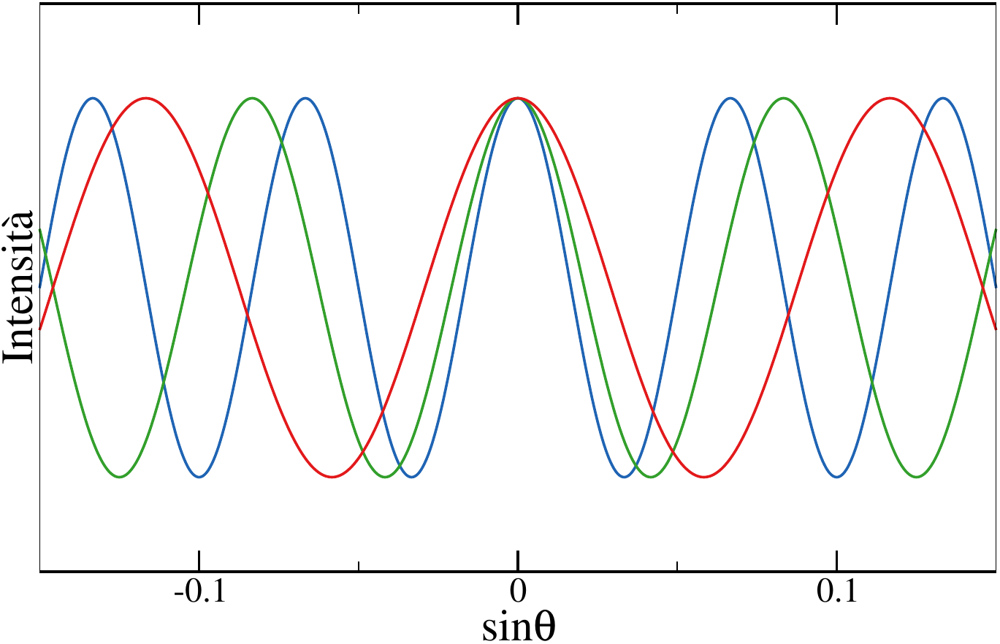
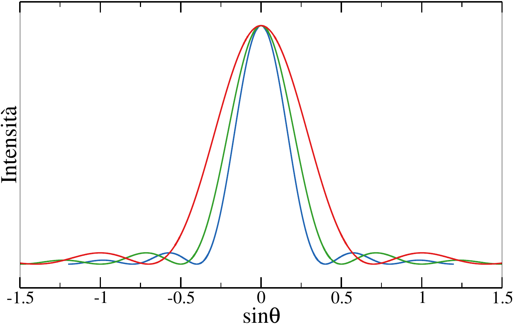
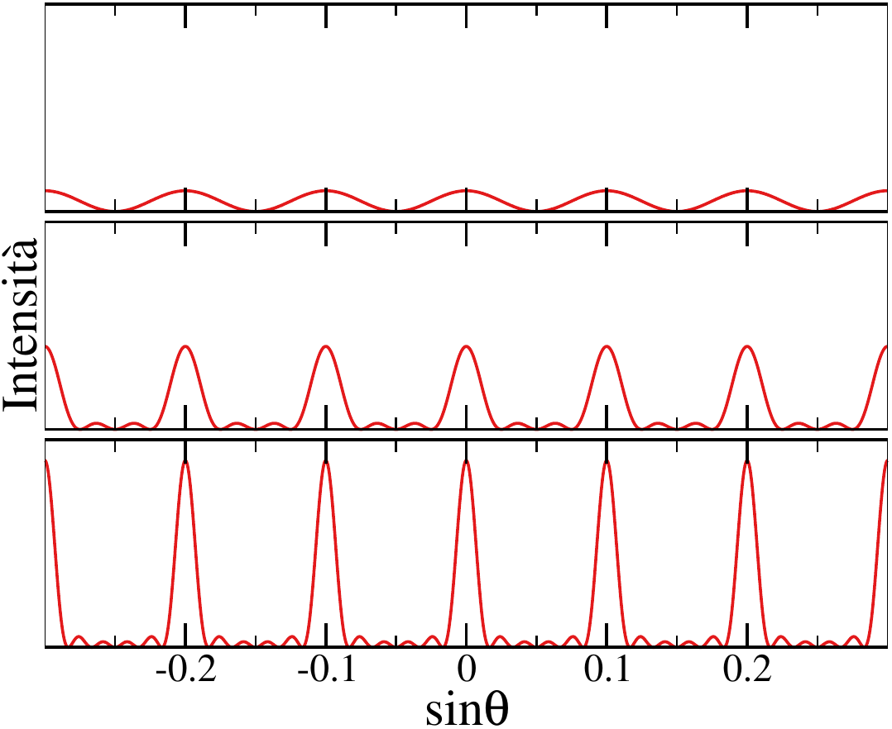
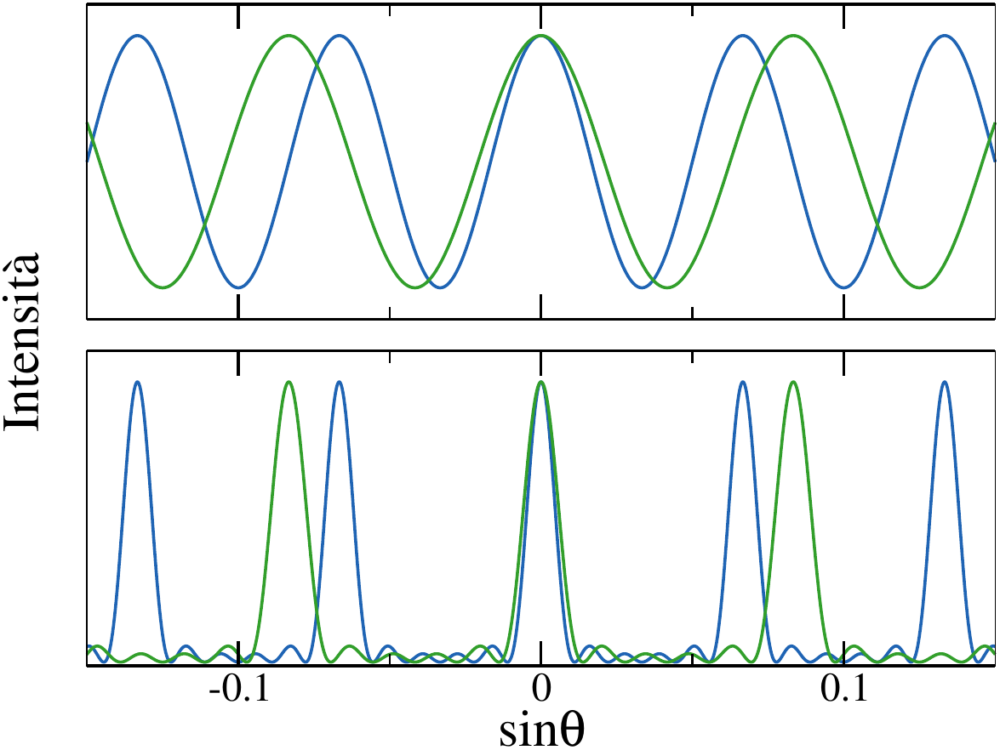

<!--
.. title: Onde
.. slug: onde
.. date: 2023-07-03 17:41:10 UTC+02:00
.. tags: 
.. category: didattica
.. link: 
.. description: 
.. type: text
.. has_math: true
-->

```{contents} Indice
:depth: 2
:backlinks: none
```

# Onde elettromagnetiche

Le onde sono fenomeni fisici comuni che appaiono in molti contesti ogniqualvolta una o più quantità fisiche si propagano nel tempo e nello spazio. In generale, sono onde quelle perturbazioni, non necessariamente periodiche, che si propagano con una velocità ben definita. Nonostante la fenomenologia diversa, tutti i tipi di onde posseggono caratteristiche generali che ne permettono una descrizione matematica unificata.

Le onde con cui abbiamo più familiarità sono quelle *meccaniche*, che richiedono un mezzo materiale per propagarsi. Esempi noti sono le onde sonore, le onde sulla superficie di un liquido oppure le onde che si ottengono facendo oscillare una corda tesa. **Nota Bene:** in tutti questi casi il trasporto non è di materia ma di energia e quantità di moto (anche se in alcuni casi, come per le onde del mare, potrebbe sembrare il contrario). [Qui](https://www.youtube.com/watch?v=LyxLxx3xifo) e [qui](https://www.youtube.com/watch?v=ElSIf2_Xmjs) alcuni video di esempio, mentre a [questo](https://phet.colorado.edu/sims/html/wave-on-a-string/latest/wave-on-a-string_it.html) link si trova una pagina per simulare onde su di una corda.

## Soluzione delle equazioni di Maxwell
<small>MNV: paragrafo 10.3</small>

Nel caso del campo elettromagnetico, abbiamo visto come le equazioni di Maxwell in assenza di sorgenti di campo (cariche e correnti) diventano estremamente simmetriche nei campi,

\begin{align}
\vec{\nabla} \cdot \vec{E} = 0 \qquad & \vec{\nabla} \times \vec{E} = -\frac{\partial \vec{B}}{\partial t}\\\\
\vec{\nabla} \cdot \vec{B} = 0 \qquad & \vec{\nabla} \times \vec{B} = \mu_0 \epsilon_0 \frac{\partial \vec{E}}{\partial t}.
\end{align}

Queste equazioni (dette omogenee) ammettono due classi di soluzioni: 

* $\vec{E} = 0$ e $\vec{B} = 0$;
* i due campi sono diversi da zero e variabili sia nel tempo che nello spazio.

Quest'ultima classe di soluzioni descrive le *onde elettromagnetiche*. Per risolvere le equazioni di Maxwell omogenee alcuni libri (tra cui il Mazzoldi-Nigro-Voci) utilizzano un procedimento un po' laborioso che riporto qui sotto, ma che noi non vedremo in dettaglio.

{}

Deriviamo una soluzione delle equazioni di Maxwell nell'ipotesi in cui i campi siano costanti (spazialmente) su di un piano ortogonale alla direzione lungo cui l'onda si propaga. Orientiamo il nostro sistema di riferimento in modo tale da avere $\hat{x}$ come direzione di propagazione, chiaramente ortogonale al piano $(y, z)$. Poiché assumiamo che i campi siano costanti lungo $y$ e $z$, le loro derivate parziali lungo queste direzioni saranno anch'esse nulle, cioè

\begin{align}
\frac{\partial E_\alpha}{\partial y} = \frac{\partial E_\alpha}{\partial z} = 0\\\\
\frac{\partial B_\alpha}{\partial y} = \frac{\partial B_\alpha}{\partial z} = 0,
\end{align}

dove $\alpha$ è una qualsiasi delle tre direzioni $x$, $y$ e $z$. In particolare si trova $\frac{\partial E_y}{\partial y} = \frac{\partial E_z}{\partial z} = 0$ (e lo stesso per il campo magnetico). Poiché entrambi i campi hanno divergenza nulla (cfr. le equazioni di Maxwell), si deve anche avere

$$
\frac{\partial E_x}{\partial x} = 0 \qquad \frac{\partial B_x}{\partial x} = 0.
$$

Possiamo ora utilizzare le altre due equazioni di Maxwell (in cui figurano i rotori dei campi). Ricordando che le derivate di $\vec{E}$  e $\vec{B}$ rispetto a $y$ e $z$ sono nulle si trova

$$
\begin{matrix}
0 = \frac{\partial B_x}{\partial t}, & \frac{\partial E_z}{\partial x} = \frac{\partial B_y}{\partial t}, & \frac{\partial E_y}{\partial x} = -\frac{\partial B_z}{\partial t}\\\\
0 = \frac{\partial E_x}{\partial t}, & \frac{\partial B_z}{\partial x} = -\epsilon_0 \mu_0  \frac{\partial E_y}{\partial t}, & \frac{\partial B_y}{\partial x} = \epsilon_0 \mu_0 \frac{\partial E_z}{\partial t}.
\end{matrix}
$$

Poiché le componenti lungo $x$ dei campi hanno derivate nulle sia rispetto al tempo che rispetto allo spazio, si trova che $E_x$ e $B_x$ devono essere *costanti*. In generale esistono situazioni in cui è presente nello spazio un campo costante e diverso da zero, per esempio il campo elettrico generato da un piano indefinito o il campo magnetico presente all'interno di un solenoide. Questi, però, sono tutti casi in cui sono presenti delle sorgenti di campo. Qui consideriamo il caso in cui le sorgenti di campo sono assenti. Ne discende che $E_x$ e $B_x$ devono essere non solo costanti ma proprio nulli.

Per risolvere questo set di equazioni consideriamo le relazioni che legano $E_y$ e $B_z$. Derivandone una rispetto al tempo e l'altra rispetto a $x$ si trova

$$
\frac{\partial^2 E_y}{\partial x^2} = -\frac{\partial^2 B_z}{\partial t \partial x} \qquad 
\frac{\partial^2 E_y}{\partial t^2} = -\frac{1}{\epsilon_0 \mu_0} \frac{\partial^2 B_z}{\partial x \partial t}
$$

e quindi le derivate secondo rispetto ad $x$ e a $t$ sono proporzionali tra di loro, cioè:

$$
\frac{\partial^2 E_y}{\partial x^2} = \epsilon_0 \mu_0 \frac{\partial^2 E_y}{\partial t^2}.
$$

Applicando lo stesso procedimento troviamo relazioni identiche per $E_z$, $B_y$ e $B_z$.

{}

Vediamone una derivazione più semplice (e anche più generale). Partendo dalla legge di Faraday in forma locale e applicando il rotore ad entrambi i membri si trova

$$
\vec{\nabla} \times (\vec{\nabla} \times \vec{E}) = -\vec{\nabla} \times \frac{\partial \vec{B}}{\partial t} = -\frac{\partial \vec{\nabla} \times \vec{B}}{\partial t}.
$$

Sostituendo la forma locale della legge di Ampère-Maxwell nel membro di destra otteniamo

$$
\vec{\nabla} \times (\vec{\nabla} \times \vec{E}) = - \mu_0 \epsilon_0 \frac{\partial ^2 \vec{E}}{\partial t^2}.
$$

Ricordando che il rotore è un prodotto vettoriale tra l'operatore nabla e un campo vettoriale, possiamo applicare una nota identità del <a href="link://slug/fisica2-esercizi-magnetostatica#il-prodotto-vettoriale">prodotto vettoriale</a>, $\vec{a} \times (\vec{b} \times \vec{c}) = (\vec{a} \cdot \vec{c}) \vec{b} - (\vec{a} \cdot \vec{b}) \vec{c}$, che nel nostro caso diventa

$$
\vec{\nabla} \times (\vec{\nabla} \times \vec{E}) = - (\vec{\nabla} \cdot \vec{\nabla}) \vec{E} = -\nabla^2 \vec{E}
$$

perché $\vec{\nabla} \cdot \vec{E} = 0$ (*cfr.* la prima equazione di Maxwell, cioè la forma locale della legge di Gauss omogenea). Uguagliando questo risultato al valore del membro di destra trovato prima si ottiene

$$
\nabla^2 \vec{E} = \mu_0 \epsilon_0 \frac{\partial ^2 \vec{E}}{\partial t^2}.
$$

Applicando lo stesso procedimento si ottiene un'identica equazione per $\vec{B}$. Ricordando che le equazioni vettoriali sono valide componente per componente, le relazioni che abbiamo trovato corrispondono alle sei equazioni differenziali seguenti:

$$
\begin{array}{lll}
\frac{\partial^2 E_x}{\partial x^2} = \mu_0 \epsilon_0 \frac{\partial ^2 E_x}{\partial t^2} & \qquad & \frac{\partial^2 B_x}{\partial x^2} = \mu_0 \epsilon_0 \frac{\partial ^2 B_x}{\partial t^2}\\\\
\frac{\partial^2 E_y}{\partial y^2} = \mu_0 \epsilon_0 \frac{\partial ^2 E_y}{\partial t^2} & & \frac{\partial^2 B_y}{\partial y^2} = \mu_0 \epsilon_0 \frac{\partial ^2 B_y}{\partial t^2}\\\\
\frac{\partial^2 E_z}{\partial z^2} = \mu_0 \epsilon_0 \frac{\partial ^2 E_z}{\partial t^2} & & \frac{\partial^2 B_z}{\partial z^2} = \mu_0 \epsilon_0 \frac{\partial ^2 B_z}{\partial t^2}
\end{array}
$$

Questo tipo di equazione differenziale è nota come *equazione di d'Alembert*, spesso scritta nella forma 

$$
\frac{\partial^2 f}{\partial x^2} = \frac{1}{v^2} \frac{\partial^2 f}{\partial t^2}
$$

dove $v$ è detta velocità di propagazione dell'onda. Nel caso specifico delle onde elettromagnetiche, $v = \frac{1}{\sqrt{\epsilon_0 \mu_0}}$, che abbiamo visto essere uguale alla velocità della luce, $c = 2.99792 \times 10^8$ m/s.

## Onde piane
<small>MNV: paragrafi 10.1, 10.2</small>

L'equazione di d'Alembert è anche detta *equazione delle onde piane* proprio perché ammette come soluzioni delle funzioni che assumono valore costante sul piano ortogonale alla direzione di propagazione, che qui scegliamo essere $\hat{x}$. Si può dimostrare infatti come l'equazione di d'Alembert sia soddisfatta solamente da funzioni del tipo

$$
f(x, t) = f(x \pm vt).
$$

Funzioni di questo tipo rappresentano fenomeni di *propagazione* lungo $x$ che avvengono a velocità $v$ (o $-v$). Consideriamo una soluzione del tipo $f(x - vt)$. Dati due valori $x_0$ e $t_0$, il valore $f(x_0, t_0)$ si ritrova per ogni coppia $t$ e $v$ per cui vale

$$
x - vt = x_0 - v t_0,
$$

relazione che può essere riscritta come

$$
x = x_0 + v (t - t_0)
$$

che esprime un moto rettilineo uniforme lungo l'asse $x$ con velocità $v$. In una dimensione, questa fenomenologia si può visualizzare graficando la funzione ad un tempo $t = t_0$ fissato. Al variare del tempo, il grafico mostra una *traslazione rigida* della funzione, che non cambia forma ma si muove uniformemente con velocità $v$.

### Onde armoniche

Casi particolari (ma fondamentali) di funzioni che soddisfano l'equazione di d'Alembert sono

$$
f(x, t) = f_0 \sin (k(x - vt)) \quad {\rm oppure} \quad f(x, t) = f_0\cos(k(x - vt))
$$

dove $f_0$ è detta *ampiezza dell'onda* e $k$ è una costante che assicura che gli argomenti delle funzioni trigonometriche abbiano la giusta dimensione (e cioè radianti). $k$ è quindi espressa in radianti per metri ed è detta *vettore d'onda* (o numero d'onda). Definendo $\omega \equiv kv$ (detta *pulsazione*), la soluzione precedenta diventa

$$
f(x, t) = f_0 \sin(kx - \omega t) \quad {\rm oppure} \quad f(x, t) = f_0\cos(kx - \omega t).
$$

Queste funzioni sono casi particolari dell'onda piana dette *onde armoniche*. Data la loro forma è chiaro come, fissando una delle due variabili, la funzione sia periodica nell'altra. A $t$ fissato la funzione si ripete identica ogniqualvolta ci si sposta di una distanza $\Delta x$ tale per cui $k\Delta x$ è un multiplo di $2\pi$. La funzione ha quindi periodicità spaziale data da

$$
\lambda = \frac{2 \pi}{k},
$$

detta *lunghezza d'onda*.

Con lo stesso ragionamento troviamo che la periodicità temporale dell'onda è data da

$$
T = \frac{2 \pi}{\omega}
$$

detta *periodo* dell'onda.

È chiaro quindi che la velocità di propagazione, e le periodicità spaziale e temporale non sono indipendenti ma legate da relazioni precise. Ad esempio si ha anche che $\lambda = v T = v / \nu$, dove $\nu$ è la *frequenza* dell'onda.

Da un punto di vista fisico si trova che $T$ (e quindi le quantità associate $\omega$ e $\nu$) dipende unicamente dalle sorgenti del campo, mentre $\lambda$ (e quindi $k$) dipende dal mezzo in cui l'onda si propaga.

Diamo ora altre definizioni utili:

* è definita *fase* dell'onda l'argomento della funzione, $\phi \equiv kx - \omega t$.
* Tutti i punti dello spazio aventi, in un certo istante, la stessa fase sono detti *fronte d'onda*. Nel caso di un'onda piana il fronte d'onda è, per l'appunto, un piano. La funzione che rappresenta l'onda prende lo stesso valore su tutto il fronte d'onda. Poiché la funzione è periodica, la stessa situazione si ripete a distanze multiple di $\lambda$: il fronte d'onda, come del resto l'onda in generale, si muove lungo la direzione di propagazione con velocità $v$.

Questi concetti si generalizzano anche in presenza di onde non piane. In particolare, il fronte d'onda è sempre definito come il luogo dei punti per i quali, in un certo istante, la fase dell'onda è costante.

### Onde elettromagnetiche piane

Abbiamo visto come, per le onde elettromagnetiche, le equazioni alla base del fenomeno sono del tipo

$$
\frac{\partial^2 E_y}{\partial x^2} = \frac{1}{c^2} \frac{\partial^2 E_y}{\partial t^2}.
$$

Abbiamo quattro di queste equazioni, due per il campo elettrico e due per il campo magnetico (lungo $y$ e lungo $z$). Ipotizzando di avere a che fare con onde armoniche, i risultati ottenuti nel paragrafo precedente si possono generalizzare al caso multidimensionale, e le soluzioni diventano:

\begin{align}
\vec{E} & = E_y \hat{y} + E_z \hat{z} = E_{y,0} \cos(kx - \omega t) \hat{y} + E_{z,0} \cos(kx - \omega t) \hat{z}\\\\
\vec{B} & = B_y \hat{y} + B_z \hat{z} = B_{y,0} \cos(kx - \omega t) \hat{y} + B_{z,0} \cos(kx - \omega t) \hat{z}.
\end{align}

Ricordiamo però che le due soluzioni sono connesse dalle equazioni di Maxwell, e quindi le ampiezze non possono essere tutte indipendenti. Ad esempio utilizzando la relazione $\frac{\partial E_z}{\partial x} = \frac{\partial B_y}{\partial t}$ si trova

$$
-k E_{z,0} \sin(kx - \omega t) = \omega B_{y,0} \sin(kx - \omega t)
$$

e quindi

$$
B_{y,0} = -\frac{E_{z,0}}{c}.
$$

Alla stessa maniera si ottiene

$$
B_{z,0} = \frac{E_{y,0}}{c}.
$$

È chiaro quindi che i due campi sono indissolubilmente legati l'un l'altro. Proprio in virtù di questo legame possiamo esprimere le quantità di interesse in funzione del campo elettrico. Ad esempio,

$$
B^2 = B_y^2 + B_z^2 = \frac{E_y^2}{c^2} + \frac{E_z^2}{c^2} = \frac{E^2}{c^2}
$$

e quindi

$$
B = \frac{E}{c},
$$

ed inoltre

$$
\vec{E} \cdot \vec{B} = E_y B_y + E_z B_z = -\frac{E_y E_z}{c} + \frac{E_z E_y}{c} = 0.
$$

Quest'ultima relazione ci dice che i due campi sono sempre *ortogonali* fra di loro. In ultimo,

$$
\vec{E} \times \vec{B} = \frac{1}{c} (E^2_y + E^2_z) \hat{x} = \frac{E^2}{c} \hat{x} = c B^2 \hat{x} = EB \hat{x}.
$$

Il prodotto vettoriale tra i due campi dà quindi la direzione di propagazione dell'onda elettromagnetica.

Tutte queste proprietà delle onde (dalla relazione tra le componenti alla direzione di propagazione) sono valide anche quando le onde non sono armoniche. [Qui](https://www.youtube.com/watch?v=Oo8XMxXY32g) un video di esempio che mostra un'animazione.

# Energia e quantità di moto di un'onda
<small>MNV: paragrafo 10.4, 10.5</small>

Abbiamo visto come sia possibile associare un'energia alla presenza di campi, sia magnetici che elettrici, in una regione di spazio. Considerando la relazione che lega i moduli dei campi, in questo caso la densità di energia vale

$$
u = \frac{1}{2} \epsilon_0 E^2 + \frac{1}{2\mu_0} B^2 = \frac{1}{2} \epsilon_0 E^2 + \frac{1}{2\mu_0} \frac{E^2}{c^2} = \epsilon_0 E^2
$$

Consideriamo ora una superficie $\Sigma$ perpendicolare alla direzione di propagazione dell'onda, data da $\vec{E} \times \vec{B}$. Nel tempo $dt$ il *flusso di energia* attraverso $\Sigma$ è dato dalla densità di energia per il volume del solido avente base $\Sigma$ e altezza $cdt$, cioè:

$$
dU = u \Sigma c dt = \epsilon_0 E^2 \Sigma c dt.
$$

La potenza che attraversa la superficie è quindi

$$
\mathcal{P} = \frac{dU}{dt} = \epsilon_0 E^2 \Sigma c
$$

che, mediata su un periodo, vale

$$
\mathcal{P}_m = \epsilon_0 \Sigma c E_0^2\frac{1}{T} \int_0^T \cos^2(kx - \omega t) dt = \frac{1}{2} \epsilon_0 c \Sigma E_0^2.
$$

Da questa quantità possiamo definire l'*intensità dell'onda* dell'onda come la potenza media sulla superficie:

$$
I \equiv \frac{\mathcal{P}_m}{\Sigma} = \frac{1}{2} \epsilon_0 c E_0^2
$$

Un'onda non possiede solo un'energia intrinseca, ma anche una quantità di moto. Questo fa sì che, come per i corpi dotati di massa che collidono, le onde che urtano degli ostacoli trasferiscano (parzialmente o totalmente) questa quantità di moto ad altri corpi. Questo scambio di quantità di moto è detto *pressione di radiazione*:

* nel caso di assorbimento completo *tutta* la quantità di moto viene ceduta all'oggetto colpito. In questo caso si ha $P_{\rm rad} = \frac{I}{c} = \frac{1}{2} \epsilon_0 E_0^2$.
* Se l'oggetto colpito ha la proprietà di riflettere completamente l'onda, questa dopo l'urto si propagherà in direzione $-\hat{x}$, e quindi l'impulso trasferito al corpo sarà doppio rispetto a prima. In questo caso la pressione di radiazione varrà quindi $P_{\rm rad} = \epsilon_0 E_0^2$.

Un'interessante applicazione di questa proprietà delle onde elettromagnetiche sono le cosiddette *pinzette ottiche* (*optical tweezers* in inglese), il cui sviluppo da parte di Arthur Ashkin è stato premiato nel 2018 con il Nobel per la fisica. Questa tecnologia utilizza fasci laser per intrappolare ed eventualmente spostare a piacere piccoli oggetti microscopici quali particelle colloidali, batteri e cellule. Se siete curiosi seguite i link per vedere come [piccole sfere micrometriche](https://www.youtube.com/watch?v=ju6wENPtXu8) o [globuli rossi](https://www.youtube.com/watch?v=mBE6xboXeHM) possono essere manipolati e spostati a piacere.

A [questa](https://phet.colorado.edu/sims/cheerpj/optical-tweezers/latest/optical-tweezers.html?simulation=optical-tweezers&locale=it) è anche possibile simulare un esperimento eseguito con pinzette ottiche. Attenzione, le opzioni sono tante!

## Spettro delle onde elettromagnetiche
<small>MNV: paragrafo 10.8</small>

Le onde elettromagnetiche possono avere frequenze in intervallo di valori molto ampio, che va da $10^2$ Hz fino a $10^{18}$ Hz. Questo *spettro* di frequenze è stato storicamente suddiviso in *bande*, mostrate in figura:


### Onde hertziane o radio,$(10^2 \leq \nu \leq 10^9)$ Hz, $(3 \times 10^6 \geq \lambda \geq 0.3)$ m

Queste onde sono utilizzate nelle trasmissioni radiofoniche e televisive

### Microonde, $(10^9 \leq \nu \leq 10^{11})$ Hz, $(3 \times 0.3 \geq \lambda \geq 3 \times 10^{-3})$ m

Queste onde sono utilizzate per telecomunicazioni (ad esempio i telefoni cellulari), per le connessioni WiFi, per i sistemi radar. Nei forni a microonde viene utilizzato il fatto che  molte molecole (come l'acqua) possono essere eccitate vibrazionalmente a queste frequenze.

### Infrarosso, $(3 \times 10^{11} \leq \nu \leq 3.8 \times 10^{14})$ Hz, $(10^{-3} \geq \lambda \geq 0.78 \times 10^{-6})$ m

Gli infrarossi vengono prodotti da corpi caldi. Similmente, le onde infrarosse possono essere utilizzate per scaldare. Sono anche utilizzate per fare spettroscopia.

### Visibile, $(3.8 \times 10^{14} \leq \nu \leq 7.9 \times 10^{14})$ Hz, $(0.78 \times 10^{-6} \geq \lambda \geq 0.38 \times 10^{-6})$ m

È detta luce visibile quell'insieme di onde a cui l'occhio umano è sensibile. L'intervallo di frequenze del visibile coincide approssimativamente con la parte dello spettro della radiazione solare più intensa.

### Ultravioletto, $(7.9 \times 10^{14} \leq \nu \leq 5 \times 10^{17})$ Hz, $(0.38 \times 10^{-6} \geq \lambda \geq 6 \times 10^{-10})$ m

Lo spettro solare contiene anche molte frequenze ultraviolette. Sulla terra, una gran parte dell'intensità di queste onde viene assorbita dall'atmosfera nel processo che porta alla formazione dell'ozono.

### Raggi X, $(5 \times 10^{17} \leq \nu \leq 5 \times 10^{19})$ Hz, $(6 \times 10^{-10} \geq \lambda \geq 6 \times 10^{-12})$ m

Queste onde, molto energetiche, sono legate alla decelerazioni di elettroni di alta energia. Sono utilizzati, ad esempio, per indagini radiografiche, poiché diversi tessuti assorbono i raggi X in maniera differente.

### Raggi $\gamma$, $(\nu \geq 3 \times 10^{18})$ Hz, $(\lambda \leq 10^{-10})$ m

I raggi $\gamma$ sono legati a processi nucleari (decadimenti radioattivi o reazioni tra i nuclei) e possono danneggiare rapidamente gli organismi viventi. Se utilizzati in maniera controllata trovano applicazioni in terapie antitumorali.

Come si vede, la suddivisione non è ben definita e ci sono alcune sovrapposizioni tra l'una e l'altra banda.

# La luce e l'indice di rifrazione

<small>MNV: paragrafo 11.1</small>

Quando un'onda passa da un mezzo all'altro si osservano, in generale, due fenomeni:

* parte dell'onda viene *riflessa*: si propaga all'indietro all'interno del primo mezzo;
* parte dell'onda viene *rifratta*: si propaga nel secondo mezzo con una direzione diversa da quella incidente.

Sebbene questi fenomeni avvengano per qualunque tipo di onda elettromagnetica, ci occuperemo in particolare della luce, cioè di quelle onde che hanno frequenze nello spettro del visibile ($(3.8 \times 10^{14} \leq \nu \leq 7.9 \times 10^{14})$ Hz, $(0.78 \times 10^{-6} \geq \lambda \geq 0.38 \times 10^{-6})$ m).

La luce si propaga con velocità $c$ nel vuoto e con velocità $v < c$ in un mezzo. In generale, $v$ dipende dalla proprietà fisiche del mezzo. Si definisce *indice di rifrazione* del mezzo la quantità

$$
n = \frac{c}{v}.
$$

Data la definizione è chiaro che $n \geq 1$, dove l'uguaglianza vale solamente nel vuoto. Il motivo fisico per cui $v < c$ in un mezzo è che gli elettroni del materiale di cui è composto risentono del campo elettrico dell'onda e cominciano ad oscillare con pulsazione $\omega$. Questo moto elettronico genera un altro campo elettrico che si somma a quello dell'onda. Ne risulta un campo totale che si propaga con velocità $v < c$.

Valori comuni dell'indice di rifrazione sono $\approx 1$ per molti gas, $1.33$ per l'acqua, tra $1.5$ e $2$ per il vetro.

## Riflessione e rifrazione

<small>MNV: paragrafo 11.3</small>

Consideriamo un'onda armonica caratterizzata da una frequenza $\nu$, da una pulsazione $\omega$, da una lunghezza d'onda $\lambda$ e da un vettore d'onda $k$. Nell'attraversare una superficie che separa il vuoto da un mezzo abbiamo visto che la velocità di propagazione varia, in questo caso da $c$ a $v$. Studiando i meccanismi microscopici si vede che $\nu$ e $\omega$ restano costanti, mentre $\lambda$ (e quindi $k$) variano. Si ha infatti

$$
\lambda_0 \nu = c, \qquad \lambda \nu = v
$$

e quindi

$$
\lambda = \lambda_0 \frac{v}{c} = \frac{\lambda_0}{n}
$$

o, equivalentemente, 

$$
k = n k_0,
$$

dove $n$ è l'indice di rifrazione del mezzo. Poiché $n > 1$, $\lambda < \lambda_0$.

Vediamo ora cosa succede nel caso generale in cui un'onda attraversi la superficie che separa due mezzi trasparenti. In questo caso i due mezzi hanno indici di rifrazione $n_1$ ed $n_2$ e le velocità al loro interno valgono $v_1 = c / n_1$ e $v_2 = c / n_2$.

Alcune definizioni:

* i vettori $\vec{k}_i$, $\vec{k}_r$ e $\vec{k}_t$ indicano la direzione e il verso delle onde incidente, riflessa e rifratta (o trasmessa). Il loro modulo è il vettore d'onda specificato sopra. 
* $\theta_i$, $\theta_r$ e $\theta_t$ sono gli angoli che $\vec{k}_i$, $\vec{k}_r$ e $\vec{k}_t$ formano con la normale alla superficie.
* Il *piano di incidenza* è il piano formato da $\vec{k}_i$ e dalla normale alla superficie.
* Consideriamo superfici *speculari*, cioè tali per cui raggi che erano paralleli prima della riflessione lo sono anche dopo. Superfici *scabre* danno invece luogo ad onde riflesse non parallele: la luce riflessa è, in questo caso, *diffusa*.

Disegniamo ora cosa succede al fronte di un'onda che colpisca la superficie:


La prima figura ci permette di disegnare la seconda. Ricordiamo che il fronte d'onda si muove con la stessa velocità dell'onda, che vale $v_1$ in alto e $v_2$ in basso. Prima di tutto, si osserva sperimentalmente che i vettori $\vec{k}_i$, $\vec{k}_r$ e $\vec{k}_t$ giacciono tutti sul piano di incidenza.

Quando il raggio di sinistra colpisce la superficie, quello di destra si trova in B, quindi quando il raggio di destra colpisce la superficie in C, il raggio riflesso da sinistra deve aver percorso una distanza AD pari a BC, perché i due raggi hanno la stessa velocità $v_1$. Quindi si può notare subito come i triangoli ACD e ACB siano uguali perché hanno uguali due lati (condividono il lato AC e i lati AD e CB sono uguali) ed un angolo (poiché sono triangoli retti). Ne deriva che anche gli altri due angoli sono uguali. Poiché i due angoli più acuti dei triangoli sono quelli di incidenza e di riflessione, si trova $\theta_i = \theta_r$.

Consideriamo ora i triangoli ACB e ACE. Prima di tutto, sono entrambi triangoli retti. Inoltre, hanno in comune il cateto AC. Infine, la distanza AE è quella percorsa dal raggio trasmesso nel tempo $\Delta t$ in cui i raggi nel primo mezzo hanno percorso AD e BC. Vale quindi 

$$
{\rm BC} = {\rm AC} \sin\theta_i = v_1 \Delta t = \frac{c \Delta t}{n_1}
$$

e 

$$
{\rm AE} = {\rm AC} \sin\theta_t = v_2 \Delta t =  \frac{c \Delta t}{n_2}.
$$

Da queste relazioni si ricava

$$
\frac{\sin\theta_i}{\sin\theta_t}= \frac{n_2}{n_1},
$$

cioè

$$
n_1 \sin\theta_i = n_2 \sin\theta_t.
$$

Questa equazione è nota come *legge di Snell*. Alcune implicazioni di questa legge:

* Se l'onda incide perpendicolarmente ($\theta_i = 0$), non vi è alcuna rifrazione ($\sin \theta_t = n_1 / n_2 \sin \theta_i = 0$).
* Se $n_2 > n_1$ allora $\theta_t < \theta_i$.
* Se $n_1 > n_2$ allora $\theta_t > \theta_i$.

Quest'ultima situazione presenta un caso limite: poiché $\sin\theta_t = \frac{n_1}{n_2} \sin\theta_i$, esiste un angolo $\theta_i = \theta_0 < \pi / 2$ per cui $\theta_t = \pi / 2$. Per valori $\theta_i > \theta_0$, l'applicazione della legge di Snell porta all'equazione

$$
\sin\theta_t = \frac{n_1}{n_2} \sin\theta_i > 1,
$$

che non ha soluzioni reali! Fisicamente questo significa che non c'è più un'onda rifratta: l'onda incidente viene riflessa completamente all'interno del primo mezzo. Questo fenomeno è detto *riflessione totale* ed avviene quando l'angolo di incidenza è maggiore dell'*angolo limite* $\theta_0$, il cui valore è determinato solamente dal rapporto tra gli indici di rifrazione:

$$
\sin\theta_0 = \frac{n_2}{n_1}.
$$

Si può fare facilmente esperienza di questo fenomeno immergendosi nell'acqua ($n \approx 1.33$) e restando ad una distanza piccola dalla superficie con l'aria ($n \approx 1$): oltre una certa distanza l'acqua sembra riflettere come uno specchio!

Dal punto di vista applicativo, questo fenomeno è molto utilizzato, ad esempio nelle fibre ottiche: un raggio di luce che penetra con un angolo maggiore di quello limite rispetto alle superfici laterali attraverso la base di un lungo e sottile cilindro di vetro (o altro materiale trasparente). Il raggio viene continuamente (e totalmente) riflesso dalle superfici laterali e rimane quindi all'interno di questa *guida di luce*. L'effetto è presente anche se le guide non sono rettilinee (purché l'angolo formato non faccia sì che il fascio di luce incontri la superficie con un angolo minore di $\theta_0$). Le fibre ottiche trovano applicazioni in tanti campi, dalla medicina (*endoscopie*) alle telecomunicazioni.

Un esperimento che mostra la riflessione totale è visibile [qui](https://www.youtube.com/watch?v=NAaHPRsveJk), mentre un interessante esempio di effetto dovuto alla rifrazione è quello che si vede in [questo video](https://www.youtube.com/watch?v=9n362snGUdw), che si può riprodurre facilmente anche a casa.

## Dispersione della luce

Il discorso sulla riflessione e rifrazione di un raggio di luce appena fatto vale strettamente solo nel caso di raggi *monocromatici*, cioè composti da onde aventi tutte la stessa lunghezza d'onda. D'altro canto, se la luce incidente è composta da uno *spettro* di onde, si osserva come l'angolo $\theta_t$ sia diverso per ogni componente del raggio. Sperimentalmente si trova infatti che l'indice di rifrazione dipende dalla lunghezza d'onda della luce incidente. Si trova cioè che $n = n(\lambda)$. Nello spettro visibile questa dipendenza è, in generale, non fortissima ma facilmente osservabile dal punto di vista sperimentale e monotona: $n$ diminuisce all'aumentare della lunghezza d'onda. L'effetto principale di questa dipendenza è che le componenti nel violetto vengono deviate maggiormente rispetto a quelle nel rosso.

Questo effetto può essere utilizzato per calcolare la dipendenza dalla lunghezza d'onda dell'indice di rifrazione. Storicamente, questo è stato fatto con un dispositivo detto *prisma*. Il prisma è una lastra di materiale trasparente a facce piane non parallele, disposte in maniera da formare un angolo $\alpha$ detto angolo di apertura. L'effetto che si ottiene quando il prisma viene attraversato da un raggio di luce bianca (cioè contenente tutte le lunghezze d'onda visibili) è simile a quello di questa celebre figura:


La dispersione che si osserva, come detto, è dovuta al fatto che $n$ dipende dalla lunghezza d'onda incidente. Misurando con precisione gli angoli e applicando la legge di Snell è possibile ottenere la funzione $n(\lambda)$ per il materiale di cui è composto il prisma.

## Onde elettromagnetiche sferiche

<small>MNV: parte finale del paragrafo 10.4</small>

Consideriamo una sorgente puntiforme (cioè di dimensioni molto piccole) che emetta onde elettromagnetiche armoniche in tutte le direzioni. Per simmetria il campo a distanza $r$ deve avere espressione

$$
E(r, t) = E_0(r ) \cos(kr - \omega t).
$$

Si parla in questo caso di onda *sferica*, perché per $t$ costante i fronti d'onda, cioè il luogo dei punti in qui la fase è costante, sono sfere. A [questa](https://phet.colorado.edu/sims/html/waves-intro/latest/waves-intro_it.html) pagina si può simulare una sorgente di onde sferiche, elettromagnetiche e non.

La potenza media che attraversa una superficie sferica di raggio $r$ sarà data dall'intensità dell'onda $I(r )$ per la superficie della sfera, $4 \pi r^2$, e quindi

$$
\mathcal{P}_m(r ) = I(r ) 4 \pi r^2 = \frac{1}{2} c \epsilon_0 E_0^2(r ) 4 \pi r^2.
$$

D'altronde, questa quantità deve essere costante indipendentemente da $r$, poiché corrisponde alla potenza media emessa dalla sorgente. Ne deriva quindi che $E_0(r )^2 r^2$ deve essere costante, e cioè che

$$
E_0(r ) = \frac{E_0}{r}.
$$

Per le onde elettromagnetiche sferiche si ha quindi

\begin{align}
E(r, t) & = \frac{E_0}{r} \cos(kr - \omega t)\\\\
B(r, t) & = \frac{E_0}{cr} \cos(kr - \omega t)
\end{align}

# Interferenza

<small>MNV: paragrafo 13.1</small>

I fenomeni di interferenza avvengono quando due onde (di qualsiasi natura, non solo elettromagnetica) si sovrappongono nello spazio. A [questo](https://phet.colorado.edu/sims/html/wave-interference/latest/wave-interference_it.html) link si può eseguire una simulazione di interferenza tra onde meccaniche. Esempi reale di interferenza si possono osservare [qui](https://www.youtube.com/watch?v=BddgVHiAZF4) e [qui](https://www.youtube.com/watch?v=nTvvVlxLmqM).

Definiamo prima di tutto le condizioni per le quali l'interfenza può avvenire. Consideriamo due onde armoniche sferiche aventi stessa frequenza (e quindi stessa lunghezza d'onda). Queste sono generate da due sorgenti distinte $S_1$ ed $S_2$. Consideriamo ora i campi elettrici nel punto $P$ distante $r_1$ da $S_1$ ed $r_2$ da $S_2$:

$$
E_1 = \frac{E_0}{r_1} \cos(kr_1 - \omega t + \phi_1), \quad E_2 = \frac{E_0}{r_2} \cos(kr_2 - \omega t + \phi_2),
$$

dove $\phi_1$ e $\phi_2$ sono caratteristiche delle sorgenti. La differenza tra gli argomenti dei coseni è chiamata *differenza di fase* in P e vale

$$
\delta = (kr_2 - \omega t + \phi_2) - (kr_1 - \omega t + \phi_1) = k(r_2 - r_1) + (\phi_2 - \phi_1).
$$

La differenza di fase così espressa consta di due termini:

* una *differenza di fase intrinseca* $\Delta \phi \equiv \phi_2 - \phi_1$
* una differenza di fase dovuta alla distanza di P dalle due sorgenti, $k(r_2 - r_1)$

Se $\delta$ è costante nel tempo, la sorgenti di luce sono dette *coerenti*. È evidente dalla relazione precedente che, fissato P, due sorgenti sono coerenti se e solo se $\Delta \phi$ è costante nel tempo (almeno per il tempo necessario per osservare i fenomeni di interesse). Le due sorgenti sono dette *sincrone* se $\Delta \phi = 0$. 

L'interferenza propriamente detta si può osservare solamente quando le onde che si sovrappongono vengono emesse da sorgenti di luce coerenti.

## L'esperimento di Young

<small>MNV: parte del paragrafo 13.2</small>

Young è stato il primo a produrre l'interferenza di due onde luminose, nel 1801. L'apparato con cui ha effettuato l'esperimento è formato da una sorgente di luce monocromatica posta ad una grande distanza da una parete opaca contenente una fessura molto stretta, $S_0$. Quando la luce colpisce la parete, la grande distanza dalla sorgente fa sì che l'onda possa essere considerata piana. Per effetto della diffrazione (che vedremo dopo), l'onda si propaga in tutte le direzioni prima di colpire una seconda parete su cui sono poste due ulteriori fessure molto sottili, $S_1$ ed $S_2$, poste a distanza $d$ l'una dall'altra. Qui la luce ancora una volta viene diffratta, ma stavolta da due fenditure, che si comportano come sorgenti sincrone (e quindi coerenti). Infine, a grande distanza (grande rispetto a $d$) viene posto uno schermo su cui appare un *pattern di interferenza* (o *figura di interferenza*) che consiste in una serie di strisce chiare e scure dette *frange di interferenza*. Le frange chiare corrispondono a massimi dell'intensità dell'onda (e quindi del campo), mentre quelle scure corrispondono a dei minimi.

Il fenomeno si può formalizzare calcolando come varia l'intensità del campo sullo schermo al variare della differenza di distanza percorsa dalle due onde per raggiungere un punto $P$ dello schermo, $r_2 - r_1$. Come abbiamo visto prima, questa è legata alla differenza di fase tra le due onde, definita come $\delta = k(r_2 - r_1)$, che può essere riscritta in funzione di un angolo $\theta$ come

$$
\delta = k d \sin \theta = \frac{2 \pi d}{\lambda} \sin \theta
$$

dove abbiamo utilizzato il rapporto che lega il vettore d'onda alla lunghezza d'onda. Si trova come l'intensità del campo sullo schermo ha andamento 

$$
I(\theta) = 4 I_0 \cos^2 \left( \frac{\pi d \sin\theta}{\lambda} \right),
$$

dove $I_0$ è l'intensità che si produrrebbe se ci fosse un'unica sorgente. È chiaro che questa funzione è massima quando 

$$
\frac{\pi d \sin\theta}{\lambda} = m \pi,
$$

cioè

$$
d \sin \theta = m \lambda
$$

dove $m$ è un qualunque intero. Quindi se la differenza di percorso tra le due onde è un *multiplo* della lunghezza d'onda, i campi elettrici sullo schermo hanno la stessa fase e quindi si sommano, dando luogo ad un'interferenza detta *costruttiva*. D'altronde, se si ha

$$
d \sin \theta = \left( m + \frac{1}{2} \right) \lambda
$$

i campi hanno fase *opposta* e quindi danno luogo ad un'interferenza distruttiva: l'intensità si annulla completamente. Per valori intermedi l'intensità varia come il coseno al quadrato, prendendo valori intermedi tra 0 e $4 I_0$. Ecco un esempio per $d / \lambda \approx 8.6$:


Se $L$ è la distanza tra le fenditure e lo schermo e definiamo $x$ come la distanza del punto $P$ dal centro dello schermo, se consideriamo solo valori di $\theta$ piccoli e siamo nella condizione $L \gg d$, si può scrivere $\sin \theta \approx \tan \theta$ e quindi 

$$
\sin \theta \approx \frac{x}{L}
$$

per cui l'intensità in funzione della distanza dal centro dello schermo (che è la quantità che si misura negli esperimenti) è data da

$$
I(x) = 4 I_0 \cos^2 \left( \frac{\pi d}{\lambda} \frac{x}{L} \right).
$$

Sulla periodicità di questa funzione si possono fare le stesse considerazioni fatte prima (l'intensità è massima quando $x = m \lambda L / d$ e minima quando $x = (2m + 1) \lambda L / 2d$).

È chiaro che variando la lunghezza d'onda vari anche il pattern di interferenza. In particolare, più la lunghezza d'onda è minore, più i picchi si avvicinano. Ecco un esempio con tre lunghezze d'onda differenti ($400$ nm, $500$ nm e $700$ nm) in un sistema con $d = 6000$ nm:



Questo fenomeno è comune a tutti i tipi di onda, ed è forse capitato ad alcuni di osservare fenomeni di interferenza con le onde superficiali di un lago o del mare.

## Interferenza da lamine sottili

<small>MNV: parte del paragrafo 13.3</small>

Uno dei fenomeni di interferenza più facili da osservare è la cosiddetta *interferenza da lamine sottili* (*thin-film interference* in inglese), che si verifica quando la luce (di solito solare) si riflette sulle due superfici di sottili strati di materiale trasparente come olio, sapone o acqua. L'effetto iridescente che si può osservare è dovuto a un fenomeno di interferenza analogo a quello dell'esperimento di Young.

Semplifichiamo il fenomeno considerando una lamina sottile (di spessore $d$) di un materiale con indice di rifrazione $n$ immersa in aria ($n_{\rm aria} \approx 1$). Consideriamo un raggio di luce incidente con angolo $\theta_i$. Parte dell'intensità verrà riflessa dal primo strato. Parte dell' onda che viene trasmessa verrà rifratta e poi riflessa dalla seconda superficie. Una volta raggiunta la prima superficie, parte di quest'onda verrà nuovamente rifratta e rientrerà nel primo mezzo (aria) parallelamente all'onda riflessa inizialmente. Queste due onde riflesse contengono la maggior parte dell'intensità dell'onda iniziale, e quindi possiamo ignorare i contributi dati dai raggi generati da riflessioni e rifrazioni ulteriori. 

In queste condizioni i due punti da cui hanno origine le due onde riflesse possono essere considerate sorgenti coerenti, in quanto prodotte dalla stessa sorgente (il raggio di luce incidente). Calcoliamo ora la differenza di fase $\delta$ tra le due onde, che può essere vista come la somma di due contributi: uno dovuto alla differenza di cammino delle due onde, che calcoleremo, e l'altro dovuto al fatto che la prima onda riflessa viene sfasata di $\pi$. Infatti, un risultato noto (che non dimostreremo) che si trova a partire dalle equazioni di Maxwell afferma come un'onda che viene riflessa da una superficie appartenente ad un mezzo avente indice di rifrazione maggiore di quello in cui l'onda si propaga riceve uno sfasamento di $\pi$. In altre parole, il verso del campo elettrico dopo la riflessione si inverte. Nel caso opposto, quando cioè un'onda viene riflessa da una superficie appartenente ad un mezzo avente indice di rifrazione minore, non si osserva alcuno sfasamento. 

Utilizzando la nomenclatura introdotta per l'esperimento di Young, troviamo come lo spazio percorso dall'onda rifratta all'interno della lamina sia

$$
r_2 = \frac{2d}{\cos \theta_t}
$$

e quindi la differenza di fase dovuta alla percorrenza di questa distanza è

$$
\delta_2 = k_t r_2 = \frac{2 knd}{\cos \theta_t}.
$$

D'altro canto, l'onda riflessa inizialmente compie un percorso 

$$
r_1 = h \sin \theta_i,
$$

dove $h$ è la distanza tra i punti dove i due raggi toccano la superficie superiore e può essere scritta in funzione di $\theta_t$ come

$$
h = r_2 \sin \theta_t
$$

e quindi si trova

$$
r_1 = \frac{2d \sin \theta_t}{\cos \theta_t} \sin \theta_i.
$$

Utilizzando la legge di Snell, per cui $\sin \theta_i = n \sin \theta_t$, si trova

$$
r_1 = \frac{2dn}{\cos \theta_t} \sin^2 \theta_t.
$$

e quindi la differenza di fase dovuta a questo percorso è

$$
\delta_1 = k r_1 = \frac{2knd}{\cos \theta_t} \sin^2 \theta_t.
$$

La differenza di fase totale è quindi

$$
\delta = \delta_2 - \delta_1 - \pi = 2 k n d \cos \theta_t - \pi
$$

che, nel caso in cui $\theta_i$, sia molto piccolo, diventa

$$
\delta = 2 k n d - \pi = \frac{4 \pi n d}{\lambda} - \pi.
$$

Similmente al caso di Young, si ottiene il massimo di intensità quando, se $m$ è un qualsiasi numero intero, $\delta = 2 m \pi$ (cioè $d = \frac{\lambda (2m + 1)}{4n}$), mentre la condizione $\delta = (2m + 1) \pi$ (cioè $d = \frac{\lambda m}{2n}$) è legata ai minimi di intensità. Questo significa che, a parità di $d$, alcune lunghezze d'onda saranno più visibili di altre. Questo fa sì che sulla superficie si generi un effetto iridescente, come quello che si osserva, ad esempio, sulle bolle di sapone:


In [questo video](https://www.youtube.com/watch?v=WTxDyYHaYAI) potete vedere diversi esempi.

# Diffrazione

<small>MNV: paragrafo 14.1</small>

La diffrazione è un caso particolare di interferenza per cui un'onda interferisce con se stessa dopo essere passata per strette fenditure oppure aver incontrato ostacoli di dimensioni comparabili con la sua lunghezza d'onda. Consideriamo un'onda che incontri un ostacolo opaco avente un bordo netto. Uno schermo posto oltre l'ostacolo mostrerà una *figura di diffrazione* formata da frange chiare e scure che si fanno via via più strette. È interessante notare che l'intensità luminosa che appare sulla parte di schermo posta dietro all'ostacolo non è nulla come avverrebbe se le onde si propagassero esclusivamente in linea retta. La diffrazione infatti, come l'interferenza, è un fenomeno legato alla natura *ondulatoria* della luce.

[Qui un filmato](https://www.youtube.com/watch?v=9D8cPrEAGyc) che mostra alcuni esempi di diffrazione.

Il comportamento dell'onda, e la figura di diffrazione che ne risulta, possono essere analizzati utilizzando il principio di Huygens-Fresnel.

## Principio di Huygens-Fresnel (cenni)

<small>MNV: paragrafo 11.2</small>

Il principio di Huygens-Fresnel afferma che tutti i punti che compongono un dato fronte d'onda possono essere considerati sorgenti puntiformi di onde sferiche secondarie aventi frequenza, lunghezza d'onda e velocità di propagazione uguali a quelle dell'onda primaria. La posizione del fronte d'onda dopo un tempo $\Delta t$ è data dalla superficie tangente a queste onde secondarie.

Questo principio serve a prevedere la posizione del fronte d'onda nel caso in cui siano presenti ostacoli o fenditure lungo la direzione di propagazione. Ecco un esempio grafico:


## Diffrazione di Fraunhofer

<small>MNV: paragrafo 14.2</small>

Esistono diversi modi con cui i fenomeni di diffrazione possono essere prodotti. Qui ci concentreremo sulla *diffrazione di Fraunhofer*, in cui sia la sorgente dell'onda che lo schermo su cui si forma la figura di diffrazione sono posti a grande distanza dalle fenditure o dagli ostacoli che generano la diffrazione stessa.

Ecco una figura che mostra schematicamente il comportamento del sistema che andiamo a studiare:


Consideriamo una parete con un'unica fenditura di larghezza $a$. Dividiamo (arbitrariamente) la fenditura in $2 m$ parti (con $m \geq 1$). Secondo il principio di Huygens-Fresnel, ogni parte si comporterà come una sorgente di luce. Ragionando in questa maniera, la figura di diffrazione non è altro che una figura di interferenza dovuta alle diverse parti della fenditura. Consideriamo tutti i raggi (secondari) che escono dalla fenditura con un angolo $\theta$. Consideriamo le onde generate da sorgenti vicine, poste quindi a distanza $a / 2m$: la differenza tra i loro percorsi è 

$$
\Delta r = \frac{a}{2m} \sin \theta.
$$

Si ha una interferenza *distruttiva* quando questa quantità è uguale alla metà della lunghezza d'onda, $\Delta r = \lambda / 2$, perché in questo caso le due onde arrivano nello stesso punto sfasate di $\pi$. Si trova quindi la condizione 

$$
\sin \theta = \frac{m\lambda}{a}.
$$

Dove $m$ è un qualsiasi intero *diverso da zero* (ricordiamo che $2 m$ è il numero di parti in cui abbiamo diviso virtualmente la fenditura, che quindi non può essere zero). Poiché $m \neq 0$, si ha che per $\theta = 0$ non abbiamo un minimo di intensità. In particolare, si può calcolare direttamente l'intensità in funzione di $\theta$, che risulta essere

$$
I(\theta) = I_{\rm max} \left[ \frac{\sin (\pi a \sin \theta / \lambda)}{\pi a \sin \theta / \lambda} \right]^2.
$$

Questa espressione mostra come l'intensità sia una funzione sì oscillante, ma il cui modulo decresce all'aumentare di $\theta$. Inoltre, $I(\theta)$ ha un massimo per $\theta = 0$, mentre i minimi sono dati dall'espressione trovata precedentemente. Gli altri massimi di questa funzione sono dati dalla condizione $\tan \alpha = \alpha$, non risolvibile analiticamente ma solo numericamente. Ecco un grafico della funzione:


Si può dimostrare come la maggior parte della potenza sia concentrata nella fascia centrale, che viene anche detta *immagine della fenditura*.

## Effetti cromatici

<small>MNV: esempio 14.2</small>

È chiaro dalle relazioni ricavate precedentemente che le figure di diffrazione dipendono, a parità di apparato sperimentale utilizzato, dalla lunghezza d'onda della luce incidente. Poiché la maggior parte dell'intensità è sempre concentrata nella frangia centrale, indipendentemente da $\lambda$, il pattern di diffrazione sarà bianco nel centro. D'altro canto, al variare di $\theta$ le posizioni dei minimi di intensità dipenderanno da $\lambda$, e quindi spostandosi dal punto bianco centrale si osserveranno frange colorate. Poiché la distanza del minimo dal centro aumenta con la lunghezza d'onda, la prima frangia colorata diventerà sempre più rossa all'aumentare di $\theta$. 



## Diffrazione prodotta da un'apertura circolare

<small>MNV: paragrafo 14.3</small>

Quando la fenditura attraversata dalla luce è di forma circolare, la figura di diffrazione acquista una simmetria radiale. Dal punto di vista qualitativo le frange che si osservano solo molto simili a quelle del caso rettilineo, anche se la dimostrazione analitica è più complicata. Un risultato importante è che l'angolo $\theta$ per il quale si osserva il primo minimo dell'intensità è dato dalla relazione

$$
\sin \theta_m = 0.61 \frac{\lambda}{R}
$$

dove $R$ è il raggio dell'apertura. Se, come spesso accade, $\lambda \ll R$, la relazione precedente si può approssimare:

$$
\theta_m \approx 0.61 \frac{\lambda}{R}.
$$

Si definisce in questo caso $2\theta_m$ come la larghezza angolare del massimo centrale. Anche in questo caso la maggior parte dell'intensità dell'onda è concentrata nella "frangia" (cioè cerchio) centrale, che viene detto *immagine* dell'apertura circolare. Ecco un esempio:


Questi risultati si applicano anche al caso in cui la fenditura venga sostituita da una lente di raggio $R$. L'immagine di una sorgente puntiforme molto lontana sarà quindi data non da un punto, ma da un disco di dimensioni finite: la dimensione angolare è chiaramente la quantità $2 \theta_m$ calcolata precedentemente, che equivale ad una dimensione lineare $d = 2 \theta_m L$, dove $L$ è la distanza della lente dallo schermo. 

## Limite di risoluzione delle lenti

<small>MNV: paragrafo 14.4</small>

Quest'ultimo fenomeno fa sì che non sia possibile distinguere oggetti più vicini di una certa distanza. Questo limite *intrinseco* è dovuto alla natura ondulatoria della luce. Consideriamo due sorgenti di luce incoerenti poste a grande distanza da una singola fenditura. Prese individualmente, le immagini delle due sorgenti sono dei pattern di diffrazione aventi dei massimi centrali di una certa larghezza angolare. Quando sono presenti entrambe, a seconda della distanza reciproca, le immagini delle due sorgenti si possono sovrapporre in misura diversa. Secondo il criterio di Rayleigh, se la distanza è tale per cui il massimo di un'immagine si trova sul minimo dell'altra, le due immagini si dicono *appena risolte*. Se la distanza è minore i massimi si sovrappongono così tanto da rendere impossibile distinguere i due contributi: le immagini non sono risolte. Nell'approssimazione $\sin \theta \approx \theta$, l'angolo minimo che permette di risolvere le due immagini è

$$
\alpha_{\rm min} = \frac{\lambda}{a}
$$

nel caso di una fenditura lineare e

$$
\alpha_{\rm min} = 0.61 \frac{\lambda}{R}
$$

nel caso di una fenditura circolare. Nel caso in cui si abbia a che fare con delle lenti, si definisce *potere risolutivo* di una lente la quantità

$$
\rho = \frac{1}{\alpha_{\rm min}}.
$$

Questa limitazione pone seri limiti alle osservazioni che è possibile fare utilizzando microscopi, lenti fotografiche e telescopi. Questi limiti possono essere superati solo *indirettamente* utilizzando tecniche di {}, che sono valsi a Eric Betzig, W.E. Moerner e Stefan Hell il premio Nobel per la Chimica nel 2014.

# Interferenza tra molte sorgenti coerenti

Consideriamo una generalizzazione dell'esperimento di Young in cui sullo schermo sono praticate non due ma $N$ fenditure poste a distanza $d$ l'una dall'altra. Su uno schermo posto a grande distanza si osserveranno delle frange di interferenza date dalla variazione di intensità in funzione dell'angolo di incidenza pari a 
$$
I(\theta) = I_0 \left( \frac{\sin \left(  \frac{\pi N d \sin \theta}{\lambda} \right)}{\sin \left( \frac{\pi d \sin \theta }{\lambda}\right)} \right)^2
$$
dove $I(0)$ è l'intensità dell'onda che attraversa una singola fenditura. La figura di interferenza che risulta ha massimi principali di intensità $I_M = N^2 I_0$ che sono separati da $N - 2$ massimi secondari di intensità molto minore. L'intensità dei massimi principali scala col quadrato di $N$, quindi un incremento anche piccolo del numero di fenditure porta a un aumento notevole del segnale in corrispondenza dei massimi principali. Ecco una figura:



I massimi principali si hanno quando si annulla il denominatore, mentre i massimi secondari si hanno quando il denominatore è diverso da zero e il numeratore vale uno.

Per calcolare la risoluzione angolare consideriamo che la posizione del massimo principale di ordine $n$ è $\sin \theta_M = n\lambda / d$, mentre i due minimi adiacenti sono a
$$
\sin \theta_m = \left( n \pm \frac{1}{N} \right) \frac{\lambda}{d}
$$
e quindi la distanza tra massimo e minimo adiacente vale
$$
\sin \theta_m - \sin \theta_M = \pm \frac{\lambda}{Nd}
$$
da cui otteniamo, per angoli piccoli,
$$
\Delta \theta \approx \frac{\lambda}{Nd\cos\theta}
$$
se la luce ha più componenti, applicando il criterio di Lord Rayleigh due componenti $\lambda$ e $\lambda' = \lambda + \Delta \lambda$ sono risolte se il massimo principale di ordine $n$ di una cade sul minimo adiacente della seconda, cioè quando
$$
n\frac{\lambda'}{d} = \left(n + \frac{1}{N} \right) \frac{\lambda}{d}
$$
da cui ricaviamo
$$
\frac{\Delta \lambda}{\lambda} = \frac{1}{Nn}.
$$
La capacità di separare diverse componenti, detta anche *potere risolutore* dello strumento, è definita come $R \equiv \lambda / \Delta \lambda = Nn$ ed è quindi proporzionale sia all'ordine del massimo $n$ che al numero di fenditure $N$.

Ecco un esempio che mostra sia l'intensità per lunghezza d'onda (blue  e verde) che totale (linea nera tratteggiata):



